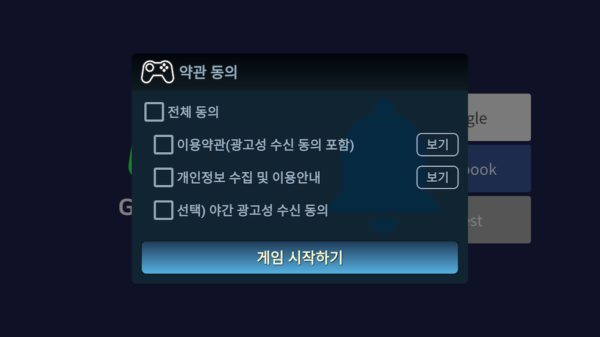
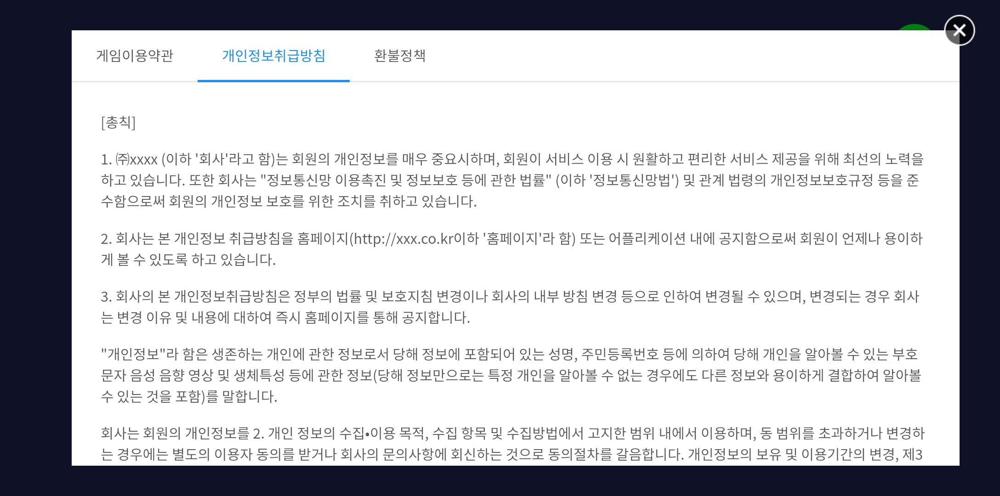

---
search:
  keyword: ["gamepot"]
---

## 1. スタートする

#### Step 1. 開発環境の構成

iOS 用アプリケーションの開発のためには開発ツール(Xcode)を設置する必要があります。iOS で GAMEPOT を使用するためのシステム環境は以下の通りです。

- オペレーティングシステム: iOS 9.0 以上
- 開発環境: Xcode

#### Step 2. Framework の追加


ダウンロードした iOS SDK ファイルを Xcode プロジェクトフォルダターゲットにマウスで引っ張ってきて追加します。

#### Step 3. Dependencies の追加

利用しようとするサービスによって必須 Dependencies リストが異なります。

サービスによって次の表を参考に Dependencies を追加します。

サービス別 Dependencies

| Service         | Framework                                                                                                                                                                                                                                                                                                                                      | Dependencies                                                                                                                                                                                                                                                                                                                                                                                                                                                                                                                                                        | bundle                                                  |
| --------------- | ---------------------------------------------------------------------------------------------------------------------------------------------------------------------------------------------------------------------------------------------------------------------------------------------------------------------------------------------- | ------------------------------------------------------------------------------------------------------------------------------------------------------------------------------------------------------------------------------------------------------------------------------------------------------------------------------------------------------------------------------------------------------------------------------------------------------------------------------------------------------------------------------------------------------------------- | ------------------------------------------------------- |
| 基本(Base)      | AFNetworking.framework<br />FirebaseAnalytics.framework<br />FirebaseCore.framework<br />FirebaseCoreDiagnostics.framework<br />FirebaseInstanceID.framework<br />FirebaseMessaging.framework<br />FirebaseNanoPB.framework<br />GamePot.framework<br />GoogleToolboxForMac.framework<br />nanopb.framework<br />Protobuf.framework<br />      | libz.tbd<br />WebKit.framework<br />UserNotifications.framework<br />                                                                                                                                                                                                                                                                                                                                                                                                                                                                                               | GamePot.bundle<br />                                    |
| ログイン(Login) | [ Base ]<br />GamePotChannel.framework<br /><br />[ Google Sign In ]<br />GamePotGoogleSignIn.framework<br />GoogleSignIn.framework<br />GTMOAuth2.framework<br />GTMSessionFetcher.framework<br /><br />[ Facebook ]<br />Bolts.framework<br />FBSDKCoreKit.framework<br />FBSDKLoginKit.framework<br />GamePotFacebook.framework<br /><br /> | [ Google Sign In ]<br />SafariServices.framework<br />[ Facebook ]<br />SafariServices.framework<br /><br />                                                                                                                                                                                                                                                                                                                                                                                                                                                        | [ Google Sign In ]<br />GoogleSignIn.bundle<br /><br /> |
| 広告(AD)        | [ Base ]<br />GamePotAd.framework<br /><br />[ Facebook ]<br />Bolts.framework<br />FBSDKCoreKit.framework<br />GamePotAdFacebook.framework<br /><br />[ Adbirx ]<br />AdBrix.framework<br />GamePotAdAdbrix.framework<br />IgaworksCore.framework<br /><br />[ Adjust ] <br />AdjustSdk.framework<br />GamePotAdAdjust.framework<br />        | [ Facebook ]<br /><br />[ Adbrix ]<br />MessageUI.framework<br />libxml2.tbd<br />iAd.framework<br />CoreTelephony.framework<br />UIKit.framework<br />CoreGraphics.framework<br />CoreText.framework<br />MobileCoreServices.framework<br />SystemConfiguration.framework<br />Security.framework<br /><br />[ Adjust ] <br />AdSupport.framework<br />                                                                                                                                                                                                            |                                                         |
| GameCenter      | GamePotGameCenter.framework                                                                                                                                                                                                                                                                                                                    |                                                                                                                                                                                                                                                                                                                                                                                                                                                                                                                                                                     |                                                         |
| NaverCafe       | AFNetworking.framework<br />GamePotNavarCafe.framework<br />NaverCafeSDK.framework<br />                                                                                                                                                                                                                                                       | AVKit.framework<br />AVFoundation.framework<br />MediaPlayer.framework<br />CoreMedia.framework<br />AssetsLibrary.framework<br />ImageIO.framework<br />QuartzCore.framework<br />ReplayKit.framework(Optional に設定)<br />MobileCoreServices.framework<br />SystemConfiguration.framework<br />Security.framework<br />WebKit.framework<br />libNaverLogin.a<br />NaverThirdPartyConstantsForApp.h<br />NaverThirdPartyLoginConnection.h<br />NLoginThirdPartyOAuth20InAppBrowserViewController.h<br />NLoginThirdPartyOAuth20InAppBrowserViewController.m<br /> | NaverAuth.bundle<br />NaverCafeSDK.bundle<br />         |
|                 |                                                                                                                                                                                                                                                                                                                                                |                                                                                                                                                                                                                                                                                                                                                                                                                                                                                                                                                                     |                                                         |


#### Step 4. Bundle Resource の追加

利用しようとするサービスによって Bundle Resource ファイルを追加する必要があります。

サービス別 Dependencies 表を参考にして Bundle Resource ファイルを追加します。


#### Step 5. InfoPlist の追加


GAMEPOT SDK は Google Firebase を使用して Google Firebase を設定して生成された GoogleService-Info.plist をプロジェクトに追加します。

GAMEPOT SDK の基本設定値を含めている GamePotConfig-Info.plist ファイルも追加します。GamePotConfig-Info.plist ファイルがなければ同じファイル名で生成後、キーに該当する値を入力します。

**GamePotConfig-Info.plist の設定**


```xml
gamepot_project_id : GAMEPOTプロジェクトID
gamepot_elsa_projectid : GAMEPOT ログプロジェクトID(optional)
```

#### Step 6. ビルドオプションの追加

**Build Settings > Linking > Other Linker Flags** セクションに-ObjC オプションを追加します。


#### Step 7. Info.plist の修正

Targets >> Info >> Custom iOS Target Properties 内に以下のユーザー権限獲得オプションを追加してください。

当該ユーザー権限は GamePot お客様センター内のファイルアップロード機能で使われます。

```
NSCameraUsageDescription
NSPhotoLibraryUsageDescription
```

#### Step 8. Google Sign In ログイン環境の設定

サービス別 Dependencies 表の **Login > Google Sign In**を参考にして Framework 及び Dependencies を追加します。

GoogleService-Info.plist ファイルの `REVERSED_CLIENT_ID` 値をコピーして **Info > URL Types**に項目を追加して URL Schemes に値を入力します。


**GamePotConfig-Info.plist の設定**


```xml
gamepot_google_app_id : GoogleService-Info.plistファイルの CLIENT_ID値
gamepot_google_url_schemes : GoogleService-Info.plistファイルのREVERSED_CLIENT_ID値
```

#### Step 9. フェイスブックログイン環境の設定

サービス別 Dependencies 表の **Login > Facebook**を参考にして Framework 及び Dependencies を追加します。

フェイスブック App ID を **Info > URL Types**に fb+フェイスブック App ID の形で追加します。


**Info > iOS Target Property**の **LSApplicationQueriesSchemes**に以下の項目を追加します。

- fbapi
- fb-messenger-share-api
- fbauth2
- fbshareextension


**GamePotConfig-Info.plist の設定**


```xml
gamepot_facebook_app_id : Facebook App ID
gamepot_facebook_display_name : Facebook display name
```

## 2. 初期化

AppDelegate ファイルの以下の部分を追加します。

```objc
#import <GamePot/GamePot.h>

- (BOOL)application:(UIApplication *)application didFinishLaunchingWithOptions:(NSDictionary *)launchOptions {
    ...
    // GamePot SDK Initialize
    [[GamePot getInstance] setup];

    // Push Permission
    if(SYSTEM_VERSION_GRATERTHAN_OR_EQUALTO(@"10.0"))
    {
        UNUserNotificationCenter *center = [UNUserNotificationCenter currentNotificationCenter];
        center.delegate = self;
        [center requestAuthorizationWithOptions:(UNAuthorizationOptionSound | UNAuthorizationOptionAlert | UNAuthorizationOptionBadge) completionHandler:^(BOOL granted, NSError * _Nullable error){
            if(!error){
                dispatch_async(dispatch_get_main_queue(), ^{
                    [[UIApplication sharedApplication] registerForRemoteNotifications];
                });
            }
        }];
    }
    else
    {
        // Code for old versions
        UIUserNotificationType allNotificationTypes = (UIUserNotificationTypeSound | UIUserNotificationTypeAlert | UIUserNotificationTypeBadge);
        UIUserNotificationSettings *settings = [UIUserNotificationSettings settingsForTypes:allNotificationTypes categories:nil];
        [application registerUserNotificationSettings:settings];
        [application registerForRemoteNotifications];
    }
    ...
}

 // Push
- (void)application:(UIApplication *)application didRegisterForRemoteNotificationsWithDeviceToken:(NSData *)deviceToken
{
    ...
    [[GamePot getInstance] handleRemoteNotificationsWithDeviceToken:deviceToken];
    ...
}

- (void)applicationWillEnterForeground:(UIApplication *)application {
    [[GamePotChat getInstance] start];
}

- (void)applicationDidEnterBackground:(UIApplication *)application {
    [[GamePotChat getInstance] stop];
}
```

## 3. ログイン、ログアウト、会員脱会

グーグル、フェイスブック、NAVER など多様なログイン SDK を統合して使用できます。

#### Step 1. 設定

```objc
// AppDelegate.m
#import <GamePotChannel/GamePotChannel.h>

// グーグルログインを使用の際
#import <GamePotGoogleSignIn/GamePotGoogleSignIn.h>

// フェイスブックログインを使用の際
#import <GamePotFacebook/GamePotFacebook.h>

- (BOOL)application:(UIApplication *)application didFinishLaunchingWithOptions:(NSDictionary *)launchOptions {
    ...
    // GamePotSDK チャンネルの初期化、使用しようとするチャンネル別にaddChannelを使用する必要があり、
    // Guest 方式は基本で含まれます。
    // Google Login 初期化
    GamePotChannelInterface* google     = [[GamePotGoogleSignIn alloc] init];
    [[GamePotChannelManager getInstance] addChannelWithType:GOOGLE interface:google];

    // フェイスブックログインの初期化
    GamePotChannelInterface* facebook   = [[GamePotFacebook alloc] init];
    [[GamePotChannelManager getInstance] addChannelWithType:FACEBOOK interface:facebook];

    // ログイン処理のために必要です。
    [[GamePotChannel getInstance] application:application didFinishLaunchingWithOptions:launchOptions];

    ...
}

- (BOOL)application:(UIApplication *)app openURL:(NSURL *)url options:(NSDictionary<UIApplicationOpenURLOptionsKey,id> *)options
{
    // ログイン処理のために必要です。
    BOOL nChannelResult = [[GamePotChannel getInstance] application:app openURL:url options:options];
    return nChannelResult;
}
```

#### Step 2. ログイン

ログインボタンをクリックすると連動します。

```objc
#import <GamePotChannel/GamePotChannel.h>
// ログインタイプの定義
// GamePotChannelType.GOOGLE
// GamePotChannelType.FACEBOOK
// GamePotChannelType.GUEST

// グーグルログインボタンをクリックすると呼び出し
[[GamePotChannel getInstance] Login:GOOGLE viewController:self success:^(GamePotUserInfo* userInfo) {
    // ログイン完了
} cancel:^{
    // ログインを試みる際にユーザーが取り消した場合
} fail:^(NSError *error) {
    // ログイン中にエラー発生
    // TODO: ゲームポップアップで失敗の原因に関する文を表示してください。
    // TODO: 文は[error localizedDescription]を使用してください。
}];

```

#### Step 3. 自動ログイン

GAMEPOT は自動ログインをサポートします。

```objc
#import <GamePotChannel/GamePotChannel.h>

// 最後にログインされた情報を持って当該情報で自動ログインできるように呼び出します。
// lastLoginType: 最後のログイン値を持ち込めます。
GamePotChannelType type = [[GamePotChannel getInstance] lastLoginType];

if(type != NONE)
{
    // 最後にログインしたログインタイプでログインする方式です。
    // 自動ログイン処理の際に以下のように呼び出すことができます。
    [[GamePotChannel getInstance] Login:type viewController:self success:^(GamePotUserInfo* userInfo) {

    } cancel:^{

    } fail:^(NSError *error) {
        // TODO: ゲームポップアップで失敗の原因に関する文を表示してください。
        // TODO: 文は[error localizedDescription]を使用してください。
    }];
}
else
{
	// 最後にログインした情報なし。ログインボタンがあるログイン画面に移動
}
```

#### Step 4. ログアウト

現在の会員アカウントをログアウトさせます。

```objc
#import <GamePotChannel/GamePotChannel.h>

[[GamePotChannel getInstance] LogoutWithSuccess:^{
	// ログアウト完了後は初期画面に移動します。
} fail:^(NSError *error) {
    // ログアウト失敗のエラーメッセージを表示します。
    // TODO: ゲームポップアップで失敗の原因に関する文を表示してください。
    // TODO: 文は[error localizedDescription]を使用してください。
}];
```

#### Step 5. 会員の脱会

現在の会員アカウントを脱会させます。

```objc
#import <GamePotChannel/GamePotChannel.h>

[[GamePotChannel getInstance] DeleteMemberWithSuccess:^{
	// 会員脱会成功ログイン画面へ移動
} fail:^(NSError *error) {
    // 会員脱会の失敗
    // TODO: ゲームポップアップで失敗の原因に関する文を表示してください。
    // TODO: 文は[error localizedDescription]を使用してください。
}];

```

#### Step 6. 検証

ログイン完了後はログイン情報をデベロッパー社サーバから GAMEPOT サーバに転送するとログイン検証が進みます。

詳しい説明は `Server to server api` メニューの `Authentication check` .項目をご参照ください。

## 4. アカウントの連動

一つのゲームアカウントに複数のソーシャルアカウント(グーグル、フェイスブックなど)を接続、解除できる機能です。(最小連動 SNS アカウントは一つです。)

ゲーム内で連動画面 UI を実装して、連動ボタンをクリックする際に以下のコードを呼び出します。

#### Step 1. アカウントの連動

Google, フェイスブックなどの ID でアカウントを連動できます。

```objc
#import <GamePotChannel/GamePotChannel.h>

// タイプの定義
// GamePotChannelType.GOOGLE
// GamePotChannelType.FACEBOOK
[[GamePotChannel getInstance] CreateLinking:GOOGLE viewController:self success:^(GamePotUserInfo *userInfo) {
	// TODO: 連動完了。ゲームポップアップで連動結果に関する文を表示してください。(例：アカウント連動に成功しました。)
} cancel:^{
	// TODO: ユーザーが取り消した場合
} fail:^(NSError *error) {
    // TODO: 連動失敗。ゲームポップアップで失敗の原因に関する文を表示してください。
    // TODO: 文は[error localizedDescription]を使用してください。
}];

```

#### Step 2. 連動されたリスト

当該 API を通じてアカウントに対する連動を確認できます。

```objc
#import <GamePotChannel/GamePotChannel.h>

// タイプの定義
// GamePotChannelType.GOOGLE
// GamePotChannelType.FACEBOOK
// タイプによる連動結果をリターンします。
BOOL isGoogleLinked = [[GamePotChannel getInstance] isLinked:GOOGLE];

// 連動されているタイプについてJsonStringの形でリターンします。
NSString* linkedList = [[GamePotChannel getInstance] getLinkedListJsonString];
```

#### Step 3. 連動の解除

以前連動されているアカウントを解除します。

```objc
#import <GamePotChannel/GamePotChannel.h>

[[GamePotChannel getInstance] DeleteLinking:GOOGLE success:^{
     // TODO: 解除の完了。ゲームポップアップで連動結果に関する文を表示してください。(例：アカウント連動を解除しました。)
} fail:^(NSError *error) {
     // TODO: 解除の失敗。ゲームポップアップで解除失敗の原因に関する文を表示してください。
     // TODO: 文は[error localizedDescription]を使用してください。
}];
```

## 5. 広告プラットフォーム

Facebook, Adjust, Adbrix などの多様な広告プラットフォーム SDK を統合して使用できます。

#### Step 1. 設定

```objc
// AppDelegate.m

#import <GamePotAd/GamePotAd.h>
// Facebook 広告プラットフォーム使用の際
#import <GamePotAdFacebook/GamePotAdFacebook.h>
// Adjust 広告プラットフォーム使用の際
#import <GamePotAdAdjust/GamePotAdAdjust.h>
// Adbrix 広告プラットフォーム使用の際
#import <GamePotAdAdbrix/GamePotAdAdbrix.h>

- (BOOL)application:(UIApplication *)application didFinishLaunchingWithOptions:(NSDictionary *)launchOptions {
    ...
    // Facebook 広告プラットフォームの初期化
    GamePotAdInterface* adFacebook    = [[GamePotAdFacebook alloc] init];
    [[GamePotAd getInstance] addAds:adFacebook];

    // Adjust 広告プラットフォームの初期化
    GamePotAdInterface* adAdjust      = [[GamePotAdAdjust alloc] init];
    [[GamePotAd getInstance] addAds:adAdjust];

    // Adbrix 広告プラットフォームの初期化
    GamePotAdInterface* adAdbrix      = [[GamePotAdAdbrix alloc] init];
	[[GamePotAd getInstance] addAds:adAdbrix];
	...
}
```

#### Step 2.フェイスブック広告プラットフォーム使用の際

上記の初期化する部分を除いて特別な追加作業はありません。

#### Step 3. Adbrix 広告プラットフォーム使用の際

GamePotConfig-Info.plist에 Adbrix キーの値を入力します。


```
gamepot_adbrix_appid : AdbrixアプリID
gamepot_adbrix_hashkey : Adbrix Hash Key
```

#### Step 4. EventTracking の転送

Event Tracking は場合によって呼び出すコードが異なります。次のコードを参考にして呼び出します。

```objc
#import <GamePotAd/GamePotAd.h>

// 一般
TrackerEvent* event = [[TrackerEvent alloc] init];
[event setEvent:@"test"];
// [event setAdjustKey:@"3m586u"]; // Adjust使用の際に当該コードで値を転送してください。
[[GamePotAd getInstance] tracking:EVENT obj:event];

// レベルアップの際
TrackerLevel* level = [[TrackerLevel alloc] init];
[level setLevel:@"12"];
// [level setAdjustKey:@"x7en7q"]; // Adjust使用の際に当該コードで値を転送してください。
[[GamePotAd getInstance] tracking:LEVEL obj:level];

// チュートリアル完了の際
TrackerTutorial* tutorialEvent = [[TrackerTutorial alloc] init];
[tutorialEvent setContentData:@"チュートリアル完了"];
[tutorialEvent setContentId:@"1"];
[tutorialEvent setSuccess:YES];
// [tutorialEvent setAdjustKey:@"byoplo"]; // Adjust使用の際に当該コードで値を転送してください。
[[GamePotAd getInstance] tracking:TUTORIAL_COMPLETE obj:tutorialEvent];

```

#### Step 5. Deep Link

**Inpo.plist > URL types** 項目に URL Schemes を追加します。


AppDelegate.m ファイル内に以下のように追加します。

```objc

// AppDelegate.m
#import <GamePotAd/GamePotAd.h>

- (BOOL)application:(UIApplication *)app openURL:(NSURL *)url options:(NSDictionary<UIApplicationOpenURLOptionsKey,id> *)options
{
    ...
    // DeepLinking使用の際に追加
    [[GamePotAd getInstance] application:app openURL:url options:options];
	...
}

```

## 6. 決済

#### Step 1. 設定

決済の結果値は Delegate の形態で実装されています。従って以下のように Delegate を追加してください。

```objc
#import <GamePot/GamePot.h>

@interface ViewController () <GamePotPurchaseDelegate>
@end
@implementation ViewController

- (void)viewDidLoad
{
    ...
    [[GamePot getInstance] setPurchaseDelegate:self];
    ...
}

- (void)GamePotPurchaseSuccess:(GamePotPurchaseInfo *)_info
{
    // 決済成功

    // 広告プラットフォームに決済イベントをするためのコードですので広告を使用する場合は必ず！挿入してください。
    [[GamePotAd getInstance] tracking:BILLING obj:_info];
}

- (void)GamePotPurchaseFail:(NSError *)_error
{
    // 決済エラー
    // TODO: ゲームポップアップで失敗の原因に関する文を表示してください。
    // TODO:文は[error localizedDescription]を使用してください。
}

- (void)GamePotPurchaseCancel
{
    // 決済進行中に取り消し
    // ’決済が取り消されました。’という文をゲームポップアップで表示します。
}
@end
```

#### Step 2. 決済の試み

```objc
#import <GamePot/GamePot.h>

// productidはストアに登録された商品IDを入力します。
[[GamePot getInstance] purchase:productid];
```

#### Step 3. 決済アイテムリストの獲得

ストアで転送する In_App アイテムリストを獲得できます。

```objective-c
NSArray<SKProduct*>* itemList = [[GamePot getInstance] getDetails];

// Device設定による通貨価格を得る際
[[GamePot getInstance] getLocalizePrice:[product productIdentifier]];
```

#### Step 4. 決済アイテムの支給

GAMEPOT は Server to server api を通じて決済ストアに領収書の検証まで全て終わらせてからデベロッパー社のサーバに支給リクエストをするため、違法決済は不可能です。

そのためには `Server to server api` メニューの `Purchase` 項目を参考にして処理してください。

## 7. その他 API

#### NAVER カフェ SDK

当該機能を使用するためには NAVER カフェの SDK と先行して連動に必要な値を獲得する必要があります。

GamePotConfig-Info.plist ファイルの使用に必要な値を追加してください。


```objc
gamepot_naver_cafeid // NAVERカフェのID
gamepot_naver_clientid // NAVERで使用する client ID
gamepot_naver_secretid // NAVERで使用する secret ID
gamepot_naver_urlscheme // NAVERで使用する urlscheme
```

サービス別 Dependencies 表の **Naver Cafe**項目を参考にして Framework 及び Dependencies を追加します。

```objc
// AppDelegate.m
#import <GamePotNavarCafe/GamePotNavarCafe.h>

- (BOOL)application:(UIApplication *)application didFinishLaunchingWithOptions:(NSDictionary *)launchOptions {
    ...
    // NAVERカフェの初期化
    [[GamePotNaverCafe getInstance] setup];
    ...
}

- (BOOL)application:(UIApplication *)app openURL:(NSURL *)url options:(NSDictionary<UIApplicationOpenURLOptionsKey,id> *)options
{
    BOOL nChannelResult = [[GamePotChannel getInstance] application:app openURL:url options:options];
    BOOL nNaverCafeResult = [[GamePotNaverCafe getInstance] application:app openURL:url options:options];

    return nChannelResult || nNaverCafeResult;
}
```

NAVER カフェの SDK は以下のように呼び出します。

```objc
#import <GamePotNavarCafe/GamePotNavarCafe.h>

[[GamePotNaverCafe getInstance] start:self];
```

ログインに成功してから以下のコードを追加すると NAVER カフェの管理者メニューから会員を識別できます。

```objc
#import <GamePotNavarCafe/GamePotNavarCafe.h>

[[GamePotNaverCafe getInstance] setUserId:[userInfo memberid]];
```

#### クーポン

ユーザーから入力されたクーポンを使用する際は以下のコードを呼び出してください。

> クーポン入力画面の UI はデベロッパー社で実装してください。

```objc
#import <GamePot/GamePot.h>

[[GamePot getInstance] coupon:/*ユーザーから入力されたクーポン*/ handler:^(BOOL _success, NSError *_error) {
    if(_success)
    {
        // TODO: messageにクーポン使用に関する結果がリターンされます。ゲームポップアップにこのメッセージを表示してください。
    }
    else
    {
        // TODO: _errorにクーポン使用失敗の原因に関する情報がリターンされます。
        // [_error localizedDescription]の内容をゲームポップアップで表示してください。
    }
}];
```

##### アイテムの支給

クーポン使用が成功したらデベロッパー社のサーバに Server to server api を通じてアイテムの支給をリクエストします。

そのためには`Server to server api` メニューの `Item` 項目を参考にして処理してください。

#### Push

```objc
#import <GamePot/GamePot.h>

// プッシュの受信 On/Off
[[GamePot getInstance] setPushEnable:YES success:^{

} fail:^(NSError *error) {

}];

// 夜間プッシュの受信 On/Off
[[GamePot getInstance] setNightPushEnable:YES success:^{

} fail:^(NSError *error) {

}];

// プッシュ/夜間プッシュを一度に設定
// ログイン前にプッシュ、夜間プッシュの許可の可否を受け取るゲームである場合は、ログイン後に以下のコードを必ず呼び出します。
[[GamePot getInstance] setPushStatus:YES night:YES ad:YES success:^{
    <#code#>
} fail:^(NSError *error) {
    <#code#>
}];
```

## 案内事項

ダッシュボード-案内事項でアップロードしたイメージが表示される機能です。

### 呼び出し

```objc
[[GamePot getInstance] showNotice:/*viewController*/ setSchemeHandler:^(NSString *scheme) {
	NSLog(@"scheme = %@", scheme);
}];
```

## お客様センター

ダッシュボード-お客様センターと連動されるユーザーと運営者間のコミュニケーションチャンネルです。

### 呼び出し

```objc
[[GamePot getInstance] showHelpWebView:(UIViewController *)];
```

## ローカルプッシュ(Local Push notification)

プッシュサーバを通じずに端末機から独自でプッシュを表示する機能です。

### 呼び出し

#### プッシュの登録

決まった時間にローカルプッシュを表示する方法は以下の通りです。

> リターン値で転送される pushid はデベロッパー社で管理します。

```objc
 NSDateFormatter* formatter = [[NSDateFormatter alloc] init];
 [formatter setDateFormat:@"yyyy-MM-dd HH:mm:ss"];

 NSString* strDate = [formatter stringFromDate:[[NSDate date] dateByAddingTimeInterval:30]];

 int pushId  = [[GamePot getInstance] sendLocalPush:@"Title" setMessage:@"Message" setDateString:strDate];
```

#### 登録したプッシュの取り消し

プッシュ登録の際に得た pushid に基づいて以前登録したプッシュを取り消すことができます。

```objc
[[GamePot getInstance] cancelLocalPush:(int)pushId];
```

## メンテナンス、強制アップデート

メンテナンスや強制アップデート機能が必要な場合、ダッシュボード-運営から機能を有効化すると作動します。

### 呼び出し

以前適用された以下の API で使用できます。

#### 1. Login API

```objc
[[GamePotChannel getInstance] Login:GAMECENTER viewController:self
    success:^(GamePotUserInfo* userInfo) {
    		// ログイン完了。ゲームロジックに合わせて処理してください。
    } cancel:^{
    		// ユーザーがログインを取り消した状態
    } fail:^(NSError *error) {
    		// ログイン失敗。 [error localizedDescription].を利用してエラーメッセージを表示してください。
    } update:^(GamePotAppStatus *appStatus) {
        // TODO: 強制アップデートが必要な場合、以下のAPIを呼び出すとSDK独自でポップアップを表示できます。
        // TODO: Customizingをしようとする場合は以下のAPIを呼び出さずにCustomizingをします。
        [[GamePot getInstance] showAppStatusPopup:self setAppStatus:appStatus
         setCloseHandler:^{
            // TODO: showAppStatusPopup APIを呼び出した場合、アプリを終了しなければならない状況で呼び出されます。
            // TODO: 終了プロセスを処理してください。
        }];
    } maintenance:^(GamePotAppStatus *appStatus) {
  	    // TODO: メンテナンス中の場合、以下のAPIを呼び出すとSDK独自でポップアップを表示できます。
	      // TODO: Customizingをしようとする場合、以下のAPIを呼び出さずにCustomizingをします。
        [[GamePot getInstance] showAppStatusPopup:self setAppStatus:appStatus
         setCloseHandler:^{
						// TODO: showAppStatusPopup APIを呼び出した場合、アプリを終了しなければならない状況で呼び出されます。
            // TODO: 終了プロセスを処理してください。
        }];
    }];
```

## 約款の同意

’利用約款’及び’個人情報の収集及び利用案内’の同意を簡単に受け取れるよう UI を提供します。

`BLUE` テーマと `GREEN` テーマの 2 種類を提供し、各領域別に Customizing も可能です。

\- `BLUE` テーマの例



\- `GREEN` テーマの例


### 約款同意の呼び出し

> 約款同意のポップアップ表示可否はデベロッパー社でゲームに合わせて処理してください。
>
> ’みる’ボタンをクリックする際に表示される内容はダッシュボードで適用及び修正できます。

```objective-c
// ブルーテーマ [[GamePotAgreeOption alloc] init:BLUE];
// グリーンテーマ [[GamePotAgreeOption alloc] init:GREEN];
GamePotAgreeOption* option = [[GamePotAgreeOption alloc] init:BLUE];
[[GamePot getInstance] showAgreeView:self option:option handler:^(GamePotAgreeInfo *result) {
   // [result agree] : 必須約款に全て同意した場合は true
   // [result agreeNight] : 夜間広告性受信同意をチェックした場合はtrue, そうでない場合はfalse
   // agreeNight値はログイン完了後に[[GamePot getInstance] setNightPushEnable]; apiを
   // 通じて転送してください。
}];
```

### Customizing

テーマを使用せずにゲームに合わせてカラーを変更します。

約款同意を呼び出す前に`GamePotAgreeOption`で各領域別にカラーを指定できます。

```objective-c
 GamePotAgreeOption* option = [[GamePotAgreeOption alloc] init:GREEN];

[option setHeaderBackGradient:@[@0xFF00050B,@0xFF0F1B21]];
[option setHeaderTitleColor:0xFF042941];
[option setContentBackGradient:@[@0xFF112432,@0xFF112432]];
[option setContentIconColor:0xFF042941];
[option setContentCheckColor:0xFF91adb5];
[option setContentTitleColor:0xFF98b3c6];
[option setContentShowColor:0xFF98b3c6];
[option setFooterBackGradient:@[@0xFF112432,@0xFF112432]];
[option setFooterButtonGradient:@[@0xFF1E3A57,@0xFF57B2E2]];
[option setFooterButtonOutlineColor:0xFF0b171a];
[option setFooterTitleColor:0xFFFFFFD5];

// 文の変更
[option setAllMessage:@"全て同意"];
[option setTermMessage:@"必須) 利用約款"];
[option setPrivacyMessage:@"必須) 個人情報の取り扱いに関する方針"];
[option setNightPushMessage:@"選択) 夜間プッシュ受信の同意"];
[option setFooterTitle:@"ゲームをスタートする"];

// 未使用の際 @""に設定
[option setHeaderTitle:@"約款同意"];

// 夜間広告性受信同意のボタンの表示可否
[option setShowNightPush:YES];
```

それぞれの変数は以下の領域に適用されます。

> contentIconDrawable のイメージは IOS には表示されません。


## 利用約款

利用約款の UI を呼び出します。

> ダッシュボード-お客様サポート－利用約款の設定項目に内容をまず入力してください。

```java
#import <GamePot/GamePot.h>

[[GamePot getInstance] showTerms:/*ViewController*/];
```


## 個人情報取り扱いに関する方針

個人情報取り扱いに関する方針 UI を呼び出します。

> ダッシュボード-お客様サポート－個人情報の取り扱いに関する方針の設定項目に内容をまず入力してください。

```java
#import <GamePot/GamePot.h>

[[GamePot getInstance] showPrivacy:/*ViewController*/];
```



## 8. ダウンロード

GAMEPOT ダッシュボードの **SDK ダウンロード** メニューから SDK をダウンロードできます。
