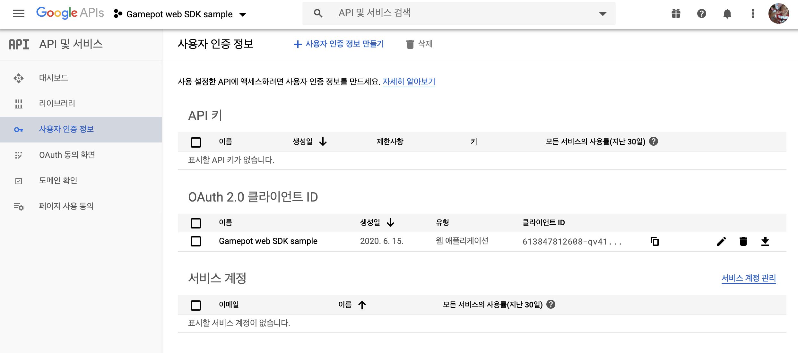

---
search:
  keyword:
    - gamepot
---

#### **NAVER クラウドプラットフォーム商品の使用方法をより詳細に提供し、様々な API の活用をサポートするために<a href="https://guide.ncloud-docs.com/docs/ja/home" target="_blank">[説明書]</a>と<a href="https://api.ncloud-docs.com/docs/ja/home" target="_blank">[API リファレンス]</a>を分けて提供しています。**

<a href="https://api.ncloud-docs.com/docs/ja/game-gamepot" target="_blank">GAMEPOT API リファレンスへ >></a><br />
<a href="https://guide.ncloud-docs.com/docs/ja/game-gamepot-overview" target="_blank">GAMEPOT 説明書へ >></a>

# Javascript SDK

> ###これは機械翻訳されたドキュメントで、語彙、構文、または文法に誤りがある可能性があります。 プロの翻訳者が翻訳したドキュメントをすぐに提供します。
>
> ####ご不明な点がございましたら、[お問い合わせ](https://www.ncloud.com/support/question)でお問い合わせください。
>
> 私たちは、サービスのさらなる向上に全力を尽くします。

## 1. はじめ

### 開発環境の設定

ブラウザで GAMEPOT を使用するためのシステム環境は以下のとおりです。

\[システム環境\]

- 最小の：`クロム4`、`IE8`、`Firefox3.5`、`Safari4`、`Opera10.50`など

#### JavaScript の追加

ダウンロードした Javascript SDK ファイルを`<header>`ブロックまたは`<body>`ブロック内に追加します。

> `GP` global variable を介して機能を利用することができます\
> ゲームパッドスクリプトのロード後、同じ変数名で再宣言されないように注意してください。

```html
<script src="/js/GamePot-2.1.0b.js"></script>
```

## 2. 초기화

ウェブページの読み込みが完了したときに実行できるように`window.onload= function（）{...}`または jQuery を使用している場合は、 `$（ducement）.ready（function（）{...}）`ブロック内で初期化します。

```html
<html>
  <head>
    <title>Gamepot Javscript</title>
  </head>
  <body>
    <!-- YOUR WEB HTML CODES -->
    <script>
      window.onload = function () {
        // Your project ID can be found on your GAMEPOT Dashboard.
        var project_id = 'xxxxxxx-xxxx-xxxx-xxxx-xxxxxx';
        var gamepotConfig = {
          // common
          api_url: "https://gpapps.gamepot.ntruss.com",
          api_key: "XXXXXXXXXXXXX",
          // If you are using Google Sign-In, enter your Google API Client ID as shown below.
          google_signin_client_id:"XXXXXXXXXX-XXXXXXXXXXX.apps.googleusercontent.com",
          // If you are using Facebook login, enter your Facebook App ID as shown below.
          facebook_app_id: "XXXXXXXXXX",
          // If you are using Apple Login, enter the Services ID of the Apple Console and the domain address you are trying to log in to as shown below.(Set as empty value when not in use)
          apple_client_id: "XXXXXXXXXX",
          apple_redirect_uri: "https://XXXXXXXXXX"
        };
        GP.initialize(project_id, gamepotConfig);
      };
    </script>
    <!-- YOUR WEB HTML CODES -->
  </body>
</html>
```


| Attribute | Description                                                                                                              |
| :---------------------- | :----------------------------------------------------------------------------------------------------------------------- |
| project_id              | GAMEPOT Dashboard Project ID|
| api_url                 | The URL associated with the Gamepot dashboard (by default, https://gpapps.gamepot.ntruss.com, but for managed product customers, the address is different, so you need to contact Gamepot)|
| api_key | Authentication key issued by GamePot ( Dashboard > Project Settings > API Key) |
| google_signin_client_id | Web Application ID in Google Console |
| facebook_app_id         | facebook app id |
| apple_client_id         | Services ID created in Apple console |
| apple_redirect_uri      | The domain address you are trying to log in to.|

## 3. ログイン、ログアウト、会員脱退

グーグル、フェイスブック、電子メールなど、さまざまなログイン SDK を統合して使用することができます。

### Google の\（API CONSOLE\）コンソールの設定

[Google API Console]（https://console.developers.google.com）でプロジェクトを作成>ユーザー認証情報の作成> OAuth クライアント ID>ウェブアプリケーションの種類に生成した後、クライアント ID の値を使用します。

> 例) 533847112608-qv8149tijkoh0vljrpeashk0udf39eoe.apps.googleusercontent.com



### フェイスブックコンソールの設定

[Facebook Developers](https://developers.facebook.com/apps) アプリの作成後アプリ ID を使用

> 例) 149235210820417

### ログイン

ログイン UI は開発会社で実装して、ログインボタンをクリック時に連動します。

#### ソーシャルプラットフォームログイン

```javascript
//ログインタイプの定義
// GP.ChannelType.GOOGLE: GOOGLE
// GP.ChannelType.FACEBOOK: FACEBOOK
// GP.ChannelType.EMAIL: EMAIL

// フェイスブックのログインボタンを押したときに呼び出さ
GP.login(GP.ChannelType.FACEBOOK, {
  onSuccess: function (userInfo) {
    console.log(
      // user.id == gamepot member_id
      // user.token == token
      // user.email == email
      'ログインに成功. ' +
      user.id + ',' + user.token + ',' + user.email
    );
  },
  onCancel: function () {
    console.log('ログインキャンセル');
  },
  onFailure: function (gamepotError) {
    console.log('ログインに失敗し: ' + gamepotError.toString());
  },
});
```

#### メールログイン

```javascript
// <input>タグなどでユーザーからの入力
var email_id = $('#input-email-id').val();
var email_password = $('#input-email-password').val();

$('#email-result-status').html('');

GP.login(GP.ChannelType.EMAIL, email_id, email_password, {
  onSuccess: function (gamepotUserInfo) {
    console.log('電子メールのログインに成功', gamepotUserInfo);
    $('#email-result-status').html(
      'ログインに成功. memberid: ' +
        gameUserInfo.memberid +
        ', userid: ' +
        gameUserInfo.userid
    );
  },
  onCancel: function () {
    console.log('電子メールのログインキャンセル');
  },
  onFailure: function (gamepotError) {
    console.log('電子メールのログインに失敗し: ' + gamepotError.toString());

    var msg = '';
    switch (gamepotError.getCode()) {
      case GP.Error.EMAIL_AUTH_WRONG_EMAIL_FORMAT:
        msg = '電子メールの形式が正しくありません。';
        break;
      case GP.Error.EMAIL_AUTH_WRONG_PASSWORD_EMPTY:
        msg = 'パスワードを入力してください。';
        break;
      case GP.Error.EMAIL_AUTH_WRONG_PASSWORD_LENGTH:
        msg = 'パスワードは8文字以上、最大32文字まで入力することができます。';
        break;
      case GP.Error.EMAIL_AUTH_WRONG_PASSWORD:
        msg = 'パスワードが一致しません。';
        break;
      case GP.Error.EMAIL_AUTH_WRONG_PASSWORD_BLOCKED:
        msg = 'パスワードエラーの回数を超えてログインすることはできません。';
        break;
      case GP.Error.EMAIL_AUTH_NOT_FOUND:
        msg = '接続アカウントが存在しません。';
        break;
      default:
        msg = gamepotError.getMessage();
        break;
    }

    $('#email-result-status').html(msg); // 結果の表示例。
  },
});
```

#### 이메일 가입

```javascript
// <input>タグなどでユーザーからの入力
var new_email_id = $('#input-email-new-id').val();
var new_email_password = $('#input-email-new-password').val();

$('#email-result-status2').html('');

GP.Channel.emailRegister(new_email_id, new_email_password, {
  onSuccess: function (gamepotUserInfo) {
    console.log('メール登録成功', gamepotUserInfo);
  },
  onCancel: function () {
    console.log('メール購読解除');
  },
  onFailure: function (gamepotError) {
    console.log('メール登録に失敗し: ' + gamepotError.toString());

    var msg = '';
    switch (gamepotError.getCode()) {
      case GP.Error.EMAIL_AUTH_WRONG_EMAIL_FORMAT:
        msg = '電子メールの形式が正しくありません。';
        break;
      case GP.Error.EMAIL_AUTH_WRONG_PASSWORD_EMPTY:
        msg = 'パスワードを入力してください。';
        break;
      case GP.Error.EMAIL_AUTH_WRONG_PASSWORD_LENGTH:
        msg = 'パスワードは8文字以上、最大32文字まで入力することができます。';
        break;
      case GP.Error.EMAIL_AUTH_WRONG_PASSWORD:
        msg = 'パスワードが一致しません。';
        break;
      case GP.Error.EMAIL_AUTH_WRONG_PASSWORD_BLOCKED:
        msg = 'パスワードエラーの回数を超えてログインすることはできません。';
        break;
      case GP.Error.EMAIL_AUTH_NOT_FOUND:
        msg = '接続アカウントが存在しません。';
        break;
      case GP.Error.EMAIL_AUTH_ALREADY_IN_USE:
        msg = '既に使用されているアカウントです。';
        break;
      default:
        msg = gamepotError.getMessage();
        break;
    }
    $('#email-result-status2').html(msg);
  },
});
```

#### 会員一意の ID

```javascript
GP.getMemberId();
```

### 自動ログイン

ユーザーが最後にログインした情報を伝達するための API を利用して自動ログインを実装することができます。

```javascript
// ユーザーが最後にログインした情報を伝達するためのAPI
var lastLoginType = GP.getLastLoginType();
if (lastLoginType !== GP.ChannelType.NONE) {
  console.log('自動ログイン. lastLoginType: ' + lastLoginType);
  GP.login(lastLoginType, {
    onSuccess: function (gameUserInfo) {
      console.log(
        '自動ログイン - 完了. memberid: ' +
          gameUserInfo.memberid +
          ', userid: ' +
          gameUserInfo.userid
      );
    },

    onCancel: function () {
      console.log('自動ログイン - キャンセル');
    },

    onFailure: function (gamepotError) {
      console.log('自動ログイン - 失敗: ' + gamepotError.toString());
    },

    onNeedUpdate: function (status) {
      console.log('自動ログイン - 更新が必要: ' + status);
    },

    onMainternance: function (status) {
      console.log('自動ログイン - 点検中: ' + status);
    },
  });
} else {
  // 初めてゲームを実行したり、ログアウトした状態。ログインをすることができるログイン画面をユーザーに見せてください。
}
```

### ログアウト

現在の会員アカウントをログアウトします。

```javascript
GP.logout({
  onSuccess() {
    console.log('ログアウト完了。');
  },
  onFailure(gamepotError) {
    console.log(
      'ログアウトに失敗。ログインされた状態ではないか、すでにセッションが終了した場合: ' +
        gamepotError.toString()
    );
  },
});
```

### メールパスワードの変更

現在ログインして電子メールアカウントのパスワードを変更します。

```javascript
GP.changeEmailPassword('my_old_password', 'my_new_password', {
  onSuccess: function () {
    // パスワード変更完了。連動結果のフレーズを露出させてください。（例えば、アカウントの連動を解除しました。)
  },
  onFailure: function (error) {
    // メールパスワード変更の失敗。error.getMessage（）を利用して、エラーメッセージを表示してください。
  },
});
```

### 会員脱退

現在の会員アカウントを脱退させます。

```javascript
GP.deleteMember({
  onSuccess: function () {
    console.log('会員脱退成功。初期画面に移動してください。');
  },
  onFailure: function (error) {
    // 会員脱退失敗。error.getMessage（）を利用して、エラーメッセージを表示してください。
    console.log(error.getMessage());
  },
});
```

### 検証

ログイン完了後にログイン情報を開発元サーバーから GAMEPOT サーバーに転送すると、ログインの検証が行われます。

詳細については、`Server to server api`マニュに`Authentication check`項目を参照してください。

## 4.アカウント連動

一つのゲームのアカウントに複数のソーシャルアカウント\（グーグル、フェイスブックなど\）を接続/解除することができる機能です。\（最小連動ソーシャルアカウントは 1 つです。\）

> 連動画面 UI は開発会社で実装してください。

### ソーシャルアカウント連動

Google、Facebook などの ID でアカウントを連動することができます。

```javascript
// GOOGLEアカウントに連動
// GP.ChannelType.GOOGLE
// FACEBOOKアカウントに連動
// GP.ChannelType.FACEBOOK
// EMAILアカウントに連動
// GP.ChannelType.EMAIL

GP.createLinking(GP.ChannelType.GOOGLE, {
  onSuccess: function (userInfo) {
    // 連動完了。連動結果のフレーズを露出させてください。（例：アカウントの連動に成功しました。)
  },

  onCancel: function () {
    // ユーザーがキャンセルした場合
  },

  onFailure: function (error) {
    // 連動の失敗。error.getMessage（）を利用して、エラーメッセージを表示してください。
  },
});
```

### 電子メールアカウントの連動

ソーシャルアカウントに連動されたアカウントにメールアドレスユーザー名として追加連動することができます。

```javascript
GP.createEmailLinking('some@example.com', 'some_my_password', {
  onSuccess: function (userInfo) {
    // 連動完了。連動結果のフレーズを露出させてください。（例：アカウントの連動に成功しました。)
  },

  onFailure: function (error) {
    // 連動の失敗。error.getMessage（）を利用して、エラーメッセージを表示してください。
  },
});
```

### 連動したリスト

この API を使用してアカウントに連動するかどうかを確認することができます。

```javascript
// タイプの定義
// GP.ChannelType.GOOGLE
// GP.ChannelType.FACEBOOK
// GP.ChannelType.EMAIL
// タイプに応じた連動の結果を返します。
var isLinked = GP.isLinked(GP.ChannelType.GOOGLE);

// 連動しているすべてのタイプのjson objectを返します。
// もしGOOGLEとFACEBOOKに連動した場合は、次のように返されます。
// [{“provider”:”google”},{“provider”:”facebook”}]
var linking = GP.getLinkedList();
```

### 連動解除

既存のに連動しているアカウントを無効にします。

```javascript
GP.deleteLinking(GP.ChannelType.GOOGLE, {
  onSuccess: function () {
    // 連動解除完了。連動結果のフレーズを露出させてください。（例えば、アカウントの連動を解除しました。)
  },
  onFailure: function (error) {
    // 連動解除の失敗。error.getMessage（）を利用して、エラーメッセージを表示してください。
  },
});
```
