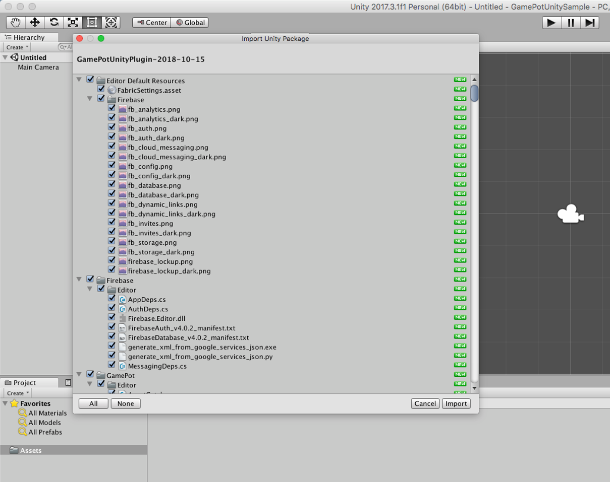
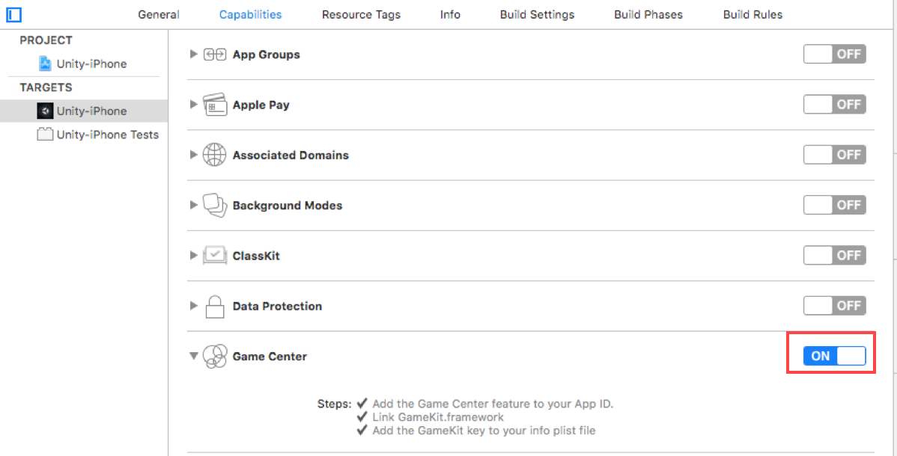
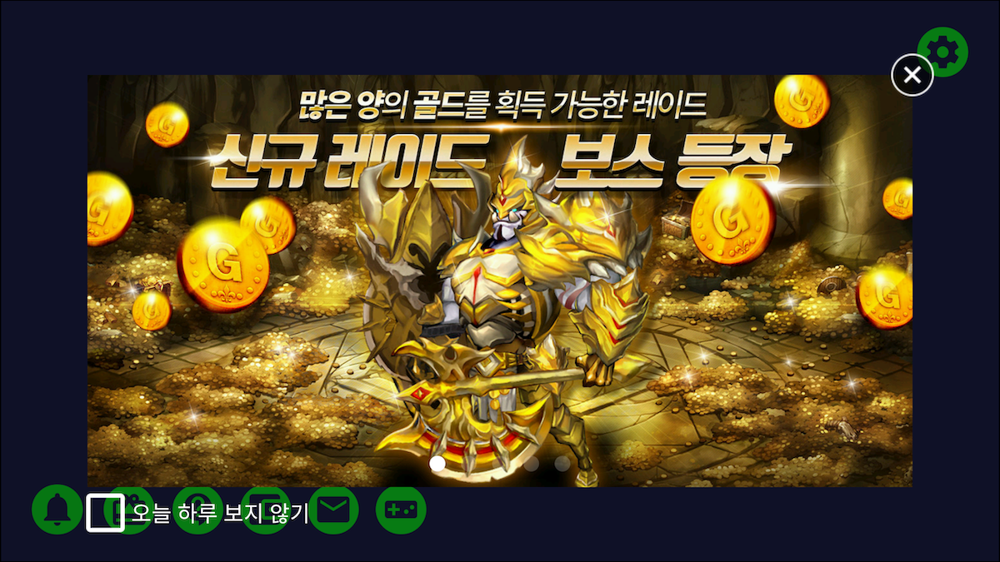
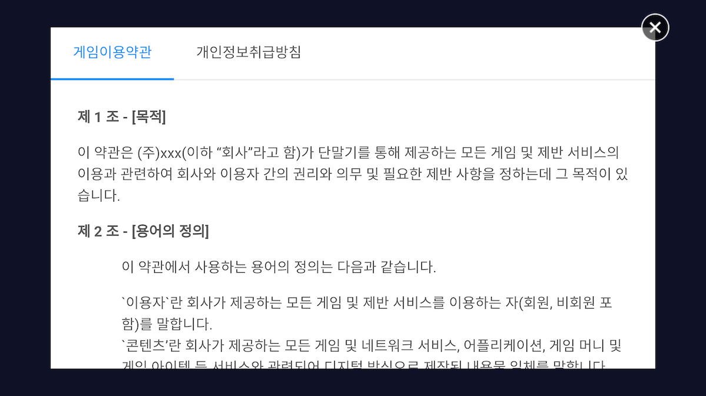
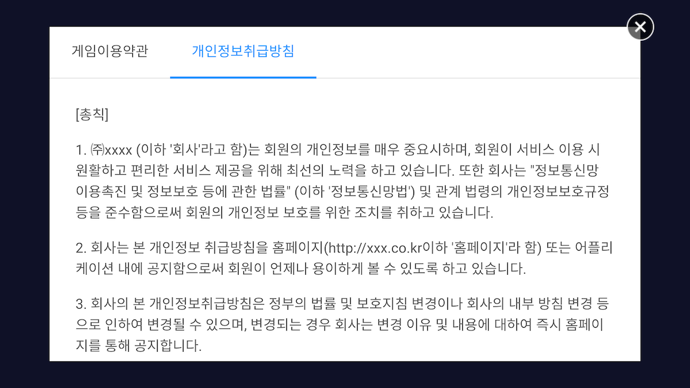

---
search:
  keyword: ["gamepot"]
---

## スタートする

### Step 1. GAMEPOT プラグインを持ち込む

生成された GAMEPOT ダッシュボードにアクセスして最新のプラグインをダウンロードします。

### Step 2. プラグインを持ち込む

**Assets > Import Package > Custom Package** メニューからダウンロードした `GamePotUnityPlugin-xxxx.unitypackage` ファイルを選択します。


プラグインを確認して Import すると当該プロジェクトに追加されます。



### Step 3. Android

#### 基本環境の設定

```
minSdkVersion : API 17 (Jelly Bean, 4.2)
```

##### Gradle 環境の設定方法

`/Assets/Plugin/Android/mainTemplate.gradle` ファイルをエディターで開きます。

```java
...
android {
	...
	defaultConfig {
		...
        resValue "string", "gamepot_project_id", "" // required
        resValue "string", "gamepot_api_url", "" // required
        resValue "string", "gamepot_store", "google" // required
        resValue "string", "gamepot_app_title","@string/app_name" // required (fcm)
        resValue "string", "gamepot_push_default_channel","Default" // required (fcm)
				resValue "string", "facebook_app_id", "0" // optional (facebook)
				resValue "string", "fb_login_protocol_scheme", "fb0" // optional (facebook)
				// resValue "string", "gamepot_elsa_projectid", "" // optional (ncp elsa)
	}
	...
}
```

以下の必須値を探して修正します。以下の値を修正すると正常に作動します。

```java
resValue "string", "[key]", "[value]"
```

| 値                           | 説明                                                                                                                                                        |
| ---------------------------- | ----------------------------------------------------------------------------------------------------------------------------------------------------------- |
| gamepot_project_id           | GAMEPOT で発行されたプロジェクト ID を入力してください。                                                                                                    |
| gamepot_api_url              | GAMEPOT で発行された API URL を入力してください。                                                                                                           |
| gamepot_store                | ストア値(`google` または `one`)                                                                                                                             |
| gamepot_app_title            | アプリのタイトル (FCM)                                                                                                                                      |
| gamepot_push_default_channel | 登録された基本チャンネル名(Default) - 変更しないでください。                                                                                                |
| facebook_app_id              | フェイスブックで発行されたアプリ ID                                                                                                                         |
| fb_login_protocol_scheme     | フェイスブックで発行された protocol scheme fb[app_id]                                                                                                       |
| gamepot_elsa_projectid       | NAVER クラウドプラットフォーム Effective Log Search & Analytics 商品使用の際のプロジェクト ID ([詳しくみる](https://www.ncloud.com/product/analytics/elsa)) |

##### Notification bar のプッシュアイコン変更方法


プッシュを受信の際、Android Notification bar に表示する Small icon は SDK 内部で基本イメージとして表示され、直接追加することもできます。

直接追加するためには `drawable` フォルダ別にイメージを入れる必要があります。( [Android Asset Studio](http://romannurik.github.io/AndroidAssetStudio/icons-notification.html#source.type=clipart&source.clipart=ac_unit&source.space.trim=1&source.space.pad=0&name=ic_stat_gamepot_small)を利用して作成すると自動でフォルダ別にイメージが作成されて便利です。)

イメージファイル名は `ic_stat_gamepot_small`でなければなりません。

| フォルダ名            | サイズ |
| --------------------- | ------ |
| res/drawable-mdpi/    | 24x24  |
| res/drawable-hdpi/    | 36x36  |
| res/drawable-xhdpi/   | 48x48  |
| res/drawable-xxhdpi/  | 72x72  |
| res/drawable-xxxhdpi/ | 96x96  |

##### Screen Orientation の設定方法

`/Assets/Plugin/Android/AndroidManifest.xml` ファイルをエディターで開きます。

```xml
...
    <activity android:screenOrientation="sensorLandscape">
      <intent-filter>
        <action android:name="android.intent.action.MAIN" />
          ...
      </intent-filter>
    </activity>
...
```

Main Activity に screenOrientation を追加してゲームに合わせて`sensorLandscape` または `sensorPortrait`を入力してください。

##### Unity Build Settings

`File > Build Settings > Build System` メニューから Gradle を選択します。


### Step 4. iOS

> GameCenter Login を `使用しない場合`には以下の位置で当該ファイルを削除してください。<br> > `Assets/Plugins/IOS/Frameworks/GamePotGameCenter.framework`<br>
> 当該ライブラリーが含まれた場合 `Capabilities設定からGameCenterを必ず有効化` する必要があります。<br>

グーグルファイアベースでダウンロードした `GoogleService-Info.plist`ファイルを `/Assets/Plugins/IOS/`にコピーします。

`/Assets/Plugin/IOS/GamePotConfig-Info.plist` 内に必要な環境変数を追加してください。


| 環境変数                      | 説明                                                                                      |
| ----------------------------- | ----------------------------------------------------------------------------------------- |
| gamepot_project_id            | GAMEPOT で発行されてプロジェクト ID を入力してください。                                  |
| gamepot_api_url               | GAMEPOT で発行された API URL を入力してください。                                         |
| gamepot_facebook_app_id       | フェイスブックで発行されたアプリ ID                                                       |
| gamepot_facebook_display_name | フェイスブックに表示される名前                                                            |
| gamepot_google_app_id         | GoogleService-Info ファイルの CLIENT_ID 値                                                |
| gamepot_google_url_schemes    | GoogleService-Info ファイルの REVERSED_CLIENT_ID 値                                       |
| gamepot_elsa_projectid        | NAVER クラウドプラットフォーム Effective Log Search & Analytics 使用の際のプロジェクト ID |

Scenes を追加してから **File > Build Settings > Build And Run**を実行すると完了します。


XCode ビルド後

Targets >> Info >> Custom iOS Target Properties 内に以下の `ユーザーの権限獲得オプションを追加` してください。

当該ユーザー権限は GAMEPOT お客様センター内のファイルアップロード機能で使われます。

```
NSCameraUsageDescription
NSPhotoLibraryUsageDescription
```

####

## 初期化

ゲームを開始する際にロードされる最初の画面に使用される個体に次のコードを追加します。

```csharp
using GamePotUnity;
public class GamePotLoginSampleScene : MonoBehaviour {
    void Awake() {
        GamePot.initPlugin();
    }
    void Start () {
        GamePot.setListener(  GamePotInterface.cs相続されたclass );
         // ex) GamePot.setListener(new GamePotSampleListener());
    }

}

ex)
public class GamePotSampleListener : MonoBehaviour , NSDKInterface {
    ....
}
```

## エラーコード

```csharp
public class NError
{
    // 分からない Error
    public static readonly int CODE_UNKNOWN_ERROR           = 0;
    // 初期化の失敗
    public static readonly int CODE_NOT_INITALIZE           = 1;
    // パラメータが正しくない場合
    public static readonly int CODE_INVAILD_PARAM           = 2;
    // メンバーIDデータがない時
    public static readonly int CODE_MEMBERID_IS_EMPTY       = 3;
    // ログインされていない状態
    public static readonly int CODE_NOT_SIGNIN              = 4;
    // ネットワークモジュールが初期化されていない時
    public static readonly int CODE_NETWORK_MODULE_NOT_INIT = 3000;
    // ネットワーク接続エラー及びタイムアウト発生の際
    public static readonly int CODE_NETWORK_ERROR           = 3001;
    // server-sideで発生するエラー
    public static readonly int CODE_SERVER_ERROR            = 4000;
    // http response codeが成功でない場合
    public static readonly int CODE_SERVER_HTTP_ERROR       = 4001;
    // ネットワーク接続エラー及びタイムアウト発生の際
    public static readonly int CODE_SERVER_NETWORK_ERROR    = 4002;
    // サーバで受け取ったデータをパースする時のエラー
    public static readonly int CODE_SERVER_PARSING_ERROR    = 4003;
    // 決済で分からないエラー発生及びストア側でErrorを転送する時
    public static readonly int CODE_CHARGE_UNKNOWN_ERROR    = 5000;
    // product idを入れていない場合
    public static readonly int CODE_CHARGE_PRODUCTID_EMPTY  = 5001;
    // product idを誤って入れた場合
    public static readonly int CODE_CHARGE_PRODUCTID_WRONG  = 5002;
    // consumeの際のエラー
    public static readonly int CODE_CHARGE_CONSUME_ERROR    = 5003;

    // error Code
    public int code { get; set; }
    // error Message
    public string message { get; set; }
}
```

## ログイン環境の設定

### グーグルログイン

#### Google Firebase コンソール

1. Google Firebase コンソールから Android 用 google-service.json ファイルをダウンロードした後に `/Assets/Plugins/Android/`にコピーします。
2. APK ビルドの際に使用した Keystore の SHA-1 値を Google Firebase console に追加します。
3. Google Firebase コンソールから iOS 用 GoogleService-Info.plist ファイルをダウンロードした後に`/Assets/Plugins/IOS/`にコピーします。

**グーグルログインの際 onCancel がレスポンスし、ログインできない場合** 以下の内容をチェックしてください。

1. 上で適用リクエストした google-service.json ファイルが正常に適用されたか確認
2. ビルドの際に使用したキーストアが Firebase console で登録した sha-1 を抽出したキーストアであるかを確認
3. Firebase console に登録したパッケージ名でビルドされたか確認

### フェイスブックログイン

#### Facebook Developer コンソール

APK ビルドの際に使用した Keystore のキーハッシュ値をフェイスブックコンソールに追加します。

#### Android

mainTemplate.gradle の修正

```java
...
defaultConfig {
	resValue "string", "facebook_app_id", "1234567890"
	resValue "string", "fb_login_protocol_scheme", "fb1234567890"
}
...
```

フェイスブックデベロッパーセンターで発行されたアプリ ID を`facebook_app_id` 値に入力して `fb_login_protocol_scheme` 値に`fb{facebook_app_id}`を入力します。

> app_id が 1234567890 の場合 fb1234567890 が `fb_login_protocol_scheme` 値です。

#### iOS

/Assets/Plugins/IOS/Frameworks ルートに以下のフレームワークを追加します。

FBSDKLoginKit.framework
FBSDKCoreKit.framework
Bolts.framework
GamePotFacebook.framework

### ゲームセンターログイン

> iOS にのみ該当する機能です。<br>
>
> GameCenter Login を `使用しない場合`には以下の位置で当該ファイルを削除してください。<br> > `Assets/Plugins/IOS/Frameworks/GamePotGameCenter.framework`<br />
> 当該ライブラリーが含まれた場合 `Capabilities設定から GameCenterを必ず有効化` してください。<br />

/Assets/Plugins/IOS/Frameworks/ ルートに Gamekit.framwork をコピーします。 **General > Linked Frameworks and Libraries** 内にコピーしたフレームワークを追加します。

Capabilities 設定で Game Center を ON に設定します。(アプリストアコンソールでも Game Center が ON に設定されていなければなりません。)



### NAVER ログイン

#### Naver Developer コンソール

使用 API を `ネアロ`に選択してアプリケーションを登録

#### Android

mainTemplate.gradle の修正

```java
...
defaultConfig {
	resValue "string", "gamepot_naver_clientid", "abcdefg1234567890"
	resValue "string", "gamepot_naver_secretid", "hijklmn"
}
...
```

発行された Client ID を`gamepot_naver_clientid` 値に入力して Client Secret は `gamepot_naver_secretid` 値に入力します。

#### iOS

GamePotConfig-Info.plist ファイルに以下の項目を追加して当該値を入力します。

```
gamepot_naver_clientid // NAVERで使用するclient ID
gamepot_naver_secretid // NAVERで使用する secret ID
gamepot_naver_urlscheme // NAVERで使用する urlscheme
```

GamePotConfig-Info.plist ファイルを SourceCode でみる際は以下のように追加

```xml
...
<key>gamepot_naver_clientid</key>
<string>xxxxxx</string>
<key>gamepot_naver_secretid</key>
<string>xxxxxx</string>
<key>gamepot_naver_urlscheme</key>
<string>xxxxxx</string>
...
```

Targets >> Info >> URL Types で NAVER ID でログイン設定に登録した URL Schemes を追加します。

URL Schemes を生成する際には `小文字`,`.`,`_`以外の文字を使用すると読み取れない場合がありますのでご注意ください。

## ログイン/ログアウト/脱会/検証

### ログイン

別途の登録なしにユーザーアカウントが生成されます。全ての身分確認のための MemberId が生成され、生成された情報は NUserInfo 構造体に保存されてリターンされます。

Request:

```csharp
GamePot.login(NCommon.LoginType);
```

Response:

```csharp
// ログイン成功
public void onLoginSuccess(NUserInfo userInfo)
{
}
// ログイン失敗
public void onLoginFailure(NError error)
{
	// ログインに失敗した場合
	// error.messageをポップアップなどでユーザーに知らせてください。
}
// ログインの取り消し
public void onLoginCancel()
{
	// ユーザーが任意でログインを取り消した場合
}
// 強制アップデート(ストアバージョンとクライアントバージョンが異なる場合に呼び出し)
public void onNeedUpdate(NAppStatus status)
{
	// TODO: パラメータに転送されたstatus情報を基にポップアップを作成してユーザーに知らせる必要があります。
	// TODO: 以下の二つの方法の中の一つを選択してください。
    // case 1: インゲームポップアップを通じてデベロッパー社で直接UIを実装
    // case 2: SDKのポップアップを使用(この場合は以下のコードを呼び出してください。)
    // GamePot.showAppStatusPopup(status.ToJson());
}
// メンテナンス(ダッシュボードにメンテナンスが有効化されている場合に呼び出し)
public void onMainternance(NAppStatus status)
{
   	// TODO: パラメータに転送されたstatus 情報を基にポップアップを作成してユーザーに知らせる必要があります。
	// TODO: 以下の二つの方法の中の一つを選択してください。
    // case 1: インゲームポップアップを通じてデベロッパー社で直接UIを実装
    // case 2: SDKのポップアップを使用(この場合は以下のコードを呼び出してください。)
    // GamePot.showAppStatusPopup(status.ToJson());
}
// アプリの終了
public void onAppClose()
{
    // TODO: 強制アップデートやメンテナンス機能をcase 2方式で実装する場合
    // TODO: アプリを強制終了することができるため、ここにアプリを終了できるように実装してください。
}
```

LoginType の定義

```csharp
public enum LoginType
{
     NONE,
     GOOGLE,
     FACEBOOK,
     GAMECENTER,
     NAVER,
     GUEST
}

```

NUserInfo の定義

```csharp
public class NUserInfo
{
    public string id { get; set; }              // メンバーID(ユーザーのユニークID)
    public string name { get; set; }            // 名前
    public string profileUrl { get; set; }      // プロフィールURL(存在する場合)
    public string email { get; set; }           // メール(存在する場合)
    public string socialid { get; set; }        // Social ID(google, facebook ...)
}
```

### ログイン情報を持ち込む

```csharp
GamePot.getMemberId(); // メンバーID(ユーザーのユニークID)
```

### 自動ログイン

```csharp
NCommon.LoginType type = GamePot.getLastLoginType();
if(type != NCommon.LoginType.NONE) {
{
    // 最後にログインしたログインタイプでログインする方式です。
    GamePot.login(type);
}
else
{
    // 初めてゲームを実行したりログアウトした状態。ログインできるログイン画面に移動してください。
}
```

### ログアウト

ユーザーをログアウトさせます。アカウントが削除されず、同じアカウントでログインできます。

Request:

```
GamePot.logout();
```

Response:

```csharp
/// ログアウトの成功
public void onLogoutSuccess()
{
}

/// ログアウトの失敗
public void onLogoutFailure(NError error)
{
   	// ログアウトに失敗した場合
	// error.messageをポップアップなどでユーザーに知らせてください。
}
```

### 脱会

会員を脱会させ、リカバリーできません。

Request:

```
GamePot.deleteMember();
```

Response:

```csharp
/// 会員脱会の成功
public void onDeleteMemberSuccess() {
}

/// 会員脱会の失敗
public void  onDeleteMemberFailure(NError error) {
   	// 会員脱会に失敗する場合
	// error.messageをポップアップなででユーザーに知らせてください。
}
```

### 検証

ログイン完了後、ログイン情報をデベロッパー社サーバから GAMEPOT サーバに転送するとログイン検証が進みます。

詳しい説明は Server to server API メニューの `Token Authentication` 項目をご参照ください。

## アカウントの連動

一つのゲームアカウントに複数のソーシャルアカウント(グーグル、フェイスブックなど)を接続/解除できる機能です。(最小連動ソーシャルアカウントは 1 つです。)

> 連動画面の UI はデベロッパー社で実装してください。

```csharp
public enum LinkingType
{
      GAMECENTER,
      GOOGLE,
      FACEBOOK,
      NAVER
}
```

### 連動

Google / Facebook などの ID にアカウントを連動できます。

Request:

```csharp
GamePot.createLinking(NCommon.LinkingType.XXXXX);
```

Response:

```csharp
/// アカウント連動の取り消し
public void onCreateLinkingCancel() {
    // ユーザーがアカウント連動を取り消した場合
}

/// アカウント連動の成功
public void onCreateLinkingSuccess(NUserInfo userInfo) {
}

/// アカウント連動の失敗
public void onCreateLinkingFailure(NError error) {
	// アカウント連動に失敗した場合
	// error.messageをポップアップなどでユーザーに知らせてください。
}
```

現在連動された全てのアカウント情報を持ってくることができます。

```csharp
List<NLinkingInfo> linkedList = GamePot.getLinkedList();
```

リンク情報の定義

```csharp
public class NLinkingInfo
{
    public LinkingType provider { get; set; }  // google, facebook, naver
}
```

### 連動の解除

以前連動されているアカウントを解除します。

Request :

```
void GamePot.deleteLinking(NCommon.LinkType.XXXXX);
```

Response:

```csharp
/// アカウント連動解除の成功
public void onDeleteLinkingSuccess() {
}

/// アカウント連動解除の失敗
public void onDeleteLinkingFailure(NError error) {
	// 連動解除に失敗した場合
	// error.messageをポップアップなどでユーザーに知らせてください。
}
```

#### アカウントの連動状態に関する結果処理の例題

createLinking / deleteLinking の結果によって現在連動されているアカウント情報を受け取って連動状態に対する UI をアップデートします。

```csharp
public void onInit()
{
	UI_Update();
}
public void onCreateLink_GAMECENTER_Click()
{
	GamePot.createLinking(NCommon.LinkingType.GAMECENTER);
}
public void onCreateLink_GOOGLE_Click()
{
	GamePot.createLinking(NCommon.LinkingType.GOOGLE);
}
public void onCreateLinkingSuccess(NUserInfo userInfo)
{
	UI_Update();
}
public void onCreateLinkingFailure(NError error)
{
	UI_Update();
}
public void onDeleteLinkingSuccess(NUserInfo userInfo)
{
	UI_Update();
}
public void onDeleteLinkingFailure(NError error)
{
	UI_Update();
}

Public void UI_Update()
{
	// Ui Update in GAME
	CreateLinkManager.instance._IOS_google_state  = false;
	CreateLinkManager.instance._IOS_gamecenter_state  = false;

	List<NLinkingInfo> linkedList = GamePot.getLinkedList();
	foreach ( NLinkingInfo item in linkedList)
	{
		case NCommon.LinkingType.GOOGLE :
			CreateLinkManager.instance._IOS_google_state  = true;
		break;
		case NCommon.LinkingType.GAMECENTER :
			CreateLinkManager.instance._IOS_gamecenter_state  = true;
		break;
	}
}
```

## 決済

### In-App 商品の照会

ストアに登録された商品情報を転送します。

この機能を活用するとユーザーに見合った価格、通貨、商品名がそれぞれ異なる形で表示されます。

```csharp
NPurchaseItem[] items = GamePot.getPurchaseItems();
foreach(NPurchaseItem item in items) {
    Debug.Log(item.productId);		// 商品ID
    Debug.Log(item.price);			// 価格
    Debug.Log(item.title);			// タイトル
    Debug.Log(item.description);	// 説明
}
```

### In-App 商品の決済

以下の関数一つでグーグル、アップル、アプリストアの決済が可能です。

Request:

```csharp
// productId : マーケットに登録された商品ID
GamePot.purchase(string productId)
```

Response:

```csharp
/// In-App決済の成功
public void onPurchaseSuccess(NPurchaseInfo purchase) {
}

/// In-App決済の失敗
public void onPurchaseFailure(NError error) {
	// 決済に失敗した場合
	// error.messageをポップアップなどでユーザーに知らせてください。
}

/// In-App決済のの失敗
public void onPurchaseCancel() {
}
```

### NPurchaseInfo の定義

決済成功後に決済したアイテムの情報です。参考用にご利用ください。

```csharp
public class NPurchaseInfo
{
    public string price { get; set; }  				// 決済アイテムの価格
    public string productId { get; set; }           // 決済アイテムのID
    public string currency { get; set; }            // 決済価格の通貨(KRW/USD)
    public string orderId { get; set; }             // ストアOrder ID
    public string productName { get; set; }         // 決済アイテムの名前
    public string uniqueId { get; set; }            // purchase api呼び出しの際、2番目のパラメータ値
    public string signature { get; set; }           // 決済Signature
    public string originalJSONData { get; set; }    // 領収書Data
}
```

### 決済アイテムの支給

GAMEPOT は Server to server api を通じて決済ストアに領収書の検証まで全て終わらせてからデベロッパー社のサーバに支給リクエストをするため、違法決済は不可能です。

そのためには `Server to server api` メニューの `Purchase Webhook` 項目を参考にして処理してください。

### 外部決済

外部決済を許可するストア及び公式ストアではない所で決済を使用できる機能です。

> 呼び出し API のみ異なり、レスポンス及び Purchase webhook などその他は一般決済と同じです。
>
> 機能を使用するためには設定が必要です。ダッシュボードマニュアルの’外部決済’項目をご参照ください。

Request:

```csharp
// productId : マーケットに登録された商品ID
GamePot.purchaseThirdPayments(string productId);
```

外部決済利用の際の商品情報リストは以下の API をご利用ください。

Request:

```csharp
// リターンされるデータフォーマットはgetPurchaseItems()と同じです。
GamePot.getPurchaseThirdPaymentsItems();
```

## 広告

IGAWorks Unity Plugin を基本として含んでいるため、[IGAWorks のガイド](http://help.igaworks.com/hc/ko/3_3/Content/Article/common_unity_aos)で適用してください。

> IGAWorks 以外にライブラリーを使用しようとする場合は私共が盛り込む方法をご案内致します。

盛り込まれたバージョンは以下の通りです。

| プラットフォーム | バージョン                                     |
| ---------------- | ---------------------------------------------- |
| Android          | IGAWorks_Unity_Android_Full_Package_2018-12-05 |
| iOS              | IGAWorks_Unity_iOS_Full_Package_2018-10-02     |

## Push On/Off

プッシュ、夜間プッシュをそれぞれ On/Off に処理することができます。

> On/Off を設定する UI はデベロッパー社で実装してください。

### プッシュ設定

Request:

```csharp
GamePot.setPushStatus(bool pushEnable);
```

Response:

```csharp
/// プッシュ状態の変更に関するサーバ通信の成功
public void onPushSuccess() {
}

/// プッシュ状態の変更に関するサーバ通信の失敗
public void onPushFailure(NError error) {
	// プッシュ状態の変更に失敗した場合
	// error.messageをポップアップなどでユーザーに知らせてください。
}
```

### 夜間プッシュの設定

Request:

```csharp
GamePot.setPushNightStatus(bool nightPushEnable);
```

Response:

```csharp
/// 夜間プッシュ状態の変更に関するサーバ通信の成功
public void onPushNightSuccess() {
}

/// 夜間プッシュ状態の変更に関するサーバ通信の失敗
public void onPushNightFailure(NError error) {
	// 夜間プッシュ状態の変更に失敗した場合
	// error.messageをポップアップなどでユーザーに知らせてください。
}
```

### プッシュ/夜間プッシュを一度に設定

ログイン前にプッシュ/夜間プッシュの許可可否を受け取るゲームである場合、ログイン後に以下のコードを必ず呼び出します。

Request:

```csharp
GamePot.setPushStatus(bool pushEnable, bool nightPushEnable, true);
```

Response:

```csharp
/// 夜間プッシュ状態の変更に関するサーバ通信の成功
public void onPushStatusSuccess() {
}

/// 夜間プッシュ状態の変更に関するサーバ通信の失敗
public void onPushStatusFailure(NError error) {
	// 夜間プッシュ状態の変更に失敗した場合
	// error.messageをポップアップなどでユーザーに知らせてください。
}
```

### プッシュ状態の照会

```csharp
NPushInfo pushInfo = GamePot.getPushStatus();
// pushInfo.enable  プッシュの許可可否
// pushInfo.night   夜間プッシュの許可可否
```

## クーポン

#### クーポンの使用

> クーポンを入力される UI はデベロッパー社で実装してください。

Request:

```csharp
GamePot.coupon(string couponNumber); // クーポン番号
```

Response:

```csharp
/// クーポン使用の成功
public void onCouponSuccess() {
}

/// クーポン使用の失敗
public void onCouponFailure(NError error) {
	// クーポンの使用に失敗した場合
	// error.messageをポップアップなどでユーザーに知らせてください。
}
```

#### アイテムの支給

クーポン使用に成功したらデベロッパー社のサーバを通じてアイテムの支給をリクエストします。

そのためには Server to server API メニューの`Item Webhook` 項目を参考にして処理してください。

## NAVER カフェ SDK

NAVER カフェ SDK(4.0.4)を含む plugin を使用する際は[NAVER カフェ SDK ガイド](https://github.com/naver/cafe-sdk-unity/blob/master/README.md#usages)を参考にして適用してください。

> NAVER カフェの SDK の容量が大きいため、盛り込む/盛り込まないの二つのバージョンで提供します。必要に応じて選択してください。

## 案内事項

GAMEPOT ダッシュボードで’案内事項’に追加したイメージを順番に表示する機能です。



イメージのお勧めスペックは以下の通りです。

- サイズ : 720 _ 1200(Portrait) / 1280 _ 640(Landscape)

  > 上のサイズを守らない場合は center crop でイメージを処理します。

- 容量 : 250KB 以下

Request:

```csharp
GamePot.showNotice();
```

Response:

GAMEPOT ダッシュボードで `クリックアクション`を`SCHEME`に設定した場合、当該イメージをクリックすると `SCHEME`値を転送します。

```csharp
public void onReceiveScheme(string scheme)
{
    // GAMEPOT ダッシュボードで設定したscheme値を転送
}
```

## お客様センター

お客様が運営者にお問い合わせを登録して回答を得ることのできる機能です。

- お問い合わせ登録画面

  

- マイお問い合わせ内訳画面

  

### 呼び出し

```csharp
GamePot.showCSWebView();
```

## ローカルプッシュ(Local Push notification)

プッシュサーバを通じずに端末機からプッシュを表示する機能です。

### 呼び出し

#### プッシュの登録

決まった時間にローカルプッシュを表示する方法は以下の通りです。

> リターン値で転送される pushid はデベロッパー社で管理します。

```Java
int pushId = GamePot.sendLocalPush(DateTime.Parse("2018-01-01 00:00:00"), "title", "content");
```

#### 登録したプッシュの取り消し

プッシュ登録の際に得た pushid に基づいて以前登録したプッシュを取り消すことができます。

```Java
GamePot.cancelLocalPush(/*プッシュ登録の際に得たpushId*/);
```

## 約款の同意

'利用約款’及び’個人情報の収集及び利用案内’の同意を簡単に受け取れるよう UI を提供します。

`BLUE` テーマと `GREEN` テーマの 2 種類を提供し、各領域別に Customizing も可能です。

- `BLUE` テーマの例

  

- `GREEN` テーマの例

  

### 約款同意の呼び出し

> 約款同意のポップアップ表示可否はデベロッパー社でゲームに合わせて処理してください。
>
> ’みる’ボタンをクリックすると表示される内容はダッシュボードで適用及び修正できます。

Request:

```csharp
// 基本呼び出し(BLUEテーマに適用)
GamePot.showAgreeDialog();

// GREENテーマに適用の際
NAgreeInfo info = new NAgreeInfo();
info.theme = "green";
GamePot.showAgreeDialog(info);
```

Response:

```csharp
// 約款に同意した場合
public void onAgreeDialogSuccess(NAgreeResultInfo info)
{
    // info.agree : 必須約款に全て同意した場合は true
    // info.agreeNight : 夜間広告性受信同意をチェックした場合はtrue, そうでない場合はfalse
    // agreeNight値はログイン完了後にsetPushNightStatus apiを通じて転送してください。
}

// エラーの発生
public void onAgreeDialogFailure(NError error)
{
	// error.messageをポップアップなどでユーザーに知らせてください。
}
```

### Customizing

テーマを使用せずにゲームに合わせてカラーを変更します。

約款の同意を呼び出す前に `NAgreeInfo`でそれぞれの領域別にカラーを指定できます。

```c#
NAgreeInfo info = new NAgreeInfo();
info.theme = "green";
info.headerBackGradient = new string[] { "0xFF00050B", "0xFF0F1B21" };
info.headerTitleColor = "0xFFFF0000";
info.headerBottomColor = "0xFF00FF00";
// 未使用の際に ""に設定
info.headerTitle = "約款の同意";
// Android : res/drawable 客体ID(ファイル名)
// iOS : asset 客体ID(ファイル名)
info.headerIconDrawable = "ic_stat_gamepot_agree";

info.contentBackGradient = new string[] { "0xFFFF2432", "0xFF11FF32" };
info.contentIconColor = "0xFF0429FF";
info.contentCheckColor = "0xFFFFADB5";
info.contentTitleColor = "0xFF98FFC6";
info.contentShowColor = "0xFF98B3FF";
// Android : res/drawable 客体ID(ファイル名)
// iOS : asset 客体ID(ファイル名)
info.contentIconDrawable = "ic_stat_gamepot_small";

info.footerBackGradient = new string[] { "0xFFFFFFFF", "0xFF112432" };
info.footerButtonGradient = new string[] { "0xFF1E3A57", "0xFFFFFFFF" };
info.footerButtonOutlineColor = "0xFFFF171A";
info.footerTitleColor = "0xFFFF00D5";
info.footerTitle = "ゲームをスタートする";
// 夜間広告性受信同意ボタンの表示可否
info.showNightPush = true;

// 文の変更
info.allMessage = "全て同意";
info.termMessage = "必須) 利用約款";
info.privacyMessage = "必須) 個人情報取り扱いに関する方針";
info.nightPushMessage = "選択) 夜間プッシュの受信同意";

GamePot.showAgreeDialog(info);
```

それぞれの変数は以下の領域に適用されます。

> contentIconDrawable は AOS にのみ表示され、基本値はプッシュアイコンで設定されます。


## 利用約款

利用約款 UI を呼び出します。

> ダッシュボード-お客様サポート－利用約款の設定項目に内容をまず入力してください。

```c#
GamePot.showTerms();
```



## 個人情報取り扱いに関する方針

個人情報取り扱いに関する方針 UI を呼び出します。

> ダッシュボード-お客様サポート－個人情報の取り扱いに関する方針の設定項目に内容をまず入力してください。

```c#
GamePot.showPrivacy();
```


