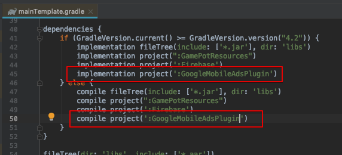

# 3rd-party SDK 적용 가이드

GAMEPOT SDK 이외에 적용하는 3rd-party SDK를 빌드애러 없이 게임 프로젝트에 적용하기 위한 가이드입니다.

> 각 SDK의 가이드를 기준으로 기술하며, API를 적용하는 방법은 각 SDK의 가이드를 참고하세요.

## Adjust

### Android ([Link](https://github.com/adjust/android_sdk/blob/master/doc/korean/README.md#qs-getting-started))

1. `build.gradle` 에 패키지 추가시 아래 두 패키지는 이미 포함되어있으니 무시하세요.

```java
implementation 'com.android.installreferrer:installreferrer:1.0'
implementation 'com.google.android.gms:play-services-analytics:16.0.4'
```

2. `AndroidManifest.xml` 에 이미 권한이 추가 되어있으니 무시하세요.

```java
<uses-permission android:name="android.permission.INTERNET" />
<uses-permission android:name="android.permission.ACCESS_NETWORK_STATE" />
```

### iOS([Link](https://github.com/adjust/ios_sdk/blob/master/README.md))

Gamepot과 충돌 사항이 없습니다.

### Unity

> 준비중입니다.

## Adbrix

### Android

> 준비중입니다.

### iOS

> 준비중입니다.

### Unity

> 준비중입니다.

## Singular 

### Android (SDK 9.2.0) ([Link](https://developers.singular.net/docs/android-sdk))

1. 앱 수준의 `build.gradle` 에 패키지 추가시 아래 패키지는 이미 포함되어있으니 무시하세요.

```java
compile 'com.android.installreferrer:installreferrer:1.0'
```

2. `AndroidManifest.xml` 에 이미 권한이 추가 되어있으니 무시하세요.

```java
<uses-permission android:name="android.permission.INTERNET" />
<uses-permission android:name="android.permission.ACCESS_NETWORK_STATE" />
```

### iOS (SDK 9.2.0) ([Link](https://developers.singular.net/docs/ios-sdk))

Gamepot과 충돌 사항이 없습니다.

### Unity ([Link](https://developers.singular.net/docs/unity-sdk))

1. 다음 경로의 라이브러리 파일을 삭제해 주세요.

`Assets/Plugins/Android/libs/installreferrer-1.0.aar`

## Appsflyer

### Android

> 준비중입니다.

### iOS

> 준비중입니다.

### Unity

> 준비중입니다.

## AdMob

### Android ([Link](https://firebase.google.com/docs/admob/android/quick-start?hl=ko))

1. Gamepot 서비스는 Firebase Messaging 서비스를 이용합니다.
Admob with Firebase를 통해 설정해주세요.

### iOS ([Link](https://developers.google.com/admob/ios/quick-start?hl=ko))

Gamepot과 충돌 사항이 없습니다.

### Unity ([Link](https://developers.google.com/admob/unity/start))

1. 위 Link를 통해 플러그인을 게임 프로젝트에 import 합니다.
2. `mainTemplate.gradle` 에서 아래와 같이 AdMob 안드로이드 프로젝트를 추가합니다.



## Admob Mediation (Admob SDK 17.2.0)

### Android([Link](https://developers.google.com/admob/android/mediate))

#### - Vungle([Link](https://developers.google.com/admob/android/mediation/vungle))

1. Gamepot과 충돌 사항이 없습니다. (vungle sdk 6.3.24)

#### - Unity Ads([Link](https://developers.google.com/admob/android/mediation/unity))

1. 앱 수준의 `build.gradle` 에 패키지 추가시, 해당 패키지로 추가해주세요.

```java
compile 'com.google.ads.mediation:unity:3.1.0.0'
```

#### - Facebook([Link](https://developers.google.com/admob/android/mediation/facebook))

1. 앱 수준의 `build.gradle` 에 패키지 추가시, 해당 패키지로 추가해주세요.

```java
compile 'com.google.ads.mediation:facebook:5.4.0.0'
```

### iOS

> 준비중입니다.

### Unity

> 준비중입니다.
