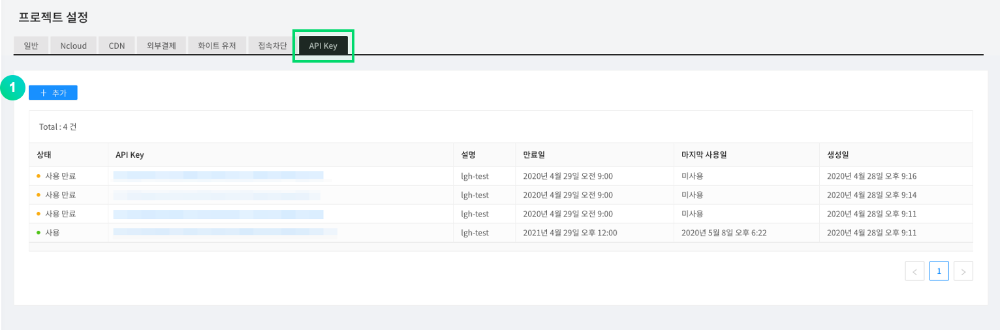
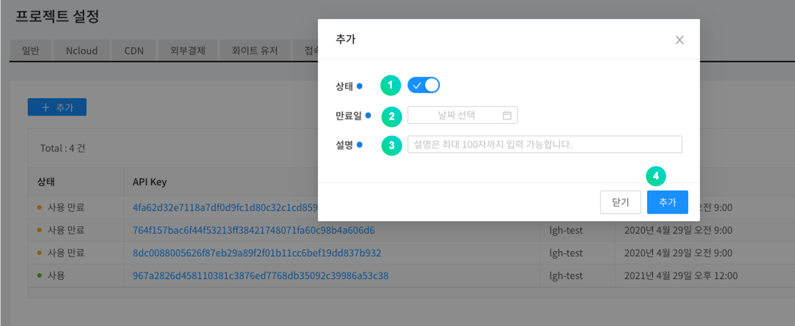
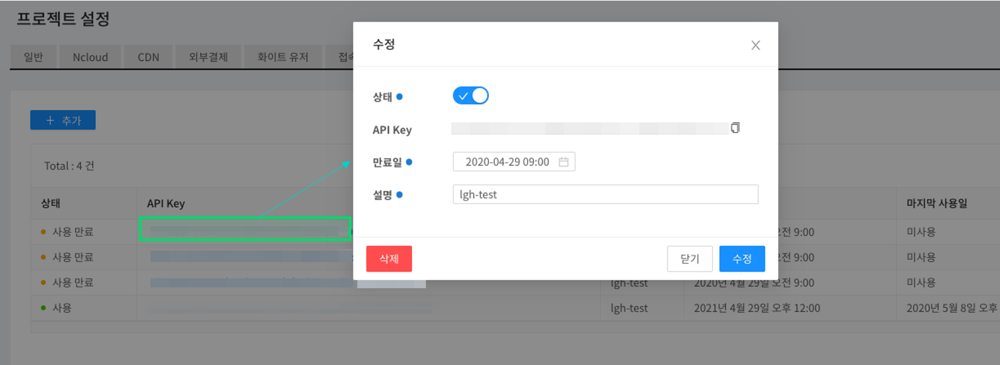

---
search:
  keyword:
    - gamepot
---

#### **네이버 클라우드 플랫폼의 상품 사용 방법을 보다 상세하게 제공하고, 다양한 API의 활용을 돕기 위해 <a href="https://guide.ncloud-docs.com/docs/ko/home" target="_blank">[설명서]</a>와 <a href="https://api.ncloud-docs.com/docs/ko/home" target="_blank">[API 참조서]</a>를 구분하여 제공하고 있습니다.**

<a href="https://api.ncloud-docs.com/docs/ko/game-gamepot" target="_blank">Gamepot API 참조서 바로가기 >></a><br />
<a href="https://guide.ncloud-docs.com/docs/game-gamepotconsole" target="_blank">Gamepot 설명서 바로가기 >></a>

# Open API

게임팟에서 제공하는 몇몇 기능을 규정 된 API로 호출할 수 있는 기능입니다.

> 대시보드에서 발급한 허용된 API Key를 사용해야 호출이 가능하며, 사용 여부 및 만료일을 지정 할 수 있습니다.

## API Key 발급

Open API를 호출하기 위해서는 먼저 대시보드에서 API Key를 생성해야 합니다.

API Key는 <b>대시보드 &gt; 프로젝트 설정 &gt; API Key </b> 에서 생성할 수 있습니다.



① API 키를 생성하기 위해서 추가 버튼을 클릭하세요.



① 해당 API Key의 활성화 여부를 선택합니다.

② API Key 만료일을 설정합니다.

③ 사용자가 알아볼 수 있는 설명을 입력합니다.

④ 추가 버튼으로 API Key를 등록합니다.



생성된 API KEY를 클릭하여 상태를 수정하거나 삭제할 수 있습니다.

> 생성된 Key 값은 Open API 사용 시, header의 x-api-key의 값에 들어갑니다.

## Open API 사용하기

### Error code

Open API 요청시 발생하는 공통 에러코드입니다.

| Code | Description                                     |
| :--- | :---------------------------------------------- |
| -1   | 대시보드에 없는 키를 사용한 경우                |
| -2   | 대시보드의 키와 헤더의 키가 다른경우            |
| -3   | 대시보드에서 삭제한 키를 사용한 경우            |
| -4   | 대시보드에서 미사용으로 처리된 키를 사용한 경우 |
| -5   | 키가 만료된 경우                                |
| -6   | 프로젝트 아이디가 없는 경우                     |

### 사용자 조회 API

사용자 UID로 사용자를 조회합니다.

#### Request

- Method : GET
- URI : /user/{userID}

```text
GET
url : https://dashboard-api.gamepot.ntruss.com/v1/api/project/{projectId}/user/{userId}
Header : 'accept-language: ko'
Header : 'x-api-key: {GamePot 대시보드에서 발급받은 API Key}'
```

| Header    | Type   | Required | Description                  |
| :-------- | :----- | :------- | :--------------------------- |
| x-api-key | String | O        | GamePot에서 발급하는 인증 키 |

| Attribute | Type   | Description             |
| :-------- | :----- | :---------------------- |
| projectId | String | GamePot SDK의 projectId |
| userId    | String | GamePot SDK의 userId    |

#### Response

성공

```javascript
{
  "status": 1,
  "result": {
    "id": "xxxxxxxxxxxxxx",
    "deleted": false,
    "store_id": "google",
    "country": "KR",
    "remoteip": "xxx.xxx.xxx.xxx",
    "adid": "test_s6SksBK",
    "device": "android",
    "network": "WI-FI",
    "version": "testVersion",
    "model": "test-111",
    "token": "test:Qz9Fd81H6O",
    "push": true,
    "night": true,
    "ad": true,
    "memo": null,
    "device_id": null,
    "createdAt": "Tue Apr 07 2020 16:32:17 GMT+0900 (GMT+09:00)",
    "updatedAt": "Tue Apr 07 2020 16:32:19 GMT+0900 (GMT+09:00)",
    "loginedAt": "Tue Apr 07 2020 16:32:19 GMT+0900 (GMT+09:00)",
    "deletedAt": null
  }
}
```

| Attribute | Type    | Description                                           |
| :-------- | :------ | :---------------------------------------------------- |
| status    | Int     | 결과값 \(1: 성공, 실패는 Error code 참고\)            |
| id        | String  | 사용자 아이디                                         |
| deleted   | Boolean | 회원 삭제 여부 \(true : 삭제, false : 정상\)          |
| store_id  | String  | 계정 생성 시 접속한 스토어 (google...)                |
| country   | String  | 유저 국가 코드 (ISO 3166-1 기준)                      |
| remoteip  | String  | 유저 아이피                                           |
| adid      | String  | 광고 id                                               |
| device    | String  | 기기 종류 (android,ios)                               |
| network   | String  | 유저 접속 네트워크 (WI-FI...)                         |
| version   | String  | Client의 버전 정보                                    |
| model     | String  | 유저 기기 모델명                                      |
| token     | String  | 푸시 토큰                                             |
| push      | Boolean | 푸시 동의 여부 \(true : 동의, false : 비동의\)        |
| night     | Boolean | 야간 푸시 동의 여부 \(true : 동의, false : 비동의\)   |
| ad        | Boolean | 광고성 푸시 동의 여부 \(true : 동의, false : 비동의\) |
| memo      | String  | 회원 메모                                             |
| device_id | String  | 회원 디바이스 ID                                      |
| createdAt | String  | 회원이 생성된 날짜                                    |
| updatedAt | String  | 회원 정보를 수정한 날짜                               |
| loginedAt | String  | 마지막 접속일                                         |
| deletedAt | String  | 회원 삭제된 날짜                                      |

실패

```javascript
{
  "status": -6,
  "message": "projectId was wrong."
}
```

| Attribute | Type   | Description                                |
| :-------- | :----- | :----------------------------------------- |
| status    | Int    | 결과값 \(1: 성공, 실패는 Error code 참고\) |
| message   | String | 오류 내용                                  |

### 사용자 정지 조회 API

사용자 UID로 사용자가 정지되었는지 조회합니다.

#### Request

- Method : GET
- URI : /user/{userID}/block

```text
GET
url : https://dashboard-api.gamepot.ntruss.com/v1/api/project/{projectId}/user/{userId}/block
Header : 'accept-language: ko'
Header : 'x-api-key: {GamePot 대시보드에서 발급받은 API Key}'
```

| Header    | Type   | Required | Description                  |
| :-------- | :----- | :------- | :--------------------------- |
| x-api-key | String | O        | GamePot에서 발급하는 인증 키 |

| Attribute | Type   | Description             |
| :-------- | :----- | :---------------------- |
| projectId | String | GamePot SDK의 projectId |
| userId    | String | GamePot SDK의 userId    |

#### Response

성공

```javascript
{
  "status": 1,
  "result": {
    "id": "xxxxxxxxxxxxxx",
    "member_id": "xxxxxxxxxxxxxx",
    "deleted": false,
    "type": "manual",
    "status": 1,
    "message": null,
    "messageMulti": [
      {
        "lang": "ko",
        "value": "테스트-ko",
        "default": true
      }
    ],
    "startedAt": "Mon May 11 2020 12:02:00 GMT+0900 (GMT+09:00)",
    "endedAt": "Mon May 25 2020 22:00:00 GMT+0900 (GMT+09:00)",
    "createdAt": "Tue May 12 2020 14:06:40 GMT+0900 (GMT+09:00)",
    "updatedAt": "Tue May 12 2020 14:06:40 GMT+0900 (GMT+09:00)",
    "deletedAt": null,
    "category_id": ""
  }
}
```

| Attribute   | Type    | Description                                                                                                |
| :---------- | :------ | :--------------------------------------------------------------------------------------------------------- |
| status      | Int     | 결과값 \(1: 성공, 실패는 Error code 참고\)                                                                 |
| id          | String  | 사용자 정지 정보에 대한 아이디                                                                             |
| member_id   | String  | 사용자 아이디                                                                                              |
| deleted     | Boolean | 사용자 정지 정보에 대한 삭제 유무 \(true: 삭제, false: 정상\)                                              |
| type        | String  | 이용정지 분류 \(manual: 수동, autopurchase: 자동\)                                                         |
| status      | Int     | 상태 \(1: 활성, 2: 비활성\)                                                                                |
| message     | String  | 이용정지 사유 (현재 사용되지 않습니다.)                                                                    |
| lang        | String  | 이용정지 메시지 언어                                                                                       |
| value       | String  | 이용정지 사유 메시지                                                                                       |
| default     | Boolean | 기본 언어 설정<br>디바이스의 언어값이 messageMulti에 없는 경우 true로 설정된 메시지가 기본으로 노출됩니다. |
| startedAt   | String  | 이용정지 시작일                                                                                            |
| endedAt     | String  | 이용정지 종료일                                                                                            |
| createdAt   | Boolean | 이용정지 등록일                                                                                            |
| updatedAt   | Boolean | 이용정지 수정일                                                                                            |
| deletedAt   | Boolean | 이용정지 삭제일                                                                                            |
| category_id | String  | 이용정지 분류 아이디                                                                                       |

실패

```javascript
{
  "status": -6,
  "message": "projectId was wrong."
}
```

| Attribute | Type   | Description                                |
| :-------- | :----- | :----------------------------------------- |
| status    | Int    | 결과값 \(1: 성공, 실패시 Error code 참고\) |
| message   | String | 오류 내용                                  |

### 사용자 정지 설정 API

사용자 UID로 사용자를 이용정지 처리합니다.

#### Request

- Method : POST
- URI : /user/{userID}/block

```text
POST
url : https://dashboard-api.gamepot.ntruss.com/v1/api/project/{projectId}/user/{userId}/block
Header : 'accept-language: ko'
Header : 'content-type: application/json'
Header : 'x-api-key: {GamePot 대시보드에서 발급받은 API Key}'
data: '{
        "messageMulti": [
                {
                    "lang": "ko",
                    "value": "테스트",
                    "default": true
                }
            ],
            "startedAt": "2020-05-11 12:02",
            "endedAt": "2020-05-25 22:00"
       }'
```

| Header    | Type   | Required | Description                  |
| :-------- | :----- | :------- | :--------------------------- |
| x-api-key | String | O        | GamePot에서 발급하는 인증 키 |

| Attribute | Type    | Description                                                                                                |
| :-------- | :------ | :--------------------------------------------------------------------------------------------------------- |
| projectId | String  | GamePot SDK의 projectId                                                                                    |
| userId    | String  | GamePot SDK의 userId                                                                                       |
| lang      | String  | 이용정지 메시지 언어                                                                                       |
| value     | String  | 이용정지 사유 메시지                                                                                       |
| default   | Boolean | 기본 언어 설정<br>디바이스의 언어값이 messageMulti에 없는 경우 true로 설정된 메시지가 기본으로 노출됩니다. |
| startedAt | String  | 이용정지 시작일 `YYYY-MM-DD HH:mm`                                                                         |
| endedAt   | String  | 이용정지 종료일 `YYYY-MM-DD HH:mm`                                                                         |

#### Response

성공

```javascript
{
  "status": 1,
  "result": {
    "memberBlock": {
      "id": "xxxxxxxxxxxxx"
    }
  }
}
```

| Attribute | Type   | Description                                |
| :-------- | :----- | :----------------------------------------- |
| status    | Int    | 결과값 \(1: 성공, 실패는 Error code 참고\) |
| id        | String | 이용정지된 아이디                          |

실패

```javascript
{
  "status": -5,
  "message": "ApiKey was expired."
}
```

| Attribute | Type   | Description                                |
| :-------- | :----- | :----------------------------------------- |
| status    | Int    | 결과값 \(1: 성공, 실패는 Error code 참고\) |
| message   | String | 오류 내용                                  |

#### Error code

| Code | Description                                                              |
| :--- | :----------------------------------------------------------------------- |
| -11  | body에 데이터 부족                                                       |
| -12  | messageMulti 값이 JSON Array가 아닌 경우                                 |
| -13  | startedAt 값의 포멧이 올바르지 않은 경우, `YYYY-MM-DD HH:mm` 형태만 가능 |
| -14  | endedAt 값의 포멧이 올바르지 않은 경우, `YYYY-MM-DD HH:mm` 형태만 가능   |
| -15  | messageMulti 값의 data 포멧이 올바르지 않은 경우                         |
| -16  | messageMulti 값의 data중에 default true가 없거나 복수개인 경우           |

### 일별 접속자 (DAU) 조회 API

일별 접속자를 조회할 수 있습니다.

#### Request

- Method : GET
- URI : /user/statistics/dau

```text
GET
url : https://dashboard-api.gamepot.ntruss.com/v1/api/project/{projectId}/user/statistics/dau
Header : 'accept-language: ko'
Header : 'x-api-key: {GamePot 대시보드에서 발급받은 API Key}'
```

| Header    | Type   | Required | Description                  |
| :-------- | :----- | :------- | :--------------------------- |
| x-api-key | String | O        | GamePot에서 발급하는 인증 키 |

| Attribute | Type   | Description                         |
| :-------- | :----- | :---------------------------------- |
| projectId | String | GamePot SDK의 projectId             |
| startDate | String | 조회하려는 시작 날짜 `YYYY-MM-DD`   |
| endDate   | String | 조회하려는 마지막 날짜 `YYYY-MM-DD` |

> 쿼리로 startDate, endDate를 넣지 않으면 최근 30일간의 데이터를 조회합니다.

#### Response

성공

```javascript
{
  "status": 1,
  "result": {
    "totalCount": 3,
    "edges": [
      {
        "node": {
          "date": "Fri Apr 10 2020 09:00:00 GMT+0900 (Korean Standard Time)",
          "count": 2
        }
      },

      ...

      {
        "node": {
          "date": "Tue Apr 14 2020 09:00:00 GMT+0900 (Korean Standard Time)",
          "count": 4
        }
      }
    ]
  }
}
```

| Attribute  | Type   | Description                                |
| :--------- | :----- | :----------------------------------------- |
| status     | Int    | 결과값 \(1: 성공, 실패는 Error code 참고\) |
| totalCount | Int    | dau 조회 결과 (건)수                       |
| date       | String | 집계 일시                                  |
| count      | Int    | (해당 일자) DAU                            |

실패

```javascript
{
  "status": -11,
  "message": "startDate format was wrong. (YYYY-MM-DD)"
}
```

| Attribute | Type   | Description                                |
| :-------- | :----- | :----------------------------------------- |
| status    | Int    | 결과값 \(1: 성공, 실패는 Error code 참고\) |
| message   | String | 오류 내용                                  |

#### Error code

| Code | Description                                                        |
| :--- | :----------------------------------------------------------------- |
| -11  | startDate 값의 포멧이 올바르지 않은 경우. `YYYY-MM-DD` 형태만 가능 |
| -12  | endDate 값의 포멧이 올바르지 않은 경우. `YYYY-MM-DD` 형태만 가능   |

### 신규 사용자 (NRU) 조회 API

신규 사용자를 조회할 수 있습니다.

#### Request

- Method : GET
- URI : /user/statistics/nru

```text
GET
url : https://dashboard-api.gamepot.ntruss.com/v1/api/project/{projectId}/user/statistics/nru
Header : 'accept-language: ko'
Header : 'x-api-key: {GamePot 대시보드에서 발급받은 API Key}'
```

| Header    | Type   | Required | Description                  |
| :-------- | :----- | :------- | :--------------------------- |
| x-api-key | String | O        | GamePot에서 발급하는 인증 키 |

| Attribute | Type   | Description                         |
| :-------- | :----- | :---------------------------------- |
| projectId | String | GamePot SDK의 projectId             |
| startDate | String | 조회하려는 시작 날짜 `YYYY-MM-DD`   |
| endDate   | String | 조회하려는 마지막 날짜 `YYYY-MM-DD` |

> 쿼리로 startDate, endDate를 넣지 않으면 최근 30일간의 데이터를 조회합니다.

#### Response

성공

```javascript
{
  "status": 1,
  "result": {
    "totalCount": 3,
    "edges": [
      {
        "node": {
          "date": "2020-04-10",
          "count": 2
        }
      },

    ...

      {
        "node": {
          "date": "2020-04-14",
          "count": 1
        }
      }
    ]
  }
}
```

| Attribute  | Type   | Description                                |
| :--------- | :----- | :----------------------------------------- |
| status     | Int    | 결과값 \(1: 성공, 실패는 Error code 참고\) |
| totalCount | int    | 조회 (건)수                                |
| date       | String | 집계 일자                                  |
| count      | int    | (해당 일자) NRU                            |

실패

```javascript
{
  "status": -11,
  "message": "startDate format was wrong. (YYYY-MM-DD)"
}
```

| Attribute | Type   | Description                                |
| :-------- | :----- | :----------------------------------------- |
| status    | Int    | 결과값 \(1: 성공, 실패는 Error code 참고\) |
| message   | String | 오류 내용                                  |

#### Error code

| Code | Description                                                        |
| :--- | :----------------------------------------------------------------- |
| -11  | startDate 값의 포멧이 올바르지 않은 경우, `YYYY-MM-DD` 형태만 가능 |
| -12  | endDate 값의 포멧이 올바르지 않은 경우, `YYYY-MM-DD` 형태만 가능   |

### 동시 접속자(CCU) 조회 API

선택한 3 개의 날짜에 대해, 동시 접속자를 시간 별 조회할 수 있습니다.

#### Request

- Method : GET
- URI : /user/statistics/ccu

```text
GET
url : https://dashboard-api.gamepot.ntruss.com/v1/api/project/{projectId}/user/statistics/ccu
Header : 'accept-language: ko'
Header : 'x-api-key: {GamePot 대시보드에서 발급받은 API Key}'
```

| Header    | Type   | Required | Description                  |
| :-------- | :----- | :------- | :--------------------------- |
| x-api-key | String | O        | GamePot에서 발급하는 인증 키 |

| Attribute | Type   | Description                         |
| :-------- | :----- | :---------------------------------- |
| projectId | String | GamePot SDK의 projectId             |
| oneDate   | String | 첫번째 조회하려는 날짜 `YYYY-MM-DD` |
| twoDate   | String | 두번째 조회하려는 날짜 `YYYY-MM-DD` |
| threeDate | String | 세번째 조회하려는 날짜 `YYYY-MM-DD` |

> 쿼리로 oneDate, twoDate, threeDate가 있으며, 없을 시 당일 포함 이전 2일까지 조회합니다.

#### Response

성공

```javascript
{
  "status": 1,
  "result": {
    "totalCount": 1440,
    "edges": [
      {
        "node": {
          "createdAt": "00:00",
          "one": 0,
          "two": 0,
          "three": 0
        }
      },

        ...

      {
        "node": {
          "createdAt": "23:59",
          "one": 0,
          "two": 0,
          "three": null
        }
      }
    ]
  }
}

```

| Attribute  | Type   | Description                                 |
| :--------- | :----- | :------------------------------------------ |
| status     | Int    | 결과값 \(1: 성공, 실패는 Error code 참고\)  |
| totalCount | Int    | ccu 조회 결과 (건)수                        |
| createdAt  | String | 집계 일시                                   |
| one        | Int    | (첫번째 일자에 대한) 해당시간 동시접속자 수 |
| two        | Int    | (두번째 일자에 대한) 해당시간 동시접속자 수 |
| three      | Int    | (세번째 일자에 대한) 해당시간 동시접속자 수 |

실패

```javascript
{
  "status": -11,
  "message": "threeDate format was wrong. (YYYY-MM-DD)"
}
```

| Attribute | Type   | Description                                |
| :-------- | :----- | :----------------------------------------- |
| status    | Int    | 결과값 \(1: 성공, 실패는 Error code 참고\) |
| message   | String | 오류 내용                                  |

#### Error code

| Code | Description                                                        |
| :--- | :----------------------------------------------------------------- |
| -11  | threeDate 값의 포멧이 올바르지 않은 경우, `YYYY-MM-DD` 형태만 가능 |
| -12  | twoDate 값의 포멧이 올바르지 않은 경우, `YYYY-MM-DD` 형태만 가능   |
| -13  | oneDate 값의 포멧이 올바르지 않은 경우, `YYYY-MM-DD` 형태만 가능   |

### 결제 조회 API

결제 아이디로 결제 내역을 조회합니다.

#### Request

- Method : GET
- URI : /purchase/{transactionID}

```text
GET
url : https://dashboard-api.gamepot.ntruss.com/v1/api/project/{projectId}/purchase/{transactionID}
Header : 'accept-language: ko'
Header : 'x-api-key: {GamePot 대시보드에서 발급받은 API Key}'
```

| Header    | Type   | Required | Description                  |
| :-------- | :----- | :------- | :--------------------------- |
| x-api-key | String | O        | GamePot에서 발급하는 인증 키 |

| Attribute     | Type   | Description               |
| :------------ | :----- | :------------------------ |
| projectId     | String | GamePot SDK의 projectId   |
| transactionID | String | GamePot SDK의 결제 아이디 |

#### Response

성공

```javascript
{
  "status": 1,
  "result": {
    "status": 1,
    "exchange_price": 5000,
    "project_id": "xxxxxxxxxxxxxx",
    "store_id": "google",
    "payment_id": "google",
    "signature": "xxxxxxxxxxxxxxxxxxxxxxxxxxxx",
    "order_id": "u8934",
    "currency": "KRW",
    "userdata": "{\"unique_id\":\"u8934\",\"server_id\":\"\",\"player_id\":\"\",\"etc\":\"\"}",
    "price": 5000,
    "id": "xxxxxxxxxxxxxx",
    "unique_id": "u8934",
    "transaction_id": "xxxxxxxxxxxxxx",
    "createdAt": "Wed Mar 18 2020 17:55:29 GMT+0900 (GMT+09:00)",
    "updatedAt": "Wed Mar 18 2020 17:55:29 GMT+0900 (GMT+09:00)",
    "request": "https://xxxxxxxxxxxxxx",
    "response": "{\"status\":1}",
    "item_id": {
      "status": null,
      "type": "inapp",
      "name": "name_001",
      "prices": []
    },
    "user_id": {
      "id": "xxxxxxxxxxxxxx",
      "deleted": false,
      "store_id": "google",
      "country": "KR",
      "remoteip": "xxx.xxx.xxx.xxx",
      "adid": "xxxxxxxxxxxxxx",
      "device": "android",
      "network": "WIFI",
      "version": "10",
      "model": "Pixel_3",
      "token": "xxxxxxxxxxxxxx",
      "push": true,
      "night": false,
      "ad": true,
      "memo": null,
      "device_id": "xxxxxxxxxxxxxx",
      "createdAt": "Wed Mar 18 2020 17:54:41 GMT+0900 (GMT+09:00)",
      "updatedAt": "Wed Mar 18 2020 17:54:42 GMT+0900 (GMT+09:00)",
      "loginedAt": "Wed Mar 18 2020 17:54:41 GMT+0900 (GMT+09:00)",
      "deletedAt": null
    }
  }
}
```

| Attribute          | Type   | Description                                                                        |
| :----------------- | :----- | :--------------------------------------------------------------------------------- |
| status             | Int    | 결과값 \(1: 성공, 실패는 Error code 참고\)                                         |
| (result의) status  | Int    | 결제 결과값 \(1: 성공)                                                             |
| exchange_price     | Int    | 결제 금액 (환율 적용)                                                              |
| project_id         | String | GamePot SDK의 projectId                                                            |
| store_id           | String | 스토어 아이디 (google,one,apple,galaxy)                                            |
| payment_id         | String | 결제 스토어 아이디 (google,tpay...) ㅣ일반적으로 store_id와 동일                   |
| signature          | String | 서명                                                                               |
| order_id           | String | Order ID                                                                           |
| currency           | String | 통화                                                                               |
| userdata           | String | 유저 정보                                                                          |
| price              | Int    | 결제 금액                                                                          |
| id                 | String | 결제 데이터의 Unique ID                                                            |
| unique_id          | String | Unique ID                                                                          |
| transaction_id     | String | 스토어 결제 ID                                                                     |
| createdAt          | String | 생성일                                                                             |
| updatedAt          | String | 갱신일                                                                             |
| request            | String | 결제 요청값                                                                        |
| response           | String | 결제 응답값                                                                        |
| (item_id의) status | String | (item_id의) 결과값                                                                 |
| type               | String | 아이템 타입 (inapp)                                                                |
| name               | String | 아이템 이름                                                                        |
| prices             | String | 아이템 가격                                                                        |
| user_id            |        | 응답 성공값 중 user_id 부분은 <b><I>사용자 조회 API</I></b>를 참고하시기 바랍니다. |

실패

```javascript
{
  "status": -6,
  "message": "projectId was wrong."
}
```

| Attribute | Type   | Description                                |
| :-------- | :----- | :----------------------------------------- |
| status    | Int    | 결과값 \(1: 성공, 실패시 Error code 참고\) |
| message   | String | 오류 내용                                  |

### 결제 취소 조회 API

결제 아이디로 결제 취소 내역을 조회합니다.

> 구글 결제만 조회됩니다.

#### Request

- Method : GET
- URI : /purchase/voided/{transactionID}

```text
GET
url : https://dashboard-api.gamepot.ntruss.com/v1/api/project/{projectId}/purchase/voided/{transactionID}
Header : 'accept-language: ko'
Header : 'x-api-key: {GamePot 대시보드에서 발급받은 API Key}'
```

| Header    | Type   | Required | Description                  |
| :-------- | :----- | :------- | :--------------------------- |
| x-api-key | String | O        | GamePot에서 발급하는 인증 키 |

| Attribute     | Type   | Description               |
| :------------ | :----- | :------------------------ |
| projectId     | String | GamePot SDK의 projectId   |
| transactionID | String | GamePot SDK의 결제 아이디 |

#### Response

성공

```javascript
{
  "status": 1,
  "result": {
    "id": "xxxxxxxxxxxxxx",
    "member_id": "xxxxxxxxxxxxxx",
    "package_id": "xxx.xxx.xxxxxxx",
    "price": 3000,
    "deleted": false,
    "purchasedAt": "Fri Feb 21 2020 16:32:35 GMT+0900 (GMT+09:00)",
    "voidedAt": "Fri Feb 21 2020 16:33:58 GMT+0900 (GMT+09:00)",
    "createdAt": "Fri Feb 21 2020 17:25:10 GMT+0900 (GMT+09:00)",
    "updatedAt": "Fri Feb 21 2020 17:25:10 GMT+0900 (GMT+09:00)",
    "deletedAt": null,
    "currency": "KRW",
    "status": 0,
    "purchase_id": {
      "status": 1,
      "exchange_price": 3000,
      "project_id": "xxxxxxxxxxxxxxxxxx",
      "store_id": "google",
      "payment_id": "google",
      "signature": "xxxxxxxxxxxxxxxxxxxxxxxxxxxxxxxxxxxxxxxxxx",
      "order_id": "xxxxxxxxxxxxxx",
      "currency": "KRW",
      "userdata": "{\"unique_id\":\"\",\"server_id\":\"\",\"player_id\":\"\",\"etc\":\"\"}",
      "price": 3000,
      "id": "xxxxxxxxxxxxxx",
      "unique_id": "",
      "transaction_id": "GPA.3307-2597-6064-86473",
      "createdAt": "Fri Feb 21 2020 16:32:39 GMT+0900 (GMT+09:00)",
      "updatedAt": "Fri Feb 21 2020 17:25:10 GMT+0900 (GMT+09:00)",
      "request": "https://xxxxxxxxxxxxxxxxxxxxxxxxxxxx",
      "response": "{\"status\":1}"
    }
  }
}
```

| Attribute   | Type    | Description                                                                          |
| :---------- | :------ | :----------------------------------------------------------------------------------- |
| status      | Int     | 결과값 \(1: 성공, 실패는 Error code 참고\)                                           |
| id          | String  | 결제 취소 아이디                                                                     |
| member_id   | String  | 유저 UID                                                                             |
| package_id  | String  | 패키지 명                                                                            |
| price       | int     | 결제 금액                                                                            |
| deleted     | Boolean | 삭제 여부 \(true : 삭제, false : 정상\)                                              |
| purchasedAt | String  | 결제일                                                                               |
| voidedAt    | String  | 결제 취소일                                                                          |
| createdAt   | String  | 생성일                                                                               |
| updatedAt   | String  | 갱신일                                                                               |
| deletedAt   | String  | 삭제일                                                                               |
| currency    | String  | 통화                                                                                 |
| status      | Int     | 상태                                                                                 |
| purchase_id |         | 응답 성공값 중 purchase_id 부분은 <b><I>결제 조회 API</I></b>를 참고하시기 바랍니다. |

실패

```javascript
{
  "status": -6,
  "message": "projectId was wrong."
}
```

| Attribute | Type   | Description                                |
| :-------- | :----- | :----------------------------------------- |
| status    | Int    | 결과값 \(1: 성공, 실패시 Error code 참고\) |
| message   | String | 오류 내용                                  |

### 결제 매출 통계 조회 API

결제 매출 통계를 조회합니다.

#### Request

- Method : GET
- URI : /purchase/statistics

```text
GET
url : https://dashboard-api.gamepot.ntruss.com/v1/api/project/{projectId}/purchase/statistics?startDate={startDate}&endDate={endDate}&currency={currency}
Header : 'accept-language: ko'
Header : 'x-api-key: {GamePot 대시보드에서 발급받은 API Key}'
```

| Header    | Type   | Required | Description                  |
| :-------- | :----- | :------- | :--------------------------- |
| x-api-key | String | O        | GamePot에서 발급하는 인증 키 |

| Attribute | Type   | Description                                                           |
| :-------- | :----- | :-------------------------------------------------------------------- |
| projectId | String | GamePot SDK의 projectId                                               |
| startDate | String | 결제 매출 통계 검색 시작일 `YYYY-MM-DD`                               |
| endDate   | String | 결제 매출 통계 검색 종료일 `YYYY-MM-DD`                               |
| currency  | String | 결제 매출 통계 통화 검색 (all...)<br> ISO 4217규정을 따르고 있습니다. |

> 쿼리로 startDate, endDate를 넣지 않으면 최근 30일간의 데이터를 조회합니다.

#### Response

성공

```javascript
"status": 1,
  "result": {
    "totalCount": 13,
    "currencyList": [
      "KRW",
      "USD"
    ],
    "edges": [
      {
        "node": {
          "date": "2020-05-01",
          "count": 0
        }
      },
      {
        "node": {
          "date": "2020-05-02",
          "count": 0
        }
      },

...

      {
        "node": {
          "date": "2020-05-13",
          "count": 4008857.31
        }
      }
    ]
  }
}
```

| Attribute    | Type   | Description                                      |
| :----------- | :----- | :----------------------------------------------- |
| status       | Int    | 결과값 \(1: 성공, 실패는 Error code 참고\)       |
| totalCount   | Int    | 검색 결과 값 수                                  |
| currencyList | String | 통화 리스트 <br> ISO 4217규정을 따르고 있습니다. |
| date         | String | 통계 날짜                                        |
| count        | String | 매출 통계 금액                                   |

실패

```javascript
{
  "status": -6,
  "message": "projectId was wrong."
}
```

| Attribute | Type   | Description                                |
| :-------- | :----- | :----------------------------------------- |
| status    | Int    | 결과값 \(1: 성공, 실패는 Error code 참고\) |
| message   | String | 오류 내용                                  |

#### Error code

| Code | Description                                                        |
| :--- | :----------------------------------------------------------------- |
| -11  | startDate 값의 포멧이 올바르지 않은 경우, `YYYY-MM-DD` 형태만 가능 |
| -12  | endDate 값의 포멧이 올바르지 않은 경우, `YYYY-MM-DD` 형태만 가능   |

### 캐릭터 조회 API

게임 내 플레이어 아이디를 조회합니다.

#### Request

- Method : GET
- URI : /player/{playerID}

```text
GET
url : https://dashboard-api.gamepot.ntruss.com/v1/api/project/{projectId}/player/{playerID}
Header : 'accept-language: ko'
Header : 'x-api-key: {GamePot 대시보드에서 발급받은 API Key}'
```

| Header    | Type   | Required | Description                  |
| :-------- | :----- | :------- | :--------------------------- |
| x-api-key | String | O        | GamePot에서 발급하는 인증 키 |

| Attribute | Type   | Description                   |
| :-------- | :----- | :---------------------------- |
| projectId | String | GamePot SDK의 projectId       |
| playerID  | String | GamePot SDK의 플레이어 아이디 |

#### Response

성공

```javascript
{
  "status": 1,
  "result": {
    "id": "xxxxxxxxxxxxxxx",
    "player_id": "테스트아이디",
    "server_id": "테스트서버",
    "name": "테스트이름",
    "level": "12",
    "userdata": "dododo",
    "ip": "xxx.xxx.xxx.xxx",
    "createdAt": "Fri Feb 21 2020 14:15:33 GMT+0900 (GMT+09:00)",
    "updatedAt": "Fri Feb 21 2020 14:15:33 GMT+0900 (GMT+09:00)",
    "user_id": "xxxxxxxxxxxxxxx"
  }
}
```

| Attribute | Type   | Description                                |
| :-------- | :----- | :----------------------------------------- |
| status    | Int    | 결과값 \(1: 성공, 실패는 Error code 참고\) |
| id        | String | 사용자 ID                                  |
| player_id | String | 플레이어 아이디                            |
| server_id | String | 서버 아이디                                |
| name      | String | 플레이어 명                                |
| level     | String | 플레이어 레벨                              |
| userdata  | String | 등록한 Userdata                            |
| ip        | String | 플레이어 아이피                            |
| createdAt | String | 플레이어 생성일                            |
| updatedAt | String | 플레이어 갱신일                            |
| user_id   | String | 게임팟 UID                                 |

실패

```javascript
{
  "status": -1,
  "message": "ApiKey was wrong."
}
```

| Attribute | Type   | Description                                |
| :-------- | :----- | :----------------------------------------- |
| status    | Int    | 결과값 \(1: 성공, 실패시 Error code 참고\) |
| message   | String | 오류 내용                                  |

### 쿠폰 사용 조회 API

쿠폰 사용 내역을 조회합니다.

> 키워드 쿠폰의 경우 사용된 쿠폰만 조회됩니다.

#### Request

- Method : GET
- URI : /coupon/{couponNumber}

```text
GET
url : https://dashboard-api.gamepot.ntruss.com/v1/api/project/{projectId}/coupon/{couponNumber}?userData={userData}
Header : 'accept-language: ko'
Header : 'x-api-key: {GamePot 대시보드에서 발급받은 API Key}'
```

| Header    | Type   | Required | Description                  |
| :-------- | :----- | :------- | :--------------------------- |
| x-api-key | String | O        | GamePot에서 발급하는 인증 키 |

| Attribute    | Type   | Description                   |
| :----------- | :----- | :---------------------------- |
| projectId    | String | GamePot SDK의 projectId       |
| couponNumber | String | 대시보드에서 발급한 쿠폰 번호 |
| userData     | String | 유저 데이터                   |

#### Response

성공

```javascript
{
  "status": 1,
  "result": {
    "id": "xxxxxxxxxxxxxxxx",
    "status": false,
    "enable": 1,
    "number": "xxxxxxxxxxxxxxxx",
    "userdata": "",
    "usedAt": null,
    "createdAt": "Wed May 13 2020 12:12:04 GMT+0900 (Korean Standard Time)",
    "request": null,
    "response": null,
    "coupon_id": {
      "id": "xxxxxxxxxxxxxxxx",
      "enable": 1,
      "type": "normal",
      "keyword": null,
      "desc": "시즌2 업데이트 사전예약 보상",
      "used": 1,
      "count": 2010,
      "length": 7,
      "limit": null,
      "prefix": "",
      "suffix": "",
      "store_id": "",
      "startedAt": "Sun May 10 2020 16:35:00 GMT+0900 (Korean Standard Time)",
      "endedAt": "Sat May 23 2020 16:35:00 GMT+0900 (Korean Standard Time)",
      "items": [
        {
          "item_id": "xxxxxxxxxxxxxxxx",
          "store_item_id": "xxxxxxxxxxxxxxxx",
          "count": 10
        },
        {
          "item_id": "xxxxxxxxxxxxxxxx",
          "store_item_id": "xxxxxxxxxxxxxxxx",
          "count": 1
        }
      ]
    }
  }
}
```

| Attribute            | Type    | Description                                 |
| :------------------- | :------ | :------------------------------------------ |
| status               | Int     | 결과값 \(1: 성공, 실패는 Error code 참고\)  |
| id                   | String  | 쿠폰 사용 내역 아이디                       |
| status               | Boolean | 쿠폰 사용 여부\(true: 사용, false: 미사용\) |
| enable               | Int     | 사용가능 여부                               |
| number               | String  | 쿠폰 번호                                   |
| userdata             | String  | 쿠폰 사용 유저 정보                         |
| usedAt               | String  | 쿠폰 사용일                                 |
| request              | String  | 쿠폰 사용 요청                              |
| response             | String  | 쿠폰 사용 응답                              |
| (coupon_id의) id     | String  | 쿠폰 아이디                                 |
| (coupon_id의) enable | int     | 사용가능 여부                               |
| type                 | String  | 쿠폰 타입                                   |
| keyword              | String  | 키워드 쿠폰 키워드                          |
| desc                 | String  | 쿠폰명                                      |
| used                 | int     | 쿠폰 상태                                   |
| count                | int     | 쿠폰 수량                                   |
| length               | int     | 쿠폰 길이                                   |
| limit                | String  | 아이템 수량                                 |
| prefix               | String  | 쿠폰 접미사                                 |
| suffix               | String  | 쿠폰 접두사                                 |
| store_id             | String  | 스토어 아이디 (google,one,apple,galaxy)     |
| startedAt            | String  | 쿠폰 사용 시작일                            |
| endedAt              | String  | 쿠폰 사용 종료일                            |
| item_id              | String  | 아이템 아이디                               |
| store_item_id        | String  | 아이템 스토어 아이디                        |
| count                | int     | 아이템 수량                                 |

실패

```javascript
{
  "status": -1,
  "message": "ApiKey was wrong."
}
```

| Attribute | Type   | Description                                |
| :-------- | :----- | :----------------------------------------- |
| status    | Int    | 결과값 \(1: 성공, 실패시 Error code 참고\) |
| message   | String | 오류 내용                                  |

### 쿠폰 사용 API

쿠폰을 사용할 수 있습니다.

#### Request

- Method : PUT
- URI : /store/{storeID}/user/{userID}/coupon/{couponNumber}

```text
PUT
url : https://dashboard-api.gamepot.ntruss.com/v1/api/project/{projectId}/store/{storeID}/user/{userID}/coupon/{couponNumber}
Header : 'accept-language: ko'
Header : 'x-api-key: {GamePot 대시보드에서 발급받은 API Key}'
```

| Header    | Type   | Required | Description                  |
| :-------- | :----- | :------- | :--------------------------- |
| x-api-key | String | O        | GamePot에서 발급하는 인증 키 |

| Attribute    | Type   | Description                             |
| :----------- | :----- | :-------------------------------------- |
| projectId    | String | GamePot SDK의 projectId                 |
| storeID      | String | 스토어 아이디 (google,one,apple,galaxy) |
| userID       | String | GamePot SDK의 사용자 UID                |
| couponNumber | String | 쿠폰 번호                               |

#### Response

성공

```javascript
{
  "status": 1,
  "message": "success"
}
```

| Attribute | Type   | Description                                |
| :-------- | :----- | :----------------------------------------- |
| status    | Int    | 결과값 \(1: 성공, 실패는 Error code 참고\) |
| message   | String | 결과 내용                                  |

실패

```javascript
{
  "status": -5,
  "message": "ApiKey was expired."
}
```

| Attribute | Type   | Description                                |
| :-------- | :----- | :----------------------------------------- |
| status    | Int    | 결과값 \(1: 성공, 실패시 Error code 참고\) |
| message   | String | 오류 내용                                  |
| errorcode | String | 오류 코드                                  |

### 게시 중인 공지사항 API

게시 중인 공지사항을 확인할 수 있습니다.

#### Request

- Method : GET
- URI : /store/{storeID}/notice/posting

```text
GET
url : https://dashboard-api.gamepot.ntruss.com/v1/api/project/{projectId}/store/{storeID}/notice/posting
Header : 'accept-language: ko'
Header : 'x-api-key: {GamePot 대시보드에서 발급받은 API Key}'
```

| Header    | Type   | Required | Description                  |
| :-------- | :----- | :------- | :--------------------------- |
| x-api-key | String | O        | GamePot에서 발급하는 인증 키 |

| Attribute | Type   | Description                             |
| :-------- | :----- | :-------------------------------------- |
| projectId | String | GamePot SDK의 projectId                 |
| storeID   | String | 스토어 아이디 (google,one,apple,galaxy) |

#### Response

성공

```javascript
{
  "status": 1,
  "result": {
    "totalCount": 1,
    "baseUrl": "https://kr.object.ncloudstorage.com/gamepot-rms76mi9",
    "edges": [
      {
        "node": {
          "id": "Tm90aWNlOjU5ZDY3MTE3LTYyZWUtNGY0ZC04YTc0LTIyZmIzZWNjYmJiMQ==",
          "store_id": "",
          "enable": true,
          "url": null,
          "scheme": null,
          "startDate": "Fri May 01 2020 15:21:00 GMT+0900 (Korean Standard Time)",
          "endDate": "Sun May 31 2020 18:24:00 GMT+0900 (Korean Standard Time)",
          "image": [
            {
              "lang": "ko",
              "value": "/notices/06cd531c-ff20-4139-bfa3-317def49dcc8.png",
              "default": true
            }
          ]
        }
      }
    ]
  }
}
```

| Attribute  | Type    | Description                                |
| :--------- | :------ | :----------------------------------------- |
| status     | Int     | 결과값 \(1: 성공, 실패는 Error code 참고\) |
| totalCount | String  | 공지사항(이미지) 조회 (건)수               |
| baseUrl    | String  | 오브젝트 스토리지 Bucket URL               |
| id         | String  | (해당 이미지의) 고유 아이디                |
| store_id   | String  | 결제 스토어 (google,one,apple,galaxy)      |
| enable     | Boolean | 공지사항 활성화 여부                       |
| url        | String  | (클릭액션) url                             |
| scheme     | String  | (클릭액션) scheme                          |
| startDate  | String  | 공지 시작 일자                             |
| endDate    | String  | 공지 종료 일자                             |
| lang       | String  | 언어                                       |
| value      | String  | (baseUrl 이하) 리소스 주소                 |
| default    | Boolean | 기본 언어 여부                             |

실패

```javascript
{
  "status": -1,
  "message": "ApiKey was wrong."
}
```

| Attribute | Type   | Description                                |
| :-------- | :----- | :----------------------------------------- |
| status    | Int    | 결과값 \(1: 성공, 실패시 Error code 참고\) |
| message   | String | 오류 내용                                  |

### 고객문의 분류 API

고객문의 분류 리스트 확인할 수 있습니다.

#### Request

- Method : POST
- URI : /v2/api/ticket/category

```text
POST
url : https://dashboard-api.gamepot.ntruss.com/v2/api/ticket/category
Header : 'language: ko'
Header : 'X-API-KEY: 2c5752cdafc95da63de7d906335ec7c4e71b4f1f56a9a277'
Header : 'X-PROJECT-ID: 6936eef9-7e32-4a1b-9ace-7206c33a07a8'
```

| Header       | Type   | Required | Description                                         |
| :----------- | :----- | :------- | --------------------------------------------------- |
| language     | String |          | 고객문의 분류 설정상 언어 (국가코드 :ISO 639-1코드) |
| X-API-KEY    | String | O        | GamePot에서 발급하는 인증 키                        |
| X-PROJECT-ID | String | O        | 대시보드 프로젝트 아이디                            |

#### Response

성공

```javascript
예제: [
  {
    id: '1e156831-0111-4ec5-9195-9c3d56d2b3c1',
    title: '회원',
    agree_story_url: '',
  },
  {
    id: 'e87a0cad-39e2-495b-ba3d-d2cddb6b19a7',
    title: '게임',
    agree_story_url: '',
  },
  {
    id: '493fb91f-1670-4d94-af2c-fb65e2a14f61',
    title: '결제',
    content:
      '- 결제 날짜 및 시간대 : (최대한 상세하게 기재 부탁드립니다.)\n- 통신사/번호 : (ex. SKT, KT, LGT / 010-0000-0000)\n- 결제 진행한 마켓 : (ex 구글, 앱스토어, 원스토어)\n- 구입 금액 : (여러 번 구매 시 날짜 및 시간대 별로 나누어 기재)\n- 구매 영수증번호 :\n- 요청사항 :',
    agree_story_url: '',
  },
  {
    id: '23ba4a6c-cd26-4003-914d-9f669c8a1169',
    title: '이벤트',
    agree_story_url: '',
  },
  {
    id: '7e2cfd61-7715-4eb0-94b7-74fe0941f852',
    title: '기타',
    agree_story_url: '',
  },
];
```

| Attribute       | Type   | Description                                            |
| :-------------- | :----- | :----------------------------------------------------- |
| id              | String | 고객문의 분류 고유아이디                               |
| title           | String | 분류 제목                                              |
| content         | String | 분류 상세 내용                                         |
| agree_story_url | String | 대시보드 > 분류 > 이벤트 팝업 항목에 설정한 페이지 URL |

실패

```javascript
{
  "status": -1,
  "message": "X-API-KEY was wrong."
}
```

#### Error code

| Code | Description               |
| :--- | :------------------------ |
| -1   | X-API-KEY 오류            |
| -6   | 프로젝트 아이디 정보 오류 |
| -9   | 필수 파라미터 미 입력     |

### 고객문의 등록 API

고객문의 등록

#### Request

- Method : POST
- URI : /v2/api/ticket

```text
POST
url : https://dashboard-api.gamepot.ntruss.com/v2/api/ticket
Header : 'application/json'
Header : 'language: ko'
Header : 'X-PROJECT-ID: 6936eef9-7e32-4a1b-9ace-7206c33a07a8'
Header : 'X-API-KEY: 2c5752cdafc95da63de7d906335ec7c4e71b4f1f56a9a277'
DATA   : '{
"type": "3246bc09-52d5-4e73-a265-41b0a08f2b7b",
"subject": "title",
"body": "한국어",
"email": "leesb86@gmail.com",
"phone": "11234",
"serverName":"serverName",
"character": "character",
"agree_termsofuse": false,
"agree_type": false,
"file": ["https://kr.object.ncloudstorage.com/gamepot-cazu8gdl/cs/437800aa-b903-4398-b909-d7c94ac51bf4.mp4"]
}'
```

| Header       | Type   | Required | Description                                  |
| :----------- | :----- | :------- | -------------------------------------------- |
| language     | String |          | 고객문의를 한 언어 (국가코드 :ISO 639-1코드) |
| X-API-KEY    | String | O        | GamePot에서 발급하는 인증 키                 |
| X-PROJECT-ID | String | O        | 대시보드 프로젝트 아이디                     |

| Attribute        | Type    | Required | Description                                                        |
| :--------------- | :------ | :------- | :----------------------------------------------------------------- |
| type             | String  | O        | 고객문의 분류 고유아이디                                           |
| subject          | String  | O        | 고객문의 제목                                                      |
| body             | String  | O        | 고객문의 본문 내용                                                 |
| email            | String  |          | 고객문의 입력한 이메일 정보                                        |
| phone            | String  |          | 고객문의 입력한 연락처 정보                                        |
| serverName       | String  |          | 고객문의 서버/캐릭터 정보                                          |
| character        | String  |          | 고객문의 캐릭터 / 게임회원 ID 정보                                 |
| agree_termsofuse | Boolean |          | 필수 약관 동의 (정보 수집에 동의 또는 고객문의 이용약관 동의 여부) |
| agree_type       | Boolean |          | 선택 약관 동의 ( 분류에 설정한 이벤트 약관 동의 여부)              |
| file             | String  |          | 업로드한 파일의 주소                                               |

####

#### Response

성공

```javascript
{
  "status": 1,
  "result": {
    "ticket": {
      "id": "VGlja2V0Ojk2MTY2ZWY0LWIxNjktNGNmYi05MWI1LWJiNzZiMjMwOTI2OA=="
    }
  }
}
```

| Attribute | Type | Description                                |
| :-------- | :--- | :----------------------------------------- |
| status    | Int  | 결과값 \(1: 성공, 실패는 Error code 참고\) |

실패

```javascript
{
  "status": -1,
  "message": "X-API-KEY was wrong."
}
```

#### Error code

| Code | Description               |
| :--- | :------------------------ |
| -1   | X-API-KEY 오류            |
| -6   | 프로젝트 아이디 정보 오류 |
| -9   | 필수 파라미터 미 입력     |
