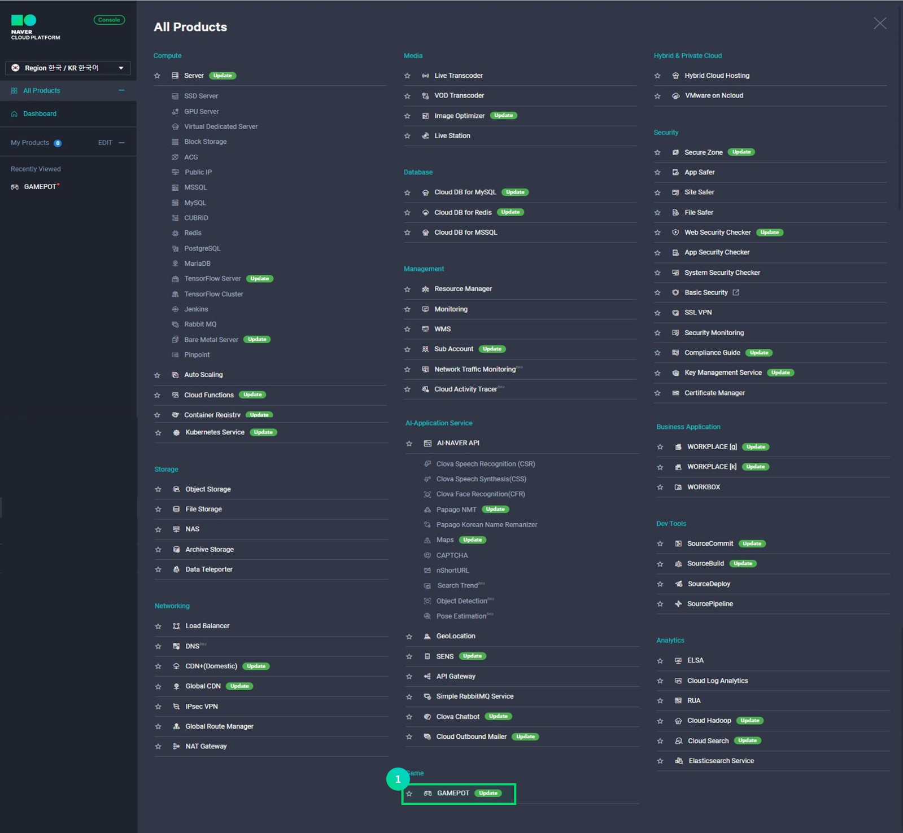
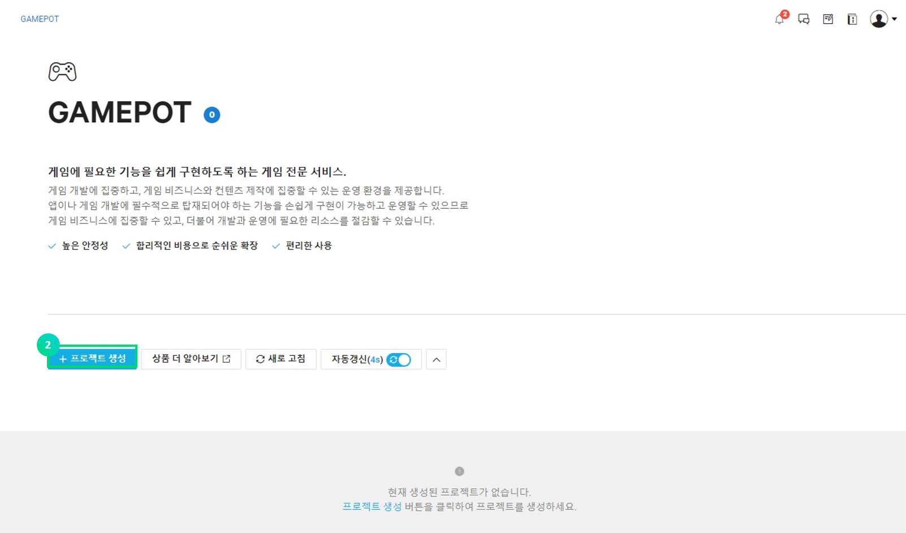
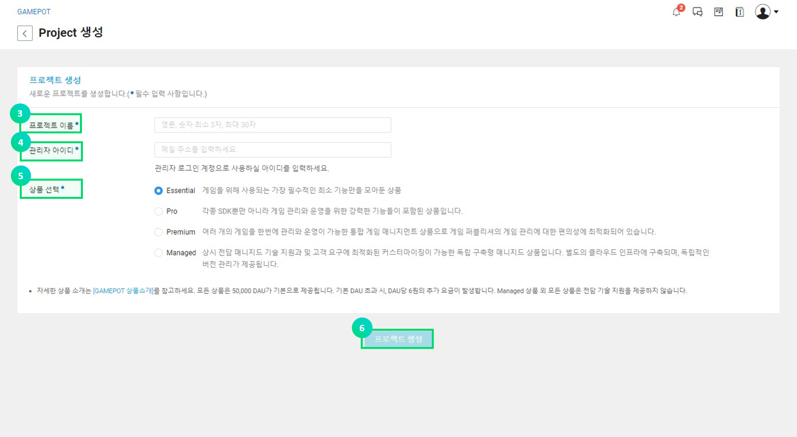
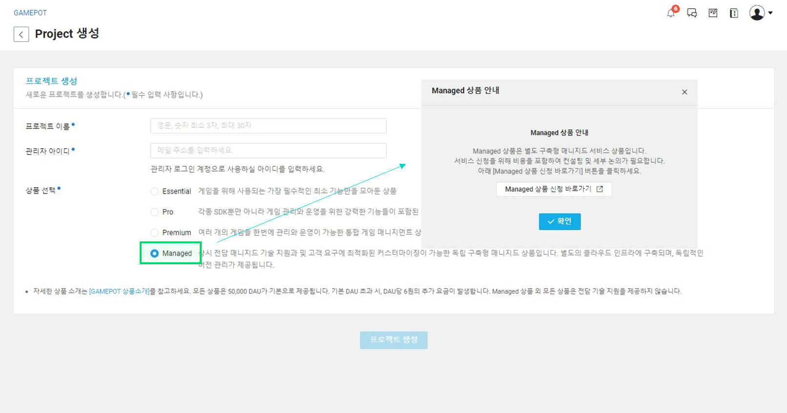
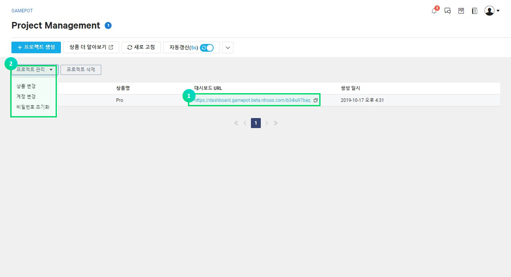
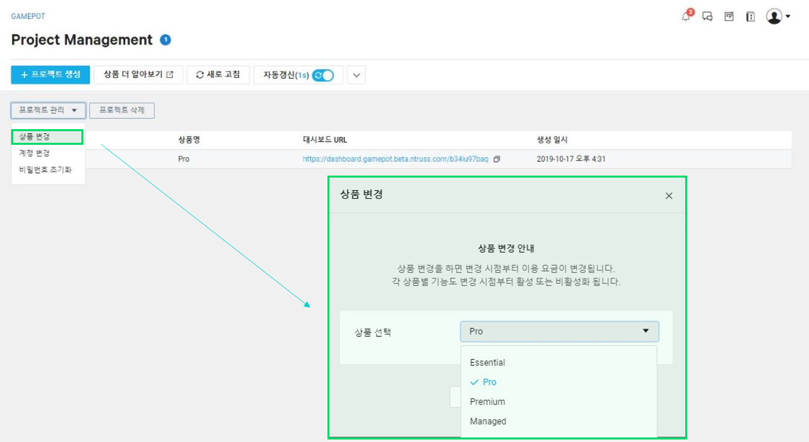
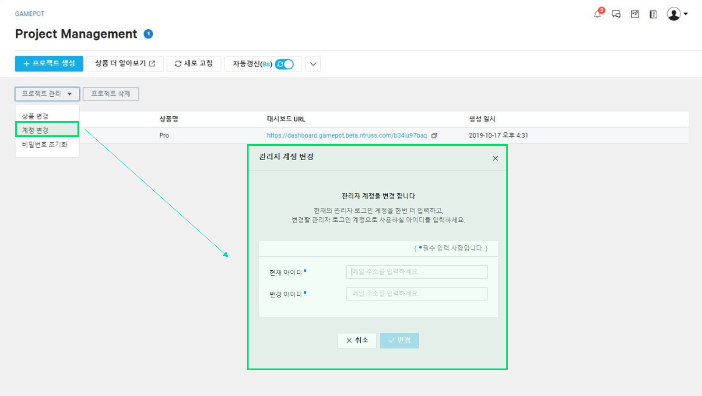
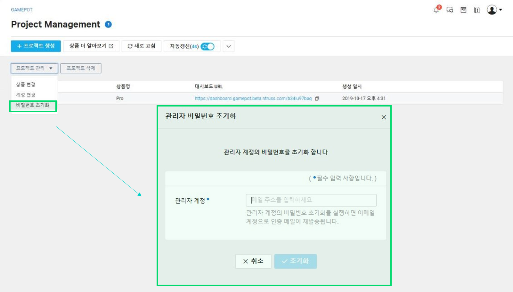
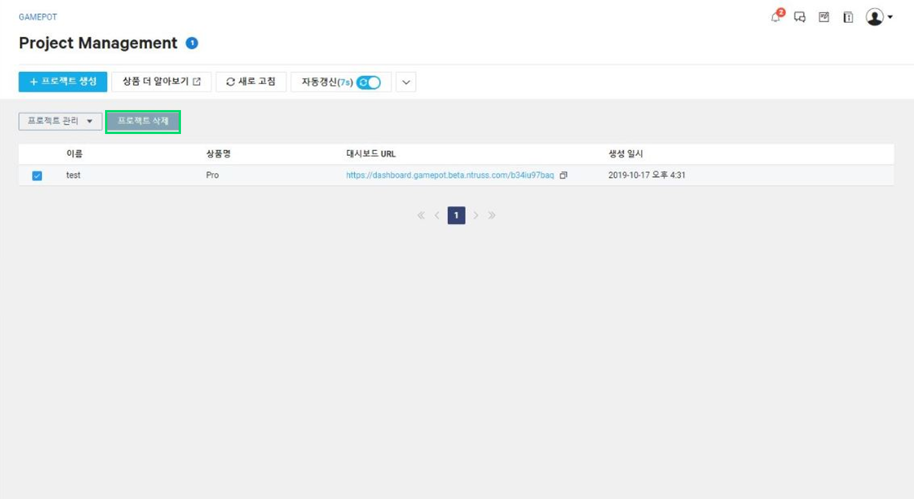
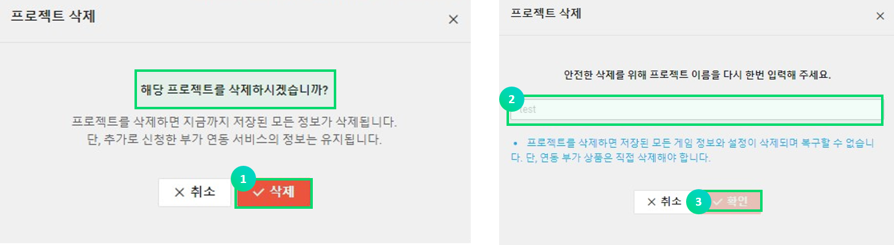

---
search:
  keyword: ['gamepot']
---

#### **네이버 클라우드 플랫폼의 상품 사용 방법을 보다 상세하게 제공하고, 다양한 API의 활용을 돕기 위해 <a href="https://guide.ncloud-docs.com/docs/ko/home" target="_blank">[설명서]</a>와 <a href="https://api.ncloud-docs.com/docs/ko/home" target="_blank">[API 참조서]</a>를 구분하여 제공하고 있습니다.**

<a href="https://api.ncloud-docs.com/docs/ko/game-gamepot" target="_blank">Gamepot API 참조서 바로가기 >></a> 
<a href="https://guide.ncloud-docs.com/docs/game-gamepotconsole" target="_blank">Gamepot 설명서 바로가기 >></a>

# Console

# 사용하기 전에

GAME Platform On the real Time(이하 GAMEPOT) 상품은 게임을 개발하고 서비스하는 데 필요한 기능을 별도의 개발 비용을 들이지 않고 간단하게 구현할 수 있는 클라우드 서비스입니다. 특히, 공통 SDK는 물론 게임 운영에 필요한 필수적인 기능과 다양한 부가 기능을 제공하여 사용자가 게임 개발에만 집중할 수 있도록 하는 완전 관리형 서비스입니다. 운영 툴이나 SDK 서버를 개발하고 인프라를 운영할 필요가 없어 자원의 효율화 효과를 얻을 수 있습니다.

**네이버 클라우드 플랫폼 GAMEPOT만의 특징**

- 게임 운영에 필요한 다양한 기능을 제공합니다.
- 편리하게 관리와 통계를 이용할 수 있는 별도의 "대시보드"가 제공됩니다. 대시보드는 모든 고객사를 단순히 계정으로만 구분하는 것이 아니므로 데이터 보안성이 높습니다.
- 게임운영에 대한 대시보드 접근 계정을 고객이 직접 관리할 수 있기 때문에 더욱 안전합니다.
- 다양한 네이버 클라우드 플랫폼의 상품과 쉽게 연동할 수 있습니다. 더불어 연동 상품의 가격도 합리적입니다.

**Q. 타사 서비스는 게임의 규모가 커질수록 비용이 증가합니다. GAMEPOT은 어떤가요?**

GAMEPOT은 게임의 성장과 비례하여 비용이 증가하는 구조가 아닙니다. 기존의 국내외 유사 서비스들은 게임이 흥행할수록 비용이 증가하는 비효율적 구조를 가지고 있으며, 이로 인하여 예상하지 못한 추가 비용이 발생했습니다. 하지만 GAMEPOT은 기본 DAU를 포함하는 정액제 요금제와 기본 DAU를 넘어섰을 경우 해당 초과된 비용만을 추가로 지불하는 종량제가 혼합된 하이브리드 형태의 요금제를 가지고 있습니다. 기본 DAU는 50,000 DAU/일 이며, 이는 결코 적은 양이 아닙니다.

**Q. 대시보드 보안성에 대해 설명해 주세요.**

고객 계정을 통해 공통된 대시보드에 접근할 경우, 고객사 계정 정보가 유출되면 저장된 모든 데이터가 유출될 수 있습니다. 네이버 클라우드 플랫폼의 보안은 외부 정보 유출을 원천적으로 차단하고 있으나 더욱 견고한 보안을 위해 GAMEPOT의 모든 고객은 모두 다른 접근 도메인과 대시보드 시스템을 제공받기 때문에 데이터를 보다 안전하게 지킬 수 있습니다.

# GAMEPOT 이용하기

## Step 1. 프로젝트 생성하기

서비스를 사용하기 위해서는 우선 프로젝트를 생성해야 합니다.

① 콘솔에서 **Game > GAMEPOT**을 선택합니다.

② **+프로젝트 생성** 버튼을 클릭합니다.

③ 게임 프로젝트의 이름을 입력합니다.

- 이름은 최소 3자에서 최대 30자까지 입력할 수 있습니다.
- 영문자, 숫자 및 '-' 기호만 가능합니다.

④ 대시보드에 사용될 관리자 아이디를 입력합니다.

- 관리자 아이디는 이메일 형태로 입력합니다.
- 아이디 인증에 필요한 메일이 입력한 메일로 전달됩니다.

⑤ 상품을 선택합니다.

- Managed 상품을 선택하면 별도의 서비스 신청을 위한 안내 팝업이 노출됩니다.

⑥ **프로젝트 생성** 버튼을 클릭하여 프로젝트 생성을 완료하세요.

- 프로젝트를 생성하면 기본 DAU가 포함된 시간당 요금이 부과됩니다. 프로젝트 생성 후, 사용하지 않더라도 요금이 부과되므로 신중한 선택이 필요합니다.

프로젝트가 생성되면 대시보드로 접근할 수 있는 URL이 표시됩니다. 관리자 아이디로 입력한 이메일을 확인하여 관리자 인증을 완료해야 합니다.

이메일 인증이 완료되면 초기 비밀번호를 입력할 수 있는 대시보드 창으로 연결됩니다. 초기 비밀번호 설정한 후 로그인하시면 됩니다.

## Step 2. 프로젝트 관리하기

프로젝트가 생성되면 게임 프로젝트 이름과 상품명이 명시된 리스트 화면을 볼 수 있습니다.

① 대시보드 URL을 통해 게임 기능을 관리할 수 있는 대시보드로 진입이 가능합니다.

② 프로젝트에 체크하고 **프로젝트 관리** 버튼을 클릭하면 간단한 관리 메뉴가 나옵니다.

- 상품 변경: 사용 중인 서비스 상품을 변경합니다. 일시적으로 대시보드 접근이 되지 않을 수 있습니다. **상품 변경** 버튼을 클릭하면 아래와 같은 팝업이 노출됩니다. 변경하고자 하는 상품을 선택 후 **수정** 버튼을 클릭합니다.

- 계정 변경: 프로젝트 생성시 입력했던 관리자 아이디를 변경할 수 있습니다. 변경 신청을 완료하면 변경된 계정의 이메일 주소로 인증메일이 전달됩니다.

- 비밀번호 초기화: 대시보드 접근 비밀번호를 분실하거나 초기화가 필요한 경우 사용합니다. 비밀번호 초기화를 한 후 대시보드에 접속하면 비밀번호를 다시 설정할 수 있습니다.

## Step 3. 프로젝트 삭제

GAMEPOT은 프로젝트 생성이 완료된 시점부터 시간당 요금이 발생합니다. 따라서 필요하지 않는 경우 프로젝트를 삭제하여 불필요한 요금이 발생하는 것을 방지해야 합니다.

① 프로젝트 삭제를 위해서는 **프로젝트 삭제** 버튼을 클릭합니다. **프로젝트 삭제** 버튼을 클릭하면 아래와 같은 팝업이 노출됩니다.

② 삭제하기 위해서는 프로젝트의 이름을 입력해야 합니다.

③ 위에 같은 팝업이 노출되고 **확인** 버튼을 클릭하면 최종적으로 삭제가 진행됩니다.
