---
search:
  keyword: ['gamepot']
---

#### **네이버 클라우드 플랫폼의 상품 사용 방법을 보다 상세하게 제공하고, 다양한 API의 활용을 돕기 위해 <a href="https://guide.ncloud-docs.com/docs/ko/home" target="_blank">[설명서]</a>와 <a href="https://api.ncloud-docs.com/docs/ko/home" target="_blank">[API 참조서]</a>를 구분하여 제공하고 있습니다.**

<a href="https://api.ncloud-docs.com/docs/ko/game-gamepot" target="_blank">Gamepot API 참조서 바로가기 >></a> 
<a href="https://guide.ncloud-docs.com/docs/game-gamepotconsole" target="_blank">Gamepot 설명서 바로가기 >></a>

# Dashboard

NAVER CLOUD PLATFORM의 GAMEPOT에서 제공하는 대시보드에 대한 가이드입니다.

## GAMEPOT 대시보드 소개

**Q. 대시보드란?**

대시보드를 통해 게임을 운영하고 관리하실 수 있습니다.

**Q. 대시보드에서 어떤 운영 기능이 포함되나요?**

대시보드에는 회원 접속 통계 및 결제에 관한 통계 및 확인이 가능하고 NAVER CLOUD PLATFORM의 서비스와 연동하여 PUSH, SMS, 로그 분석 등 다양한 기능을 제어할 수 있습니다. 또한 쿠폰이나 업데이트 등 게임에 필요한 운영 기능을 자체적으로 가지고 있어 보다 효율적인 게임 관리가 가능합니다.

## GAMEPOT 대시보드 시작하기

### 로그인

#### Step 1. 대시보드 접속

NAVER CLOUD PLATFORM의 콘솔에서 대시보드 URL을 클릭하여 대시보드에 접속합니다.

#### STEP 2. 회원가입

프로젝트 생성 시 등록한 관리자 계정으로 비밀번호 초기화 메일이 전송됩니다.

#### STEP 3. 로그인

관리자 계정이 대시보드 관리의 모든 권한을 갖는 마스터 계정이 됩니다.

① 관리자 계정에서 사용할 비밀번호를 설정합니다.

② 대시보드의 기준이 될 통화를 선택합니다. 선택한 통화는 매출 지표, 결제 통계 등에 사용됩니다. <i>운영 중에 기준 통화를 변경하여도 이전 데이터는 변경되지 않으니 신중하게 선택해 주세요.</i>

③ 대시보드에 보여질 시간대를 선택합니다.

## 대시보드 메뉴 활용하기

### 대시보드

대시보드에서는 가입현황, 매출, 접속, 통계 등의 게임의 전반적인 운영 상황을 한눈에 파악할 수 있습니다.

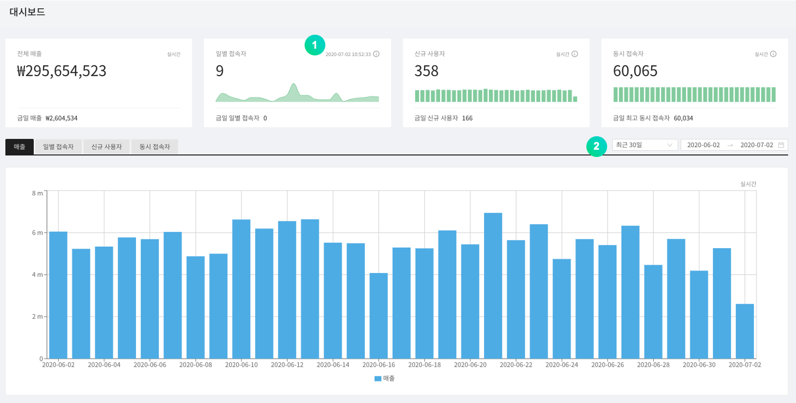

① 날짜를 선택하여 그래프를 확인 할 수 있습니다.

## 통계

### 사용자 지표

지정된 기간 동안의 각종 사용자 지표를 그래프로 나타냅니다.

① 기본적으로는 당일 기준 30일간의 사용자 지표를 출력하며, 기간 지정을 통하여 자유롭게 선택한 기간 동안 사용자 지표를 조회할 수 있습니다.

② 각 그래프를 확대하여 상세정보를 확인할 수 있습니다.

③ 마지막 업데이트 시각을 확인할 수 있습니다.

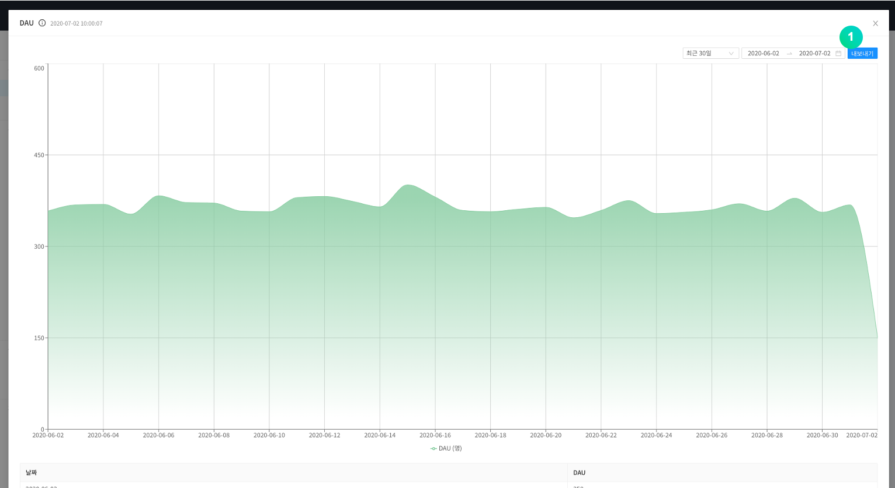

① 현재 보이는 그래프의 RAW 데이터를 CSV 파일 형태로 다운로드 할 수 있습니다.

#### Retention

Retention 데이터를 확인할 수 있습니다. [Retention D+0]은 가입일부터 지표에 표시되고 [Retention D+1]은 가입일의 다음날에도 접속한 회원부터 표시됩니다.

### 매출 지표

지정된 기간 동안의 각종 매출 지표를 그래프로 나타냅니다.

① 기본적으로는 당일 기준 30일간의 매출 지표를 출력하며, 기간 지정을 통하여 자유롭게 선택한 기간 동안 매출 지표를 조회할 수 있습니다.

② 각 그래프를 확대하여 상세정보를 확인할 수 있습니다.

③ 마지막 업데이트 시각을 확인할 수 있습니다.

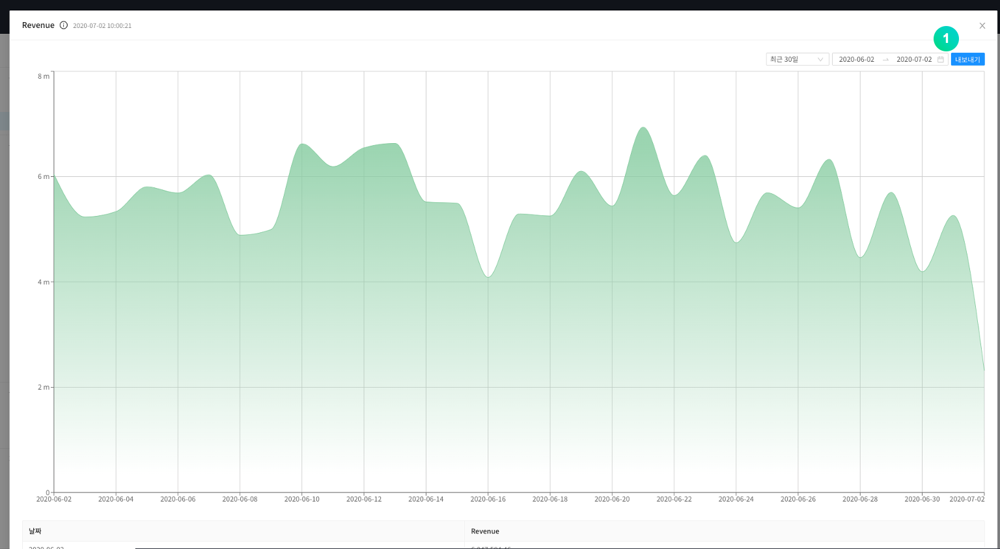

① 현재 보이는 그래프의 RAW 데이터를 CSV 파일 형태로 다운로드 할 수 있습니다.

## 운영

### 회원

#### - 목록

가입한 회원 목록이 표시됩니다.

① 가입일, 국가, 스토어, 사용자 ID, 디바이스 ID, ADID, 아이피 등을 지정하여 회원을 조회할 수 있습니다.

② 회원 목록을 CSV 파일 형태로 다운로드 할 수 있습니다.

③ 회원 로그인 이력을 최대 90일까지 CSV 파일 형태로 다운로드 할 수 있습니다.

④ 사용자ID를 클릭하면 아래와 같은 상세페이지가 나타납니다.

① 회원에 대한 기본정보를 보여줍니다.

② 게임에 접속한\(로그인\) 내역을 표시합니다.

③ 플레이어 ID, 레벨 등 게임 내 정보를 표시합니다.

④ 회원이 게임에서 결제한 내역을 표시합니다.

⑤ 회원이 접수한 문의와 그에 대한 답변 내역을 표시합니다.

⑥ 회원이 연동한 소셜 계정을 모두 보여줍니다.

- 소셜 계정을 추가하거나 연결을 취소할 수 있습니다.

⑦ 회원의 이용정지 내역을 표시합니다.

⑧ 지급된 아이템내역을 표시합니다.

**개별 푸시 발송** 버튼을 클릭하여 특정 회원에게 푸시메시지를 발송할 수 있습니다.

① 발송할 푸시메시지의 기본언어를 지정합니다.

② 발송할 메시지를 입력합니다.

③ 발송할 언어를 선택합니다.

**이용정지** 버튼을 클릭하여 특정 회원을 이용정지 할 수 있습니다.

① 이용정지 상태를 선택합니다.

② 등록한 이용정지 분류를 선택합니다.

③ 지정한 사용자ID가 입력되어 있습니다.

④ 표시될 이용정지 사유의 기본언어를 선택합니다.

⑤ 이용정지 사유를 입력하고 언어를 지정합니다.

⑥ 이용정지 기간을 지정합니다.

**회원탈퇴** 버튼을 클릭하여 특정 회원을 탈퇴시킬 수 있습니다.

#### - 일별 접속자

지정된 기간 동안의 일일 접속자 수를 그래프로 나타냅니다.

기본적으로는 당일 기준 30일간의 일일 접속자 수를 출력하며, 기간 지정을 통하여 자유롭게 선택한 기간 동안 일일 접속자 수를 조회할 수 있습니다.

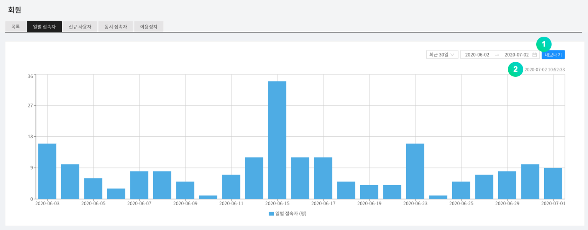

① 현재 보여지는 그래프의 RAW 데이터를 CSV 파일 형태로 다운로드 할 수 있습니다.

② 마지막 업데이트 시각을 확인할 수 있습니다.

#### - 신규 사용자

지정된 기간 동안 게임에 가입한 일일 신규 가입자 수를 그래프로 나타냅니다.

기본적으로는 당일 기준 30일간의 일일 신규 가입자 수를 출력하며, 기간 지정을 통하여 자유롭게 선택한 기간 동안 일일 신규 가입자 수를 조회할 수 있습니다.

① 현재 보여지는 그래프의 RAW 데이터를 CSV 파일 형태로 다운로드 할 수 있습니다.

② 마지막 업데이트 시각을 확인할 수 있습니다.

#### - 동시 접속자

게임에 접속한 회원의 수를 1분 단위로, 최대 3일에 대해 동시에 조회할 수 있습니다.

① 당일과 전일, 전전일이 기본적으로 지정되어 있으며, 조회하고자 하는 최대 3개의 날을 선택\(변경\)할 수 있습니다. 초기화 버튼을 이용하여 기본 지정일로 되돌아 올 수 있습니다.

② 현재 보여지는 그래프의 RAW 데이터를 CSV 파일 형태로 다운로드 할 수 있습니다.

③ 마지막 업데이트 시각을 확인할 수 있습니다.

#### - 이용정지

특정 회원에 대해, 지정된 기간동안 게임에 접속할 수 없도록 합니다.

이용정지는 회원의 사용자 ID를 기준으로 적용됩니다.

① 이용정지를 적용하기 위해, 추가 버튼을 이용합니다.

② 이용정지 분류를 설정하여 응답 메세지 템플릿을 등록할 수 있습니다.

③ 특정 기간 동안에 대해, 이용 정지 기록을 조회할 수 있습니다. 시작일 기준으로 검색됩니다.

④ 특정 사용자 ID에 대해, 이용정지 내역을 조회할 수 있습니다.

⑤ 이용정지 회원 내역이 출력됩니다.

- 활성 : 현재 이용 정지 상태가 적용된 경우
- 비활성 : 현재 이용 정지 상태가 해제된 경우

### 결제

#### - 결제목록

회원이 Google Play Store, APPSTORE, ONE Store, Galaxy Store에서 결제를 시도한 내역을 확인할 수 있습니다.

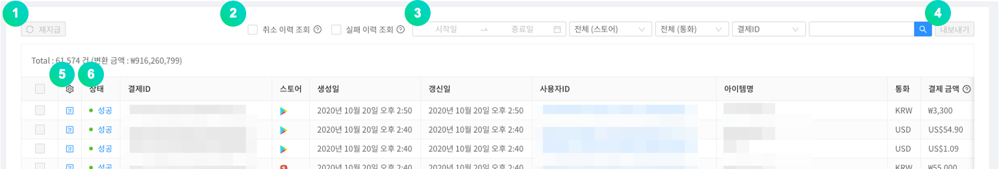

① 실패한 결제에 대해서 체크박스로 다중선택 한 다음, 재지급 버튼을 눌러 재지급 할 수 있습니다.

② 취소 및 실패한 이력만 조회할 수 있습니다.

③ 기간, 스토어, 통화, 결제 ID, 사용자 ID를 선택하여 결제목록을 확인할 수 있습니다.

④ 결제 목록을 CSV 파일 형태로 다운로드 할 수 있습니다.

⑤ 성공한 결제에 대해서 결제 취소 처리를 할 수 있습니다. 결제를 취소할 경우 매출 통계에서 제외됩니다.

⑥ 회원이 시도한 결제의 성공 여부를 조회할 수 있습니다. 실패한 결제 시도에 대해서는 아이템을 재지급할 수 있습니다.

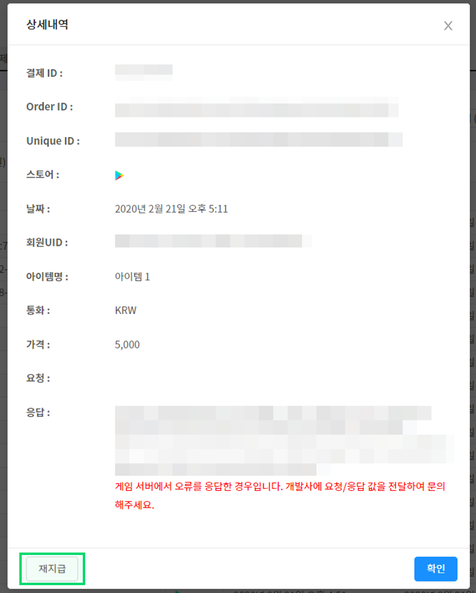

결제 상태를 클릭하여 시도된 결제에 대한 상세 내역을 확인할 수 있으며, 실패된 결제에 대해서는 재지급 버튼을 이용하여 아이템을 재지급할 수 있습니다.

#### - IAP

인앱 구매 시 상품정보를 관리하는 기능입니다. 구글플레이, 앱스토어, 원스토어, 갤럭시스토어 등의 상품을 모두 등록하셔야 합니다.

① **In-App 아이템 추가** 버튼을 클릭하면 스토어, 상품 이름, 상품 아이디를 입력하여 유료 아이템을 생성할 수 있습니다.

② **다량입력** 버튼을 클릭하면 인앱 상품을 CSV 파일로 한번에 등록할 수 있습니다.

③ 각 상품 항목의 체크박스를 다중선택 한 다음, **삭제**버튼을 클릭해 삭제할 수 있습니다.

#### - 통계

일일 단위로 결제 금액 데이터를 그래프로 보여주는 기능입니다.

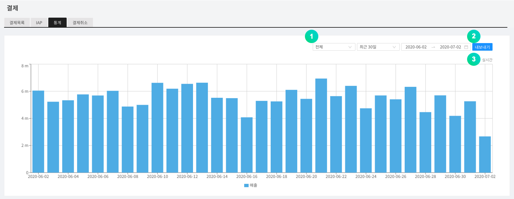

① 스토어를 지정하여 그래프를 볼 수 있습니다.

② 현재 보여지는 그래프의 RAW 데이터를 CSV 파일 형태로 다운로드 할 수 있습니다.

③ 마지막 업데이트 시각을 확인할 수 있습니다.

#### - 결제취소

스토어의 결제 영수증 상태와 비교하여 임의적으로 결제를 취소하는 회원의 게임 접속에 대해 이용정지 조치를 할 수 있습니다. 이용정지 된 회원이 해당 아이템을 재결제하면 이용 정지가 비활성화됩니다. 구글 플레이스토어, 애플 앱스토어의 영수증 검증을 지원합니다.

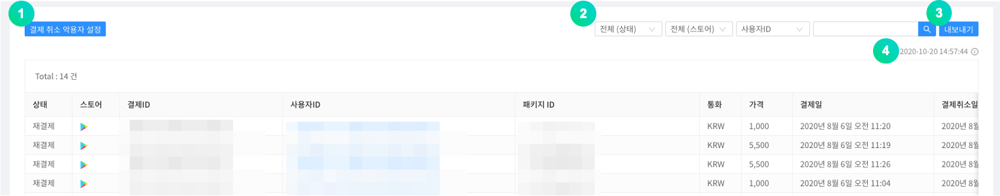

① 결제 취소자의 이용 정지 처리 조건을 설정합니다.

② 상태, 스토어, 사용자ID, 패키지ID 등을 선택하여 결제 취소 목록을 확인할 수 있습니다.

③ 결제취소 내역을 CSV 파일 형태로 다운로드 할 수 있습니다.

④ 마지막 업데이트 시각을 확인할 수 있습니다.

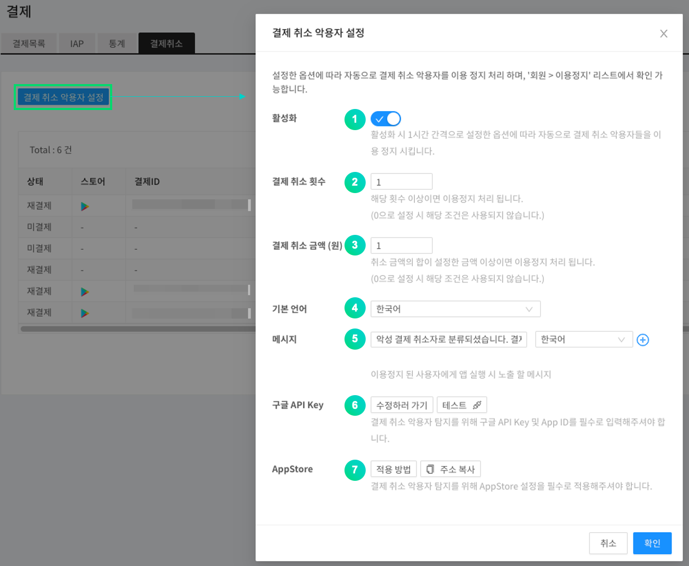

① 회원이 임의적으로 결제 취소를 악용한 부분에 대하여 이용 정지 여부를 결정할 수 있습니다. 활성화 시 1시간 간격으로 설정한 옵션에 따라 자동으로 결제 취소 악용자들을 이용 정지 시킵니다.

② 회원이 임의적으로 결제 취소를 진행한 총 횟수가 설정된 횟수 이상일 경우 게임 이용이 정지됩니다.

③ 회원이 임의적으로 결제 취소한 상품의 총합이 설정된 가격 이상일 경우 게임 이용이 정지됩니다.

④ 게임 이용이 정지된 회원이 게임 접속을 시도할 경우 출력되는 안내 메시지의 기본 언어를 선택합니다.

⑤ 게임 이용이 정지된 회원이 게임 접속을 시도할 경우 출력되는 안내 메시지입니다.

⑥ 구글의 결제 취소 리스트를 받아오기 위해 구글 API key를 입력해야 합니다. 테스트 버튼을 이용하여 기능이 정상 동작중인지 확인할 수 있습니다.

⑦ App Store의 결제 취소 리스트를 받아오기 위해 주소 복사 버튼을 클릭하여 URL을 복사하고 App Store에 입력해야 합니다.

### 공지사항

대시보드에 등록된 공지사항 이미지는 게임에 접속한 회원들에게 노출됩니다. 노출할 일정 및 스토어를 지정하면 해당 조건에 맞춰 공지사항이 노출되고 일정 종료 후에는 노출되지 않습니다.

공지사항 기능을 사용하기 위해서는 먼저 NAVER CLOUD PLATFORM의 API 인증키와 Object Storage 서비스가 필요합니다. 공지사항 기능 사용 시, Object Storage 비용은 별도로 발생합니다.

#### Step 0. 서브계정을 생성해, Object Storage 서비스 사용권한 부여

① API 인증키를 발급받기 전 서브계정을 생성해 Object Storage 사용권한을 부여한 다음, 해당 계정을 통해 API 인증키를 발급받기를 권장합니다.

② [Sub Account 사용 가이드](https://docs.ncloud.com/ko/management/management-4-1.html)를 참고하여 서브계정을 생성합니다. (서브 계정 생성 시, **API Gateway Access**를 체크해주세요.)

③ 생성한 서브계정에 Object Storage 서비스 권한을 부여해주세요. [System Managed 정책 설명서](https://docs.ncloud.com/ko/management/management-4-2.html)를 참고하여 해당 서브계정에 **NCP_OBJECT_STORAGE_MANAGER** 권한을 부여합니다. (혹은 오브젝트 스토리지 권한을 포함한 권한)

④ 생성한 서브계정으로 접속한 다음, API 인증키를 발급받습니다.

#### Step 1. API 인증키 준비

공지사항 메뉴는 API를 통해 Object Storage를 연동하여 사용합니다. 따라서 NAVER CLOUD PLATFORM의 API 인증키를 사전에 준비해야 합니다.

API 인증키는 **포털 &gt; 마이페이지 &gt; 계정관리 &gt; 인증키 관리** 메뉴에서 만들 수 있습니다.

① API 인증키를 생성하기 위해서 **신규 API 인증키 생성**을 클릭하세요.

- API 인증키는 계정당 2개까지 생성할 수 있습니다.

#### Step 2. 대시보드와 API 인증키 연동하기

발급 받은 인증키를 대시보드 연동을 해야 Object Storage의 버킷이 생성되고 공지사항 기능을 사용할 수 있습니다. 대시보드의 **프로젝트 설정 &gt; Ncloud** 메뉴로 이동하여 API 인증키를 연결합니다.

API 인증키가 연결되면 Object Storage의 버킷이 자동으로 생성됩니다. 공지사항에 사용된 모든 이미지는 해당 버킷에 저장됩니다.

#### Step 3. 공지사항 추가

공지사항을 추가하기 위해서 **공지사항** 메뉴로 이동합니다.

화살표 버튼을 이용하여 사용자에게 노출할 이미지 순서를 지정할 수 있습니다.

**공지사항 추가** 버튼을 통해 이미지를 추가할 수 있습니다.

이후 팝업 메뉴가 나타나면 원하는 값을 입력하고 **저장** 버튼을 클릭하면 공지가 추가됩니다.

선택한 스토어의 분류에 따라 모든 스토어의 해당 앱에 공지사항이 노출되거나, 특정 스토어를 통하여 게임을 접속한 사용자에게만 공지사항이 노출될 수 있도록 지정할 수 있습니다.

분류가 지정된 이미지는, 해당 분류 값으로 호출할 때에만 이미지가 노출됩니다.

국가를 지정하면 해당 국가에 해당하는 디바이스에 대해서만 이미지가 노출됩니다.

노출된 공지사항 이미지를 사용자가 터치할 경우 클릭액션 타입에 의해 URL은 외부 브라우저로 이동하며, SCHEME은 callback 함수로 값을 리턴합니다.

언어 설정 별로, 노출 될 이미지를 추가 등록 할 수 있습니다.

### 점검 & 업데이트

점검 및 업데이트 기능을 이용하여 더욱 쉽고 편리하게 게임을 관리할 수 있습니다.

#### - 점검

게임 점검 시간에 자동으로 점검 메시지와 함께 게임 접속을 차단합니다.

점검 시간과 메시지를 입력한 뒤 저장하면 게임 내 점검 공지가 노출됩니다.

① 스토어를 지정하실 수 있습니다. 전체 점검일 경우 전체 스토어로 지정해 주세요.

② 점검 시작 시간과 종료 시간을 지정해 주세요.

③ 디바이스 언어설정에 따라 다르게 노출될 점검 메시지 중, 기본언어를 지정합니다.

④ 언어설정 별로 다르게 노출 될 메시지를 추가로 등록할 수 있습니다.

⑤ URL은 점검 시에 자세히 보기 클릭 시에 이동시킬 주소를 입력해 주세요.

**예: 카페 공지사항이나 자체 제작된 점검 안내 페이지**

#### - 업데이트

최신 버전이 아닐 경우 업데이트 안내를 보여주고 구글플레이나 애플스토어와 같은 스토어의 업데이트 화면으로 이동합니다.

① 스토어별로 설정을 합니다.

② 기능 활성화 여부를 선택합니다.

③ **강제**로 선택한 경우 스토어에서 업데이트를 하기 전까지 게임을 이용할 수 없고, **권장**을 선택한 경우 스토어에서 업데이트를 하지 않아도 게임을 이용할 수 있습니다.

④ 버전정보를 입력합니다. 입력된 버전과 다르거나 낮을 경우 기능이 동작합니다.

⑤ 업데이트 버튼 선택 시 이동할 URL을 입력합니다.

- Custom URL 입력 : 클라이언트 업데이트 팝업에서 업데이트 버튼 선택 시 설정된 Custom URL로 이동
- Custom URL 미 입력 : 클라이언트 업데이트 팝업에서 업데이트 버튼 선택 시 기본 설정 되어 있는 스토어로 이동

### 메시지

별도의 메시지 서버 구축 없이 SMS, PUSH 등을 통해 메시지 알림 기능을 구현할 수 있는 서비스입니다. 해당 기능을 사용하기 위해서는 NAVER Cloud Plaform의 Simple & Easy Notification Service\(SENS\)를 신청해야만 합니다.

① 서브계정을 생성하여, SENS 서비스를 신청하기를 권장합니다. 본문의 **공지사항 -> Step 0** 를 참고하여, 서브계정을 생성합니다. (**Step 0** 와 마찬가지로, API 인증키 또한 서브계정에서 발급 받아주세요.)

② 생성한 서브계정에 SENS 서비스 권한을 부여해주세요. [System Managed 정책 설명서](https://docs.ncloud.com/ko/management/management-4-2.html)를 참고하여 해당 서브계정에 **NCP_SENS_MANAGER** (를 포함하는) 권한을 부여합니다.

① SENS와 연동하기 위해서는 서비스 키를 발급해야 합니다. **서비스 키 발급** 버튼을 클릭하고, 생성한 서브계정으로 접속한 다음 [SENS 공통 가이드](https://docs.ncloud.com/ko/sens/sens-1-2.html)를 참고하여 서비스 키를 발급 받습니다.

② **인증서 등록 가이드** 버튼을 클릭하여 **SENS 웹 콘솔 사용 가이드**에 따라 인증서를 등록합니다.

③ **설정** 버튼을 클릭하여 아래의 화면으로 이동하여 PUSH 서비스 ID 값을 입력합니다.

#### - 푸시메시지

**메시지 &gt; 푸시 메시지** 메뉴를 클릭하면 발송 상태, 예약 시간, 발송 시간 등을 확인할 수 있는 목록 화면이 나타납니다.

**푸시 메시지** 메뉴에서 **+메시지 추가** 버튼을 클릭하면 아래와 같은 팝업이 노출됩니다. 해당 팝업 메뉴를 통해 메시지 발송이 가능합니다.

① 푸시 메시지의 전송 스케쥴을 지정할 수 있습니다. \(즉시발송 / 예약발송 / 예약발송\(글로벌 현지시각\)\)

② 플랫폼을 지정하여, 지정된 플랫폼 유저들만 푸시를 받을 수 있습니다.

③ 디바이스의 언어설정에 따라 다르게 전송될 푸시 메시지 중, 기본언어를 지정합니다.

④ 제목을 필요에 따라 입력할 수 있습니다. 미입력 시 앱 이름이 제목으로 보입니다.

⑤ 디바이스의 언어설정에 따라 다른 푸시 메시지를 등록할 수 있습니다.

CSV파일 업로드를 통해 푸시메시지를 대량으로 발송할 수 있습니다.

- 다량입력을 통해 최대 100개의 푸시를 등록 할 수 있습니다.(CSV 파일 최대 용량 20MB)
- CSV 샘플을 다운 받아 설정 후 CSV 파일 등록하기를 클릭하여 등록해주세요.
- CSV 파일은 UTF-8 형식으로 저장 후 등록해주세요.
- 다량입력은 푸시 즉시발송을 지원하지 않습니다.

#### - 문자메시지

SMS/LMS 발송, 이력 및 결과 조회 등의 기능을 사용할 수 있습니다. SMS/LMS를 발송하려면 먼저 NAVER CLOUD PLATFORM의 SENS에서 서비스 키 발급과 발신 번호 등록이 필요합니다.

① SENS와 연동하기 위해서는 우선 서비스 키를 발급과 발신번호 등록을 해야 합니다. **서비스 키 발급** 버튼을 클릭하여 [SENS 공통 가이드](https://docs.ncloud.com/ko/sens/sens-1-1.html)와 [SENS SMS 사용 가이드](https://docs.ncloud.com/ko/sens/sens-1-3.html)를 참고하여 서비스 키 발급과 발신 번호를 등록합니다.

② **설정** 버튼을 클릭하여 서비스 ID와 Secret Key를 입력하여 주세요.

**메시지 추가** 버튼을 클릭합니다. 아래와 같은 팝업이 노출됩니다.

① SMS 단문메시지, LMS 장문 메시지입니다. 메시지에 따라 가격이 상이합니다.

② 네이버 클라우드 콘솔에 등록하신 발신번호를 입력해 주세요.\(등록되지 않은 번호는 발송이 되지 않습니다.\)

③ SMS,LMS로 발송될 수신 번호를 입력할 수 있습니다.

④ SMS,LMS 수신 번호/쿠폰 난수 번호 등이 다량일 경우, CSV 형태의 파일로 구성할 수 있으며 이에 대한 샘플 파일을 다운로드 받을 수 있습니다.

⑤ SMS,LMS 수신 번호/쿠폰 난수 번호 등이 다량일 경우, CSV 형태의 파일로 구성하여 업로드 할 수 있습니다. 업로드 된 SMS,LMS 수신 번호 및 쿠폰 난수 번호는 ⑥의 메세지 내용 중 지정된 항목에 매칭되어 자동으로 입력 및 SMS,LMS로 발송됩니다.

⑥ SMS, LMS로 발송될 메시지 내용을 입력해 주세요.

⑦ 예약시간을 지정하시면 지정된 시간에 메시지가 발송됩니다.

### 쿠폰

게임 내에 필수적으로 사용되는 쿠폰 기능은 일반 쿠폰, 키워드 쿠폰을 지원합니다.

#### - 일반쿠폰

일반 쿠폰은 일반적인 코드 형태로 되어 있는 쿠폰입니다.

게임 내에서 사용될 쿠폰을 쉽게 생성 및 관리 하실 수 있는 기능입니다.

리스트 앞 쪽의 아이콘을 클릭하면 쿠폰 수량을 추가하거나 사용 통계를 확인할 수 있습니다.

**+쿠폰생성**을 클릭하면 쿠폰을 생성할 수 있습니다.

Prefix\(접두사\), Suffix\(접미사\)를 지정한 경우 쿠폰번호 생성 시 지정된 문구가 붙습니다.

쿠폰 수량은 최대 10만개 생성 가능하며, 생성 후에 증가시킬 수 있습니다. 최대 쿠폰 수는 50만개 입니다.

제목과 내용을 입력하면 인게임에서 쿠폰 제목과 쿠폰 내용을 보여줄 수 있습니다.

쿠폰 사용 시 지급되는 아이템과 아이템의 수량을 지정할 수 있습니다. + 버튼을 통해 복수의 아이템을 지급할 수 있습니다.

#### - 키워드 쿠폰

'크리스마스','오픈이벤트','새해'와 같이 지정된 키워드를 생성하고 해당 키워드를 쿠폰창에 입력시에 아이템을 지급하는 기능입니다. 최근 쿠폰 코드 입력이 복잡하여 게임 사용자의 편의를 위해 키워드 쿠폰이 많이 활용됩니다.

**+쿠폰 생성**을 클릭합니다.

기간과 쿠폰을 지급할 키워드를 입력해야 합니다.

제한 수량을 초과하지 않고 지급이 가능합니다.

제목과 내용을 입력하면 인게임에서 쿠폰 제목과 쿠폰 내용을 보여줄 수 있습니다.

쿠폰 사용 시 지급되는 아이템과 아이템의 수량을 지정할 수 있습니다. + 버튼을 통해 복수의 아이템을 지급할 수 있습니다.

#### - 사용내역

전체 발급된 쿠폰 번호를 기간, 쿠폰 번호, 사용자 ID 등으로 조회하실 수 있습니다.

[실패 이력 조회] 버튼을 체크하면 실패한 이력만 조회할 수 있습니다.

### 고객지원

고객이 게임 내에서 문의를 남겼을 경우 조회하고 답변할 수 있는 기능입니다. 게임 내 고객지원 창에서 기본 정보를 입력할 수 있도록 되어 있는 경우 GAMEPOT에서도 해당 정보를 확인하실 수 있습니다.

#### - 고객문의

고객이 문의한 내역을 확인하실 수 있습니다.

고객문의 페이지에서 해당 회원에 대한 모든 정보를 확인할 수 있습니다.

번역 기능으로 문의 내용, 답변 내용의 언어를 감자히거나 원하는 언어로 번역할 수 있습니다.

> 고객문의 번역 기능은 프로젝트 설정>NCloud>Papago 값을 설정해야 노출됩니다. 기본 번역 언어, 자동 언어 감지, 자동 번역 기능은 회원 정보 수정에서 설정할 수 있습니다.

각 문의에 담당자를 지정할 수 있습니다. 담당자를 지정하면 해당 담당자 외 다른 사용자는 문의에 답변할 수 없습니다.

답변 템플릿을 선택하여 자주 쓰는 답변 내용을 불러올 수 있습니다.

답변에 필요한 이미지 및 동영상 파일을 업로드할 수 있습니다.

답변 만족도는 문의 종료 후 고객이 만족도를 선택해야 노출됩니다.

**\[알림 및 문의 설정\]**

문의 답변 시 고객에게 푸시, 메일을 발송을 설정하거나 문의 설정을 하는 기능입니다.

##### 푸시 설정

디바이스 언어 설정에 따른 푸시 알림 기능을 설정합니다.

##### 메일 설정

발신 메일 설정을 언어별로 입력합니다.

메일 발송 기능을 사용하려면 발신 메일 주소, 발신 메일 이름을 필수로 입력해야 합니다.

메일 내용을 입력하지 않으면 기본 메시지가 발송됩니다.

**발신 메일 미리보기** 버튼을 클릭하여 발송될 메일 템플릿을 확인할 수 있습니다.

##### 고객문의 설정

문의 시 수집 항목 노출 여부를 선택합니다.

활성화한 항목은 고객 문의 UI에 입력 항목이 표시됩니다.

**\[분류 설정\]**

고객문의에 대한 템플릿을 미리 설정해놓는 기능입니다.

**분류 설정**을 클릭합니다.

**분류 추가**를 통해, 고객문의에 대한 분류명을 추가하고 관리할 수 있습니다.

디바이스 언어설정에 따라 다른 분류명과 템플릿을 지정해 놓을 수 있습니다.

이벤트 약관을 설정하면 SDK에서 해당 분류를 선택했을때 약관창이 노출됩니다.

**\[Web 문의 주소\]**

로그인 하지 않은 유저도 Web으로 문의를 남길 수 있습니다. 답변은 이메일로 발송됩니다.

**Web 문의 주소**를 클릭하면 외부 문의 URL이 클립보드에 저장됩니다.

**\[답변 템플릿 설정\]**

문의 답변 템플릿을 설정할 수 있습니다.

**답변 템플릿 추가**를 클릭합니다.

① 답변 템플릿 사용 여부를 선택합니다.

② 템플릿 언어를 선택합니다. 프로젝트의 사용 언어만 설정 가능합니다.

③ 선택한 언어에 적용할 템플릿명을 입력합니다.

④ 선택한 언어에 적용할 답변 템플릿 내용을 입력합니다.

#### - FAQ

자주 묻는 질문 내역을 등록하고, 확인할 수 있습니다.

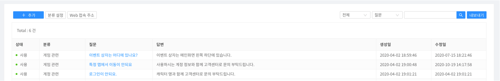

**추가**를 클릭합니다.

① 상태를 체크하면 해당 질문이 활성화되어 확인할 수 있습니다.

② FAQ의 분류명을 선택할 수 있습니다.

③ 디바이스 언어설정에 따라 다르게 노출되는 FAQ 항목에서, 기본언어를 지정합니다.

④ 디바이스 언어설정에 따라 다른 질문과 답변을 등록해 놓을 수 있습니다.

⑤ 질문과 이에대한 답변을 입력합니다.

**\[분류 설정\]**

FAQ에 대한 분류를 설정해놓는 기능입니다.

**분류 설정**을 클릭합니다.

**분류 추가**를 통해, 고객문의에 대한 분류명을 추가하고 관리할 수 있습니다.

① 상태를 체크하면 해당 분류명이 활성화됩니다.

② 디바이스 언어설정에 따라 다르게 노출되는 FAQ 분류명에서 기본언어를 지정합니다.

③ 디바이스 언어설정에 따라 다른 FAQ 분류명으로 지정해 놓을 수 있습니다.

④ 지정한 언어의 분류명을 입력합니다.

**\[Web 접속 주소\]**

외부접속으로 로그인 하지 않은 유저도 Web에서 FAQ를 확인할 수 있습니다.

#### - 이용약관 설정

사내 이용약관 내용을 입력할 수 있습니다. 이 내용은 SDK를 통해 사용자에게 노출 할 수 있습니다.

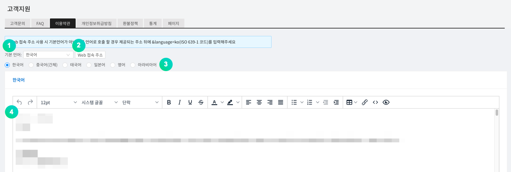

① 디바이스 언어설정에 따라 다르게 노출되는 이용약관 내용에서 기본언어를 지정합니다.

② 이용약관을 웹페이지에서 확인할 수 있습니다. 클릭하면 URL이 복사됩니다. 다른 언어로 접속하려면 URL뒤에 <b><i>&language=ko</i> (ISO 639-1 코드 참고)</b>를 추가합니다.

③ 디바이스 언어설정마다 다른 이용약관 내용을 입력할 수 있습니다.

④ 지정한 언어에 대한 이용약관 내용을 입력합니다.

#### - 개인정보 취급 방침 설정

사내 개인정보 취급 방침 내용을 입력할 수 있습니다. 이 내용은 SDK를 통해 사용자에게 노출 할 수 있습니다.

① 디바이스 언어설정에 따라 다르게 노출되는 개인정보 취급 방침 내용에서 기본언어를 지정합니다.

② 개인정보 취급 방침을 웹페이지에서 확인할 수 있습니다. 클릭하면 URL이 복사됩니다. 다른 언어로 접속하려면 URL뒤에 <b><i>&language=ko</i> (ISO 639-1 코드 참고)</b>를 추가합니다.

③ 디바이스 언어설정마다 다른 개인정보 취급 방침 내용을 입력할 수 있습니다.

④ 지정한 언어에 대한 개인정보 취급 방침 내용을 입력합니다.

#### - 환불정책 설정

사내 환불정책 내용을 입력할 수 있습니다. 이 내용은 SDK를 통해 사용자에게 노출 할 수 있습니다.

① 디바이스 언어설정에 따라 다르게 노출되는 환불정책 내용에서 기본언어를 지정합니다.

② 환불정책을 웹페이지에서 확인할 수 있습니다. 클릭하면 URL이 복사됩니다. 다른 언어로 접속하려면 URL뒤에 <b><i>&language=ko</i> (ISO 639-1 코드 참고)</b>를 추가합니다.

③ 디바이스 언어설정마다 다른 환불정책 내용을 입력할 수 있습니다.

④ 지정한 언어에 대한 환불정책 내용을 입력합니다.

#### - 통계

일정 기간에 대한 고객문의 통계를 확인할 수 있습니다.

답변 만족도는 문의 종료 후 고객이 만족도를 선택해야 노출됩니다.

#### - 담당자별 통계

담당자를 선택하여 담당자별 통계를 확인할 수 있습니다.

#### - 일별 리포트

고객 문의 통계를 일별로 확인할 수 있습니다.

최대 90일까지 조회가능합니다.

#### -페이지

웹문서를 생성하고 접속 주소를 제공하는 기능입니다.

각 언어에 대한 내용을 입력한 후 제공되는 주소뒤에 &language=(언어코드)를 입력하면 해당 언어로 호출할 수있습니다.

#### -GDPR

클라이언트에서 접속하는 IP 기준으로 GDPR 대상 국가를 판별하여 기존 약관 화면 대신 GDPR 약관 화면을 보여줍니다.

① GDPR 관련 설정을 할 수 있습니다.

② GDPR 페이지를 선택할 수 있습니다.

③ 현재 페이지의 사용 여부를 선택할 수 있습니다.

④ 현제 페이지의 필수 확인 여부를 선택할 수 있습니다.

> GDPR을 사용하기 위해 NAVER CLOUD 콘솔에서 OutBoundMailer 기능을 활성화해야 합니다.

① GDPR 활성화 여부를 선택할 수 있습니다. GDPR을 활성화하면 기존 이용약관, 개인정보처리방침이 GDPR 설정 내용으로 대체됩니다.

② 발신 메일 주소를 입력합니다.

③ 발신 메일 이름을 입력합니다.

④ 광고 앱 동의 활성화 여부를 선택할 수 있습니다. [개인 맞춤광고 보기에 대한 동의], [개인 맞춤이 아닌 광고 보기에 대한 동의] 항목은 이 항목이 선택되어 있어야 노출됩니다.

## 게임

### 플레이어

SDK를 통해 인게임 캐릭터 정보를 전송하고, 대시보드 상에서 확인할 수 있습니다.

### 선물하기

Webhook을 통해 아이템을 게임 서버로 발송할 수 있습니다.

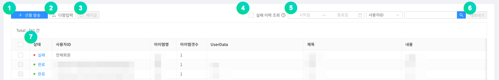

① 선물발송을 추가할 수 있습니다.

② CSV 업로드을 통해 선물발송을 다량으로 등록할 수 있습니다.

③ 실패한 선물내역에 대해서 체크박스로 다중선택 한 다음, 재지급 버튼을 눌러 재지급 할 수 있습니다.

④ 실패한 이력만 조회할 수 있습니다.

⑤ 기간, 사용자ID, 제목, 내용 등으로 검색할 수 있습니다.

⑥ 선물발송 내역을 CSV 파일 형태로 다운로드 할 수 있습니다.

⑦ 선물 발송 상세 내역을 확인할 수 있습니다.

**선물 발송** 버튼을 클릭합니다.

① 체크하면 실제 게임서버로 발송하지 않고 테스트합니다.

② 대상을 선택합니다.

③ 대상 ID를 입력할 수 있습니다.

④ 아이템 발송 시 UserData값으로 전달되는 데이터를 입력합니다.

⑤ 표시될 제목을 입력할 수 있습니다.

⑥ 표시될 설명을 입력할 수 있습니다.

⑦ 발송할 아이템과 수량을 지정합니다.

#### - 아이템

아이템 메뉴에서는 쿠폰을 통해 획득 가능한 쿠폰 아이템을 생성할 수 있는 메뉴입니다. **아이템 추가** 버튼을 클릭하여 아이템을 추가할 수 있습니다.

① 아이템을 추가 할 수 있습니다.

② **다량입력** 버튼을 클릭하면 아이템을 CSV 파일로 한번에 등록할 수 있습니다.

① 아이템의 이름을 입력합니다.

② 아이템 ID를 입력합니다. 아이템 ID는 아이템마다 고유해야 합니다.

### 사전예약

사전 예약 기능은 사전예약 웹페이지를 통해 등록한 사용자의 통계를 보여주는 기능입니다.

① 사전예약을 추가 할 수 있습니다. 사전예약명은 통계 산출을 위한 ID로 활용됩니다.

② 사전예약명을 수정할 수 있습니다.

③ 사전예약 신청자를 다운로드 받을 수 있습니다.

향후 사전 예약자에게 대량 문자 발송이 가능하도록 기능을 추가할 예정입니다.

### 원격구성

원격구성 기능은 앱을 업데이트 하지 않고 앱의 동작과 모양을 변경할 수 있도록 하는 기능입니다. 서버에 매개변수를 추가하고 해당 값을 GAMEPOT SDK에서 불러와 사용하실 수 있습니다. 따라서 게임 내에 기능을 서버에서 제어하고자 하는 경우 이 기능을 이용하면 쉽게 적용 및 제어가 가능합니다.

**추가** 버튼을 클릭합니다. 아래와 같은 팝업 창이 노출되면, 매개변수와 값을 입력합니다.

해당 매개변수와 값이 반영되는 시점은 새롭게 앱을 실행하는 유저부터 반영됩니다.

### 로그

로그는 NAVER CLOUD PLATFORM의 ELSA를 연동하여 게임 내 로그나 크래시 로그 등을 수집하실 수 있는 기능입니다. ELSA의 사용법은 [ELSA 이용 가이드](https://docs.ncloud.com/ko/elsa/elsa-1-1.html)를 참고하세요.

## 광고

(주)나스미디어와 제휴하여, 손쉽게 광고를 신청하고 각종 통계정보를 GAMEPOT 대시보드에서 확인할 수 있는 기능입니다.

## 설정

### 프로젝트 설정

#### - 일반

앱의 전반적인 환경을 설정하고 앱을 운영하기 위한 다양한 키값을 입력하실 수 있습니다.

##### 기본정보

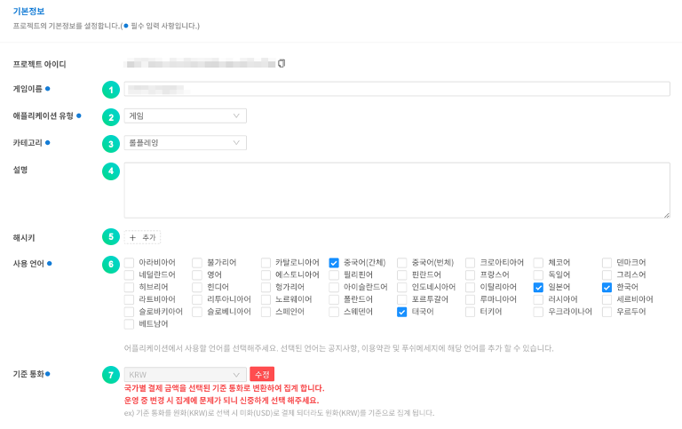

① 게임이름을 적어주세요.

② 애플리케이션 유형을 선택할 수 있습니다.

③ 카테고리를 선택할 수 있습니다.

④ 프로젝트 설명을 입력할 수 있습니다.

⑤ 해시키를 입력할 수 있습니다.

⑥ 사용언어를 선택할 수 있습니다.

⑦ 기준 통화를 변경할 수 있습니다.

- 운영 중에 기준 통화를 변경하여도 지난 결제 금액은 변경되지 않습니다. 신중하게 선택해주세요.

##### Public Key

구글 스토어와 원 스토어와 연동하기 위해 설정하는 항목입니다.

① 구글 스토어 Public key 값을 입력합니다.

② 구글 스토어에서 동일한 게임을 2가지 버전으로 출시할 경우\(예를 들어 12세, 18세\), 패키지 명을 앞에 넣고 뒤에 Public key 값을 넣습니다.

③ 원 스토어 Public key 값을 입력합니다.

④ 원 스토어에서 동일한 게임을 2가지 버전으로 출시할 경우\(예를 들어 12세, 18세\), 패키지 명을 앞에 넣고 뒤에 Public key 값을 넣습니다.

##### 구글 API Key

구글 API 연동\(구글스토어 결제 취소자 목록 확인 및 최신버전의 결제 영수증 검증\)에 필요한 설정 항목입니다.

① 구글에서 제공하는 JSON 데이터를 입력합니다. '도움말 보기'를 참고하세요.

② 결제 영수증 검증 버전입니다. 1번 항목에 데이터를 입력 했다면 'Version 3'로 선택하세요.

③ 구글 영수증 검증 테스트로 입력한 구글 JSON값이 올바른지 확인할 수 있습니다.

① 구글 영수증의 패키지명을 입력합니다.

② 구글 영수증의 상품명을 입력합니다.

③ 구글 영수증의 구매 토큰을 입력합니다.

④ 구글 영수증 조회 결과를 확인할 수 있습니다.

##### Apple ID Login

안드로이드 기기에서 Apple ID로 로그인하기 위해서 사전에 설정해야 하는 정보입니다. 입력 방법 및 Return URL은 도움말보기를 클릭하여 자세히 확인하실 수 있습니다.

##### App ID

강제 업데이트로 스토어 이동시 필요한 설정 항목입니다. 아이디 획득 방법은 도움말보기를 클릭하여 확인하실 수 있습니다. 첫번째 입력칸은 버전 구분을 위한 값을 입력하고 두번째 입력칸은 스토어로 보낼 값을 입력합니다.

① 구글스토어 패키지명을 입력합니다.

② 동일한 게임을 2가지 버전으로 출시할 경우\(예를 들어 12세, 18세 버전\)구글스토어 패키지명을 추가로 입력합니다.

③ 원스토어의 패키지명과 PID를 입력합니다.

④ 동일한 게임을 2가지 버전으로 출시할 경우 원스토어 패키지명과 PID를 추가로 입력합니다.

⑤ 갤럭시스토어의 패키지명을 입력합니다.

⑥ 동일한 게임을 2가지 버전으로 출시할 경우 갤럭시스토어 패키지명을 추가로 입력합니다.

⑦ 애플스토어의 번들아이디와 애플아이디를 입력합니다.

⑧ 동일한 게임을 2가지 버전으로 출시할 경우 애플스토어의 번들아이디와 애플아이디를 추가로 입력합니다.

##### Server Key

원 스토어에서 인앱 결제를 하고 아이템 지급을 요청하기 위해서 사전에 설정해야 하는 정보입니다.

① 원 스토어의 라이선스 키를 입력합니다.

② 두 가지 버전으로 출시하는 경우 다른 버전의 라이선스 키를 입력합니다.\(두 가지 버전이 아닌 경우 입력하지 않아도 됩니다.\)

##### Auth Key

Auth Key 항목은 구글, 페이스북 로그인 시 토큰 검증에 사용되며, 토큰 검증 실패 시 게임 유저의 로그인을 제한합니다. 로그인이 제한된 게임 유저는 이용정지 메뉴에 자동으로 등록됩니다.

① 구글의 Client ID값을 입력합니다.

② 페이스북의 App ID값을 입력합니다.

③ 페이스북의 App Secret Key값을 입력합니다.

④ 애플 PRIVATE KEY 를 입력합니다.

⑤ 애플 KEY ID 를 입력합니다.

⑥ 애플 TEAM ID 를 입력합니다.

##### WebHook

결제 아이템은 결제 성공 시 아이템 지급을 요청하는 주소를 입력합니다.

쿠폰 아이템은 SDK를 이용하여 쿠폰 사용 성공 시 SDK 서버에서 개발사 서버로 성공에 대한 처리\(아이템 지급\)를 요청하는 주소를 입력합니다.

실 서비스에 이용되는 주소\(서비스\)와 서비스 중 테스트 환경이 필요한 경우의 주소\(테스트사용자\)가 제공됩니다. 테스트 사용자 주소로 동작하게 하려면 '프로젝트 설정 &gt; 테스트 사용자'에 추가해 주셔야 합니다.

**WebHook Test** 버튼을 클릭하여 WebHook 적용을 간단하게 테스트할 수 있습니다.

**White IP** 버튼을 클릭하여 Webhook을 통해 게임 서버 호출 시 허용해야 하는 IP 리스트를 확인할 수 있습니다.

**테스트 결제 발송 차단** 스위치를 활성화하면 테스트 결제 시 Webhook을 발송을 차단할 수 있습니다.

> 활성화한 경우 : 테스트 결제 시 결제 실패로 처리
>
> 비활성화한 경우 : 테스트 결제 시 결제 성공으로 처리

#### - Ncloud

네이버 클라우드 플랫폼과 연동하기 위한 키값을 추가 변경하실 수 있습니다. 자세한 사용법은 각 항목의 사용자 가이드를 참고하시기 바랍니다.

#### - CDN

CDN을 이용하고자 할 경우 아래 CDN 주소를 입력해 주세요.

**CDN 주소 입력 시 주의 사항**

- 반드시 CDN의 원본은 \[공지사항\] 기능에 사용되는 Object Storage가 설정되어야 합니다.
- 입력한 CDN이 없거나 URL 오타, 또는 원본 설정이 잘못되었을 경우, 업로드된 이미지가 게임상에 정상적으로 보이지 않게 됩니다.

#### - 외부결제

원스토어의 경우 기본 스토어 결제 모듈이 아닌 제 3의 결제모듈을 허용하고 있습니다.

지원중인 PG사는 다날이며 지속적으로 추가될 예정입니다.

**\[설정\]**

결제 수단별로 필요한 값은 다날을 통해 얻고 **Store Secret key** 는 원스토어 콘솔에 **Client secret** 값을 입력하세요.

**\[가격 입력\]**

결제 - IAP 메뉴에서 인앱 아이템 별로 사용자가 지불할 가격을 입력하세요.

#### - 화이트 유저

등록된 아이피로 접속하는 경우 지정된 종류에 따라 아래 기능이 활성화됩니다.

- 개발 : SDK 로그가 활성화 되어 로그가 노출됩니다.
- 결제/쿠폰 : 결제 및 쿠폰 사용 시 Webhook 테스트로 설정된 주소가 호출됩니다.
- 점검 : 점검 기능이 활성화 되어있더라도 무시하고 진행됩니다.
- 업데이트 : 업데이트 기능이 활성화 되어있더라도 무시하고 진행됩니다.
- 회원 : 접속차단에 포함된 국가 또는 IP를 무시하고 진행됩니다.

**추가** 버튼을 클릭해서 매개변수와 값을 입력합니다.

#### - 접속차단

등록된 IP, 국가코드, Device ID로 접속하는 유저들을 차단 합니다.

**추가** 버튼을 클릭합니다. 아래와 같은 팝업 창이 노출되면, 해당하는 값을 입력합니다.

① 상태를 체크하면 접속차단이 활성화됩니다.

② 접속차단할 대상의 입력값 종류를 지정합니다.

③ 접속차단할 대상을 입력합니다.

④ 차단대상의 디바이스 언어설정에 따라 다르게 노출되는 메시지에 대해, 기본언어를 지정합니다.

⑤ 디바이스 언어설정에 따라 다른 메시지를 등록해 놓을 수 있습니다.

#### - API Key

Open API를 사용하기 위한 인증에 사용되는 키를 관리하는 메뉴입니다.
[+추가] 버튼을 클릭하여 키를 생성하고 생성된 키 값을 Open API 호출 시 header에 x-api-key 값으로 넣어야 합니다.
생선된 Key를 클릭하면 수정 메뉴로 진입이 가능하며, Key 상태, Key 만료일, 설명 등을 수정할 수 있으며, Key를 삭제할 수도 있습니다.

### 관리자

#### 감사

최고 관리자 계정으로 대시보드 사용자의 활동 기록을 확인할 수 있습니다.

### 작업관리

각 메뉴에서 csv로 내보내기한 결과를 한달간 다운로드 받을 수 있습니다.

## 기타

### SDK다운로드

Android, IOS, Unity SDK를 다운로드할 수 있습니다.

> 대시보드 우측 상단에서 GAMEPOT 정보를 확인할 수 있습니다.

### GAMEPOT 공지사항

GAMEPOT의 공지사항을 확인할 수 있습니다.

### 사용자 가이드

GAMEPOT 대시보드 사용 가이드 페이지로 이동합니다.

### 언어 변경

대시보드의 각 메뉴 등이 선택한 언어로 변경됩니다.

### 회원정보수정

대시보드 이용 계정의 이름, 비밀번호를 변경하실 수 있습니다.

대시보드 우측 상단의 아이콘을 클릭하면 나타나는 드롭다운 메뉴 중 회원정보수정을 선택할 수 있습니다.

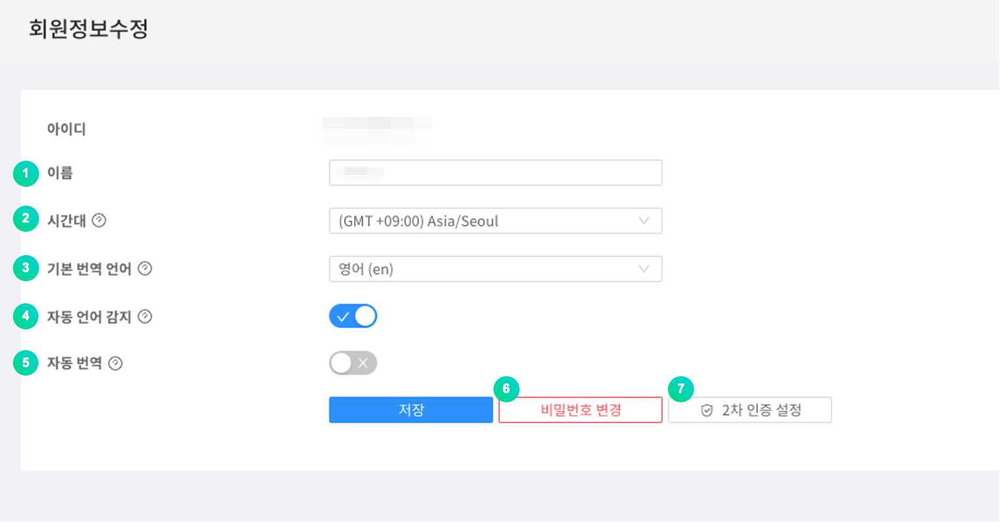

① 사용자의 이름을 변경할 수 있습니다.

② 대시보드의 기준이 될 시간대를 설정합니다.

③ 고객문의 번역 사용 시 번역되어 도착할 언어를 선택합니다.

④ 고객문의 번역 사용 시 문의 내역의 언어가 자동으로 감지될 것인지 설정합니다.

⑤ 고객문의 번역 사용 시 문의 내역의 언어가 자동으로 번역될 것인지 설정합니다.

⑥ 비밀번호를 변경할 수 있습니다.

⑦ 로그인 2차 인증을 설정할 수 있습니다.

인증번호, OTP 둘 중 한가지의 방식으로 2차 인증을 설정할 수 있습니다.

① 휴대폰 SMS 인증번호로 2차 인증을 설정합니다.

② Google OTP로 2차 인증을 설정합니다.

### 환경설정

게임팟 대시보드 관리를 위한 사용자 관리, 역할 관리, 업데이트 기능 등이 있습니다.

#### - 사용자

대시보드를 이용할 수 있는 사용자를 관리하는 메뉴로 사용자를 추가/삭제하실 수 있습니다.

① 상태를 체크하면 해당 사용자가 활성화됩니다.

**등록** 버튼을 클릭합니다. 아래와 같은 팝업 창이 노출되면, 해당하는 값을 입력합니다.

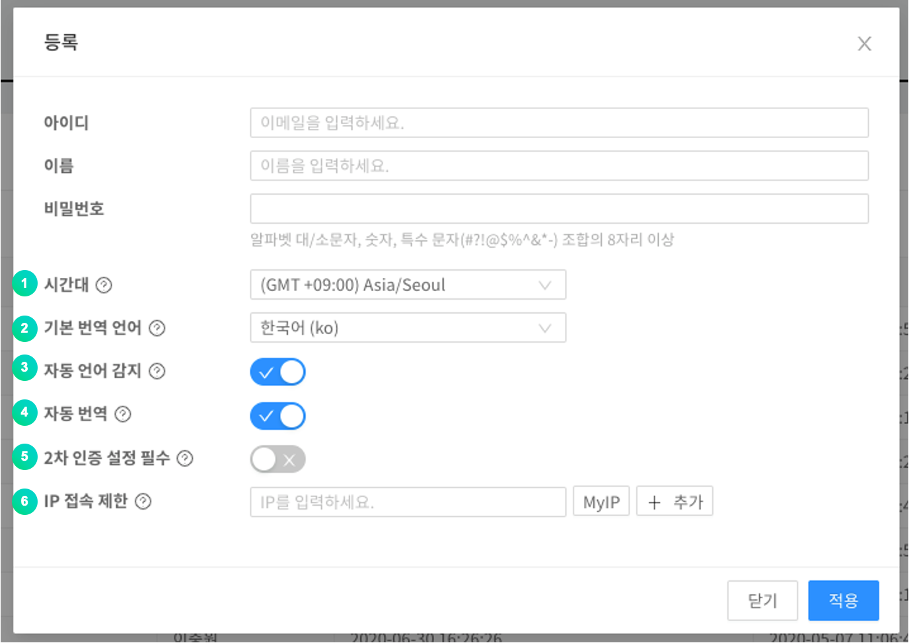

① 사용자 대시보드의 기준이 될 시간대를 설정합니다.

② 고객지원 번역 기능을 사용할 경우 번역되어 도착할 언어를 선택합니다.

③ 고객지원 번역 기능을 사용할 경우 문의 내역의 언어가 자동으로 감지될지 선택합니다.

④ 고객지원 번역 기능을 사용할 경우 문의 내역이 자동 번역될 것인지 선택합니다.

⑤ 해당 사용자가 로그인할 때 2차 인증을 필수로 설정할 것인지 선택합니다.

⑥ IP 접속 제한을 설정할 경우 허용하지 않은 IP의 접속을 제한합니다.

#### - 역할

대시보드를 이용할 수 있는 사용자를 그룹 단위로 관리하는 기능으로, 각 역할마다 다른 권한을 부여할 수 있습니다.

**톱니바퀴** 버튼을 클릭합니다. 아래와 같은 화면에서, 해당 역할에 대한 설정을 할 수 있습니다.

① 해당 역할에 포함할 사용자를 위치시킵니다.

② 기본 역할에 포함할 사용자를 위치시킵니다. 기본 역할 경우, 모든 권한을 가지고 있습니다.

③ 해당 역할에 허용할 기능을 선택합니다.

#### - 업데이트

게임팟 시스템의 업데이트 내역을 확인할 수 있습니다.

