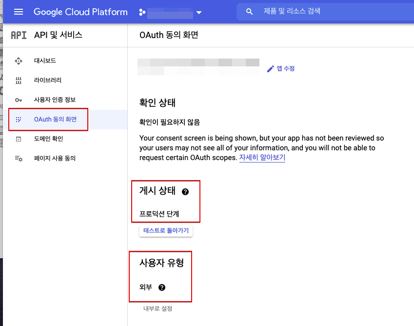
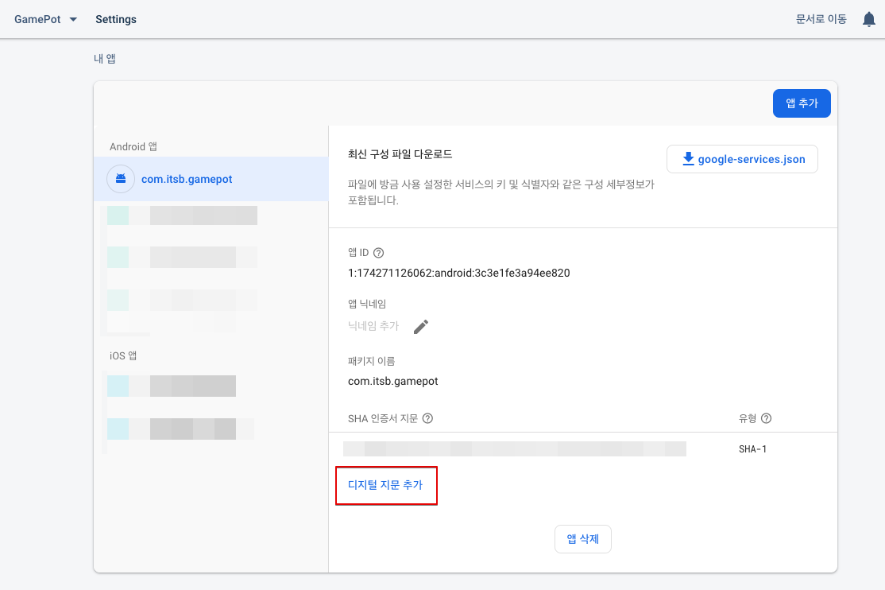
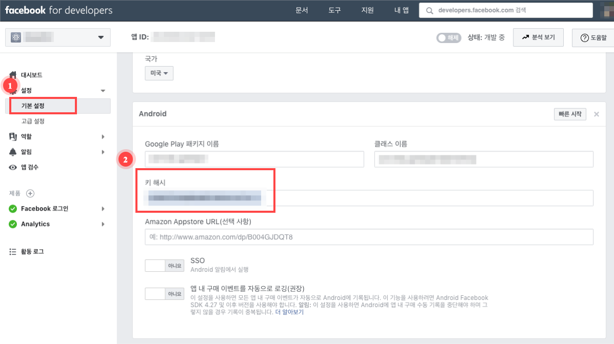
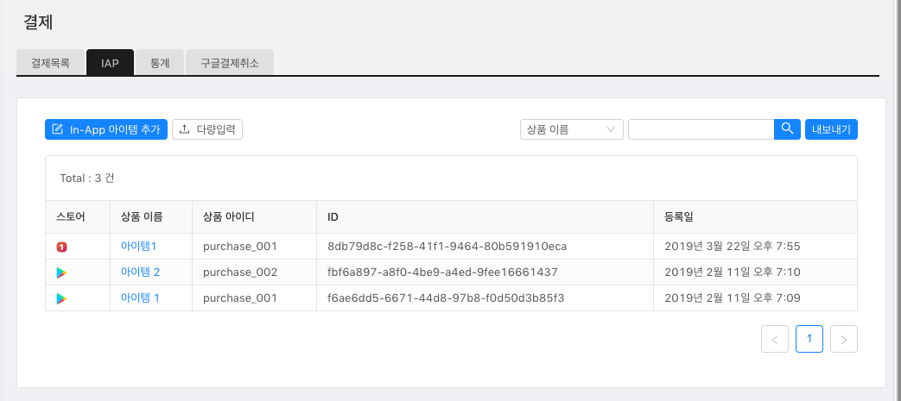
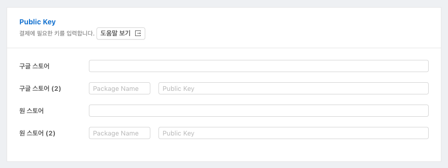
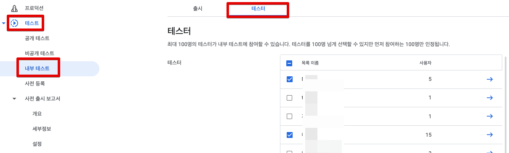
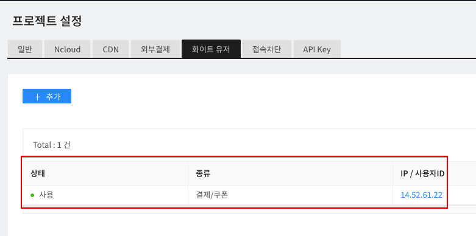
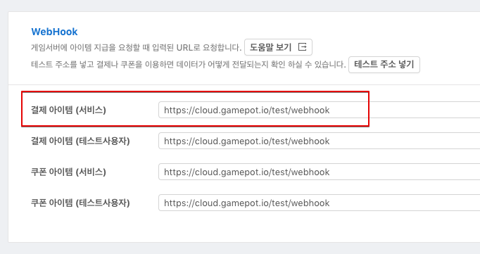
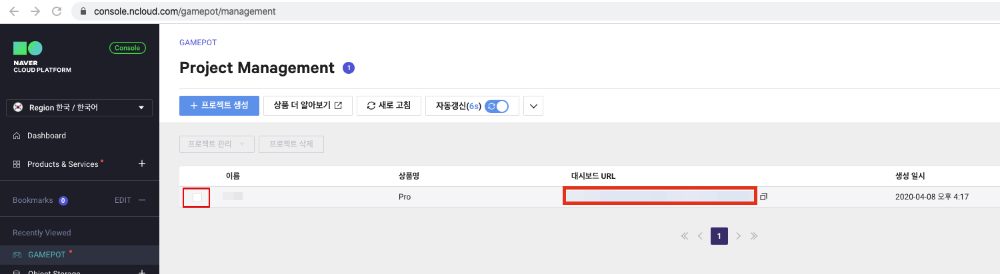

# FAQ

게임팟 클라이언트 SDK 체크리스트  : [다운로드](https://xyuditqzezxs1008973.cdn.ntruss.com/patch/GAMEPOT_CheckList.xlsx)

## 로그인이 안 돼요!

> 소셜 로그인 기능의 경우, 기본적으로 해당 플랫폼의 개발 가이드를 기준으로 합니다. 문제 발생 시, 해당 플랫폼의 로그인 개발 가이드를 먼저 확인 해주세요.

### 1. Google 로그인

#### 1-1)

    # Q. 로그인 시도시 바로 로그인 취소가 리턴됩니다. (AOS, iOS)
    # A. 필요한 환경이 올바로 설정 되지 않아 발생하는 현상입니다.

1. Firebase 설정 파일인 `google-service.json`파일이 프로젝트에 정상적으로 포함 됐는지 확인

2. (AOS) APK 빌드 시 사용한 Keystore의 SHA-1값을 Firebase Console에 추가했는지 확인

   > SHA-1값은 개발사에 요청합니다.


3. Firebase Console에서 프로젝트 설정이 정상적으로 되어있는지 확인

   - 해당 내용이 적용된 빌드가 맞는지 확인

     1. Console 상에 설정한 Package Name(AOS) / Bundle ID(iOS)로 빌드했는지 여부

     2. (AOS) SHA-1을 추출한 Keystore로 빌드했는지 여부

   - Firbase Conosole에 지원 이메일을 설정 했는지 확인


    * (AOS) Google Console에서 `앱 서명`을 사용하는 경우, Console에서 만들어진 SHA-1 값도 추가로 넣어주셔야 합니다.

4. 위 체크 항목을 모두 확인했음에도 불구하고 여전하다면, 지원 이메일을 다른 이메일로 변경해보세요.

   > 간헐적으로 최초 지원 이메일 설정 시 제대로 동작하는 경우가 발생하고 있습니다. 이 경우 다른 이메일로 변경하면 위 문제가 모두 해결되었습니다.


1~4번 항목까지 진행했지만 로그인 시도시 onCancel 처리가 되는 경우 
- https://console.cloud.google.com 사이트 접속
- 프로젝트 선택 후 >  왼쪽 상단 메뉴 > API 및 서비스 > 사용자 인증 정보 > OAuth 2.0 클라이언트 ID 유형에 Android/ IOS 정보가 있는지 확인

 

- 프로젝트 선택 후 >  왼쪽 상단 메뉴 > API 및 서비스 > OAuth 동의 화면 > 게시 상태가 프로덕션이며 사용자 유형이 외부인지 확인

 


#### 1-2)

    # Q. APK를 직접 설치할때는 로그인이 되나, 스토어에 올린 앱을 다운받아서 로그인할땐 로그인이 되지 않습니다. (AOS)
    # A. Google Developer Console에서 '앱 서명' 기능을 사용해서 그렇습니다.

콘솔에서 APK를 업로드 할 때 '앱 서명'을 활성화 하게 되면 keystore가 콘솔에서 관리하는 키로 교체되면서 발생하는 문제로, 콘솔에서 관리하는 keystore의 sha-1값을 Firebase console에 추가해주셔야 합니다.



> 이 때 페이스북 로그인을 사용하는 경우, Facebook developer console에도 또한 새로운 keystore의 keyhash 값을 추가해주셔야 합니다.


#### 1-3)

    # Q. IOS에서 구글 로그인 시 오류 \(401 오류 : disabled\_client\)가 발생 됩니다. (iOS)
    # A. Firebase 콘솔 설정에 지원 이메일이 설정 되어 있지 않아 문제가 발생 할 수 있습니다.

지원 이메일을 설정 한 후 확인해주세요.


#### 1-4)

    # Q. iOS에서 구글 로그인 시 팝업이 발생 되는데, 게임이름이 아닌 다른 값으로 노출 됩니다. (iOS)
    # A. Xcode >> Targets >> build Settings >> Product Name 항목의 값을 변경 해주시면 됩니다.


### 2. Facebook 로그인

    # Q. Facebook 앱이 스마트폰에 설치되어 있을 때, 정상적으로 로그인 할 수 없습니다. (AOS, iOS)
    # A. Facebook Developer Console의 환경설정이 올바르지 않아 문제가 발생할 수 있습니다.

APK 빌드 시 사용한 Keystore의 키 해시 값을 페이스북 콘솔에 추가합니다.



- Google Console에서 '앱 서명' 기능을 사용할 경우, Google Console에서 관리하는 keystore의 keyhash 값도 추가해주셔야 합니다.
  

### 3. APPLE 로그인

    # Q. APPLE 로그인 시도 시, 에러가 발생합니다. (iOS)
    # A. 필요한 환경이 올바로 설정 되지 않아 발생하는 현상입니다.

1.  Xcode >> TARGETS >> Signing & Capabilities >> + Capability >> Sign In with Apple을 추가했는지 확인

2.  Xcode >> TARGETS >> Build phases >> Link Binary With Libraries에 LocalAuthentication.framework, AuthenticationService.framework이 추가되었는지 확인
    (Target 버전이 iOS 13 이하라면 AuthenticationService.framework은 optional로 설정)


### 4. Naver 로그인(네아로)

#### 4-1)

    # Q. 네이버 로그인 시 오류가 발생 합니다. (AOS, iOS)
    # A. NAVER Developers Console의 환경설정이 빌드설정과 달라 문제가 발생할 수 있습니다.

NAVER Developers Application 설정과 빌드 설정이 일치하는 지 확인해주세요.


#### 4-2)

**_`해당 사항은 네이버 카페 SDK를 함께 연동하는 경우에만 적용됩니다.`_**

    # Q. 네이버 카페 SDK 연동 시, 웹뷰를 통한 네아로(네이버 아이디로 로그인)을 할 수 없습니다. (iOS)
    # A. 네아로 SDK와 카페 SDK의 로그인 모듈이 공존하여 발생하는 이슈입니다.


1. 해당 링크의 패치를 다운받아 주세요. \([Download](https://kr.object.ncloudstorage.com/itsb/patch/Patch_GamePotNaverLogin_20200508.zip)\)

2. 기존에 프로젝트 내 존재하는 2개의 framework를 삭제해주세요.

   - GamePotNaver.framework
   - NaverThirdPartyLogin.framework (존재할 경우)

3. 다운받은 패치(GamePotNaver.framework)를 기존 동일한 경로에 넣어주세요.

   IOS UIWebview 이슈 떄문에 네이버 카페 SDK는 4.4.7 이후 버전을 사용 부탁드립니다.

4. (UNITY ONLY) 네이버 카페 초기화 단계에서, url scheme 명시적으로 삽입

    ../Assets/NCSDK/Plugins/iOS/NCSDKUnityManager.mm


5. info.plist의 URL Scheme 값 우선순위를 첫번째로 수정해주세요. \([Link](https://docs.gamepot.io/undefined/gamepot_troubleshooting#unity-sdk-ios)\)


### 5. Line 로그인

    # Q. 라인 로그인 시 오류 \(400 오류 : Bad\_Request\)가 발생 합니다. (AOS, iOS)
    # A. LINE Developers Console의 환경설정이 올바르지 않아 문제가 발생할 수 있습니다.

Line Developer Console의 설정이 올바른지 확인해주세요.


### 6. Twitter 로그인

    # Q. 트위터 로그인 시 오류 \(Error Code - 1011\)가 발생 합니다. (AOS, iOS)
    # A. Twitter Developers Console의 환경설정이 올바르지 않아 문제가 발생할 수 있습니다.

Twitter Developer Console의 설정이 올바른지 확인해주세요.

1. Sign in with Twitter가 Enabled 상태인지 확인해주세요.

2. Callback URL 설정이 올바른지 확인해주세요.
   - 첫째줄 (AOS 사용) : twittersdk://
   - 둘째줄 (iOS 사용) : twitterkit-{twitter_consumerkey}://


## 결제가 안 돼요!

### 1. 공통

#### 1-1)

    # Q. 결제 시도시 'productid was wrong!' 문구가 노출됩니다.
    # A. GAMEPOT 대시보드 -> 결제 -> IAP에 스토어의 상품 아이디를 추가해주세요.



#### 1-2)

    # Q. 첫번째 결제 시도엔 응답이 없고, 두번째 결제 시도시에 결제가 성공했다고 응답합니다. (Play Store, ONEStore)
    # A. 대시보드 - 프로젝트 설정 - 일반 - Public Key에 키가 올바르지 않은 경우입니다.

`도움말 보기` 에 내용을 참고하여 키를 넣어주세요.



### 2. Google Play Store

#### 2-1)

    # Q. 구글 결제 팝업은 노출되나 결제가 진행되지 않아요.
    # A. 구글 결제를 할 수 있는 환경이 올바로 설정되지 않아 발생하는 경우입니다. 아래 항목을 하나씩 체크하세요.

1. 콘솔 &gt; 앱정보 &gt; 인앱 상품에 인앱이 `활성 APK` 로 돼있는지 확인


2. 콘솔에 앱이 `출시됨` 상태인지 확인

   > `프로덕션` 트랙이 아닌 `비공개`/`내부 테스트` 트랙에 올리시면 됩니다.


3. 콘솔 -&gt; 테스트 -&gt; 트랙 관리 -&gt; 테스트 참여 대상 관리에 테스트 계정을 등록했는지 확인



4. 테스트 참여 URL로 접속하여 테스트 참여를 신청했는지 확인


5. 콘솔 -&gt; 설정에서 `라이선스 테스트`에 테스트 계정을 추가했는지 확인


6. 단말기 -&gt; 설정 -&gt; 계정 메뉴에 테스트 참여한 계정만 남기고 모두 삭제 했는지 확인

### 3. ONEStore

#### 3-1)

    # Q. '비정상 앱에서 결제가 요청되었습니다' 문구 노출됩니다.
    # A. 오픈 전에 앱은 테스트 계정만 접근이 가능합니다. 아래 사항을 확인하세요.

1. 테스트 계정이 등록되어있는지 확인해주세요.

2. 단말기에 설치된 원스토어 앱이 1번에서 등록한 테스트 계정으로 로그인하는지 확인해주세요.

#### 3-2)

    # Q. 결제시 \[package\] doesn't exist or wrong secret. 문구 노출됩니다.
    # A. GAMEPOT 대시보드에 원스토어 관련 키값이 정상 적용됐는지 다시 확인하세요.

1. APK의 Package name 이 원스토어에 등록된 패키지명과 동일 여부


2. 원스토어 콘솔의 `라이선스 키` 적용 여부


> 해당 값이 GAMEPOT 대시보드 아래 항목에 적용되었는지 여부


3. 원스토어 콘솔의 `Client secret` 적용 여부


> 해당 값이 GAMEPOT 대시보드의 아래 항목에 적용되었는지 여부


#### 3-3)

    # Q. 결제 완료 후 "조회된 결과 값이 존재하지 않습니다. \(9001\)" 문구와 함께 결제가 실패합니다.
    # A. 원스토어에 영수증 검증 요청 시 리얼/테스트 환경의 차이로 문제가 발생한 경우입니다.

**A-1. 원스토어 결제화면이 Sandbox 환경인 경우**

- 게임팟 대시보드 - 프로젝트 설정 - 테스트 사용자 메뉴에 `결제/쿠폰`으로 아이피가 `등록`되어 있는지 확인해주세요.



- 게임팟 대시보드 - 프로젝트 설정 - Webhook 항목에 `결제 아이템(테스트 사용자)` 주소가 `등록`되어 있는지 확인해주세요.


**A-2. 원스토어 결제화면이 Production 환경인 경우**

- 게임팟 대시보드 - 프로젝트 설정 - 테스트 사용자 메뉴에서 `결제/쿠폰`으로 아이피가 `미사용` 상태인지, `미등록`인지 확인해주세요.


- 게임팟 대시보드 - 프로젝트 설정 - Webhook 항목에 `결제 아이템(서비스)` 에 주소가 `등록`되어 있는지 확인해주세요.



#### 3-4)
- 원스토어 SDK 인앱 버전 SDK v17, API v5 만 지원합니다.

- Android 빌드시 targetSdkVersion 30(Android 11)로 빌드한 경우 Android 11 OS기기에 원스토어 APK가 설치되었음에도 찾지 못합니다.

    [AndroidManifest.xml 파일 내 하기 문구 추가 필요]

        <!-- targetSdkVersion 30 일때 원스토어 관련 패치 [Start] -->
        <queries>
            <intent>
                <action android:name="com.onestore.ipc.iap.IapService.ACTION" />
            </intent>
            <intent>
                <action android:name="android.intent.action.VIEW" />
                <data android:scheme="onestore" />
            </intent>
        </queries>
        <!-- targetSdkVersion 30 일때 원스토어 관련 패치 [End] -->
    
        <application

### 3. Galaxy Store

#### 3-1)

    # Q. 로그인시 '삼성 인앱결제  선택한 상품이 없어요' 문구 노출됩니다.
    # A. 앱이 배포가 안 된 경우 발생합니다.
         앱 배포 전에 테스트 인앱 결제를 하기 위해서는 아래와 같이 진행되어야 합니다. 
         대시보드 > 프로젝트 설정 > 화이트 유저 추가 (종류 : 개발 / 테스트 기기 IP) 설정을 합니다.


## 인앱 아이템 리스트를 가져오지 못하는 경우

1. 게임팟 결제는 소모성 인앱만 결제가 가능합니다.

2. 결제 라이브러리가 빌드시 탑재 되어 있어야 합니다.

 - 구글 인앱 SDK    : 

    (유니티) ../Assets/Plugins/Android/libs/billing-3.0.3.aar

    (gradle) implementation 'com.android.billingclient:billing:3.0.3'

 - 원스토어 인앱 SDK : gamepot-billing-onestore.aar

 - 갤럭시 스토어 인앱 SDK :  gamepot-billing-galaxystore.aar

3. 결제 관련 셋팅이 되어 있어야 합니다. 참조:[# 결제가 안되요!](https://docs.gamepot.io/undefined/gamepot_faq#undefined-1)

4. getPurchaseItems API를 이용하는 경우 로그인 이후 결제 모듈을 초기화 작업을 진행 후 비동기적으로 인앱 리스트를 받으며 받은 결과를 보여주는 API 입니다. 호출하는 타이밍상 정보가 없을 수가 있습니다.
위와 같이 없는 경우 getPurchaseDetailListAsync API (동기식 인앱 리스트 항목 획득)를 사용하시는 것을 추천드립니다.

## 인앱 영수증이 있는데 대시보드에는 영수증 정보가 없어요. / 결제 진행이 중단된 경우 복구 처리하는 로직이 있나요?

게임팟 결제 로직 :

클라이언트 > 스토어 인앱 결제 진행 > 게임팟 서버에서 대시보드에 기입한 정보를 토대로 영수증 검증을 진행합니다.

영수증 검증시 문제가 없으면 결제 Webhook api 발송 후 대시보드 결제 목록에 정보가 추가 / Webhook api 결과와 상관없이 클라이언트 SDK에는 성공 처리됩니다.

스토어 인앱 결제에서 성공 이후 알 수 없는 이유로( 네트워크 이슈, 앱 강제 종료 등등) 중단되는 경우

쉐어드 메모리에 결제 API 호출시 전달한 정보를 저장합니다.

이슈가 발생한 앱을 종료 > 앱을 재실행 > 로그인 성공시 게임팟 내부적으로 결제 중단 이력을 체크를 하며 중단된 이력이 있는 경우 쉐어드 메모리에 저장된 내용을 토대로 결제 로직이 다시 진행되며 영수증 검증까지 이상없으면 결제 Webhook api 발송 후 대시보드 결제 목록에 정보가 추가 됩니다.

인앱 영수증은 있으나 게임팟 대시보드에 결제 이력이 없는 경우는 게임팟 결제 로직상에 문제가 발생한 케이스입니다.

유저에게는 결제를 진행한 앱을 다시 실행하여 로그인 유도를 해주시면 내부적으로 결제 로직이 다시 진행이되며 이상이 없는경우 결제 API를 발송 및 대시보드에 이력을 남깁니다.

결제 모듈이 다른 앱을 실행하면 결제 복구 로직이 발생하지 않습니다 

ex) 구글 결제 진행 후 장애 발생 > 원스토어 버전 로그인시 결제 모듈이 다르기때문에 결제 복구 로직이 진행되지 않습니다.

구글의 경우 기기 설정 내 결제를 진행한 계정만 남긴 상태에서 진행해주세요.

( 로그인 계정과 결제하는 계정은 다를 수 있습니다.)


## Adbrix Remaster

    # Q. Adbrix Remaster 적용 후 IOS 빌드 시 Crash가 발생되요.
    # A. Adbrix Remaster는 Swift로 구현되어 있는 라이브러리로 Swift 라이브러리 적용 시 추가 설정이 필요 합니다.

XCode에서 아래와 같이 설정 하신 후 빌드 해주세요.

만약 빌드 해도 동일하다면 클린 빌드 한 후 확인 해주세요.


#### Q. Adbrix Remaster 적용 후 AppStore 업로드 시 Error가 발생 됩니다.

#### A. Adbrix Remaster 라이브러리가 x86_64, i386 아키텍쳐를 포함 하여 발생하는 문제 입니다. 아래와 같이 조치 후 다시 빌드 후 확인 해주세요.

콘솔\(터미널\)에서 AdBrixRM.framework 파일 위치로 이동 후 아래 두 명령어를 입력 lipo -remove x86_64 ./AdBrixRM.framework/AdBrixRM -o ./AdBrixRM.framework/AdBrixRM lipo -remove i386 ./AdBrixRM.framework/AdBrixRM -o ./AdBrixRM.framework/AdBrixRM


## Naver Cafe

    # Q. iOS Naver Cafe 노출 시 영문으로 노출 됩니다.
    # A. XCode >> Targets >> Info >> Localization native development region 을 korea로 변경 후 확인 부탁드립니다.

## 서비스 런칭

    # Q. iOS 플랫폼을 대상으로 서비스를 런칭할 예정입니다.
    # A. iOS App Store 의 경우, 앱 검수 기간이 1~2 주 가량 소요되기 때문에 2주 정도 여유기간을 두시고 리얼존 대시보드로 이전을 신청하셔야 원활한 진행이 가능합니다.

## 푸쉬

### Case1 :

    # Q. iOS에서 푸쉬 수신이 되지 않아요.
    # A. 아래 설명에 있는 부분을 하나씩 확인 해주세요.

**1. NCloud SENS 설정에 Certification에 iOS 인증서가 등록되어 있는지 확인 부탁드립니다.**

iOS는 빌드 시 사용 된 프로비저닝프로파일 타입에 따라 등록해야 하는 인증서가 다릅니다.

- Developement Provisioning &gt;&gt; Push Development 인증서 등록 Type은 Sandbox로 설정
- Adhoc / Distribution Provisioning &gt;&gt; Push Distribution 인증서 등록 Type은 Production으로 설정

**2. 인증서 등록 후 클라이언트에서 로그인까지 완료 되었는지 확인 부탁드립니다.**

Gamepot은 푸쉬토큰을 로그인 완료 시 서버로 전달 합니다.

따라서 인증서를 등록하셨으면 Client에서 로그인까지 진행 후 확인 부탁드립니다.

**3. 앱이 Forground 상태 인지 확인해주세요.**

iOS의 경우 앱이 Forground 인 상태에서는 푸쉬 수신이 되지 않습니다.

home 버튼을 눌러 메인 화면에서 푸쉬가 수신되는지 확인 부탁드립니다.

**4. Xcode에서 build 시 Capability에 Push Notification이 포함 되어 있는지 확인 해주세요.**

Xcode에서 build 시 Capability에 Push Notification이 포함되어야 합니다. 수신이 되지 않는다면 빌드 시 이 부분이 포함 되지 않았는지 확인 부탁드립니다.


### Case2 : 

    # Q. AOS에서 푸쉬 수신이 되지 않아요.
    # A. 아래 설명에 있는 부분을 하나씩 확인 해주세요.

- 네이버 클라우드 콘솔상 푸시 설정 값이 잘 설정되었는지 확인합니다.
  
    - Firebase 콘솔 내 앱 설정 > 클라우드 메시징 탭에 서버키와 발신자 ID가 정보 확인
    - 네이버 클라우드 콘솔 >  Simple & Easy Notification Service (SENS) >  push > certificate 항목에 설정 값을 확인

        https://console.ncloud.com/sens/push-certificate


[Firebase SDK를 별도로 탑재하여 사용중인 경우]
- ../Assets/Plugins/Android/AndroidManifest.xml 내 하기 코드가 적용되어 있는지 확인

        ....
        </activity>
    
        <!-- FCM [start]-->
        <service android:name="io.gamepot.common.GamePotFCMIDService">
        <intent-filter>
            <action android:name="com.google.firebase.INSTANCE_ID_EVENT"/>
        </intent-filter>
        </service>
        <service android:name="io.gamepot.common.GamePotFCMService">
        <intent-filter>
            <action android:name="com.google.firebase.MESSAGING_EVENT"/>
        </intent-filter>
        </service>
        <!-- FCM [End]-->
    
        ...
        <meta-data android:name="android.max_aspect" android:value="2.1" />


## 구글 앱 서명 사용시 주의점

    # Q. 직접 설치한 APK는 소셜 로그인이 정상적으로 되나, 스토어에서 다운로드 후 소셜로그인하면 로그인이 되지 않아요.
    # A. 구글 개발자 콘솔에서 앱 서명이 활성화 되어 키스토어가 변경된 경우입니다.

구글 개발자 콘솔에 `설정` -> `앱 무결성` 메뉴에 아래와 같은 화면이 보여집니다.


구글 로그인을 이용중이라면 `SHA-1`값을 firebase console에 추가하시고,

페이스북 로그인을 이용중이라면 위 `SHA-1`값의 `keyhash`를 페이스북 콘솔에 추가하세요.


## 사용자ID 이전하는 방법

> 사용자ID 이관은 소셜 계정으로 연결된 사용자ID에서만 다른 사용자ID로 이관을 할 수 있습니다. 

    1. 이전을 시킬 사용자ID와 이전을 받을 사용자ID를 확보합니다.
    2. 이전을 시킬 사용자ID를 게임팟 대시보드 > 회원 > 목록 화면에서 사용자ID를 조회 후
       사용자ID를 클릭하여 상세 화면으로 이동합니다.
    3. 하단에 계정연동 탭을 클릭 > 이동을 하고자 하는 소셜 아이디 옆의 설정 아이콘을 클릭합니다.
    4. 연동정보 변경 팝업 창 내에 사용자ID이 이전을 받을 사용자ID를 입력 후 변경 버튼을 클릭합니다.
    ( 이전 작업을 한 소셜 계정의 아이디를 체크 및 추후 확인 합니다. 
      변경을 하면 해당 사용자ID에서 소셜 계정 정보가 사라집니다.)
    5. 이전 받은 사용자ID를 게임팟 대시보드 > 회원 > 목록 화면에서 사용자ID를 조회 후
       사용자ID를 클릭하여 상세 화면으로 이동합니다.
    6. 하단에 계정연동 탭을 클릭 > 이전을 한 소셜 아이디가 존재하는지 확인
    7. 이전 시킬 사용자ID로 로그인된 클라이언트에서 로그아웃을 한 후 다시 로그인 과정을 진행

ex) 4번 항목 예시 


ex) 6번 항목 예시


## 사용자ID 복구

    1. 게임팟 대시보드 > 회원 > 목록 화면에서 사용자ID를 조회 후
       사용자ID를 클릭하여 상세 화면으로 이동합니다.
    2. 회원 복구 버튼을 클릭 > 확인 버튼을 클릭합니다.
    
    단. 사용자가 탈퇴 후 동일한 소셜 계정으로 로그인 과정을 진행하여 신규 사용자ID를 발급 받았다면
    1.2번 과정을 진행한 이후 사용자ID 이전하는 방법을 이용하여 사용자ID 이전 절차를 진행해야 합니다.   


## 대시보드 사전예약 페이지 연동 방법

### 1. 발신번호 신청 [[SMS 발신번호 신청 가이드](https://docs.ncloud.com/ko/sens/sens-1-3.html#%EB%B0%9C%EC%8B%A0%EB%B2%88%ED%98%B8-%EB%93%B1%EB%A1%9D%EC%A1%B0%ED%9A%8C%ED%95%98%EA%B8%B0)]

> 발신번호 신청 및 해당 번호의 승인이 된 이후에 문자를 발송 할 수 있습니다.


### 2. 사전예약 페이지 연동 API 설명

> API는  SMS 인증문자 발송 > SMS 인증완료 > SMS 사전예약 신청완료 순으로 진행이 되어야 합니다.

#### 공통 사항 :  게임 > 사전예약 > 추가 > 명칭을 입력 후 저장한 상태
GamePot 사전예약 페이지의 Category Id : 저장한 명칭을 선택 후 옆의 복사 아이콘을 클릭


#### 3-1 SMS 인증문자 발송

##### Request

```text
POST
url : https://alpha-api.gamepot.io/v1/phone/request
Header : 'content-type: application/json'
data:
{
	"projectId":"ab2775b4-cf09-4794-9480-XXXXXXXXXXXX",
	"categoryId":"b062a3f3-0a37-44d1-9e8f-XXXXXXXXXXXX",
	"from":"XXXXXXX",
	"to":"010XXXXXXX",
	"store":"google"
}
```


| Attribute     | Type   | Required | Description             |
| :------------ | :----- | :------- | :---------------------- |
| projectId     | String | -        | GamePot SDK의 projectId  |
| categoryId    | String | -        | GamePot 사전예약 페이지의 categoryId    |
| from          | String | -        | 승인 받은 발신번호                |
| to            | String | -        | SMS 인증 번호를 수신 받는 연락처     |
| store         | String | -        | 스토어 ( google, one, apple )  |

#### Response

```javascript
{
    "code": 200,
    "message" : ""
}
```

| Attribute | Type   | Description                                     |
| :-------- | :----- | :---------------------------------------------- |
| code      | Int    | 결과값 \(200: 성공, 404 :실패 \)                    |
| error     | String | 상황별 오류 내용 전달                                |

#### 3-2 SMS 인증완료

##### Request

```text
POST
url : https://gamepot.apigw.ntruss.com/gpapps/v1/v1/phone/verify
Header : 'content-type: application/json'
data:
{
	"projectId":"ab2775b4-cf09-4794-9480-XXXXXXXXXXXX",
	"categoryId":"b062a3f3-0a37-44d1-9e8f-XXXXXXXXXXXX",
	"code":"6137",
	"to":"010XXXXXXX",
	"store":"google"
}
```


| Attribute     | Type   | Required | Description             |
| :------------ | :----- | :------- | :---------------------- |
| projectId     | String | -        | GamePot SDK의 projectId  |
| categoryId    | String | -        | GamePot 사전예약 페이지의 categoryId    |
| code          | String | -        | 수신 받은 인증번호                |
| to            | String | -        | SMS 인증 번호를 수신 받는 연락처     |
| store         | String | -        | 스토어 ( google, one, apple )  |

#### Response

```javascript
{
    "code": 200,
    "message" : ""
}
```

| Attribute | Type   | Description                                     |
| :-------- | :----- | :---------------------------------------------- |
| code      | Int    | 결과값 \(200: 성공, 404 :실패 \)                    |
| error     | String | 상황별 오류 내용 전달                                |


#### 3-3 SMS 사전예약 신청완료

##### Request

```text
POST
url : https://gamepot.apigw.ntruss.com/gpapps/v1/v1/phone/join
Header : 'content-type: application/json'
data:
{
	"projectId":"ab2775b4-cf09-4794-9480-XXXXXXXXXXXX",
	"categoryId":"b062a3f3-0a37-44d1-9e8f-XXXXXXXXXXXX",
	"code":"6137",
   	"from":"02XXXXXXXX",
	"to":"010XXXXXXX",
	"store":"google",
    	"tag":""
}
```

| Attribute     | Type   | Required | Description             |
| :------------ | :----- | :------- | :---------------------- |
| projectId     | String | -        | GamePot SDK의 projectId  |
| categoryId    | String | -        | GamePot 사전예약 페이지의 categoryId    |
| code          | String | -        | 수신 받은 인증번호                |
| from          | String | -        | 승인 받은 발신번호                 |
| to            | String | -        | SMS 인증 번호를 수신 받는 연락처     |
| store         | String | -        | 스토어 ( google, one, apple )  |
| tag           | String | -        | 기타정보 ( 유입 경로 같은 정보  )   |

#### Response

```javascript
{
    "code": 200,
    "message" : ""
}
```

| Attribute | Type   | Description                                     |
| :-------- | :----- | :---------------------------------------------- |
| code      | Int    | 결과값 \(200: 성공, 404 :실패 \)                    |
| error     | String | 상황별 오류 내용 전달                                |


## GooglePlayGames API

    # Q. GAMEPOT SDK를 통해, GooglePlayGames API를 사용할 수 있나요?
    # A. GAMEPOT SDK에서 자체적으로 지원하는 GooglePlayGames API가 존재합니다. (업적, 리더보드) (Android, Unity, Unreal)

플랫폼 별, GooglePlayGames API 사용방법은 다음과 같습니다.

### Android

```java
import io.gamepot.channel.GamePotChannel;
import io.gamepot.channel.google.playgame.GamePotAchievementInfo;

//Achievement Handling API
GamePotChannel.getInstance().showAchievement(ACTIVITY);

GamePotChannel.getInstance().loadAchievements(ACTIVITY, new GamePotChannelListener<GamePotAchievementInfo>() {
    @Override
    public void onCancel() {
    }
    @Override
    public void onSuccess(GamePotAchievementInfo info) {}
    
    @Override
    public void onFailure(GamePotError err) {}
    });

GamePotChannel.getInstance().unlockAchievement(Activity activity, String achievementId);

GamePotChannel.getInstance().incrementAchievement(Activity activity, String achievementId, int Count);


//Leaderboard Handling API
GamePotChannel.getInstance().showLeaderboard(Activity activity);

GamePotChannel.getInstance().submitScoreLeaderboard(Activity activity, String leaderBoardId, int leaderBoardScore);

```

### Unity

> 빌드 시, gamepot-channel-google-playgame.aar을 포함하여 빌드 해주세요.

- /Assets/Plugin/Android/mainTemplate.gradle에 gamepot_gpg_id 값을 넣어주세요.

```java
...
android {
    ...
    defaultConfig {
        ...
        resValue "string", "gamepot_gpg_id", ""
    }
    ...
}
```


```csharp
using GamePotUnity;

//Achievement Handling API
GamePot.showAchievement();

GamePot.unlockAchievement(string achievementId);

GamePot.incrementAchievement(string achievementId, string count);

GamePot.loadAchievement();

//loadAchievement Handled by Callback Function
void onLoadAchievementSuccess(List<NAchievementInfo> info);
void onLoadAchievementFailure(NError error);
void onLoadAchievementCancel();

//Leaderboard Handling API
GamePot.showLeaderboard();

GamePot.submitScoreLeaderboard(string leaderBoardId, string leaderBoardScore);
```

### Unreal

>Unreal 엔진의 경우, 엔진 소스 내 빌드스크립트에서 gpg App ID 값을 디폴트로 Manifest Merge 하고 있습니다. (UnrealEngine 4.26 기준)

> GAMEPOT GooglePlayGames 모듈과 duplicate 나지 않도록, 엔진 소스 내 `Engine/Source/Programs/UnrealBuilTool/Platform/Android/UEDeployAndroid.cs` 의 다음 2-line 을 주석처리 해주세요.


GamePot_Android_UPL.xml 수정

```xml
...
<resourceCopies>
        <copyFile src="$S(PluginDir)/ThirdParty/Android/libs/gamepot-channel-google-playgame.aar" dst="$S(BuildDir)/libs/gamepot-channel-google-playgame.aar" />
</resourceCopies>

...

<AARImports>
    <insertValue value="com.google.android.gms,play-services-games,21.0.0"/>
    <insertNewline/>
    <insertValue value="com.google.android.gms,play-services-base,17.5.0"/>
    <insertNewline/>
    <insertValue value="com.google.android.gms,play-services-auth,19.0.0"/>       
    <insertNewline/>
</AARImports>

...

<buildGradleAdditions>
    <insert>

        ...
        dependencies {
            ...
            implementation(name: 'gamepot-channel-google-playgame', ext: 'aar')
            implementation 'com.google.android.gms:play-services-games:21.0.0'
            implementation 'com.google.android.gms:play-services-base:17.5.0'
            implementation 'com.google.android.gms:play-services-auth:19.0.0'
            ...
        }
        ...

        defaultConfig {
            ...
            resValue "string", "gamepot_gpg_id","xxx" //insert gpg App ID
            ...
        }

    </insert>
</buildGradleAdditions>

...

<gameActivityImportAdditions>
  <insert>
    import io.gamepot.channel.google.playgame.GamePotGooglePlaygame;
  </insert>
</gameActivityImportAdditions>

...
```

```c++
#include "GamePotSDKPluginModule.h"

//Achievement Handling API
FGamePotSDKPluginModule::GetSharedGamePotSdk()->showAchievement();

FGamePotSDKPluginModule::GetSharedGamePotSdk()->unlockAchievement(FString achievementId);

FGamePotSDKPluginModule::GetSharedGamePotSdk()->incrementAchievement(FString achievementId, FString count);

//loadAchievement Handled by Callback Function
FGamePotSDKPluginModule::GetSharedGamePotSdk()->loadAchievement();

void FOnSdkLoadAchievementSuccess(FNAchievementInfo info);
void FOnSdkLoadAchievementFailure(FNError error);
void FOnSdkLoadAchievementCancel();

//Leaderboard Handling API
FGamePotSDKPluginModule::GetSharedGamePotSdk()->showLeaderboard();

FGamePotSDKPluginModule::GetSharedGamePotSdk()->submitScoreLeaderboard(FString leaderBoardId, FString leaderBoardScore);
```


## Casebook

### - Dashboard

#### 1. Push 메시지가 수신되지 않을 때

    1. 대시보드 >> 프로젝트설정 >> ncloud API 인증키의 AccessKey, Secret Key, SENS-PUSH, SENS-SMS 값을 확인해주세요.
    2. 해당 인증키에 대해 SENS 프로젝트의 Certificate 설정을 했는지 확인해주세요.


#### 2. 사용자 지표 Retention 계산방식에 대해

첫 날 계정을 생성한 후, 그 다음 날 접속한 유저를 New User로 간주하여 Counting 합니다. (광고 등의 경로를 통해 유입된 허수를 제하기 위해서입니다.)

    example)
     아래의 이미지 장표에서 2020-01-07 기준으로 살펴봤을 때,
     2020-01-07에 신규 유저 중 2020-01-08일에 접속한 인원이 5명이며 
     해당 날짜(2020-01-07)에 New User을 5명으로 판단합니다. (Day1 값과 같습니다.)
     해당 인원 기준으로 Day 2(다음 날 2020-01-09)에 1명 접속 / Day 3에 0명 접속 / Day 4에 1명 접속을 한 상태를 보여줍니다.
     5명의 유저 중, n Day에 카운트 되는 방식이기때문에 중간에 0%로 빠지는 구간이 생깁니다.


#### 3. 회원의 이용정지를 비활성화 했을 때

    이용정지 리스트에 사용자 아이디가 추가 되어 있고 상태가 비활성화 상태일 때, 구글 환불을 진행 한다고 하더라도 자동으로 해당 리스트가 재 활성화 되지 않습니다.
    또한 비활성화 된 사용자 아이디에 대해서는 계정 접근을 막지 않고 있습니다.

### - ETC.

#### 1. Firebase Console에서 google-service.json 추출 시

    Firebase Console 상에서, SHA 지문이 등록된 상태에서 google-service.json을 추출 해주세요.
    그렇지 않을 경우, json 파일의 일부 값이 누락되어 추출될 가능성이 있어 정상적인 로그인이 안될 수도 있습니다.


#### 2. 게임팟 로그인 검증 시, Token authentication failed 오류가 발생

    베타존을 사용 중인 업체에서 발생할 수 있는 이슈입니다.
    로그인 검증 Request URL이 'https://gamepot.apigw.ntruss.com/gpapps/v1/loginauth'로 설정되어 있으면, https://cloud-api.gamepot.io/loginauth 으로 변경하여 확인 부탁드립니다.
    
    리얼존 : https://gamepot.apigw.ntruss.com/gpapps/v1/loginauth
    베타존 : https://cloud-api.gamepot.io/loginauth ( 서비스 종료 예정 )

#### 3. 빌드 실행 시, '비정상적으로 앱이 실행되었습니다. 스토어에서 다운로드 받으세요' 메시지 팝업이 발생

    대시보드 >> 프로젝트 설정 >> 일반 탭에서, 해시키가 잘못 설정되어 발생할 수 있습니다.
    해당 해시키를 삭제 또는 정확한 해시키로 입력 후 확인해보세요.


#### 4. Gamepot SDK에서 결제 시도 시, Gamepot SDK에서는 성공 응답을 받았지만 대시보드의 결제 >> 결제목록에 결제한 이력에 대해 등록 안되고, 게임서버에 req 전달 안됨

    대시보드 >> 프로젝트 설정 >> 일반 탭에서, 구글 API Key의 Json 값이 등록되어 있는지 확인헤보세요.
    구글 API Key 설정이 version 2로 되어있을 때, 해당 key 값이 없어도 결제가 가능했지만 version 3부터는 key 값을 입력해야 합니다.
    만약 입력이 되어 있는 상태라면 도움말 보기를 클릭하여 JSON 값을 다시 생성하여 등록 부탁드립니다.
    ref.) 새로 계정을 발급받고 key 값을 추출해 넣었을 때, 새로운 키가 갱신 적용되기까지는 약 하루가량 시간이 소요됩니다.


#### 5. 결제 완료 후, Google Play Developer API not linked 오류가 발생

    구글 API Key 설정이 올바르지 않을 때 발생할 수 있는 문제 입니다.
    도움말 보기를 클릭하여 JSON 값을 다시 생성하여 등록 부탁드립니다.
    ref.) 새로 계정을 발급받고 key 값을 추출해 넣었을 때, 새로운 키가 갱신 적용되기까지는 약 하루가량 시간이 소요됩니다.


#### 6. 신규 서비스 계정 발급 후 Key값을 적용했음에도, 결제 API가 실패할 경우

    (구글 서비스 계정 이관 시) 신규 Key를 발급받아 적용했음에도, 결제 API가 실패하는 구글 콘솔 측 버그 레포트가 유입되었습니다. (2020.02.13)
       
    결제 진행 후 아래와 같은 오류가 발생 
    
    오류 문구 :
    "The current user has insufficient permissions to perform the requested operation."
    
    구글 콘솔에서 서비스 계정에 권한 설정이 정상적으로 되었는지 추가 확인 후
    구글 콘솔에서 임의로 인앱상품을 하나 생성한 다음, 문제가 해결되는지 확인해보세요.


#### 7. IOS Push 메시지 수신 문제 \[[IOS APNS 인증서 등록 가이드](https://kr.object.ncloudstorage.com/itsb/patch/IOS%20APNS%20%E1%84%8B%E1%85%B5%E1%86%AB%E1%84%8C%E1%85%B3%E1%86%BC%E1%84%89%E1%85%A5%20%E1%84%80%E1%85%A1%E1%84%8B%E1%85%B5%E1%84%83%E1%85%B3%20%E1%84%86%E1%85%AE%E1%86%AB%E1%84%89%E1%85%A5.docx)\]

    1. SENS 설정에 Certification에 인증키 및 인증서가 등록되어 있는지 확인 부탁드립니다.
    
    2. IOS는 빌드 시 사용 된 프로비저닝프로파일 타입에 따라 등록해야 하는 인증서가 다릅니다.
    
    [Development]
    Provisioning >> Push Development 인증서를 업로드 해주시고 Type은 Sandbox로 설정해주세요.
    
    [Adhoc / Distribution]
    Provisioning >> Push Distribution 인증서를 업로드 해주시고 Type은 Production으로 설정해주세요.
    
    3. Gamepot은 Push Token을 로그인 완료 시 서버로 전달 합니다. 따라서 인증서를 등록 후, 클라이언트에서 로그인까지 진행 확인해주세요.
    
    4. IOS의 경우, 앱이 Forground 상태에서는 푸쉬 수신이 되지 않습니다. home 버튼을 눌러 메인 화면에서 푸쉬가 수신되는지 확인해주세요.
    
    5. IOS의 경우, Xcode에서 build 시 Capability에 Push Notification이 포함되어야 합니다. 수신이 되지 않을 경우, 빌드 시 해당부분이 추가 되지 않았는지 확인해주세요.

#### 8. IOS 결제 테스트 방법

    1. 테스트 하려는 기기의 설정 >> iTunse 및 Store >> Apple ID : XXXX 를 터치 >> 로그아웃
    
    2. 앱 실행
    
    3. 앱의 유료 결제 항목 선택
    
    4. 팝업 발생 시 기존 appleID 사용으로 선택
    
    5. 테스트 계정 ID / PW 넣고 로그인 (가끔 상태에 따라 팝업이 여러번 뜨는 경우 있으나 특별히 신경 쓰지 않아도 됩니다.)
    
    6. 유료 결제 항목의 가격 및 이름이 팝업 형태로 노출 되며 [Environment : Sandbox] 문구 노출
    
    7. 구입 선택
    
    * 결제 팝업에  [Environment : Sandbox] 문구가 노출 되면 실제 요금은 부과되지 않습니다.


#### 9. Push 메시지의 앱 이름은 클라이언트 빌드시 결정이 됩니다.


언어에 맞게 앱 이름을 변경하고자 한다면 아래와 같은 방식으로 진행하시면 됩니다.


    [안드로이드]
    
    app/src/main/res/values-국가코드/strings.xml
    
    ex) 디바이스 언어가 영어일 때 앱 이름을 변경하고자 할 때
    app/src/main/res/values-en/strings.xml
    
    [유니티 안드로이드]
    
    Assets/Plugins/Android/GamePotResources/res/values-국가코드/strings.xml
    
    ex) 디바이스 언어가 한국어일 때 앱 이름을 변경하고자 할 때
    Assets/Plugins/Android/GamePotResources/res/values-ko/strings.xml


    [strings.xml]
    <?xml version="1.0" encoding="utf-8"?>
        <resources>
            <string name="app_name">언어에 맞게 앱 이름을  설정</string>
        </resources>


IOS 설정은 아래와 같이 진행을 합니다. 

1. XCode >> Targets >> Info >> Localization >> 추가하고자 하는 언어 추가


2. Xcode >> File >> file >> Strings File 아이콘 클릭 >> next > 파일명 InfoPlist 으로 정의 후 파일 생성
3. 생성된 파일된 파일을 선택후  Localization 설정 부여


4. 언어을 선택하면 관련 파일들이 생성이 되며 해당 파일에 각각 언어에 맞는 앱 이름을 부여하면 됩니다.

    [InfoPlist.string]
    CFBundleDisplayName="언어에 맞게 앱 이름을  설정";


#### 10. 인앱 리스트 정보를 가져올 때 스토어마다 GamePot.getPurchaseItems() API의 Price 값이 다릅니다. 

	인앱 리스트 정보를 가져올 때 각 스토어 인앱 SDK에서 전달을 주는 값을 공유드립니다.
	
	구글 스토어 : price의 값은 화폐단위 + 인앱 가격 
	ex)  ₩1,000
	
	애플 스토어 : price의 값은 인앱 가격
	ex) 1000
	
	IOS에서 화폐 단위를 표기하기 위해서는  price_currency_code 값을 참조하시면 됩니다.
	ex) price_currency_code : KRW


#### 11. 대시보드 관리자 계정이 비밀번호 5회 실패로 로그인이 안되요. ( V2 대시보드 사용자 대상) 

1. https://console.ncloud.com/gamepot 사이트에 admin 계정으로 접속을 합니다.

2. 비밀번호를 초기화 하고자 하는 대시보드를 선택한 후 프로젝트 관리 항목을 클릭시 비밀번호 초기화 메뉴가 보여지게 됩니다.

3. 비밀번호 초기화 메뉴를 선택시 관리자 계정을 입력하는 팝업이 발생하며 내용을 입력시 관련 메일로 초기화 할 수 있는 메일이 전달됩니다.




#### 12. 대시보드 데이터 초기화 지원 범위

    스토어 배포 전에 원하시는 목록을 정리하여 요청하시는 것을 권장드리며
    앱 배포 후 데이터 초기화의 경우 실제 유저의 데이터와 더미 데이터의 구분이 명확하지 않아 서비스에 혼란을 초래하므로 권장하지 않습니다.
    
    CBT를 선행으로 진행 후 런칭 진행시 회원 정보를 유지하지 않는 경우
    게임 디비 초기화 시 게임팟 계정 연동 이력도 삭제돼야 하므로 런칭전에 필히 삭제 요청 해주세요.
    
    삭제된 데이터는 복구되지 않으니 신중히 판단 부탁드리며
    대시보드 메뉴별 데이터 삭제 가능 범위는 아래와 같습니다.


| 목록           | 스토어 배포 전   | 스토어 배포 후 |
| :------------ | :------------| :---------- |
| 사용자 지표      | X            | X           |
| 매출 지표       | X            | X            |
| 회원(소셜 계정 연동 포함)| O            | 조건부 가능            |
| 결제           | O            | O            |
| 공지사항        | O            | O            |
| 점검           | O            | O            |
| 업데이트        | O            | O            |
| 메시지         | O            | O            |
| 쿠폰           | O            | O            |
| 고객지원        | O            | O            |
| 게임 > 플레이어  | O            | O            |
| 게임 > 선물하기  | O            | O            |


#### 13. 애플의 iOS 14 개인정보처리방침 강화에 따라 수집하는 개인정보 내역 리스트

애플 콘솔 내 ‘일반정보’ >> ‘앱이 수집하는 개인정보 탭’을 기준으로 말씀 드리면 아래와 같습니다.
(고객 신원 정보와 연결되지 않으며 관련 정보로 추적하는 목적이 아닌 사항)

게임팟 SDK에서 수집하는 항목은 다음과 같습니다.

[식별자]
- 사용자 ID (계정정보)
- 기기 ID (IDFA,  auto generated)
- 구입 항목

[사용자 컨텐츠]
- 사진 또는 비디오
- 고객지원

    [사용자 컨텐츠]의 경우 게임팟 PRO 이상 상품을 이용하시는 고객중 게임팟 고객 문의 UI를 사용하는 경우에 해당하며 오브젝트 스토리지 기능 사용시 고객 문의에 이미지파일을 첨부 파일로 올릴 수 있습니다. 

### Migration

#### Ver 3.2.0 Migration


기본적으로 라이브러리 파일들이 교체작업을 진행하시는 것으를 기준으로 설명드립니다.

[Android]
- AndroidX 모듈 탑재된 라이브러리로 교체
- 구글 인앱 SDK 1.1 에서 3.0.3 버전으로 교체 
- 갤럭시 앱스 인앱 SDK 업데이트

3.1.0 버전 이전 사용자는 AndroidX 라이브러리 교체로 인한 마이그레이션 작업이 필요합니다.

AndroidX 모듈 지원됨에 따른 변경점

1. 빌드 환경 수정

    1-1) ../libs 폴더내 라이브러리 파일 교체

    1-2) [./gradle.properties] 파일 내 문구 추가
```text
    android.enableJetifier=true
    android.useAndroidX=true
```
    1-3) [ ./build.gradle ] 파일 내 com.android.tools.build 버전 수정 
    
    ( com.android.tools.build 3.3.3 / 3.4.3 이상 버전 사용)
    
    ex)
    classpath 'com.android.tools.build:gradle:3.3.3' 
    
    1-4)
    [ ../app/build.gradle ] 파일 내 androidx 지원모듈로 변경
```text
    [삭제 또는 주석 처리 진행]
    //implementation 'com.android.support:appcompat-v7:28.0.0'
    //implementation 'com.android.support:multidex:1.0.1'

    [추가]
    implementation 'androidx.appcompat:appcompat:1.2.0'
    implementation 'androidx.multidex:multidex:2.0.0'
```

1-5) import android.support.XXXXXXX 라이브러리들이 androidx.appcompat:appcompat 라이브러리에 맞게 변경이 필요합니다. 

```text
    ex) 
    기존 샘플 프로젝트 샘플내 변경된 CLASS

    기존
    import android.support.annotation.NonNull;
    import android.support.annotation.Nullable;
    import android.support.v4.app.FragmentManager;
    import android.support.v4.app.FragmentTransaction;
    import android.support.v4.app.ListFragment;
    import android.support.annotation.UiThread;
    import android.support.v4.app.FragmentActivity;

    android.support.v4.app.FragmentManager fm = getSupportFragmentManager();

    =>
    수정 :
    import androidx.annotation.NonNull;
    import androidx.annotation.Nullable;
    import androidx.fragment.app.FragmentManager;
    import androidx.fragment.app.FragmentTransaction;
    import androidx.fragment.app.ListFragment;
    import androidx.annotation.UiThread;
    import androidx.fragment.app.FragmentActivity;

    androidx.fragment.app.FragmentManager fm = getSupportFragmentManager();
```

2. 기타 :

    2-1) 구글 인앱 SDK 버전 변경


```text
기존:    implementation 'com.android.billingclient:billing:1.1

변경:    implementation 'com.android.billingclient:billing:3.0.3'
```

2-2) Facebook SDK 8.1.0 

```text    
기존:   implementation 'com.facebook.android:facebook-android-sdk:5.2.0'

변경:   implementation 'com.facebook.android:facebook-android-sdk:8.1.0' 
```


[IOS]

1) Frameworks 파일들 교체

2) FACEBOOK SDK 8.0 업데이트 됨에 따른 추가 변경 사항

```text
    Xcode 내 추가 수정
    - Build Phases > Link binary With Libraries > Accelerate.farmework 추가
    - Build Settings > Other Linker Flags >  -lz , -lstdc++ , -lc++ 추가
```


[Unity]


1. ..Assets/GamePot 폴더 및 이하 파일 및 기존 라이브러리 파일 삭제 후 유니티 플러그인 패키지를 import 처리 부탁 드립니다. 

    [삭제 대상 파일]
```text
    ../Assets/Plugins/Android/libs/animated-vector-drawable-27.1.1.aar
    ../Assets/Plugins/Android/libs/annotation-1.0.2.jar
    ../Assets/Plugins/Android/libs/appcompat-v7-27.1.1.aar
    ../Assets/Plugins/Android/libs/billing-1.1.aar
    ../Assets/Plugins/Android/libs/cardview-v7-27.0.2.aar
    ../Assets/Plugins/Android/libs/converter-gson-2.3.0.jar
    ../Assets/Plugins/Android/libs/core-3.3.0.jar
    ../Assets/Plugins/Android/libs/core-common-1.1.0.jar
    ../Assets/Plugins/Android/libs/core-runtime-1.1.0.aar
    ../Assets/Plugins/Android/libs/customtabs-27.1.1.aar
    ../Assets/Plugins/Android/libs/facebook-android-sdk-5.2.0.aar
    ../Assets/Plugins/Android/libs/facebook-applinks-5.2.0.aar
    ../Assets/Plugins/Android/libs/facebook-common-5.2.0.aar
    ../Assets/Plugins/Android/libs/facebook-core-5.2.0.aar
    ../Assets/Plugins/Android/libs/facebook-login-5.2.0.aar
    ../Assets/Plugins/Android/libs/facebook-messenger-5.2.0.aar
    ../Assets/Plugins/Android/libs/facebook-places-5.2.0.aar
    ../Assets/Plugins/Android/libs/facebook-share-5.2.0.aar
    ../Assets/Plugins/Android/libs/firebase-analytics-16.0.6.aar
    ../Assets/Plugins/Android/libs/firebase-analytics-impl-16.2.4.aar
    ../Assets/Plugins/Android/libs/firebase-common-16.0.3.aar
    ../Assets/Plugins/Android/libs/firebase-core-16.0.6.aar
    ../Assets/Plugins/Android/libs/firebase-iid-17.0.4.aar
    ../Assets/Plugins/Android/libs/firebase-iid-interop-16.0.1.aar
    ../Assets/Plugins/Android/libs/firebase-measurement-connector-17.0.1.aar
    ../Assets/Plugins/Android/libs/firebase-measurement-connector-impl-17.0.4.aar
    ../Assets/Plugins/Android/libs/firebase-messaging-17.3.4.aar
    ../Assets/Plugins/Android/libs/gamepot-bridge.aar
    ../Assets/Plugins/Android/libs/gamepot-channel-apple-signin.aar
    ../Assets/Plugins/Android/libs/gamepot-channel-base.aar
    ../Assets/Plugins/Android/libs/gamepot-channel-facebook.aar
    ../Assets/Plugins/Android/libs/gamepot-channel-google-signin.aar
    ../Assets/Plugins/Android/libs/gamepot-common.aar
    ../Assets/Plugins/Android/libs/lifecycle-common-1.1.0.jar
    ../Assets/Plugins/Android/libs/lifecycle-runtime-1.1.0.aar
    ../Assets/Plugins/Android/libs/livedata-core-1.1.0.aar
    ../Assets/Plugins/Android/libs/logging-interceptor-3.9.1.jar
    ../Assets/Plugins/Android/libs/LoggingInterceptor-2.0.5.jar
    ../Assets/Plugins/Android/libs/play-services-ads-identifier-16.0.0.aar
    ../Assets/Plugins/Android/libs/play-services-auth-16.0.1.aar
    ../Assets/Plugins/Android/libs/play-services-auth-api-phone-16.0.0.aar
    ../Assets/Plugins/Android/libs/play-services-auth-base-16.0.0.aar
    ../Assets/Plugins/Android/libs/play-services-base-16.1.0.aar
    ../Assets/Plugins/Android/libs/play-services-basement-16.2.0.aar
    ../Assets/Plugins/Android/libs/play-services-drive-16.0.0.aar
    ../Assets/Plugins/Android/libs/play-services-games-16.0.0.aar
    ../Assets/Plugins/Android/libs/play-services-measurement-api-16.0.4.aar
    ../Assets/Plugins/Android/libs/play-services-measurement-base-16.0.5.aar
    ../Assets/Plugins/Android/libs/play-services-stats-16.0.1.aar
    ../Assets/Plugins/Android/libs/play-services-tasks-16.0.1.aar
    ../Assets/Plugins/Android/libs/retrofit-2.3.0.jar
    ../Assets/Plugins/Android/libs/support-annotations-27.1.1.jar
    ../Assets/Plugins/Android/libs/support-compat-27.1.1.aar
    ../Assets/Plugins/Android/libs/support-core-ui-27.1.1.aar
    ../Assets/Plugins/Android/libs/support-core-utils-27.1.1.aar
    ../Assets/Plugins/Android/libs/support-fragment-27.1.1.aar
    ../Assets/Plugins/Android/libs/support-media-compat-27.1.1.aar
    ../Assets/Plugins/Android/libs/support-v4-27.1.1.aar
    ../Assets/Plugins/Android/libs/support-vector-drawable-27.1.1.aar
    ../Assets/Plugins/Android/libs/viewmodel-1.1.0.aar
```

기존에 ../Android/nativeLibs 및 ../IOS/etcFrameworks 에 있는 라이브러리( 네이버 로그인 / 갤럭시 인앱 SDK 등등)를 사용중이셨다면 

nativeLibs 및 etcFrameworks 폴더에 있는 신규 라이브러리 파일를 

../Assets/Plugins/Android/libs 및 ../Assets/Plugins/IOS/Frameworks 폴더로 옮겨 사용 부탁 드립니다.

```text
    - 라이브러리 및 리소스 위치 
    
    [AOS]
    ../Assets/Plugins/Android/libs
    ../Assets/Plugins/Android/nativeLibs

    [IOS]
    ../Assets/Plugins/IOS/Bundle
    ../Assets/Plugins/IOS/etcFrameworks
    ../Assets/Plugins/IOS/Frameworks
    ../Assets/Plugins/IOS/Source
```

2. androidx 모듈 활성화 옵션 설정 추가 

    [ Unity 2019.02.XX 버전 또는 이전 버전 ]

    - [../Assets/Plugins/Android/mainTemplate.gradle] 파일 수정 

    [ Unity 2019.02.XX 버전 또는 이전 버전 ]

    - [../Assets/Plugins/Android/launcherTemplate.gradle] 파일 수정 

```text
    // 구문 추가
    ([rootProject] + (rootProject.subprojects as List)).each {
        ext {
        it.setProperty("android.useAndroidX", true)
        it.setProperty("android.enableJetifier", true)
        }
    }
```


3. ../Assets/Plugins/Android/AndroidManifest.xml (유니티 패키지에는 반영되어 있습니다.)
   
    android:name="androidx.multidex.MultiDexApplication" 로 변경

```text
ex)
기존 :   <application android:icon="@drawable/app_icon"
            android:label="@string/app_name"
            android:name="android.support.multidex.MultiDexApplication"
변경 :   <application android:icon="@drawable/app_icon"
            android:label="@string/app_name"
            android:name="androidx.multidex.MultiDexApplication"
```


4. 게임팟 기능 API 추가에 따른 인터페이스 파일 수정 (유니티 패키지에는 반영되어 있습니다.)

```text
    ../Assets/Plugins/IOS/Source/GamePotAppDelegate.mm
    ../Assets/Plugins/IOS/Source/GamePotBinding.mm
    ../Assets/Plugins/IOS/Source/GamePotManager.h
    ../Assets/Plugins/IOS/Source/GamePotManager.mm
```

5. 2.1.2 버전 이전 사용자의 경우 게임팟 샘플 씬 및 코드 삭제
    ../Assets/Sample 폴더 및 파일 삭제


####  Ver Unity 2.1.1 To Ver Unity 2.1.2 Or New Version

    Unity 엔진 버전에 따라 유니티 플러그인 패키지가 분기되었던 부분에 대해 수정 작업을 진행하였으며
    Firebase 및 Google Resolver 버전이 1.2.116.0에서 1.2.155 으로 업데이트가 있었습니다.

하기 작업이 필요합니다.


    1. 기존 프로젝트에서 하기 폴더 및 내부 파일 삭제를 선행으로 진행
    
    [삭제해야 하는 폴더 및 파일]
    
    ../Assets/PlayServicesResolver
    
    ../Assets/Firebase
    
    2. v2.1.2 유니티 플러그인 패키지 추가시 하기 항목들은 필수로 추가
    
    [추가되는 폴더 및 파일]
    
    ../Assets/ExternalDependencyManager
    
    ../Assets/Firebase


[ Unity 2019.02.XX 버전 또는 이전 버전 ]
    
    - 기존과 동일한 방식으로 업데이트 진행


[ Unity 2019.3.0~2019.3.6]  

    - 기존에 사용한 settingsTemplate.gradle / mainTemplate.gradle 파일을 유지합니다.
    해당 버전의 엔진 특성상 외부 라이브러리 탑재시 제약 사항이 발생하는 버전이므로 
    다른 버전의 유니티 플러그인 버전을 사용할 것을 권유 드립니다.

[ Unity 2019.3.7 이상 버전 또는 이후 버전 (신규로 작업하는 경우) ]

    1. baseProjectTemplate.gradle을 추가합니다.
    
    일반적으로 하기 파일을 rename 해서 사용하시면 됩니다.
    baseProjectTemplate_GAMEPOT_UNITY2019_3.gradle
    => baseProjectTemplate.gradle 
    
    2. settingsTemplate.gradle 삭제 합니다.
    ../Assets/Plugins/Android/settingsTemplate.gradle 
    
    3. mainTemplate.gradle 파일에 정의 했던 gamepot_project_id 같은 환경 변수 정의를 launcherTemplate.gradle에 정의합니다.
    
    일반적으로 하기 파일을 rename한 후 게임팟 환경 변수 값을 정의 합니다.
    launcherTemplate_GAMEPOT_UNITY2019_3.gradle
    => launcherTemplate.gradle 
    
    4. mainTemplate_GAMEPOT_UNITY2019_3.gradle 파일을 참고하여 mainTemplate.gradle 설정합니다.
    gamepot_project_id 같은 환경 변수들은 launcherTemplate.gradle에 정의되었으므로 지우시면 됩니다.


    5. Unity 2020.X 버전을 사용하시는 경우 추가 수정사항

Unity 2020.X 버전을 위한 패치 : [다운로드](https://xyuditqzezxs1008973.cdn.ntruss.com/patch/unity_2020_X.zip)

    [폴더 및 파일 교체]
    ../Assets/ExternalDependencyManager
    ../Assets/Firebase


    - 폴더명 수정 
    
    기존 :  ../Assets/Plugins/Android/Firebase
    
    수정 :  ../Assets/Plugins/Android/FirebaseApp.androidlib
    
    기존 :  ../Assets/Plugins/Android/GamePotResources
    
    수정 :  ../Assets/Plugins/Android/GamePotResources.androidlib


    - mainTemplate.gradle 수정 (폴더명 변경됨에 따른 수정)
    
    기존 : 
    
    dependencies {
        ...
    	implementation project('GamePotResources')
    	implementation project('Firebase')
    
    수정 :
    
    dependencies {
        ...
    	implementation project('GamePotResources.androidlib')
    	implementation project('FirebaseApp.androidlib')
    
    - 유니티 에디터 상에서  ../Assets/Plugins/Android/nativeLibs 폴더내 모든 라이브러리가 Android 빌드시 포함되지 않도록 설정합니다.
    참조 이미지 : 


####  Ver Unity Tools 1.0.0 To Ver Unity Unity Tools 1.0.1

    Unity Tools 버전간 호환이 되지 않아 신규로 작업이 필요합니다. 
    
    빈 프로젝트 > 최신 Unity Tools 1.0.1 설치 > Unity Unity Tools 실행 
    > 다운로드 SDK ver2.1.2 버튼을 클릭하여 유니티 플러그인 패키지를 설치 후 작업을 진행이 필요합니다.