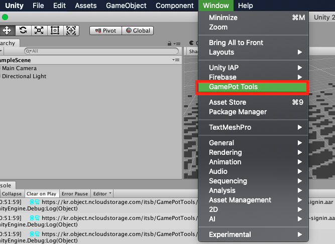
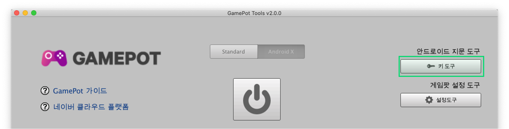
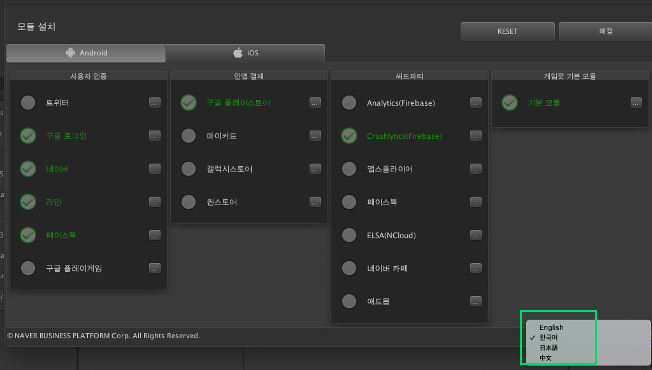

---
search:
  keyword:
    - gamepot
---

# GamePot Tools - Beta

NAVER CLOUD PLATFORM의 GAMEPOT에서 제공하는 GamePot Tools에 대한 가이드입니다.

## GAMEPOT Tools 소개

**Q. 게임팟 툴즈란?**

유니티 엔진을 통해 게임을 개발하는 과정에서  발생할 수 있는, 패키지 의존성 이슈를 한눈에 확인하고 관리할 수 있도록
게임팟 SDK에서 제공하는 관리 툴입니다.

게임팟 SDK에서 제공하고 있는 기존 라이브러리 모듈 뿐만아니라, 다양한 서드파티 라이브러리를 원클릭으로 관리할 수 있습니다.

플랫폼, 모듈 별로 패키지 의존성 현황을 진단하고, 해결할 수 있습니다.

## 1. 시작하기

### Step 1. GamePot Tools 플러그인 가져오기

생성된 GAMEPOT 대시보드에 접속한 후 최신 플러그인을 다운로드합니다.
 **기타 > SDK 다운로드 > Unity > GamePot Tools 다운로드**

### Step 2. 플러그인 가져오기

> Unity 버전 2017.4.x 이상이여야 합니다.

**Assets &gt; Import Package &gt; Custom Package** 메뉴에서 다운로드한 `GamePotTools_xxxx.unitypackage `파일을 선택합니다.

플러그인을 확인하고 import하면 해당 프로젝트에 추가됩니다.

### Step 3. Android/iOS

GamePot Tools의 경우, 각 플랫폼에 대한 namespace를 요구하기 때문에 Android/iOS 빌드 환경이 셋팅된 상태에서 정상 작동합니다. 유니티에디터 상에서 **File > Build Settings > Android/iOS** 모듈이 모두 download 된 상태인지 확인해주세요.

## 2. 사용하기

**Window > GamePot Tools** 탭을 클릭하여 GamePot Tools를 실행할 수 있습니다.

① 게임팟 가이드를 웹페이지에서 확인할 수 있습니다.

② 네이버 클라우드 플랫폼 가이드를 웹페이지에서 확인할 수 있습니다.

③ 최소 모듈이 구성된 상태의 GamePot Sdk를 다운로드 합니다.

④ 플랫폼을 선택할 수 있습니다. (Android / iOS)

### 안드로이드 지문 도구

현재 프로젝트내에 설정된 KetStore로부터 각종 Fingerprint를 획득합니다. 

**키 도구** 버튼을 클릭합니다.

> 유니티 플랫폼 설정이 Android로 변경되어 있어야 합니다.

① 현재 프로젝트의 PlayerSetting에 설정된 KeyStore 정보를 확인합니다.

② Sha1 지문을 획득합니다.

③ Base64 해시를 획득합니다.

④ APK파일 경로를 입력하고 해시를 획득합니다.

⑤ 안드로이드 스튜디오 설치 페이지로 이동합니다.

⑥ JDK 다운로드 페이지로 이동합니다.

⑦ Install 기능을 통해 삭제한 패키지가 저장되어 있는 로컬 저장소로 이동합니다.

⑧ 캐시데이터가 저장되어 있는 로컬 저장소로 이동합니다.

### 게임팟 설정 도구

GamePot의 각종 셋팅값을 관리합니다.

#### Android

Android Bulid에 관한 Gamepot 프로젝트 환경을 설정합니다. 
`Android > mainTemplate.gradle`에 반영됩니다.

#### IOS

IOS Bulid에 관한 Gamepot 프로젝트 환경을 설정합니다.
`IOS > GamePotConfig-info.plist`에 반영됩니다.

### 모듈 설치

플랫폼별 모듈 및 라이브러리를 관리합니다.

① 플랫폼을 선택할 수 있습니다. (Android / iOS)

② 프로젝트 내에 구성하고자 하는 모듈을 선택할 수 있습니다. 이미 구성되어 있는 모듈의 경우, 활성화 상태가 유지됩니다.

③ 해당 모듈에 대한 의존성 패키지 목록을 확인하고, 프로젝트 내 현황을 확인 할 수 있습니다.

④ 게임팟 SDK를 비롯해,관련된 모든 패키지를 삭제하고 초기화합니다. 

⑤ 선택한 모듈 목록에  대해, 필요한 의존성 패키지를 구성합니다.

 - 모듈을 처음 선택시, 노란색은 의존성 패키지 호환성이 완료되지않았음을 의미합니다. 이 때, '해결' 기능을 통해, 패키지 호환성을 맞춰주어야 합니다. (일부 써드파티 모듈의 경우, 사전에 play resolver를 먼저 수행해야 합니다.)

#### 패키지 설치

 - 프로젝트 내에, 해당 패키지가 없기 때문에, CDN 서버에서 다운로드합니다.
 
  

 - 로컬에 패키지가 없습니다. 표시된 경로에 다운로드가 진행됩니다. 
 
  

- 중복된 패키지가 존재합니다. 권장버전의 패키지만 남기고 나머지는 삭제됩니다.
 

 - 최신버전의 패키지가 설치되어 있습니다. 현재 상태를 유지합니다.
 모든 '선택됨' 버튼을 재클릭하여 선택 해제하면, 기존 패키지를 삭제하고 CDN 서버에서 다시 다운로드 할 수 있습니다.

- 설치 버튼을 클릭하면, 패키지 Resolving이 시작됩니다.

 

- Resolving이 완료되면, 해당 모듈 항목이 초록색으로 변합니다.

 

### 언어변경

- GamePot Tools의 언어가 선택한 언어로 변경됩니다. 영어, 한국어, 일본어, 중국어를 지원합니다.

