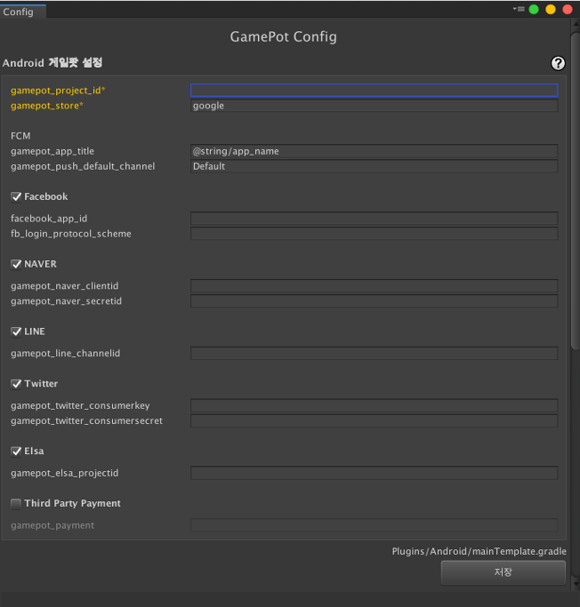
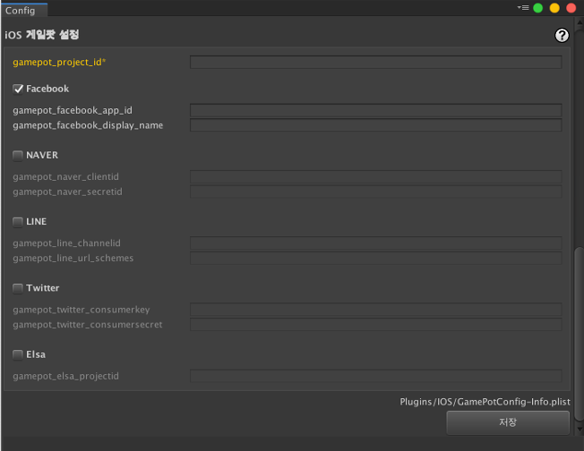
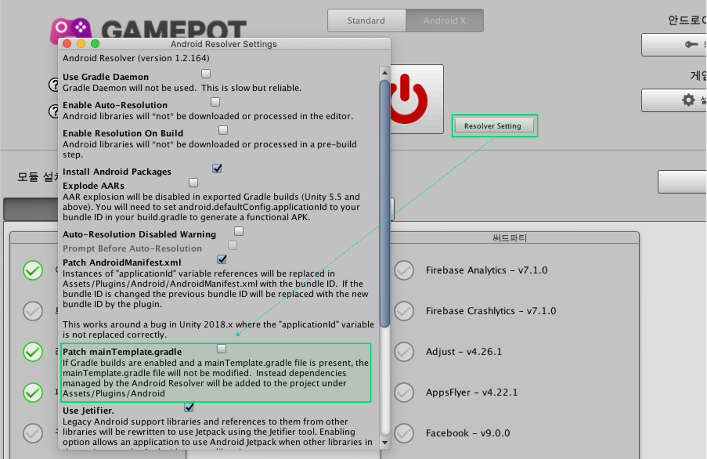

---
search:
  keyword:
    - gamepot
---

# GamePot Tools

NAVER CLOUD PLATFORM의 GAMEPOT에서 제공하는 GamePot Tools에 대한 가이드입니다.

## GAMEPOT Tools 소개

**Q. 게임팟 툴즈란?**

유니티 엔진을 통해 게임을 개발하는 과정에서  발생할 수 있는, 패키지 의존성 이슈를 한눈에 확인하고 관리할 수 있도록
게임팟 SDK에서 제공하는 관리 툴입니다.

게임팟 SDK에서 제공하고 있는 기존 라이브러리 모듈 뿐만아니라, 다양한 서드파티 라이브러리를 원클릭으로 관리할 수 있습니다.

플랫폼, 모듈 별로 패키지 의존성 현황을 진단하고, 해결할 수 있습니다.

## 1. 시작하기

**GAMEPOT Tools는 패키지 구성을 셋팅하기 위해, `EDM4U(External Dependency Manager for Unity)`를 참조합니다.   기본 Tools 패키지에 포함하고 있습니다. (Google Resolver v1.2.164 - GAMEPOT Tools v2.0.0 기준)**

### Step 1. GamePot Tools 플러그인 가져오기

생성된 GAMEPOT 대시보드에 접속한 후 최신 플러그인을 다운로드합니다.
 **기타 > SDK 다운로드 > Unity > GamePot Tools 다운로드**

### Step 2. 플러그인 가져오기

> Unity 버전 2017.4.x 이상이여야 합니다.

**Assets &gt; Import Package &gt; Custom Package** 메뉴에서 다운로드한 `GamePotTools_xxxx.unitypackage `파일을 선택합니다.

플러그인을 확인하고 import하면 해당 프로젝트에 추가됩니다.

### Step 3. Android/iOS

GamePot Tools의 경우, 각 플랫폼에 대한 namespace를 요구하기 때문에 Android/iOS 빌드 환경이 셋팅된 상태에서 정상 작동합니다. 유니티에디터 상에서 **File > Build Settings > Android/iOS** 모듈이 모두 download 된 상태인지 확인해주세요.

## 2. 사용하기

> GAMEPOT Tools는 **.Net 4.x**  이상의 환경에서 정상 작동합니다.   `Build Settings >> Player Settings >> Other Settings >> Configuration` 에서 Scripting Runtime Version을 **.Net 4** 로 변경한 다음, 사용해주세요.

**Window > GamePot Tools** 탭을 클릭하여 GamePot Tools를 실행할 수 있습니다.

**Download** 버튼을 클릭하여, 기본적인 GamePot SDK 모듈을 설치합니다.

기본 모듈구성 설치가 완료되면, 다음과 같은 초기화면이 표시됩니다.

① 게임팟 가이드를 웹페이지에서 확인할 수 있습니다.

② 네이버 클라우드 플랫폼 가이드를 웹페이지에서 확인할 수 있습니다.

③ 최소 모듈이 구성된 상태의 GamePot Sdk를 다운로드 합니다.

④ 플랫폼을 선택할 수 있습니다. (Android / iOS)

### 안드로이드 지문 도구

현재 프로젝트내에 설정된 KetStore로부터 각종 Fingerprint를 획득합니다. 

**키 도구** 버튼을 클릭합니다.

> 빌드 플랫폼 설정이 Android로 변경되어 있어야 합니다.

① 현재 프로젝트의 PlayerSetting에 설정된 KeyStore 정보를 확인합니다.

② Sha1 지문을 획득합니다.

③ Base64 해시를 획득합니다.

④ APK파일 경로를 입력하고 해시를 획득합니다.

⑤ 안드로이드 스튜디오 설치 페이지로 이동합니다.

⑥ JDK 다운로드 페이지로 이동합니다.

⑦ Install 기능을 통해 삭제한 패키지가 저장되어 있는 로컬 저장소로 이동합니다.

⑧ 캐시데이터가 저장되어 있는 로컬 저장소로 이동합니다.

### 게임팟 설정 도구

GamePot의 각종 셋팅값을 관리합니다.

#### Android

Android Bulid에 관한 Gamepot 프로젝트 환경을 설정합니다. 
`Android > mainTemplate.gradle`에 반영됩니다.

#### IOS

IOS Bulid에 관한 Gamepot 프로젝트 환경을 설정합니다.
`IOS > GamePotConfig-info.plist`에 반영됩니다.

### 모듈 관리

플랫폼별 모듈 및 라이브러리를 관리합니다.

① 플랫폼을 선택할 수 있습니다. (Android / iOS)

② 프로젝트 내에 구성하고자 하는 모듈을 자유롭게 선택할 수 있습니다. 
(서드파티 모듈의 경우, 유니티 패키지의 형태로 설치되며 다시 Reset 하기 전까지 활성화 상태야 유지됩니다.)

③ 현재 선택된 모듈구성에 대한, 프로젝트 의존성 해결상태를 각각 색깔로 나타냅니다. 해당 버튼을 눌러, 의존성 상태를 해결하기 위한 다음 단계로 나아갈 수 있습니다.

④ 게임팟 SDK를 비롯해,관련된 모든 패키지를 삭제하고 초기화합니다. 

 > 아직 현재 모듈 구성에 대한, 의존성 해결상태를 확인하기 전(Unchecked) 상태입니다. 버튼을 누르면, 의존성 상태를 확인하고 다음 단계로 나아갑니다.

 
 > Android Play Resolver의 Resolve 기능이 작동하지 않은(필요한) 상태입니다.   버튼을 누르면 Android Play Resolve 기능이 작동하면서, 현재 모듈 구성에 적절한 패키지 구성을 찾아 프로젝트 경로(/Plugins/Android/)에 다운로드 합니다.  (Android Platform 셋팅에서만  나타나는 상태입니다.)

  
 > 현재 모듈 구성에 부족한 패키지가 존재하거나, 적절하지 않은 (혹은 중복된) 패키지가 존재하는 상황입니다. 버튼을 누르면 GamePot Tools의 자체 Resolve 기능을 통해, 패키지 구성을 최적화합니다.

   
 > 현재 모듈 구성에 대해, 패키지 셋팅이 완료된 상황입니다. 의존성 상태가 해결되었음을 의미하며 정상 빌드 할 수 있습니다.

### 모듈 환경 구성하기

 - 원하는 모듈구성을 선택한 다음, 표시된 버튼(Resolver)를 누릅니다.

 

 - 해당 모듈구성에 대해, 아직 Android Play Resolver가 작동하지 않은 상태입니다. 버튼을 눌러 Android Play Resolver를 작동해야 합니다. (Android Platform)
 
 

 - Android Play Resolver를 작동하기 전, Android Resolver Settings를 확인해야 합니다. Patch mainTemplate.gradle 체크가 해제되었는지 확인 후 진행해주세요.

 

- Android Play Resolver가 작동하면서, 필요한 패키지 구성을 프로젝트 경로(/Plugins/Android/)에 다운로드 합니다. Resolver 작동이 완료되면, 다이얼로그와 함께 결과(True/False)가 표시됩니다.

 - 부족한 패키지, 혹은 적절하지 않은(중복된)패키지가 존재하는 상황입니다. 다시 Resolver 버튼을 누릅니다.

- 새로운 팝업 화면이 뜨며, 각 패키지 상태 리스트가 표시됩니다.   설치 버튼을 클릭하면, 필요 패키지 다운로드, 불필요 패키지 삭제를 진행하며 최적화를 수행합니다.

 

- Resolving이 완료되면, 해당 모듈 항목이 초록색으로 변합니다. 이제 모듈 환경 구성이 완료되었습니다.

 

### 언어변경

- GamePot Tools의 언어가 선택한 언어로 변경됩니다. 영어, 한국어, 일본어, 중국어를 지원합니다.

