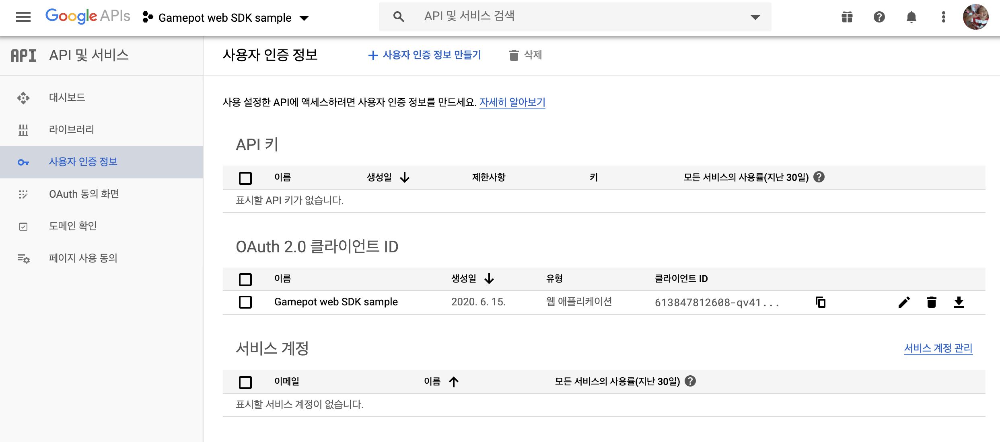

---
search:
  keyword:
    - gamepot
---

# Javascript SDK

## 1. 시작하기

### 개발 환경 구성

브라우저에서 GAMEPOT을 사용하기 위한 시스템 환경은 다음과 같습니다.

\[ 시스템 환경 \]

- 최소사항: `크롬 4`, `IE 8`, `Firefox 3.5`, `Safari 4`, `Opera 10.50` 등

#### 자바스크립트 추가

다운로드한 Javascript SDK 파일을 `<header>`블록 또는 `<body>` 블록 내에 추가합니다.
> `GP` global variable을 통해 기능을 사용할 수 있습니다\
> 게임팟 스크립트 로드 후 동일한 변수명으로 재 선언되지 않도록 주의해주세요. 
```html
<script src="/js/GamePot-2.1.0b.js"></script>
```

## 2. 초기화

웹페이지 로딩이 완료될 때 실행할 수 있도록 `window.onload = function() {...}` 또는 jQuery를 사용하는 경우 `$(ducement).ready(function() {...})` 블록 내에서 초기화합니다.

```html

<html>
<head></head>
<body>
    <!-- YOUR WEB HTML CODES -->
    
    <script>
        window.onload = function() {
            
            // 프로젝트 ID는 게임팟 대시보드에서 확인할 수 있습니다.
            var project_id = "f2c4f50b-2546-280e-913b-a7cea5548384"; 
            
            var gamepotConfig = {
              // 구글 로그인을 사용하는 경우 아래와 같이 구글 API 클라이언트 ID를 입력
              google_signin_client_id: "403241810604-fv81........apps.googleusercontent.com",
              // 페이스북 로그인 사용하는 경우 아래와 같이 Facebook 앱 ID를 입력
              facebook_app_id: "149535310821467"
            };
            // 게임팟 초기화
            GP.setup(project_id, gamepotConfig);
        }
    </script>

    <!-- YOUR WEB HTML CODES -->
</body>
</html>

```

## 3. 로그인, 로그아웃, 회원 탈퇴

구글, 페이스북, 이메일 등 다양한 로그인 SDK를 통합하여 사용할 수 있습니다.

### 구글\(API CONSOLE\) 콘솔 설정

[Google API Console](https://console.developers.google.com) 에서 프로젝트를 생성 > 사용자 인증정보 만들기 > OAuth 클라이언트 ID > 웹 어플리케이션 유형으로 생성 후 클라이언트 ID 값을 사용합니다.

> 예시) 533847112608-qv8149tijkoh0vljrpeashk0udf39eoe.apps.googleusercontent.com



### 페이스북 콘솔 설정

[Facebook Developers](https://developers.facebook.com/apps) 에서 앱 생성 후 앱 ID 사용

> 예시) 149235210820417

### 로그인

로그인 UI는 개발사에서 구현하고, 로그인 버튼 클릭 시에 연동합니다.

#### 소셜 플랫폼 로그인

```javascript

// 로그인 타입 정의
// GP.ChannelType.GOOGLE: 구글
// GP.ChannelType.FACEBOOK: 페이스북
// GP.ChannelType.EMAIL: 이메일

// 페이스북 로그인 버튼을 눌렀을 때 호출
GP.login(GP.ChannelType.FACEBOOK, {
        
    onSuccess: function(userInfo) {
      console.log("로그인 성공. memberid: " + userInfo.memberid + ", userid: " + userInfo.userid);
    },
    onCancel: function() {
      console.log("로그인 취소");
    },
    onFailure: function(gamepotError) {
      console.log("로그인 실패: " + gamepotError.toString());
    }
});

```

#### 이메일 로그인

```javascript

// <input>태그 등에서 사용자로 부터 입력
var email_id = $("#input-email-id").val();
var email_password = $("#input-email-password").val();

$("#email-result-status").html("");

GP.login(GP.ChannelType.EMAIL, email_id, email_password, {

    onSuccess: function (gamepotUserInfo) {
        console.log("이메일 로그인 성공", gamepotUserInfo);
        $("#email-result-status").html("로그인 성공. memberid: " + gameUserInfo.memberid + ", userid: " + gameUserInfo.userid);
    },
    onCancel: function () {
        console.log("이메일 로그인 취소");
    },
    onFailure: function (gamepotError) {
        console.log("이메일 로그인 실패: " + gamepotError.toString());
  
        var msg = "";
        switch (gamepotError.getCode()) {
        case GP.Error.EMAIL_AUTH_WRONG_EMAIL_FORMAT:
            msg = "이메일 형식이 올바르지 않습니다.";
            break;
        case GP.Error.EMAIL_AUTH_WRONG_PASSWORD_EMPTY:
            msg = "비밀번호를 입력해주세요.";
            break;
        case GP.Error.EMAIL_AUTH_WRONG_PASSWORD_LENGTH:
            msg = "비밀번호는 최소 8자, 최대 32자 까지 입력할 수 있습니다.";
            break;
        case GP.Error.EMAIL_AUTH_WRONG_PASSWORD:
            msg = "비밀번호가 일치하지 않습니다.";
            break;
        case GP.Error.EMAIL_AUTH_WRONG_PASSWORD_BLOCKED:
            msg = "비밀번호 오류 횟수 초과로 로그인할 수 없습니다.";
            break;
        case GP.Error.EMAIL_AUTH_NOT_FOUND:
            msg = "연결 계정이 존재하지 않습니다.";
            break;
        default:
            msg = gamepotError.getMessage();
            break;
        }
        
        $("#email-result-status").html(msg); // 결과 표시 예.
    }
});

```


#### 이메일 가입

```javascript

// <input>태그 등에서 사용자로 부터 입력
var new_email_id = $("#input-email-new-id").val();
var new_email_password = $("#input-email-new-password").val();

$("#email-result-status2").html("");

GP.Channel.emailRegister(new_email_id, new_email_password, {

    onSuccess: function (gamepotUserInfo) {
      console.log("이메일 가입 성공", gamepotUserInfo);
    },
    onCancel: function () {
      console.log("이메일 가입 취소");
    },
    onFailure: function (gamepotError) {
      console.log("이메일 가입 실패: " + gamepotError.toString());
    
      var msg = "";
      switch (gamepotError.getCode()) {
        case GP.Error.EMAIL_AUTH_WRONG_EMAIL_FORMAT:
          msg = "이메일 형식이 올바르지 않습니다.";
          break;
        case GP.Error.EMAIL_AUTH_WRONG_PASSWORD_EMPTY:
          msg = "비밀번호를 입력해주세요.";
          break;
        case GP.Error.EMAIL_AUTH_WRONG_PASSWORD_LENGTH:
          msg = "비밀번호는 최소 8자, 최대 32자 까지 입력할 수 있습니다.";
          break;
        case GP.Error.EMAIL_AUTH_WRONG_PASSWORD:
          msg = "비밀번호가 일치하지 않습니다.";
          break;
        case GP.Error.EMAIL_AUTH_WRONG_PASSWORD_BLOCKED:
          msg = "비밀번호 오류 횟수 초과로 로그인할 수 없습니다.";
          break;
        case GP.Error.EMAIL_AUTH_NOT_FOUND:
          msg = "연결 계정이 존재하지 않습니다.";
          break;
        case GP.Error.EMAIL_AUTH_ALREADY_IN_USE:
          msg = "이미 사용 중인 계정입니다.";
          break;
        default:
          msg = gamepotError.getMessage();
          break;
      }
      $("#email-result-status2").html(msg);
    }
});
```


#### 회원 고유 아이디

```javascript
GP.getMemberId();
```

### 자동 로그인

사용자가 마지막에 로그인 했던 정보를 전달하는 API를 이용하여 자동 로그인을 구현할 수 있습니다.

```javascript

// 사용자가 마지막에 로그인했던 정보를 전달하는 API
var lastLoginType = GP.getLastLoginType();
if(lastLoginType !== GP.ChannelType.NONE) {
    console.log("자동 로그인. lastLoginType: " + lastLoginType);
    GP.login(lastLoginType, {
    
        onSuccess: function (gameUserInfo) {
          console.log("자동 로그인 - 완료. memberid: " + gameUserInfo.memberid + ", userid: " + gameUserInfo.userid);
        },
      
        onCancel: function () {
          console.log("자동 로그인 - 취소");
        },
        
        onFailure: function (gamepotError) {
          console.log("자동 로그인 - 실패: " + gamepotError.toString());
        },
        
        onNeedUpdate: function (status) {
          console.log("자동 로그인 - 업데이트 필요: " + status);
        },
        
        onMainternance: function (status) {
            console.log("자동 로그인 - 점검중: " + status);
        },
    });
}
else
{
    // 처음 게임을 실행했거나 로그아웃한 상태. 로그인을 할 수 있는 로그인 화면을 사용자에게 보여주세요.
}
```

### 로그아웃

현재 회원 계정을 로그아웃합니다.

```javascript

GP.logout({
    onSuccess() {
         console.log("로그아웃 완료.");
     },
     onFailure(gamepotError) {
         console.log("로그아웃 실패. 로그인된 상태가 아니거나 이미 세션이 종료된 경우: " + gamepotError.toString());
     }
});

```

### 회원 탈퇴

현재 회원 계정을 탈퇴시킵니다.

```javascript

GP.deleteMember({
    onSuccess: function() {
        console.log("회원탈퇴 성공. 초기화면으로 이동해주세요.");
    },
    onFailure: function(error) {
        // 회원탈퇴 실패. error.getMessage()를 이용해서 오류 메시지를 보여주세요.
        console.log(error.getMessage());
    }
});

```

### 검증

로그인 완료 후 로그인 정보를 개발사 서버에서 GAMEPOT 서버로 전달하면 로그인 검증이 진행됩니다.

자세한 설명은 `Server to server api` 매뉴에 `Authentication check` 항목을 참고해주세요.

## 4. 계정 연동

하나의 게임 계정에 복수 개의 소셜 계정\(구글, 페이스북 등\)을 연결/해제할 수 있는 기능입니다.\(최소 연동 소셜 계정은 1가지입니다.\)

> 연동화면 UI는 개발사에서 구현해주세요.

### 소셜 계정 연동

Google, Facebook 등의 아이디로 계정을 연동할 수 있습니다.

```javascript

// 구글 계정에 연동
// GP.ChannelType.GOOGLE
// 페이스북 계정에 연동
// GP.ChannelType.FACEBOOK
// 이메일 계정에 연동
// GP.ChannelType.EMAIL

GP.createLinking(GP.ChannelType.GOOGLE, {
    onSuccess: function(userInfo) {
        // 연동 완료. 연동 결과에 대한 문구를 노출시켜 주세요.(예: 계정 연동에 성공했습니다.)
    },

    onCancel: function() {
        // 사용자가 취소한 경우
    },

    onFailure: function(error) {
        // 연동 실패. error.getMessage()를 이용해서 오류 메시지를 보여주세요.
    }
});

```

### 이메일 계정 연동

소셜계정으로 연동된 계정에 이메일 아이디로 추가 연동할 수 있습니다.

```javascript

GP.createEmailLinking("some@example.com", "some_my_password", {
    onSuccess: function(userInfo) {
        // 연동 완료. 연동 결과에 대한 문구를 노출시켜 주세요.(예: 계정 연동에 성공했습니다.)
    },

    onFailure: function(error) {
        // 연동 실패. error.getMessage()를 이용해서 오류 메시지를 보여주세요.
    }
});

```

### 연동된 리스트

해당 API를 통해 계정에 대해 연동 여부를 확인하실 수 있습니다.

```javascript

// 타입 정의
// GP.ChannelType.GOOGLE
// GP.ChannelType.FACEBOOK
// GP.ChannelType.EMAIL
// 타입에 따른 연동 결과를 반환합니다.
var isLinked = GP.isLinked(GP.ChannelType.GOOGLE);

// 연동되어 있는 모든 타입에 대해 json object로 반환합니다.
// 만약 GOOGLE과 FACEBOOK에 연동된 경우 아래와 같이 반환됩니다.
// [{“provider”:”google”},{“provider”:”facebook”}]
var linking = GP.getLinkedList();

```

### 연동 해제

기존에 연동되어 있는 계정을 해제합니다.

```javascript

GP.deleteLinking(GP.ChannelType.GOOGLE, {
    onSuccess: function() {
        // 연동 해제 완료. 연동 결과에 대한 문구를 노출시켜 주세요. (예: 계정 연동을 해지했습니다.)
    },
    onFailure: function(error) {
        // 연동 해제 실패. error.getMessage()를 이용해서 오류 메시지를 보여주세요.
    }
});

```
