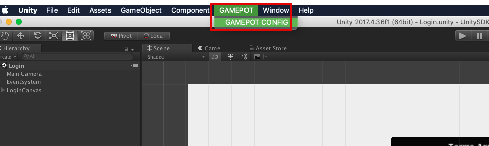
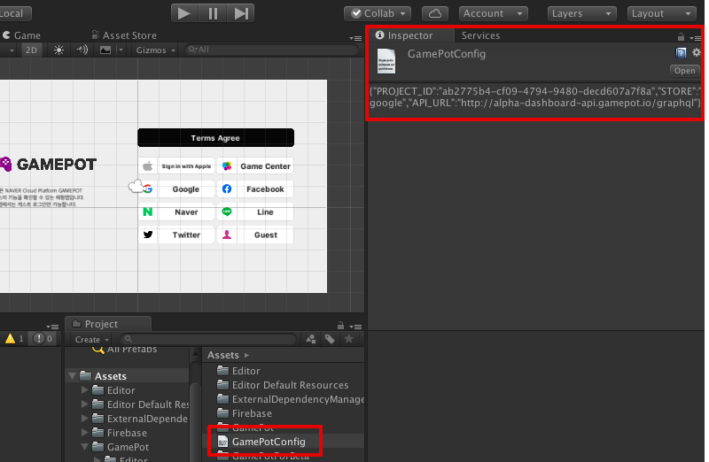

---
search:
  keyword: ['gamepot']
---

#### **네이버 클라우드 플랫폼의 상품 사용 방법을 보다 상세하게 제공하고, 다양한 API의 활용을 돕기 위해 <a href="https://guide.ncloud-docs.com/docs/ko/home" target="_blank">[설명서]</a>와 <a href="https://api.ncloud-docs.com/docs/ko/home" target="_blank">[API 참조서]</a>를 구분하여 제공하고 있습니다.**

<a href="https://api.ncloud-docs.com/docs/ko/game-gamepot" target="_blank">Gamepot API 참조서 바로가기 >></a><br />
<a href="https://guide.ncloud-docs.com/docs/game-gamepotconsole" target="_blank">Gamepot 설명서 바로가기 >></a>

# GamePot Unity SDK (Standalone)

## 0. Project Setting

(빌드 시 필요한) 게임팟 프로젝트와 관련된 각종 셋팅값을 입력합니다.

1.  유니티 에디터 상단의 GAMEPOT >> GAMEPOT CONFIG 메뉴를 클릭합니다.



2.  해당 메뉴를 클릭 후, 인스펙터창에 게임팟 프로젝트와 관련된 각종 셋팅값을 입력하고, 하단의 **Confirm** 버튼을 클릭합니다.

| ID         | type   | desc                                                                    |
| :--------- | :----- | :---------------------------------------------------------------------- |
| PROJECT_ID | string | 게임팟 Project ID                                                       |
| STORE      | string | 스토어 ID                                                               |
| API_URL    | string | ~~게임팟 api 서버 url (default)~~ 빈 값으로 유지해주세요. (v2.4.0 이후) |

|


3.  **Confirm** 버튼을 누르면, **/Assets/** 의 경로에 GamePotStandalone_Config.json 파일이 생성된 것을 확인 할 수 있습니다.
4.  Windows 플랫폼 빌드 시, 초기화 시점에 해당 config정보를 읽어올 수 있도록 **~/build/bin/{Build_Name}\_Data** 경로에 해당 json 파일을 위치시켜주세요.



## 1. 초기화

게임을 시작할때 로드되는 첫 장면에 사용되는 개체에 다음 코드를 추가합니다.

```csharp

using GamePotUnity;
using GamePotUnity.Standalone.Networking;

public class GamePotLoginSampleScene : MonoBehaviour {

    bool isPaused = false;

    void Awake() {

        // GamePot 인스턴스 초기화
        GamePot.initPlugin();
    }
    void Start () {
        GamePot.setListener(  GamePotInterface.cs 상속받은 class );
         // ex) GamePot.setListener(new GamePotSampleListener());
    }

   void OnApplicationPause(bool pauseStatus)
    {
       if(pauseStatus == true)
       {
           GamePotChat.start();    //(re)connect to socket server
       }
       else
       {
           GamePotChat.stop();    //disconnect from socket server
       }
       pauseStatus != isPaused
    }
}

ex)
public class GamePotSampleListener : MonoBehaviour , IGamePot {
    ....
}
```

## 2. MemberInfo 셋팅

- **로그인 API를 호출하기 전**, (GAMEPOT JS SDK로부터 획득한) UserInfo 값을 셋팅해주세요.

- 다음과 같이, MemberID(GamePot) / Token(GamePot) 값을 GamePotSettings.MemberInfo에 저장합니다.

```csharp

//전달받은 memberId / token 값을 GamePotSettings.MemberInfo에 넣어줍니다.
***************************************************

[Step 1] - Setting MemberInfo

NUserInfo userInfo = new NUserInfo
{
     memberid = (string) GAMEPOT_MEMBER_ID,
     token = (string) GAMEPOT_TOKEN
};
GamePotSettings.MemberInfo = userInfo;

***************************************************

[Step 2]

....
//GamePotSettings.MemberInfo 값을 셋팅한 다음, Login API를 호출해주세요.
GamePot.login(NCommon.LoginType.STANDALONE);
....

```

| Struct                    | ID       | type   | desc             |
| :------------------------ | :------- | :----- | :--------------- |
| GamePotSetting.MemberInfo |          |        |                  |
|                           | memberid | string | 게임팟 Member ID |
|                           | token    | string | 게임팟 Token     |

|

## 3. 로그인 (점검 체크)

- Login API를 호출하면, 내부적으로 점검 여부를 체크하여 Callback 이벤트가 호출됩니다. 이 때, Windows 플랫폼의 경우 NCommon.LoginType.STANDALONE을 파라메터로 넣어주세요.

- 로그인 성공 시, GamePotSettings.MemberInfo에 셋팅된 정보가 NUserInfo 구조체에 저장되어 onLoginSuccess 이벤트 파라메터로 return 됩니다.

Case 1 )

Request:

```csharp
GamePot.login(NCommon.LoginType.STANDALONE);
```

Response:

```csharp
// 로그인 성공
public void onLoginSuccess(NUserInfo userInfo)
{
}

// 로그인 실패
public void onLoginFailure(NError error)
{
    // 로그인을 실패하는 경우
    // error.message를 팝업 등으로 유저에게 알려주세요.
}

// 점검(대시보드에 점검이 활성화되어 있는 경우 호출)
public void onMainternance(NAppStatus status)
{
    // TODO: 파라미터로 넘어온 status 정보를 토대로 팝업을 만들어 사용자에게 알려줘야 합니다.
    // ex) 인게임 팝업을 통해 개발사에서 직접 UI 구현
}

```

- Case 2

Request:

```csharp
GamePot.login(NCommon.LoginType, GamePotCallbackDelegate.CB_Login);
```

```csharp
GamePot.login(NCommon.LoginType, (resultState, userInfo, appStatus, error) => {
    switch (resultState)
    {
        case NCommon.ResultLogin.SUCCESS:
        // login success
        break;
        case NCommon.ResultLogin.FAILED:
        // login fail
        break;
        case NCommon.ResultLogin.MAINTENANCE:
        // onMaintenance
        break;
        default:
        break;
    }
});
```

NUserInfo 정의

```csharp
public class NUserInfo
{
    public string memberid { get; set; }        // 맴버 ID(유저의 유니크 아이디)
    public string name { get; set; }            // 이름
    public string profileUrl { get; set; }      // 프로필 URL(존재 시)
    public string email { get; set; }           // 이메일(존재 시)
    public string token { get; set; }           // 유저 광고 ID
    public string userid { get; set; }          // Social ID(google, facebook ...)
}
```

<!-- ### Step 4
(setup 이후,) 소켓 서버에 대해 핸들링(connect / disconnect) 할 수 있습니다.

```csharp
GamePotChat.start();    //connect
GamePotChat.stop();    //disconnect
​``` -->

## 4. 기타 API

### 4-1. 고객지원 / FAQ (웹뷰)

- ref. 현재 유니티 엔진 상에서, **웹뷰에 대한 Event 수신 / 한글 유니코드 입력이 불가한 이슈** 가 있습니다. 이에 따라, 아직 (공식적으로) 고객지원 메뉴에 대한 Native API는 제공되지 않는 상태입니다.

​```csharp
//대시보드 주소 및 각 파라메터 값을, 생성한 GamePot 대시보드에 대한 값으로 수정하여 접근이 가능합니다.

[url]
"https://{domain}/cs/question?projectid={projectid}&store={store}&memberid={memberid}&device={device}&sdkversion={sdkversion}&language={language}"

/* Example
https://gsrpkjibrmls4086645.gcdn.ntruss.com/demo/cs/question?projectid=ab2775b4-cf09-4794-9480-decd607a7f8a&store=google&memberid=4e125b06-462f-4c9f-8dbe-b1447bc9e370&device=android&sdkversion=2.1.2&language=ko
*/

```

| ID         | desc                        | example                                  |
| :--------- | :-------------------------- | :--------------------------------------- |
| domain     | 게임팟 대시보드 domain 주소 | gsrpkjibrmls4086645.gcdn.ntruss.com/demo |
| projectid  | 게임팟 Project ID           | ab2775b4-cf09-4794-9480-decd607a7f8a     |
| store      | 스토어 명                   | google                                   |
| memberid   | 게임팟 Member ID            | 4e125b06-462f-4c9f-8dbe-b1447bc9e370     |
| device     | 플랫폼                      | android                                  |
| sdkversion | 게임팟 SDK Version          | 2.1.2                                    |
| language   | 언어                        | ko                                       |

|

### 4-2. 쿠폰

> 쿠폰 번호를 입력받는 UI는 개발사에서 구현해주세요.

- Case 1

Request:

```csharp
GamePot.coupon(string couponNumber); // 쿠폰번호

GamePot.coupon(string couponNumber, string userData); // 쿠폰번호, 사용자정보
```

Response:

```csharp
/// 쿠폰 사용 성공
public void onCouponSuccess() {
}

/// 쿠폰 사용 실패
public void onCouponFailure(NError error) {
    // 쿠폰 사용을 실패하는 경우
    // error.message를 팝업 등으로 유저에게 알려주세요.
}
```

- Case 2

Request:

```csharp
GamePot.coupon(string couponNumber, GamePotCallbackDelegate.CB_Common); // 쿠폰번호

GamePot.coupon(string couponNumber, string userData, GamePotCallbackDelegate.CB_Common);    // 쿠폰번호, 사용자정보
```

```csharp
GamePot.coupon(couponNumber, (success, error) => {
   if(success)
   {
       // 쿠폰 사용 성공
   }
   else
   {
        // 쿠폰 사용을 실패하는 경우
        // error.message를 팝업 등으로 유저에게 알려주세요.
   }
});
```

#### - 아이템 지급

쿠폰 사용이 성공하면 개발사 서버에 Server to server api를 통해 아이템 지급을 요청합니다.

이를 위해선 Server to server api 메뉴에 `Item Webhook` 항목을 참고하여 처리하셔야 합니다.

### 4-3. 게임 로그 전송

게임에서 사용되는 정보를 담아 호출하면 `대시보드` - `게임`에서 조회가 가능합니다.

아래는 사용할 수 있는 예약어 정의 표 입니다.

| 예약어                            | 필수 | 타입   | 설명         | 최대 길이 |
| :-------------------------------- | :--- | :----- | :----------- | --------- |
| GamePotSendLogCharacter.NAME      | 필수 | String | 케릭터명     | 128       |
| GamePotSendLogCharacter.LEVEL     | 선택 | String | 레벨         | 128       |
| GamePotSendLogCharacter.SERVER_ID | 선택 | String | 서버아이디   | 128       |
| GamePotSendLogCharacter.PLAYER_ID | 선택 | String | 케릭터아이디 | 128       |
| GamePotSendLogCharacter.USERDATA  | 선택 | String | ETC          | 128       |

|

```csharp
String name = "케릭터명";
String level = "10";
String serverid = "svn_001";
String playerid = "283282191001";
String userdata = "";

GamePotSendLogCharacter characterLog = new GamePotSendLogCharacter();
characterLog.put(GamePotSendLogCharacter.NAME, name);
characterLog.put(GamePotSendLogCharacter.PLAYER_ID, playerid);
characterLog.put(GamePotSendLogCharacter.LEVEL, level);
characterLog.put(GamePotSendLogCharacter.SERVER_ID, serverid);
characterLog.put(GamePotSendLogCharacter.USERDATA, userdata);
```

Request:

```csharp
GamePot.characterInfo(characterLog, GamePotCallbackDelegate.CB_Common);

GamePot.characterInfo(characterLog, (success, error) => {
    if(success)
    {
        //게임 로그 전송 성공
    }
    else
    {
        //게임 로그 전송 실패
    }
});
```
