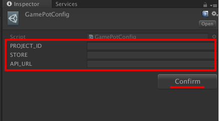

---
search:
  keyword: ['gamepot']
---

# GamePot Unity SDK (Standalone)

**_Standalone(Windows) 플랫폼을 위한 GamePot Unity SDK는 콘솔에서 웹뷰를 사용하기 위해, 3rd party Unity Asset 'VUPLEX(for Mac & Windows)' 를 사용하고 있습니다._**

**_해당 Asset을 Asset Store에서 구입하여 import 한 다음, GamePot SDK를 사용해주세요._**

[[ VUPLEX Site Link ]](https://developer.vuplex.com/webview/overview)

[[ VUPLEX AssetStore Link ]](https://assetstore.unity.com/packages/tools/gui/3d-webview-for-windows-and-macos-154144)

## 0. Project Setting

(빌드 시 필요한) 게임팟 프로젝트와 관련된 각종 셋팅값을 입력합니다.

 1) 유니티 에디터 상단의 GAMEPOT >> GAMEPOT CONFIG 메뉴를 클릭합니다. 

 


 2) 해당 메뉴를 클릭 후, 인스펙터창에 게임팟 프로젝트와 관련된 각종 셋팅값을 입력하고, 하단의 **Confirm** 버튼을 클릭합니다.

 | ID       | type   | desc             |
| :------- | :----- | :--------------- |
| PROJECT_ID | string | 게임팟 Project ID |
| STORE    | string | 스토어 ID    |
| API_URL    | string | 게임팟 api 서버 url (default)    |
|



 3) **Confirm** 버튼을 누르면, **/Assets/** 의 경로에 GamePotConfig.json 파일이 생성된 것을 확인 할 수 있습니다. 
 4) Windows 플랫폼 빌드 시, 초기화 시점에 해당 config정보를 읽어올 수 있도록 **~/build/bin/{Build_Name}_Data**  경로에 해당 json 파일을 위치시켜주세요.


## 1. 초기화

게임을 시작할때 로드되는 첫 장면에 사용되는 개체에 다음 코드를 추가합니다.

```csharp

using GamePotUnity;
public class GamePotLoginSampleScene : MonoBehaviour {

    bool isPaused = false;

    void Awake() {

        // GamePot 초기화
        GamePot.initPlugin();
    }
    void Start () {
        GamePot.setListener(  GamePotInterface.cs 상속받은 class );
         // ex) GamePot.setListener(new GamePotSampleListener());
    }

   void OnApplicationPause(bool pauseStatus)
    {
       if(pauseStatus == true)
       {
           GamePotChat.start();    //(re)connect to socket server 
       }
       else
       {
           GamePotChat.stop();    //disconnect from socket server
       }
       pauseStatus != isPaused
    }
}

ex)
public class GamePotSampleListener : MonoBehaviour , IGamePot {
    ....
}
```

## 2. MemberInfo 셋팅

 -  **로그인 API를 호출하기 전**, (JS Script SDK로부터 획득한) UserInfo 값을 셋팅해주세요.

 - 다음과 같이, MemberID(GamePot) / Token(GamePot) 값을 GamePotSettings.MemberInfo에 저장합니다.

```csharp

//전달받은 memberId / token 값을 GamePotSettings.MemberInfo에 넣어줍니다.
***************************************************

[Step 1] - Setting MemberInfo

NUserInfo userInfo = new NUserInfo
{
     memberid = (string) GAMEPOT_MEMBER_ID,
     token = (string) GAMEPOT_TOKEN
};
GamePotSettings.MemberInfo = userInfo;

***************************************************

[Step 2] 

....
//GamePotSettings.MemberInfo 값을 셋팅한 다음, Login API를 호출해주세요.
GamePot.login(NCommon.LoginType.STANDALONE); 
....

```

| Struct                    | ID       | type   | desc             |
| :------------------------ | :------- | :----- | :--------------- |
| GamePotSetting.MemberInfo |          |        |                  |
|                           | memberid | string | 게임팟 Member ID |
|                           | token    | string | 게임팟 Token     |
|


## 3. 로그인 (점검 체크)

 -  Login API를 호출하면, 내부적으로 점검 여부를 체크한 후 Callback 이벤트가 호출됩니다. 이 때, Windows 플랫폼의 경우 NCommon.LoginType.STANDALONE을 파라메터로 넣어주세요.

  - 로그인 성공 시, GamePotSettings.MemberInfo에 저장한 정보가 NUserInfo 구조체에 저장되어 리턴됩니다.

 Case 1 )

Request:

```csharp
GamePot.login(NCommon.LoginType.STANDALONE);
```

Response:

```csharp
// 로그인 성공
public void onLoginSuccess(NUserInfo userInfo)
{
}

// 로그인 실패
public void onLoginFailure(NError error)
{
    // 로그인을 실패하는 경우
    // error.message를 팝업 등으로 유저에게 알려주세요.
}

// 점검(대시보드에 점검이 활성화되어 있는 경우 호출)
public void onMainternance(NAppStatus status)
{
    // TODO: 파라미터로 넘어온 status 정보를 토대로 팝업을 만들어 사용자에게 알려줘야 합니다.
    // TODO: 아래 두 가지 방식 중 한 가지를 선택하세요.
    // case 1: 인게임 팝업을 통해 개발사에서 직접 UI 구현
    // case 2: SDK의 팝업을 사용(이 경우에는 아래 코드를 호출해 주세요.)
    // GamePot.showAppStatusPopup(status.ToJson());
}

// 앱 종료
public void onAppClose()
{
    // TODO: 점검 기능을 case 2 방식으로 구현하는 경우
    // TODO: 앱을 강제 종료할 수 있기 때문에 이 곳에 앱을 종료할 수 있도록 구현하세요.
}
```

- Case 2

Request:

```csharp
GamePot.login(NCommon.LoginType, GamePotCallbackDelegate.CB_Login);
```

```csharp
GamePot.login(NCommon.LoginType, (resultState, userInfo, appStatus, error) => {
    switch (resultState)
    {
        case NCommon.ResultLogin.SUCCESS:
        // login success
        break;
        case NCommon.ResultLogin.FAILED:
        // login fail
        break;
        case NCommon.ResultLogin.MAINTENANCE:
        // onMaintenance
        break;
        default:
        break;
    }
});
```

NUserInfo 정의

```csharp
public class NUserInfo
{
    public string memberid { get; set; }        // 맴버 ID(유저의 유니크 아이디)
    public string name { get; set; }            // 이름
    public string profileUrl { get; set; }      // 프로필 URL(존재 시)
    public string email { get; set; }           // 이메일(존재 시)
    public string token { get; set; }           // 유저 광고 ID
    public string userid { get; set; }          // Social ID(google, facebook ...)
}
```

<!-- ### Step 4
(setup 이후,) 소켓 서버에 대해 핸들링(connect / disconnect) 할 수 있습니다.

```csharp
GamePotChat.start();    //connect
GamePotChat.stop();    //disconnect
``` -->

## 공지사항 이미지 웹뷰

(GamePot SDK 초기화 이후,) 웹뷰 형태의 공지사항 이미지 팝업을 노출합니다.

```csharp
GamePot.showNoticeWebView();
```

- ref. (Unity Editor 상에서) 노출되는 팝업 이미지의 레이아웃은 Sample Prefab으로 되어 있으며, 이를 수정해 레이아웃을 조정할 수 있습니다. (/Assets/Resources/GamePotWebViewManager)

## 고객지원 / FAQ 웹뷰

- ref. 현재 유니티 엔진 상에서, **웹뷰에 대한 Event 수신 / 한글 유니코드 입력이 불가한 이슈** 가 있습니다. 이에 따라, 아직 (공식적으로) 고객지원 메뉴에 대한 Native API는 제공되지 않는 상태입니다.

```csharp
//대시보드 주소 및 각 파라메터 값을, 생성한 GamePot 대시보드에 대한 값으로 수정하여 접근이 가능합니다.

[url] 
"https://{domain}/cs/question?projectid={projectid}&store={store}&memberid={memberid}&device={device}&sdkversion={sdkversion}&language={language}"

/* Example 
https://gsrpkjibrmls4086645.gcdn.ntruss.com/demo/cs/question?projectid=ab2775b4-cf09-4794-9480-decd607a7f8a&store=google&memberid=4e125b06-462f-4c9f-8dbe-b1447bc9e370&device=android&sdkversion=2.1.2&language=ko
*/

```

| ID       | desc   | example             |
| :------- | :----- | :--------------- |
| domain |  게임팟 대시보드 domain 주소 | gsrpkjibrmls4086645.gcdn.ntruss.com/demo |
| projectid |  게임팟 Project ID | ab2775b4-cf09-4794-9480-decd607a7f8a |
| store    | 스토어 명 |  google |
| memberid   |  게임팟 Member ID |  4e125b06-462f-4c9f-8dbe-b1447bc9e370  |
| device    | 플랫폼  |  android   |
| sdkversion    | 게임팟 SDK Version |   2.1.2   |
| language    | 언어 |   ko   |
|