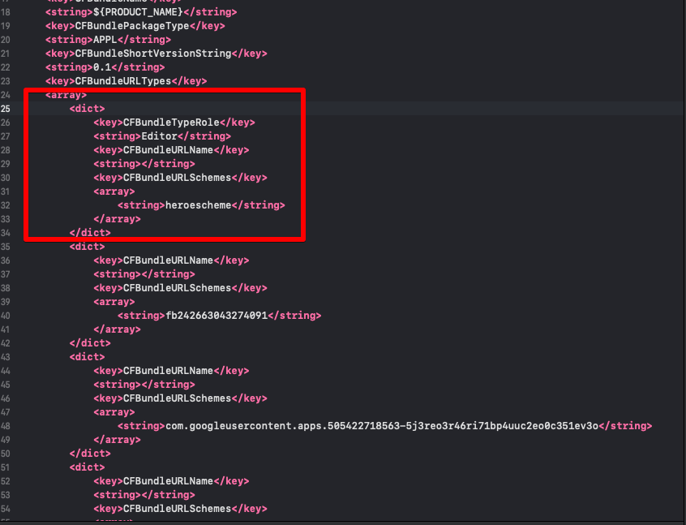
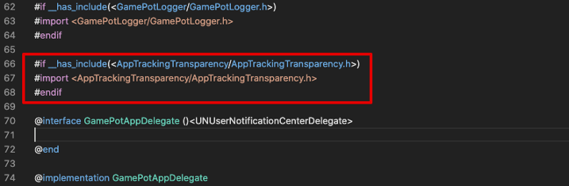
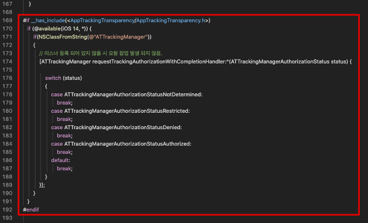

# Troubleshooting

## 64-bit 환경에서 빌드 할 때, 네아로(네이버 아이디 로그인)시도 시 크래시가 발생. (API 28 이상의 Android 빌드)

⒈ `AndroidManifest.xml` 파일에 다음 코드를 추가

> Unity의 경우, /Assets/Plugins/Android/AndroidManifest.xml를 수정

```java
// TODO : <application> 태그 안에 넣어주세요.

<application>

...

   <uses-library android:name="org.apache.http.legacy" android:required="false" />

...

</application>
```

ref.) 해당 부분이 패치된 라이브러리의 교체로 대신할 수 있습니다. \[[gamepot-channel-naver.aar](https://kr.object.ncloudstorage.com/itsb/patch/gamepot-channel-naver.aar)\]


## 플레이 스토어 APK 업로드 시, com.nhncorp.nelo2.android.util 암호화패턴 보안알림 발생

  게임팟 SDK 3.3.0 부터는  nelo2-android-sdk-https-0.12.0.aar / nelo2-android-sdk-common-0.12.0.aar 가 탑재가 되어 있으며 위 이슈는 해결이 되었습니다.

  다만 변경된 네이버 클라우드 ELSA 라이브러리로 인해 minSDK 버전이 19이상으로 해야 합니다.


[게임팟 SDK 3.2.0 이하 버전 기준]

⒈ logging 기능 관련 라이브러리가 obsolete여서 발생하는 문제

⒉ (대시보드 로그 기능을 사용하지 않을 경우) Gamepot SDK의 라이브러리 중, 아래 목록의 라이브러리를 제거

 |||
 | :------  | :------  |
 | 1. gamepot-logger.aar |
 | 2. nelo2-android-sdk-common-0.10.2.jar |
 | 3. nelo2-android-sdk-https-0.10.2.jar |
 |||


## IOS 빌드시 오류 발생 

오류 예제 :

error: Building for iOS, but the linked and embedded framework 'XXXXXX.framework' was built for iOS + iOS Simulator.

위 경우는 'XXXXXX.framework'가 i386 x86_64 Archive 정보를 가지고 있어서 발생하는 부분입니다. 

```text
(허용되지 않은 아키텍쳐를 제거하는 코드 입니다.)  

만일 NaverThirdPartyLogin.framework가 문제였다면 아래와 같이 작업하여 제거 후 빌드를 진행합니다.

lipo -remove x86_64 ./NaverThirdPartyLogin.framework/NaverThirdPartyLogin -o ./NaverThirdPartyLogin.framework/NaverThirdPartyLogin
lipo -remove i386 ./NaverThirdPartyLogin.framework/NaverThirdPartyLogin -o ./NaverThirdPartyLogin.framework/NaverThirdPartyLogin
```

## Line i386 x86_64 IOS Archive 업로드 이슈

⒈ 콘솔(터미널)에서 LineSDK.framework 파일 위치로 이동 후, 아래 명령어를 하나씩 입력 해주세요.

```text
(허용되지 않은 아키텍쳐를 제거하는 코드 입니다.) 

lipo -remove x86_64 ./LineSDK.framework/LineSDK -o ./LineSDK.framework/LineSDK
lipo -remove i386 ./LineSDK.framework/LineSDK -o ./LineSDK.framework/LineSDK
lipo -remove x86_64 ./LineSDKObjC.framework/LineSDKObjC -o ./LineSDKObjC.framework/LineSDKObjC
lipo -remove i386 ./LineSDKObjC.framework/LineSDKObjC -o ./LineSDKObjC.framework/LineSDKObjC
```

## Twitter i386 x86_64 IOS 빌드 이슈

⒈ 콘솔(터미널)에서 TwitterCore.framework 파일 위치로 이동 후, 아래 명령어를 하나씩 입력 해주세요.

```text
(허용되지 않은 아키텍쳐를 제거하는 코드 입니다.)  

lipo -remove x86_64 ./TwitterCore.framework/TwitterCore -o ./TwitterCore.framework/TwitterCore
lipo -remove i386 ./TwitterCore.framework/TwitterCore -o ./TwitterCore.framework/TwitterCore
lipo -remove x86_64 ./TwitterKit.framework/TwitterKit -o ./TwitterKit.framework/TwitterKit
lipo -remove i386 ./TwitterKit.framework/TwitterKit -o ./TwitterKit.framework/TwitterKit
```

## AdbrixRM i386 x86_64 IOS 빌드 이슈

⒈ 콘솔(터미널)에서 AdBrixRM.framework 파일 위치로 이동 후, 아래 명령어를 하나씩 입력 해주세요.

```text
(허용되지 않은 아키텍쳐를 제거하는 코드 입니다.) 

lipo -remove x86_64 ./AdBrixRM.framework/AdBrixRM -o ./AdBrixRM.framework/AdBrixRM
lipo -remove i386 ./AdBrixRM.framework/AdBrixRM -o ./AdBrixRM.framework/AdBrixRM
```


## 네아로 NaverThirdPartyLogin.framework i386 x86_64 이슈
```text
(허용되지 않은 아키텍쳐를 제거하는 코드 입니다.) 

lipo -remove x86_64 ./NaverThirdPartyLogin.framework/NaverThirdPartyLogin -o ./NaverThirdPartyLogin.framework/NaverThirdPartyLogin
lipo -remove i386 ./NaverThirdPartyLogin.framework/NaverThirdPartyLogin -o ./NaverThirdPartyLogin.framework/NaverThirdPartyLogin
```


## Unity 2018.4.4이상, Unity 2019.2.0이상에서 Android 빌드 이슈

⒈ `mainTemplate.gradle` 파일을 아래와 같이 수정

> TODO 항목을 참고하세요.

```java
// TODO : GradleVersion이 사용되는 곳을 모두 제거합니다.

buildscript {
    repositories {
        // if (GradleVersion.current() >= GradleVersion.version("4.2")) {
            google()
            jcenter()
        // } else {
        //     jcenter()
        // }
    }
    dependencies {
        // if (GradleVersion.current() < GradleVersion.version("4.0")) {
        //     classpath 'com.android.tools.build:gradle:2.1.0'
        // } else if (GradleVersion.current() < GradleVersion.version("4.2")) {
        //     classpath 'com.android.tools.build:gradle:2.3.0'
        // } else {
                  // TODO : Android gradle plugin version을 3.4.0버전으로 변경합니다.
            classpath 'com.android.tools.build:gradle:3.4.0'
        // }
        classpath 'com.google.gms:google-services:3.2.0'
    }
}

allprojects {
   repositories {
        flatDir {
            dirs 'libs'
        }

        // if (GradleVersion.current() >= GradleVersion.version("4.2")) {
            google()
            jcenter()
        // } else {
        //     jcenter()
        // }
   }
}


dependencies {
    // if (GradleVersion.current() >= GradleVersion.version("4.2")) {
        implementation fileTree(include: ['*.jar'], dir: 'libs')
        implementation project(":GamePotResources")
        implementation project(':Firebase')
    // } else {
    //     compile fileTree(include: ['*.jar'], dir: 'libs')
    //     compile project(":GamePotResources")
    //     compile project(':Firebase')
    // }
}

fileTree(dir: 'libs', include: ['*.aar'])
        .each { File file ->
    // println file.name
    // if (GradleVersion.current() >= GradleVersion.version("4.2")) {
        dependencies.add("implementation", [name: file.name.lastIndexOf('.').with { it != -1 ? file.name[0..<it] : file.name }, ext: 'aar'])
    // } else {
    //     dependencies.add("compile", [name: file.name.lastIndexOf('.').with { it != -1 ? file.name[0..<it] : file.name }, ext: 'aar'])
    // }
}
```

⒉ Firebase 관련 파일을 수정

- ⒈ [링크](https://kr.object.ncloudstorage.com/gamepot/Firebase_patch.zip)를 통해 패치파일을 다운로드

- ⒉ 아래와 같이 파일 복사

    ```java
    /Firebase_patch/Assets/Firebase/Editor
     위 경로의 파일을 아래 경로에 복사
    -> {unity project}/Assets/Firebase/Editor

    {unity project}/Assets/PlayServicesResolver/Editor
     위 경로의 파일을 모두 삭제 후 아래 경로에 파일을 복사
    -> /Firebase_patch/Assets/PlayServicesResolver/Editor
    ```

- ⒊ /Assets/Plugins/Android/Firebase/res 폴더가 생성되지 않았다면 Unity 재실행


## (Unity) 네이버 플러그 SDK (plug_sdk_4_4_7.unitypackage.unitypackage 이상) 를 적용 시, IOS 빌드 오류 발생.

- [링크](https://kr.object.ncloudstorage.com/itsb/patch/Patch_GamePotNaverLogin_20200508.zip)를 통해 패치파일을 다운로드 및 압축 해제  (GamePotNaver.framework)

- 다운받은 패치(GamePotNaver.framework)를 기존 경로의 framework와 교체해주세요.

## (IOS) 네이버 플러그 SDK를 적용 시, 웹뷰를 통해 네이버 아이디 로그인 불가. 

- XCode에서 info.plist를 열어주세요.

 - 다음과 같이, Naver Cafe의 URLScheme 값을 해당 Array의 가장 첫번째 인덱스로 올려 저장한 다음 로그인 정상동작을 확인해주세요.  
 



## (Unity) IDFA 허용 여부 확인 팝업 제거 (IOS 13 이하) 

- (유니티 프로젝트, 혹은 XCode 프로젝트에서) GamePotAppDelegate.mm을 열어주세요.
    
    경로
        - (Unity Project) Assets/Plugins/IOS/Source/GamePotAppDelegate.mm
        - (XCode) Libraries/Plugins/IOS/Source/GamePotAppDelegate.mm

 - 다음과 같이, AppTrackingTransparency를 초기화하는 부분을 제거해주세요.
 





## (Unity) 네이버 라운지 SDK 적용 ( NaverSDK Ver 1.1.1 기준 설명)

참고 URL : https://navergame.gitbook.io/naver-game/naver-game-sdk-faq-1#unity-android-class-duplication-exception

- 유니티 플러그인 패키지 적용시 navergame-sdk-1.1.1.aar 파일 미포함 또는 삭제 처리 진행

../Assets/NGSDK/Plugins/Android/navergame-sdk-1.1.1.aar

- 안드로이드 네이티브 네이버 라운지 SDK 라이브러리 탑재

../Assets/Plugins/Android/navergame-sdk-gradle-1.1.1.aar 

- mainTemplate.gradle 파일 수정 (네이버 라운지 SDK에서 사용되는 라이브러리 추가)

```text
dependencies {
..
implementation 'androidx.multidex:multidex:2.0.1'
implementation "androidx.recyclerview:recyclerview:1.2.0"
implementation "androidx.viewpager2:viewpager2:1.0.0"
implementation "com.squareup.retrofit2:retrofit:2.6.4"
```

- ../Assets/Plugins/Android/libs 폴더에 중복된 라이브러리 삭제 ( 삭제 리스트 )

```text
../Assets/Plugins/Android/libs/activity-1.0.0.aar
../Assets/Plugins/Android/libs/annotation-1.1.0.jar
../Assets/Plugins/Android/libs/collection-1.1.0.jar
../Assets/Plugins/Android/libs/core-1.3.0.aar
../Assets/Plugins/Android/libs/core-common-2.1.0.jar
../Assets/Plugins/Android/libs/core-runtime-2.0.0.aar
../Assets/Plugins/Android/libs/customview-1.0.0.aar
../Assets/Plugins/Android/libs/fragment-1.1.0.aar
../Assets/Plugins/Android/libs/lifecycle-common-2.1.0.jar
../Assets/Plugins/Android/libs/lifecycle-livedata-2.0.0.aar
../Assets/Plugins/Android/libs/lifecycle-livedata-core-2.0.0.aar
../Assets/Plugins/Android/libs/lifecycle-runtime-2.1.0.aar
../Assets/Plugins/Android/libs/lifecycle-viewmodel-2.1.0.aar
../Assets/Plugins/Android/libs/loader-1.0.0.aar
../Assets/Plugins/Android/libs/okhttp-4.9.1.jar
../Assets/Plugins/Android/libs/okio-2.8.0.jar
../Assets/Plugins/Android/libs/savedstate-1.0.0.aar
../Assets/Plugins/Android/libs/versionedparcelable-1.1.0.aar
../Assets/Plugins/Android/libs/viewpager-1.0.0.aar
../Assets/Plugins/Android/libs/retrofit-2.5.0.aar
```

## (Unity) GoogleMobileAds SDK 적용 ( GoogleMobileAds-v6.1.2 기준 설명)

AdMob SDK(Unity)의 경우, 유니티 패키지를 import 후 Unity Play Services Resolver 기능을 사용해야 합니다.

Unity에서 Assets > Play Services Resolver > Android Resolver > Settings 메뉴 중
Use Jetifier / Enable Auto-Resolution 선택해 주십시오.
Enable Resolution On Build / Enable Auto-Resolution / Patch gradle Template.properties 항목은 선택 해제한 상태에서 Resolver를 진행 해주세요.

이후 중복 라이브러리 오류의 경우 둘 중에 한곳의 라이브러리를 제거하시면 되십니다. 

중복되는 라이브러리 파일 목록 : 
```text
..Assets/Plugins/Android/libs/annotation-1.1.0.jar
..Assets/Plugins/Android/libs/browser-1.0.0.aar
..Assets/Plugins/Android/libs/core-common-2.1.0.jar
..Assets/Plugins/Android/libs/core-runtime-2.0.0.aar
..Assets/Plugins/Android/libs/core-1.3.0.aar
..Assets/Plugins/Android/libs/coordinatorlayout-1.0.0.aar
..Assets/Plugins/Android/libs/collection-1.1.0.jar
..Assets/Plugins/Android/libs/asynclayoutinflater-1.0.0.aar
..Assets/Plugins/Android/libs/fragment-1.1.0.aar
..Assets/Plugins/Android/libs/drawerlayout-1.0.0.aar
..Assets/Plugins/Android/libs/documentfile-1.0.0.aar
..Assets/Plugins/Android/libs/customview-1.0.0.aar
..Assets/Plugins/Android/libs/cursoradapter-1.0.0.aar
..Assets/Plugins/Android/libs/loader-1.0.0.aar
..Assets/Plugins/Android/libs/lifecycle-viewmodel-2.1.0.aar
..Assets/Plugins/Android/libs/lifecycle-runtime-2.1.0.aar
..Assets/Plugins/Android/libs/lifecycle-livedata-2.0.0.aar
..Assets/Plugins/Android/libs/lifecycle-common-2.1.0.jar
..Assets/Plugins/Android/libs/legacy-support-core-utils-1.0.0.aar
..Assets/Plugins/Android/libs/legacy-support-core-ui-1.0.0.aar
..Assets/Plugins/Android/libs/interpolator-1.0.0.aar
..Assets/Plugins/Android/libs/viewpager-1.0.0.aar
..Assets/Plugins/Android/libs/versionedparcelable-1.1.0.aar
..Assets/Plugins/Android/libs/swiperefreshlayout-1.0.0.aar
..Assets/Plugins/Android/libs/sqlite-framework-2.0.1.aar
..Assets/Plugins/Android/libs/sqlite-2.0.1.aar
..Assets/Plugins/Android/libs/slidingpanelayout-1.0.0.aar
..Assets/Plugins/Android/libs/print-1.0.0.aar
..Assets/Plugins/Android/libs/localbroadcastmanager-1.0.0.aar
..Assets/Plugins/Android/libs/lifecycle-livedata-core-2.0.0.aar
..Assets/Plugins/Android/libs/play-services-basement-17.5.0.aar
..Assets/Plugins/Android/libs/play-services-ads-identifier-17.0.0.aar
..Assets/Plugins/Android/libs/play-services-measurement-sdk-api-18.0.1.aar
..Assets/Plugins/Android/libs/play-services-measurement-impl-18.0.1.aar
..Assets/Plugins/Android/libs/play-services-measurement-base-18.0.1.aar
..Assets/Plugins/Android/libs/play-services-tasks-17.2.0.aar
..Assets/Plugins/Android/libs/play-services-measurement-18.0.1.aar

..Assets/Plugins/Android/libs/play-services-measurement-sdk-18.0.1.aar
..Assets/Plugins/Android/libs/play-services-measurement-api-18.0.1.aar

..Assets/Plugins/IOS/Frameworks/nanopb.framework
```

## (Unity) appsflyer SDK 적용 ( appsflyer-v6.3.2 기준 설명)

다른 SDK도 동일합니다만 UnityAppController class는 빌드하는 프로젝트에서 하나의 파일에서만 상속을 받아야 합니다. 

게임팟의 유니티 플러그인 패키지를 탑재하는 경우 기본적으로 GamePotAppDelegate.h에서 상속을 받고 있습니다. 

appsflyer 나 Singular 같은 광고툴의 경우 해당 라이브러리도 UnityAppController 를 상속을 받아 게임팟 SDK 동작이 안 될 수가 있습니다 

하나의 파일에서만 상속받도록 수정하여 사용하셔야 합니다. 

예시)
[appsflyer-v6.3.2 기준 패치](https://xyuditqzezxs1008973.cdn.ntruss.com/patch/fixed_appsflyer632.zip)


## (Unity) Firebase SDK 별도로 적용할 때 ( Firebase Unity 8.7.0 기준 설명)

GAMEPOT 유니티 플러그인 패키지에는 일부 Firebase SDK가 있어 별도의 Firebase SDK를 탑재시 라이브러리 중복에 의한 오류가 발생합니다.

Firebase Unity SDK(FirebaseAnalytics.unitypackage / FirebaseMessaging.unitypackage + 추가하고자하는 Firebase SDK)를 import 후 Unity Play Services Resolver 기능을 사용해야 합니다.

Unity에서 Assets > Play Services Resolver > Android Resolver > Settings 메뉴 중

Use Jetifier / Enable Auto-Resolution 선택해 주십시오.

Enable Resolution On Build / Enable Auto-Resolution / Patch gradle Template.properties 항목은 선택 해제한 상태에서 Resolver를 진행 해주세요.

1. 중복되는 라이브러리 파일 삭제 필요: 
```text
../Assets/Plugins/Android/libs/viewpager-1.0.0.aar 
../Assets/Plugins/Android/libs/versionedparcelable-1.1.0.aar 
../Assets/Plugins/Android/libs/transport-runtime-2.2.5.aar 
../Assets/Plugins/Android/libs/transport-backend-cct-2.3.3.aar 
../Assets/Plugins/Android/libs/transport-api-2.2.1.aar 
../Assets/Plugins/Android/libs/swiperefreshlayout-1.0.0.aar 
../Assets/Plugins/Android/libs/slidingpanelayout-1.0.0.aar 
../Assets/Plugins/Android/libs/print-1.0.0.aar 
../Assets/Plugins/Android/libs/play-services-tasks-17.2.0.aar 
../Assets/Plugins/Android/libs/play-services-stats-17.0.0.aar 
../Assets/Plugins/Android/libs/play-services-measurement-sdk-api-18.0.1.aar 
../Assets/Plugins/Android/libs/play-services-measurement-sdk-18.0.1.aar 
../Assets/Plugins/Android/libs/play-services-measurement-impl-18.0.1.aar 
../Assets/Plugins/Android/libs/play-services-measurement-base-18.0.1.aar 
../Assets/Plugins/Android/libs/play-services-measurement-api-18.0.1.aar 
../Assets/Plugins/Android/libs/play-services-measurement-18.0.1.aar 
../Assets/Plugins/Android/libs/play-services-cloud-messaging-16.0.0.aar 
../Assets/Plugins/Android/libs/play-services-basement-17.5.0.aar 
../Assets/Plugins/Android/libs/play-services-base-17.5.0.aar 
../Assets/Plugins/Android/libs/play-services-ads-identifier-17.0.0.aar 
../Assets/Plugins/Android/libs/localbroadcastmanager-1.0.0.aar 
../Assets/Plugins/Android/libs/loader-1.0.0.aar 
../Assets/Plugins/Android/libs/lifecycle-viewmodel-2.1.0.aar 
../Assets/Plugins/Android/libs/lifecycle-runtime-2.1.0.aar 
../Assets/Plugins/Android/libs/lifecycle-livedata-core-2.0.0.aar 
../Assets/Plugins/Android/libs/lifecycle-livedata-2.0.0.aar 
../Assets/Plugins/Android/libs/lifecycle-common-2.1.0.jar 
../Assets/Plugins/Android/libs/legacy-support-core-utils-1.0.0.aar 
../Assets/Plugins/Android/libs/legacy-support-core-ui-1.0.0.aar 
../Assets/Plugins/Android/libs/javax.inject-1.jar 
../Assets/Plugins/Android/libs/interpolator-1.0.0.aar 
../Assets/Plugins/Android/libs/fragment-1.1.0.aar 
../Assets/Plugins/Android/libs/firebase-messaging-21.0.1.aar 
../Assets/Plugins/Android/libs/firebase-measurement-connector-18.0.0.aar 
../Assets/Plugins/Android/libs/firebase-installations-interop-16.0.1.aar 
../Assets/Plugins/Android/libs/firebase-installations-16.3.5.aar 
../Assets/Plugins/Android/libs/firebase-iid-interop-17.0.0.aar 
../Assets/Plugins/Android/libs/firebase-iid-21.0.1.aar 
../Assets/Plugins/Android/libs/firebase-encoders-json-17.1.0.aar 
../Assets/Plugins/Android/libs/firebase-encoders-16.1.0.jar 
../Assets/Plugins/Android/libs/firebase-datatransport-17.0.10.aar 
../Assets/Plugins/Android/libs/firebase-core-18.0.1.aar 
../Assets/Plugins/Android/libs/firebase-components-16.1.0.aar 
../Assets/Plugins/Android/libs/firebase-common-19.5.0.aar 
../Assets/Plugins/Android/libs/firebase-annotations-16.0.0.jar 
../Assets/Plugins/Android/libs/firebase-analytics-18.0.1.aar 
../Assets/Plugins/Android/libs/drawerlayout-1.0.0.aar 
../Assets/Plugins/Android/libs/documentfile-1.0.0.aar 
../Assets/Plugins/Android/libs/customview-1.0.0.aar 
../Assets/Plugins/Android/libs/cursoradapter-1.0.0.aar 
../Assets/Plugins/Android/libs/core-runtime-2.0.0.aar 
../Assets/Plugins/Android/libs/core-common-2.1.0.jar 
../Assets/Plugins/Android/libs/core-1.3.0.aar 
../Assets/Plugins/Android/libs/coordinatorlayout-1.0.0.aar
../Assets/Plugins/Android/libs/collection-1.1.0.jar 
../Assets/Plugins/Android/libs/asynclayoutinflater-1.0.0.aar 
../Assets/Plugins/Android/libs/annotation-1.1.0.jar
../Assets/Plugins/IOS/Frameworks/nanopb.framework 
../Assets/Plugins/IOS/Frameworks/FirebaseNanoPB.framework 
../Assets/Plugins/IOS/Frameworks/FirebaseMessaging.framework 
../Assets/Plugins/IOS/Frameworks/FirebaseInstanceID.framework 
../Assets/Plugins/IOS/Frameworks/FirebaseCoreDiagnostics.framework 
../Assets/Plugins/IOS/Frameworks/FirebaseCore.framework 
../Assets/Plugins/IOS/Frameworks/FirebaseAnalytics.framework
```


2. ../Assets/Plugins/Android/AndroidManifest.xml 내 FCM 관련 코드가 적용되어 있는지 확인

```text
....
</activity>

<!-- FCM [start]-->
<service android:name="io.gamepot.common.GamePotFCMIDService">
<intent-filter>
    <action android:name="com.google.firebase.INSTANCE_ID_EVENT"/>
</intent-filter>
</service>
<service android:name="io.gamepot.common.GamePotFCMService">
<intent-filter>
    <action android:name="com.google.firebase.MESSAGING_EVENT"/>
</intent-filter>
</service>
<!-- FCM [End]-->

...
<meta-data android:name="android.max_aspect" android:value="2.1" />

```text