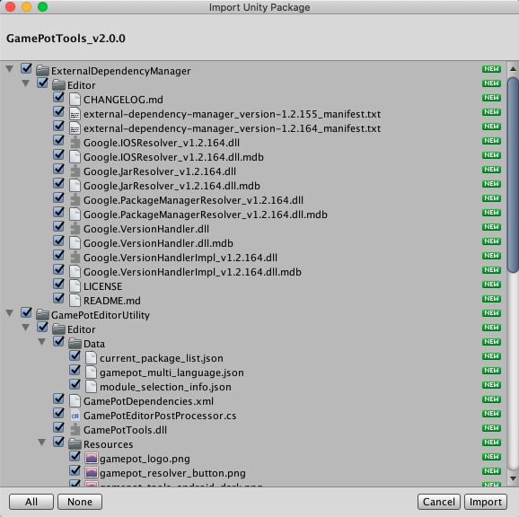
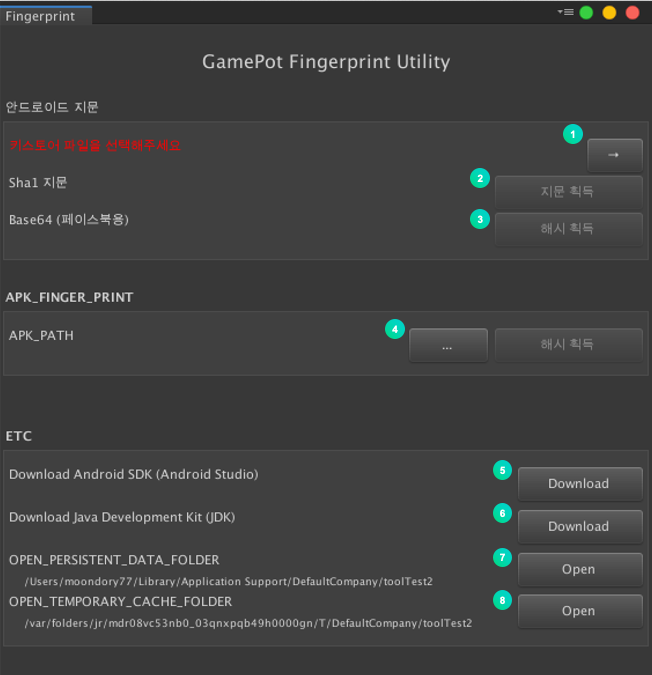

---
search:
  keyword:
    - gamepot
---

# Unitools

NAVER CLOUD PLATFORM의 GAMEPOT에서 제공하는 유니툴즈에 대한 가이드입니다.

## GAMEPOT 유니툴즈 소개

**Q. 유니툴즈란?**

유니티에 Gamepot을 적용할 때 의존성패키지를 한눈에 관리할 수 있는 Unity Plugin Tools 입니다. 유저인증, 인앱구매 등에 필요한 모듈 및 라이브러리를 한눈에 관리할 수 있습니다. 플랫폼별로 의존성 패키지 현황을 진단하고 설치, 삭제할 수 있습니다.

## 1. 시작하기

### Step 1. Unitools 플러그인 가져오기

생성된 GAMEPOT 대시보드에 접속한 후 최신 플러그인을 다운로드합니다.
 **기타 > SDK 다운로드 > Unitools 메뉴**

### Step 2. 플러그인 가져오기

> Unity 버전 2017.4.x 이상이여야 합니다.

**Assets &gt; Import Package &gt; Custom Package** 메뉴에서 다운로드한 `GamePotTools_xxxx.unitypackage `파일을 선택합니다.

플러그인을 확인하고 import하면 해당 프로젝트에 추가됩니다.

### Step 3. Android/iOS

GamePot Tools의 경우, 각 플랫폼에 대한 namespace를 요구하기 때문에 Android/iOS 빌드 환경이 셋팅된 상태에서만 정상 작동합니다. 유니티에디터 상에서 **File > Build Settings > Android/iOS** 모듈이 모두 download 된 상태인지 확인해주세요.

## 2. 사용하기

**Window > GamePot Tools** 탭을 클릭하여 유니툴즈를 실행할 수 있습니다.

① 유니툴즈의 버전을 확인하고 최신 버전 업데이트가 있을 시 업데이트를 실행합니다.

② 게임팟 가이드를 웹페이지에서 확인할 수 있습니다.

③ 네이버 클라우드 플랫폼 가이드를 웹페이지에서 확인할 수 있습니다.

④ 최신버전의 GamePot Sdk를 다운로드 합니다.

### 안드로이드 지문 도구

현재 프로젝트내에 설정된 KetStore로부터 각종 Fingerprint를 획득합니다. 

**키 도구** 버튼을 클릭합니다.

> 유니티 플랫폼 설정이 Android로 변경되어 있어야 합니다.

① 현재 프로젝트의 PlayerSetting에 설정된 KeyStore 정보를 확인합니다.

② Sha1 지문을 획득합니다.

③ Base64 해시를 획득합니다.

④ APK파일 경로를 입력하고 해시를 획득합니다.

⑤ 안드로이드 스튜디오 설치 페이지로 이동합니다.

⑥ JDK 다운로드 페이지로 이동합니다.

⑦ 삭제한 라이브러리가 있는 폴더로 이동합니다.

⑧ 캐시가 있는 폴더로 이동합니다.

### 게임팟 설정 도구

GamePot의 각종 셋팅값을 관리합니다.

#### Android

Android Bulid에 관한 Gamepot 프로젝트 환경을 설정합니다. 
`Android > mainTemplate.gradle`에 반영됩니다.

#### IOS

IOS Bulid에 관한 Gamepot 프로젝트 환경을 설정합니다.
`IOS > GamePotConfig-info.plist`에 반영됩니다.

### 모듈 설치

플랫폼별 모듈 및 라이브러리를 관리합니다.

① 플랫폼을 선택할 수 있습니다.

② 의존성 패키지를 진단 및 관리할 라이브러리 목록을 선택할 수 있습니다.

③ 해당 라이브러리의 의존성 패키지 목록을 확인할 수 있습니다.

④ 선택한 라이브러리에 대해 프로젝트 내 의존성 패키지 현황을 진단하고 설치 혹은 제거합니다.

#### 패키지 설치

 - 패키지가 설치되어 있지 않아 서버에서 다운로드 됩니다.

 - 중복된 패키지가 있습니다. 선택한 패키지가 적용되고 나머지는 삭제됩니다.

 - 최신버전의 패키지가 설치되어 있습니다. 현재 상태를 유지합니다.
 '선택됨' 버튼을 클릭하여 선택을 해제하면 기존 패키지를 삭제하고 서버에서 다시 다운로드합니다.

설치 버튼을 클릭하면 다운로드가 진행됩니다.

### 언어변경

유니툴즈의 언어가 선택한 언어로 변경됩니다. 영어, 한국어, 일본어, 중국어를 지원합니다.

