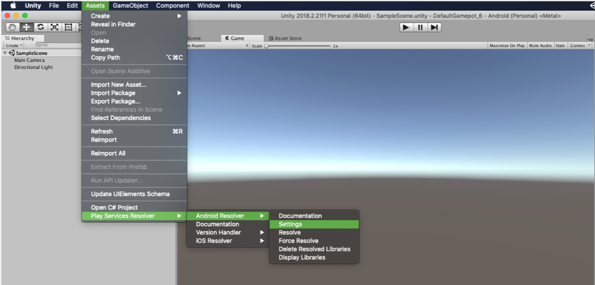
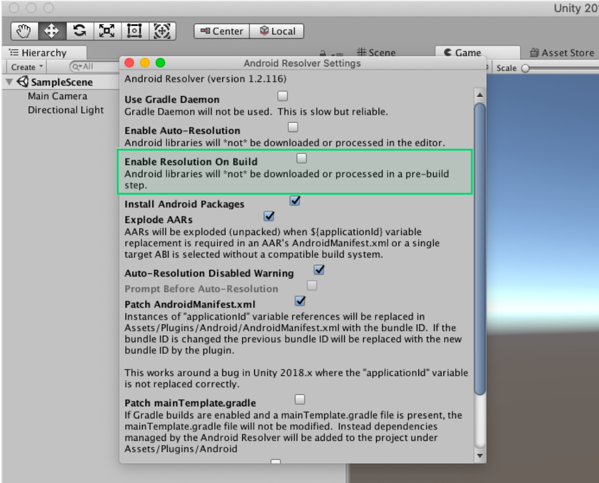
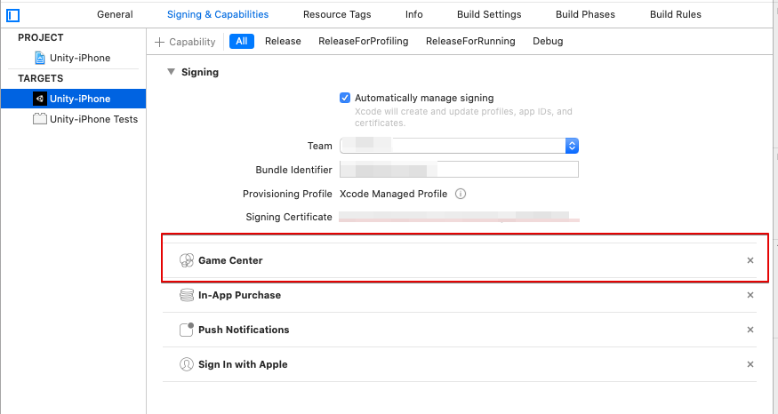
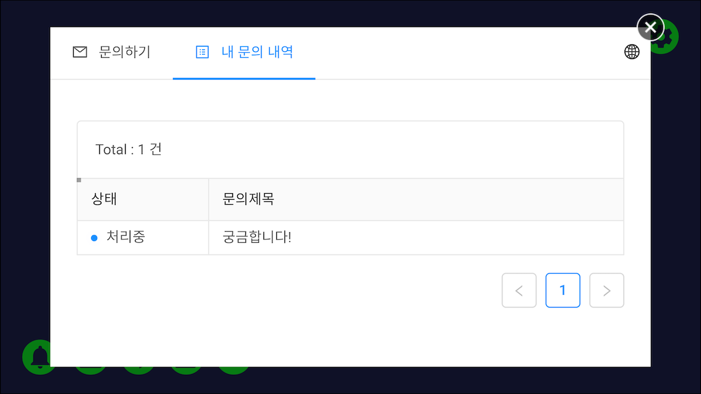

---
search:
  keyword: ['gamepot']
---

# Unity SDK

## 1. 시작하기

### Step 1. GAMEPOT 플러그인 가져오기

생성된 GAMEPOT 대시보드에 접속한 후 최신 플러그인을 다운로드합니다.

### Step 2. 플러그인 가져오기

**Assets &gt; Import Package &gt; Custom Package** 메뉴에서 다운로드한 GamePotUnityPlugin-xxxx.unitypackage 파일을 선택합니다.


플러그인을 확인하고 import하면 해당 프로젝트에 추가됩니다.


### Step 3. Android

#### 기본 환경 설정

```d
minSdkVersion : API 17 (Jelly Bean, 4.2)
```

**Gradle 환경 설정 방법**

/Assets/Plugin/Android/mainTemplate.gradle 파일을 에디터로 엽니다.

```java
...
android {
    ...
    defaultConfig {
        ...
        resValue "string", "gamepot_project_id", "" // required
        resValue "string", "gamepot_store", "google" // required
        resValue "string", "gamepot_app_title","@string/app_name" // required (fcm)
        resValue "string", "gamepot_push_default_channel","Default" // required (fcm)
        resValue "string", "facebook_app_id", "0" // optional (facebook)
        resValue "string", "fb_login_protocol_scheme", "fb0" // optional (facebook)
        // resValue "string", "gamepot_elsa_projectid", "" // optional (ncp elsa)
    }
    ...
}
```

아래의 필수 값을 찾아 수정합니다. 아래 값들을 수정해야만 정상적으로 작동됩니다.

```java
resValue "string", "[key]", "[value]"
```

| 값                           | 설명                                                                                           |
| :--------------------------- | :--------------------------------------------------------------------------------------------- |
| gamepot_project_id           | GAMEPOT에서 발급받은 프로젝트 아이디를 입력해 주세요.                                          |
| gamepot_store                | 스토어값\(`google` 또는 `one` 또는 `galaxy`\)                                                  |
| gamepot_app_title            | 앱 제목 \(FCM\)                                                                                |
| gamepot_push_default_channel | 등록된 기본 채널 이름 \(Default\) - 변경하지 마세요.                                           |
| facebook_app_id              | 페이스북 발급 받은 앱ID                                                                        |
| fb_login_protocol_scheme     | 페이스북에서 발급 받은 protocol scheme fb\[app_id\]                                            |
| gamepot_elsa_projectid       | NCLOUD ELSA 사용시 프로젝트ID \([자세히 보기](https://www.ncloud.com/product/analytics/elsa)\) |

**노티바에 푸시 아이콘 변경 방법**


푸시 수신 시 Android Notification bar에 보여줄 Small icon은 SDK 내부에서 기본 이미지로 노출하며 직접 추가할 수도 있습니다.

직접 추가하려면 `drawable` 폴더별로 이미지를 넣어야 합니다.\([Android Asset Studio](http://romannurik.github.io/AndroidAssetStudio/icons-notification.html#source.type=clipart&source.clipart=ac_unit&source.space.trim=1&source.space.pad=0&name=ic_stat_gamepot_small)를 이용해 제작하면 자동으로 폴더별로 이미지가 제작되어 편리합니다.\)

이미지 파일명은 ic_stat_gamepot_small이어야 합니다.

| 폴더명                                                         | 크기  |
| :------------------------------------------------------------- | :---- |
| /Assets/Plugins/Android/GamePotResources/res/drawable-mdpi/    | 24x24 |
| /Assets/Plugins/Android/GamePotResources/res/drawable-hdpi/    | 36x36 |
| /Assets/Plugins/Android/GamePotResources/res/drawable-xhdpi/   | 48x48 |
| /Assets/Plugins/Android/GamePotResources/res/drawable-xxhdpi/  | 72x72 |
| /Assets/Plugins/Android/GamePotResources/res/drawable-xxxhdpi/ | 96x96 |

**Screen Orientation 설정 방법**

/Assets/Plugin/Android/AndroidManifest.xml 파일을 에디터로 엽니다.

```markup
...
    <activity android:screenOrientation="sensorLandscape">
      <intent-filter>
        <action android:name="android.intent.action.MAIN" />
          ...
      </intent-filter>
    </activity>
...
```

Main Activity에 screenOrientation을 추가 후 게임에 맞게 `sensorLandscape` 혹은 `sensorPortrait` 를 입력하세요.

**Android Resolver Settings**

`Assets > Play Services Resolver > Android Resolver > Settings` 메뉴로 이동합니다.



`Enable Resolution On Build 체크박스를 해제` 해주세요.



**Unity Build Settings**

`File > Build Settings > Build System` 메뉴에서 Gradle을 선택합니다.


### Step 4. iOS

> GameCenter Login을 `사용하지 않으실 경우`에는 아래 위치해서 해당 파일을 삭제 해주세요.
> &gt; `Assets/Plugins/IOS/Frameworks/GamePotGameCenter.framework`
> 해당 라이브러리가 포함된 경우 `Capabilities설정에서 GameCenter를 필히 활성화` 해주셔야 합니다.

구글 파이어베이스에서 다운로드한 `GoogleService-Info.plist` 파일을 `/Assets/Plugins/IOS/`에 복사합니다.

`/Assets/Plugin/IOS/GamePotConfig-Info.plist` 내에 필요한 환경 변수를 추가해 주세요.


| 환경 변수                     | 설명                                                  |
| :---------------------------- | :---------------------------------------------------- |
| gamepot_project_id            | GAMEPOT에서 발급받은 프로젝트 아이디를 입력해 주세요. |
| gamepot_facebook_app_id       | 페이스북 발급 받은 앱ID                               |
| gamepot_facebook_display_name | 페이스북에 보여지는 이름                              |
| gamepot_google_app_id         | GoogleService-Info 파일의 CLIENT_ID 값                |
| gamepot_google_url_schemes    | GoogleService-Info 파일의 REVERSED_CLIENT_ID 값       |
| gamepot_elsa_projectid        | NCLOUD ELSA 사용시 프로젝트ID                         |

scenes를 추가한 후에 **File &gt; Build Settings &gt; Build And Run**을 실행하면 완료됩니다.


XCode 빌드 후

Targets &gt;&gt; Info &gt;&gt; Custom iOS Target Properties 내에 아래 `사용자 권한 획득 옵션을 추가` 부탁드립니다.

해당 사용자 권한은 GamePot 고객센터 내의 파일 업로드 기능에서 사용 됩니다.

```text
NSCameraUsageDescription
NSPhotoLibraryUsageDescription
```

iOS 14 이상 버전

iOS 14 버전부터 IDFA 값 획득 시 사용자에게 권한을 획득해야만

IDFA 값 획득이 가능하도록 변경되었습니다.

따라서 IDFA 값 획득 시 사용자에게 권한 획득하는 팝업을 사용하신다면
Targets &gt;&gt; Info &gt;&gt; Custom iOS Target Properties 내에 아래 사용자 권한 획득 옵션을 추가 부탁드립니다.

> 2020.09.11<br/>
> Apple에서 IDFA 값 획득 시 사용자에게 권한 획득하는 팝업 필수 적용은 2021년 초까지 연기되었습니다.<br/>
> 아래 링크 참고 부탁드립니다.<br/> > https://developer.apple.com/news/?id=hx9s63c5

```text
NSUserTrackingUsageDescription
```

## 2. 초기화

게임을 시작할때 로드되는 첫 장면에 사용되는 개체에 다음 코드를 추가합니다.

```csharp
using GamePotUnity;
public class GamePotLoginSampleScene : MonoBehaviour {
    void Awake() {
        GamePot.initPlugin();
    }
    void Start () {
        GamePot.setListener(  GamePotInterface.cs 상속받은 class );
         // ex) GamePot.setListener(new GamePotSampleListener());
    }

}

ex)
public class GamePotSampleListener : MonoBehaviour , IGamePot {
    ....
}
```

## 3. 오류 코드

```csharp
public class NError
{
    // 알 수 없는 Error
    public static readonly int CODE_UNKNOWN_ERROR           = 0;
    // 초기화 실패
    public static readonly int CODE_NOT_INITALIZE           = 1;
    // 파라미터가 올바르지 않은 경우
    public static readonly int CODE_INVAILD_PARAM           = 2;
    // 멤버아이디 데이터가 없을때
    public static readonly int CODE_MEMBERID_IS_EMPTY       = 3;
    // 로그인이 되지 않은 상태
    public static readonly int CODE_NOT_SIGNIN              = 4;
    // 네트워크 모듈이 초기화되지 않았을 때
    public static readonly int CODE_NETWORK_MODULE_NOT_INIT = 3000;
    // 네트워크 연결 오류 및 타임아웃 발생 시
    public static readonly int CODE_NETWORK_ERROR           = 3001;
    // server-side에서 발생하는 오류
    public static readonly int CODE_SERVER_ERROR            = 4000;
    // http response code가 성공이 아닌 경우
    public static readonly int CODE_SERVER_HTTP_ERROR       = 4001;
    // 네트워크 연결 오류 및 타임아웃 발생 시
    public static readonly int CODE_SERVER_NETWORK_ERROR    = 4002;
    // 서버에서 받은 데이터를 파싱할 때 오류
    public static readonly int CODE_SERVER_PARSING_ERROR    = 4003;
    // 결제에서 알 수 없는 오류 발생 및 스토어 측에서 Error를 전달할 때
    public static readonly int CODE_CHARGE_UNKNOWN_ERROR    = 5000;
    // product id를 넣지 않은 경우
    public static readonly int CODE_CHARGE_PRODUCTID_EMPTY  = 5001;
    // product id를 잘못 넣은 경우
    public static readonly int CODE_CHARGE_PRODUCTID_WRONG  = 5002;
    // consume 시 오류
    public static readonly int CODE_CHARGE_CONSUME_ERROR    = 5003;

    // error Code
    public int code { get; set; }
    // error Message
    public string message { get; set; }
}
```

## 4. 로그인 환경 설정

### 구글 로그인

#### Google Firebase Console

1. Google Firebase Console에서 Android용 google-service.json 파일을 다운로드한 후에 `/Assets/Plugins/Android/`에 복사합니다.
2. APK 빌드 시 사용한 Keystore의 SHA-1 값을 Google Firebase console에 추가합니다.
3. Google Firebase Console에서 iOS용 GoogleService-Info.plist 파일을 다운로드한 후에 `/Assets/Plugins/IOS/`에 복사합니다.

**구글 로그인 시 onCancel이 응답하며 로그인이 되지 않는 경우** 아래 내용을 체크해주세요.

1. 위에 적용요청한 google-service.json파일을 정상적으로 적용했는지 확인
2. 빌드 시 사용한 키스토어가 Firebase console에 등록한 sha-1를 추출한 키스토어인지 확인
3. Firebase console에 등록한 패키지명으로 빌드를 했는지 확인

### 페이스북 로그인

#### Facebook Developer Console

APK 빌드 시 사용한 Keystore의 키 해시 값을 페이스북 콘솔에 추가합니다.

#### Android

mainTemplate.gradle 수정

```java
...
defaultConfig {
    resValue "string", "facebook_app_id", "1234567890"
    resValue "string", "fb_login_protocol_scheme", "fb1234567890"
}
...
```

페이스북 개발자 센터에서 발급받은 앱 ID를 `facebook_app_id` 값에 입력하고 `fb_login_protocol_scheme` 값에 `fb{facebook_app_id}`를 입력합니다.

> app_id가 1234567890인 경우 fb1234567890이 `fb_login_protocol_scheme` 값입니다.

#### iOS

/Assets/Plugins/IOS/Frameworks 경로에 아래 프레임 워크를 추가합니다.

FBSDKLoginKit.framework FBSDKCoreKit.framework GamePotFacebook.framework

### APPLE 로그인

> iOS에만 해당하는 기능입니다. (Android의 경우, Web Login 형태로 지원 - 8. 기타 API 참고)

**Xcode &gt; TARGETS &gt; Signing & Capabilities &gt; + Capability &gt; Sign In with Apple을 추가 합니다.**


### 게임센터 로그인

> iOS에만 해당하는 기능입니다.
>
> GameCenter Login을 사용하시는 경우에는 아래 위치해서 이미지와 같이 설정 해주세요.
> &gt; `Assets/Plugins/IOS/etcFrameworks/GamePotGameCenter.framework`


> 해당 라이브러리가 포함된 경우 `Capabilities설정에서 GameCenter를 필히 활성화` 해주셔야 합니다.

**Xcode &gt; Build Phases &gt; Linked Binary With Libraries** 내에 Gamekit.framework 를 추가합니다.


**Xcode &gt; TARGETS &gt; Signing & Capabilities &gt; + Capability &gt; GameCenter을 추가 합니다.**



## 5. 로그인/로그아웃/탈퇴/검증

### 로그인

별도의 가입 없이 사용자 계정이 생성됩니다. 모든 신원 확인을 위한 MemberId가 생성되며, 생성된 정보는 NUserInfo 구조체에 저장되어 리턴됩니다.

- Case 1

Request:

```csharp
GamePot.login(NCommon.LoginType);
```

Response:

```csharp
// 로그인 성공
public void onLoginSuccess(NUserInfo userInfo)
{
}
// 로그인 실패
public void onLoginFailure(NError error)
{
    // 로그인을 실패하는 경우
    // error.message를 팝업 등으로 유저에게 알려주세요.
}
// 로그인 취소
public void onLoginCancel()
{
    // 사용자가 임의로 로그인을 취소한 경우
}
// 강제 업데이트(스토어 버전과 클라이언트 버전이 다를 경우 호출)
public void onNeedUpdate(NAppStatus status)
{
    // TODO: 파라미터로 넘어온 status 정보를 토대로 팝업을 만들어 사용자에게 알려줘야 합니다.
    // TODO: 아래 두 가지 방식 중 한 가지를 선택하세요.
    // case 1: 인게임 팝업을 통해 개발사에서 직접 UI 구현
    // case 2: SDK의 팝업을 사용(이 경우에는 아래 코드를 호출해 주세요.)
    // GamePot.showAppStatusPopup(status.ToJson());
}
// 점검(대시보드에 점검이 활성화되어 있는 경우 호출)
public void onMainternance(NAppStatus status)
{
       // TODO: 파라미터로 넘어온 status 정보를 토대로 팝업을 만들어 사용자에게 알려줘야 합니다.
    // TODO: 아래 두 가지 방식 중 한 가지를 선택하세요.
    // case 1: 인게임 팝업을 통해 개발사에서 직접 UI 구현
    // case 2: SDK의 팝업을 사용(이 경우에는 아래 코드를 호출해 주세요.)
    // GamePot.showAppStatusPopup(status.ToJson());
}
// 앱 종료
public void onAppClose()
{
    // TODO: 강제 업데이트나 점검 기능을 case 2 방식으로 구현하는 경우
    // TODO: 앱을 강제 종료할 수 있기 때문에 이 곳에 앱을 종료할 수 있도록 구현하세요.
}
```

- Case 2

Request:

```csharp
GamePot.login(NCommon.LoginType, GamePotCallbackDelegate.CB_Login);
```

```csharp
GamePot.login(NCommon.LoginType, (resultState, userInfo, appStatus, error) => {
    switch (resultState)
    {
        case NCommon.ResultLogin.SUCCESS:
        // login success
        break;
        case NCommon.ResultLogin.CANCELLED:
        // login cancel
        break;
        case NCommon.ResultLogin.FAILED:
        // login fail
        break;
        default:
        break;
    }
});
```

LoginType 정의

```csharp
public enum LoginType
{
    NONE,
    GOOGLE,
    GOOGLEPLAY,
    FACEBOOK,
    NAVER,
    GAMECENTER,
    TWITTER,
    LINE,
    APPLE,
    GUEST,
    THIRDPARTYSDK
}
```

NUserInfo 정의

```csharp
public class NUserInfo
{
    public string memberid { get; set; }        // 맴버 ID(유저의 유니크 아이디)
    public string name { get; set; }            // 이름
    public string profileUrl { get; set; }      // 프로필 URL(존재 시)
    public string email { get; set; }           // 이메일(존재 시)
    public string token { get; set; }           // 유저 유효성 체크용 Token (Token Authentication API에서 사용)
    public string userid { get; set; }          // Social ID(google, facebook ...)
}
```

### 로그인 정보 가져오기

```csharp
GamePot.getMemberId(); // 맴버 ID(유저의 유니크 아이디)
```

### 자동 로그인

```csharp
NCommon.LoginType type = GamePot.getLastLoginType();
if(type != NCommon.LoginType.NONE) {
{
    // 마지막에 로그인했던 로그인 타입으로 로그인하는 방식입니다.
    GamePot.login(type);
}
else
{
    // 처음 게임을 실행했거나 로그아웃한 상태. 로그인을 할 수 있는 로그인 화면으로 이동해 주세요.
}
```

### 로그아웃

사용자를 로그아웃시킵니다. 계정이 삭제되지 않으며, 동일한 계정으로 로그인이 가능합니다.

- Case 1

Request:

```csharp
GamePot.logout();
```

Response:

```csharp
/// 로그아웃 성공
public void onLogoutSuccess()
{
}

/// 로그아웃 실패
public void onLogoutFailure(NError error)
{
    // 로그아웃을 실패하는 경우
    // error.message를 팝업 등으로 유저에게 알려주세요.
}
```

- Case 2

Request:

```csharp
GamePot.logout(GamePotCallbackDelegate.CB_Common);
```

```csharp
GamePot.logout((success, error) => {
   if(success)
   {
       // 로그아웃 성공
   }
   else
   {
        // 로그아웃을 실패하는 경우
        // error.message를 팝업 등으로 유저에게 알려주세요.
   }
});
```

### 탈퇴

회원을 탈퇴하며, 복구가 불가능합니다.

- Case 1

Request:

```text
GamePot.deleteMember();
```

Response:

```csharp
/// 회원 탈퇴 성공
public void onDeleteMemberSuccess() {
}

/// 회원 탈퇴 실패
public void  onDeleteMemberFailure(NError error) {
    // 회원 탈퇴를 실패하는 경우
    // error.message를 팝업 등으로 유저에게 알려주세요.
}
```

- Case 2

Request:

```csharp
GamePot.deleteMember(GamePotCallbackDelegate.CB_Common);
```

```csharp
GamePot.deleteMember((success, error) => {
   if(success)
   {
        // 회원 탈퇴 성공
   }
   else
   {
        // 회원 탈퇴를 실패하는 경우
        // error.message를 팝업 등으로 유저에게 알려주세요.
   }
});
```

### 검증

로그인 완료 후 로그인 정보를 개발사 서버에서 GAMEPOT 서버로 전달하면 로그인 검증이 진행됩니다.

자세한 설명은 Server to server api 메뉴에 `Token Authentication` 항목을 참고해주세요.

## 6. 계정 연동

하나의 게임 계정에 복수 개의 소셜계정\(구글/페이스북 등\)을 연결/해제할 수 있는 기능입니다.\(최소 연동 소셜 계정은 1가지입니다.\)

> 연동화면 UI는 개발사에서 구현해주세요.

```csharp
public enum LinkingType
{
    GOOGLEPLAY,
    GAMECENTER,
    GOOGLE,
    FACEBOOK,
    NAVER,
    TWITTER,
    LINE,
    APPLE
}
```

### 연동

Google / Facebook 등의 아이디로 계정을 연동 하실 수 있습니다.

- Case 1

Request:

```csharp
void GamePot.createLinking(NCommon.LinkingType.XXXXX);
```

Response:

```csharp
/// 계정 연동 취소
public void onCreateLinkingCancel() {
    // 유저가 계정연동을 취소한 경우
}

/// 계정 연동 성공
public void onCreateLinkingSuccess(NUserInfo userInfo) {
}

/// 계정 연동 실패
public void onCreateLinkingFailure(NError error) {
    // 계정 연동을 실패하는 경우
    // error.message를 팝업 등으로 유저에게 알려주세요.
}
```

- Case 2

Request:

```csharp
void GamePot.createLinking(NCommon.LinkingType.XXXXX, GamePotCallbackDelegate.CB_CreateLinking);
```

```csharp
GamePot.createLinking(NCommon.LinkingType.XXXXX, (resultState, userInfo, error) => {
      switch (resultState)
    {
        case NCommon.ResultLinking.SUCCESS:
        // 계정 연동 성공
        break;
        case NCommon.ResultLinking.CANCELLED:
        // 계정 연동 취소
        break;
        case NCommon.ResultLinking.FAILED:
        // 계정 연동 실패
        break;
        default:
        break;
    }
});
```

현재 연동된 모든 계정 정보를 가져올 수 있습니다.

```csharp
List<NLinkingInfo> linkedList = GamePot.getLinkedList();
```

링크 정보 정의

```csharp
public class NLinkingInfo
{
    public LinkingType provider { get; set; }  // google, facebook, naver, apple..
}
```

### 연동 해제

기존에 연동 되어 있는 계정을 해제합니다.

- Case 1

Request :

```csharp
void GamePot.deleteLinking(NCommon.LinkingType.XXXXX);
```

Response:

```csharp
/// 계정 연동 해제 성공
public void onDeleteLinkingSuccess() {
}

/// 계정 연동 해제 실패
public void onDeleteLinkingFailure(NError error) {
    // 연동 해제를 실패하는 경우
    // error.message를 팝업 등으로 유저에게 알려주세요.
}
```

- Case 2

Request:

```csharp
void GamePot.deleteLinking(NCommon.LinkingType.XXXXX, GamePotCallbackDelegate.CB_Common);
```

```csharp
GamePot.deleteLinking(NCommon.LinkingType.XXXXX, (success, error) => {
    if(success)
    {
       // 계정 연동 해제 성공
    }
   else
   {
        // 연동 해제를 실패하는 경우
        // error.message를 팝업 등으로 유저에게 알려주세요.
    }
});
```

#### 계정 연동 상태에 대한 결과 처리 예제

createLinking / deleteLinking 결과에 따라 현재 연동 되어 있는 계정 정보를 받아와 연동상태에 대한 UI를 업데이트 합니다.

```csharp
public void onInit()
{
    UI_Update();
}
public void onCreateLink_GAMECENTER_Click()
{
    GamePot.createLinking(NCommon.LinkingType.GAMECENTER);
}
public void onCreateLink_GOOGLE_Click()
{
    GamePot.createLinking(NCommon.LinkingType.GOOGLE);
}
public void onCreateLinkingSuccess(NUserInfo userInfo)
{
    UI_Update();
}
public void onCreateLinkingFailure(NError error)
{
    UI_Update();
}
public void onDeleteLinkingSuccess(NUserInfo userInfo)
{
    UI_Update();
}
public void onDeleteLinkingFailure(NError error)
{
    UI_Update();
}

Public void UI_Update()
{
    // Ui Update in GAME
    CreateLinkManager.instance._IOS_google_state  = false;
    CreateLinkManager.instance._IOS_gamecenter_state  = false;

    List<NLinkingInfo> linkedList = GamePot.getLinkedList();
    foreach ( NLinkingInfo item in linkedList)
    {
        switch(item.provider)
        {
        case NCommon.LinkingType.GOOGLE :
            CreateLinkManager.instance._IOS_google_state  = true;
            break;
        case NCommon.LinkingType.GAMECENTER :
            CreateLinkManager.instance._IOS_gamecenter_state  = true;
            break;

        ...

        }
    }
}
```

## 7. 결제

### 인앱 상품 조회

스토어에 등록된 상품 정보를 전달 합니다.

이 기능을 활용하면 사용자에 맞게 가격, 통화, 상품명이 다르게 표시됩니다.

```csharp
NPurchaseItem[] items = GamePot.getPurchaseItems();
foreach(NPurchaseItem item in items) {
    Debug.Log(item.productId);        // 상품ID
    Debug.Log(item.price);            // 가격
    Debug.Log(item.title);            // 제목
    Debug.Log(item.description);    // 설명
}
```

### 인앱 상품 결제

아래 함수 하나로 구글, 애플, 앱스토어 결제가 가능합니다.

- Case 1

Request:

```csharp
// productId : 스토어에 등록된 상품ID를 입력해 주시면 됩니다.
// uniqueId  : 별도로 관리하는 영수증 번호를 넣으시면 됩니다.
// serverId  : 결제를 진행한 캐릭터의 서버아이디를 입력해 주시면 됩니다.
// playerId  : 결제를 진행한 캐릭터의 캐릭터 아이디를 입력해 주시면 됩니다.
// etc       : 결제를 진행한 캐릭터 기타 정보를 넣으시면 됩니다.
GamePot.purchase(string productId);

GamePot.purchase(string productId, string uniqueId);

GamePot.purchase(string productId, string uniqueId, string serverId, string playerId, string etc);
```

Response:

```csharp
/// 인앱 결제 성공
public void onPurchaseSuccess(NPurchaseInfo purchase) {
}

/// 인앱 결제 실패
public void onPurchaseFailure(NError error) {
    // 결제를 실패하는 경우
    // error.message를 팝업 등으로 유저에게 알려주세요.
}

/// 인앱 결제 실패
public void onPurchaseCancel() {
}
```

- Case 2

Request:

```csharp
// productId : 마켓에 등록된 상품ID
GamePot.purchase(string productId, GamePotCallbackDelegate.CB_Purchase);

GamePot.purchase(string productId, string uniqueId, GamePotCallbackDelegate.CB_Purchase);

GamePot.purchase(string productId, string uniqueId, string serverId, string playerId, string etc, GamePotCallbackDelegate.CB_Purchase);

```

```csharp
GamePot.purchase(productId, (resultState, purchaseInfo, error) => {
      switch (resultState)
    {
        case NCommon.ResultPurchase.SUCCESS:
        // purchase success
        break;
        case NCommon.ResultPurchase.CANCELLED:
        // purchase cancel
        break;
        case NCommon.ResultPurchase.FAILED:
        // purchase fail
        break;
        default:
        break;
    }
});
```

### NPurchaseInfo 정의

결제 성공 후 결제한 아이템의 정보입니다. 참고용으로 사용하시면 됩니다.

```csharp
public class NPurchaseInfo
{
    public string price { get; set; }               // 결제 아이템의 가격
    public string productId { get; set; }           // 결제 아이템 ID
    public string currency { get; set; }            // 결제 가격 통화(KRW/USD)
    public string orderId { get; set; }             // 스토어 Order ID
    public string productName { get; set; }         // 결제 아이템 이름
    public string gamepotOrderId { get; set; }      // GAMEPOT에서 생성한 order id
    public string uniqueId { get; set; }            // (개발사에서 별도로 관리하는) 영수증 ID
    public string serverId { get; set; }            // (결제를 진행한 캐릭터의) 서버 아이디
    public string playerId { get; set; }            // (결제를 진행한 캐릭터의) 캐릭터 아이디
    public string etc { get; set; }                 // (결제를 진행한 캐릭터의) 기타 정보
    public string signature { get; set; }           // 결제 Signature
    public string originalJSONData { get; set; }    // 영수증 Data
}
```

### 결제 아이템 지급

GAMEPOT은 Server to server api를 통해 결제 스토어에 영수증 검증까지 모두 마친 후 개발사 서버에 지급 요청을 하기 때문에 불법 결제가 불가능합니다.

이를 위해선 `Server to server api` 메뉴에 `Purchase Webhook` 항목을 참고하여 처리하셔야 합니다.

### 외부결제

외부결제를 허용하는 스토어 및 공식 스토어가 아닌 곳에서 결제를 사용할 수 있는 기능입니다.

> 호출 api만 다르고 응답 및 purchase webhook등 나머지는 일반 결제와 동일합니다.
>
> 기능을 사용하기 위해선 설정이 필요합니다. 대시보드 메뉴얼에 '외부결제' 항목을 참고하세요.

- Case 1

Request:

```csharp
// productId : 마켓에 등록된 상품ID
GamePot.purchaseThirdPayments(string productId);
```

외부결제 이용 시 상품 정보 리스트는 아래 api를 사용하세요.

Request:

```csharp
// 리턴되는 데이터 포멧은 getPurchaseItems()와 동일합니다.
GamePot.getPurchaseThirdPaymentsItems();
```

- Case 2

Request:

```csharp
// productId : 마켓에 등록된 상품ID
GamePot.purchaseThirdPayments(string productId, GamePotCallbackDelegate.CB_Purchase);
```

```csharp
// 리턴되는 데이터 포멧은 getPurchaseItems()와 동일합니다.
GamePot.purchase(productId, (resultState, purchaseInfo, error) => {
      switch (resultState)
    {
        case NCommon.ResultPurchase.SUCCESS:
        // purchase success
        break;
        case NCommon.ResultPurchase.CANCELLED:
        // purchase cancel
        break;
        case NCommon.ResultPurchase.FAILED:
        // purchase fail
        break;
        default:
        break;
    }
});
```

## 8. 기타 API

### SDK 지원 로그인 UI

SDK 내에서, 자체적으로 (완성된 형태의) Login UI를 제공합니다.


```csharp
public class NLoginUIInfo
{
    public NCommon.LoginType[] loginTypes { get; set; }     // 노출할 Login UI 타입(배열)
    public bool showLogo { get; set; }                      // 이미지 로고 노출 여부
}
```

#### SDK 로그인 UI 호출

- Case 1

Request:

```csharp
 NLoginUIInfo info = new NLoginUIInfo();

//호출할 로그인 UI 타입
 info.loginTypes = new NCommon.LoginType[] 
 {
     NCommon.LoginType.GOOGLE,
     NCommon.LoginType.FACEBOOK,
     NCommon.LoginType.GUEST
     ...
 };
 info.showLogo = true;
 GamePot.showLoginWithUI(info);
```

Response:

 **일반 로그인 API 응답 로직과 동일합니다. (단, onLoginCancel / onLoginFailure의 경우 Native 레벨에서 토스트 메시지로 처리됩니다.)**

```csharp
// 로그인 성공
public void onLoginSuccess(NUserInfo userInfo)
{
}
// 강제 업데이트(스토어 버전과 클라이언트 버전이 다를 경우 호출)
public void onNeedUpdate(NAppStatus status)
{
    // TODO: 파라미터로 넘어온 status 정보를 토대로 팝업을 만들어 사용자에게 알려줘야 합니다.
    // TODO: 아래 두 가지 방식 중 한 가지를 선택하세요.
    // case 1: 인게임 팝업을 통해 개발사에서 직접 UI 구현
    // case 2: SDK의 팝업을 사용(이 경우에는 아래 코드를 호출해 주세요.)
    // GamePot.showAppStatusPopup(status.ToJson());
}
// 점검(대시보드에 점검이 활성화되어 있는 경우 호출)
public void onMainternance(NAppStatus status)
{
       // TODO: 파라미터로 넘어온 status 정보를 토대로 팝업을 만들어 사용자에게 알려줘야 합니다.
    // TODO: 아래 두 가지 방식 중 한 가지를 선택하세요.
    // case 1: 인게임 팝업을 통해 개발사에서 직접 UI 구현
    // case 2: SDK의 팝업을 사용(이 경우에는 아래 코드를 호출해 주세요.)
    // GamePot.showAppStatusPopup(status.ToJson());
}
// 앱 종료
public void onAppClose()
{
    // TODO: 강제 업데이트나 점검 기능을 case 2 방식으로 구현하는 경우
    // TODO: 앱을 강제 종료할 수 있기 때문에 이 곳에 앱을 종료할 수 있도록 구현하세요.
}
```

- Case 2

Request:

```csharp
 GamePot.showLoginWithUI(NLoginUIInfo, GamePotCallbackDelegate.CB_Login);
```

```csharp
 GamePot.showLoginWithUI(NLoginUIInfo, (resultState, userInfo, appStatus, error) => {
    switch (resultState)
    {
        case NCommon.ResultLogin.SUCCESS:
        // login success
        break;
        default:
        break;
    }
});
```

#### Customizing

**로그인 UI 이미지 로고 변경 방법**

로그인 UI 상단에 노출되는 이미지 로고는 SDK 내부에서 기본 이미지로 노출하며, 직접 추가할 수도 있습니다.

> 직접 추가하려면 `drawable` 폴더별로 이미지를 넣어야 합니다.\([Android Asset Studio](http://romannurik.github.io/AndroidAssetStudio/icons-notification.html#source.type=clipart&source.clipart=ac_unit&source.space.trim=1&source.space.pad=0&name=ic_stat_gamepot_logo)를 이용해 제작하면 자동으로 폴더별로 이미지가 제작되어 편리합니다.\)

이미지 파일명은 ic_stat_gamepot_logo 이어야 합니다.

| 폴더명                                                         | 크기  |
| :------------------------------------------------------------- | :---- |
| /Assets/Plugins/Android/GamePotResources/res/drawable-mdpi/    | 78x55 |
| /Assets/Plugins/Android/GamePotResources/res/drawable-hdpi/    | 116x82 |
| /Assets/Plugins/Android/GamePotResources/res/drawable-xhdpi/   | 155x110 |
| /Assets/Plugins/Android/GamePotResources/res/drawable-xxhdpi/  | 232x165 |
| /Assets/Plugins/Android/GamePotResources/res/drawable-xxxhdpi/ | 310x220 |

**Screen Orientation 설정 방법**

/Assets/Plugin/Android/AndroidManifest.xml 파일을 에디터로 엽니다.

```markup
...e
    <activity android:screenOrientation="sensorLandscap">
      <intent-filter>
        <action android:name="android.intent.action.MAIN" />
          ...
      </intent-filter>
    </activity>
...
```

Main Activity에 screenOrientation을 추가 후 게임에 맞게 `sensorLandscape` 혹은 `sensorPortrait` 를 입력하세요.


### 애플 로그인 (for Android - Web Login)

#### GAMEPOT Dashboard

대시보드 프로젝트 설정 >> 일반 >> Apple ID Login 설정

> 기능을 사용하기 위해선 Apple Developer Console 설정이 필요합니다.
>
> 대시보드에서 해당 항목의 **도움말보기**를 참고해주세요.

/Assets/Plugins/Android/libs 경로에 아래 aar파일을 추가합니다. (Select platforms for plugin - Android 체크 확인)

- gamepot-channel-apple-signin.aar

### 네이버 로그인

#### Naver Developers

사용 API를 `네아로`로 선택 후 애플리케이션 등록

#### Android

mainTemplate.gradle 수정

```java
...
defaultConfig {
    resValue "string", "gamepot_naver_clientid", "abcdefg1234567890"
    resValue "string", "gamepot_naver_secretid", "hijklmn"
}
...
```

Console에서 발급받은 Client ID를 `gamepot_naver_clientid` 값에 입력하고 Client Secret은 `gamepot_naver_secretid` 값에 입력합니다.

#### iOS

GamePotConfig-Info.plist 파일에 아래 항목을 추가하여 해당 값을 입력 합니다.

```text
gamepot_naver_clientid // 네이버에서 사용할 client 아이디
gamepot_naver_secretid // 네이버에서 사용할 secret 아이디
gamepot_naver_urlscheme // 네이버에서 사용할 urlscheme
```

GamePotConfig-Info.plist 파일을 SourceCode로 볼 때는 아래와 같이 추가

```markup
...
<key>gamepot_naver_clientid</key>
<string>xxxxxx</string>
<key>gamepot_naver_secretid</key>
<string>xxxxxx</string>
<key>gamepot_naver_urlscheme</key>
<string>xxxxxx</string>
...
```

Targets &gt;&gt; Info &gt;&gt; URL Types에 네이버아이디로 로그인 설정에 등록한 URL Schemes를 추가합니다.

URL Schemes를 생성 할 때는 `소문자`,`.`,`_`이외의 문자를 사용하면 인식이 안될 수 있으니 주의 부탁드립니다.

### 라인 로그인

#### LINE Developers

APK 빌드 시 사용한 패키지 이름과 keystore의 SHA값, url Scheme 값을 라인 콘솔에 추가합니다.

#### Android

mainTemplate.gradle 수정

발급받은 Client ID를 `gamepot_line_channelid` 값에 입력합니다.

```java
...
defaultConfig {
    resValue "string", "gamepot_line_channelid","xxxxxxx"
}
...
```

#### iOS

/Assets/Plugins/IOS/GamePotConfig-Info.plist 파일에 아래 항목을 추가하여 해당 값을 입력 합니다.

```text
gamepot_line_channelid // 네이버에서 사용할 client 아이디
gamepot_line_url_schemes // Line URL Scheme (line3rdp.{프로젝트 번들 identifier})
```

GamePotConfig-Info.plist 파일을 SourceCode로 볼 때는 아래와 같이 추가하면 됩니다.

```markup
...
<key>gamepot_line_channelid</key>
<string>xxxxxx</string>
<key>gamepot_line_url_schemes</key>
<string>xxxxxx</string>
...
```

### 트위터 로그인

#### Twitter Developers

#### Android

mainTemplate.gradle 수정

```java
...
defaultConfig {
        resValue "string", "gamepot_twitter_consumerkey","xxxxx" // Twitter 개발자 콘솔에서 획득
        resValue "string", "gamepot_twitter_consumersecret","xxx" // Twitter 개발자 콘솔에서 획득
}
...
```

#### iOS

GamePotConfig-Info.plist 파일에 아래 항목을 추가하여 해당 값을 입력 합니다.

```text
gamepot_twitter_consumerkey : Twitter Consumer Key
gamepot_twitter_consumersecret :  Twitter Consumer Secret
```

GamePotConfig-Info.plist 파일을 SourceCode로 볼 때는 아래와 같이 추가

```markup
...
<key>gamepot_twitter_consumerkey</key>
<string>xxxxxx</string>
...
```

### 쿠폰

#### 쿠폰 사용

> 쿠폰을 입력받는 UI는 개발사에서 구현해주세요.

- Case 1

Request:

```csharp
GamePot.coupon(string couponNumber); // 쿠폰번호

GamePot.coupon(string couponNumber, string userData); // 쿠폰번호, 사용자정보
```

Response:

```csharp
/// 쿠폰 사용 성공
public void onCouponSuccess() {
}

/// 쿠폰 사용 실패
public void onCouponFailure(NError error) {
    // 쿠폰 사용을 실패하는 경우
    // error.message를 팝업 등으로 유저에게 알려주세요.
}
```

- Case 2

Request:

```csharp
GamePot.coupon(string couponNumber, GamePotCallbackDelegate.CB_Common); // 쿠폰번호

GamePot.coupon(string couponNumber, string userData, GamePotCallbackDelegate.CB_Common);    // 쿠폰번호, 사용자정보
```

```csharp
GamePot.coupon(couponNumber, (success, error) => {
   if(success)
   {
       // 쿠폰 사용 성공
   }
   else
   {
        // 쿠폰 사용을 실패하는 경우
        // error.message를 팝업 등으로 유저에게 알려주세요.
   }
});
```

#### 아이템 지급

쿠폰 사용이 성공하면 개발사 서버에 Server to server api를 통해 아이템 지급을 요청합니다.

이를 위해선 Server to server api 메뉴에 `Item Webhook` 항목을 참고하여 처리하셔야 합니다.

### Push on/off

푸시, 야간푸시를 각각 on/off를 처리 할 수 있습니다.

> on/off설정하는 UI는 개발사에서 구현해주세요.

#### 푸시 설정

- Case 1

Request:

```csharp
GamePot.setPushStatus(bool pushEnable);
```

Response:

```csharp
/// 푸시 상태 변경에 대한 서버 통신 성공
public void onPushSuccess() {
}

/// 푸시 상태 변경에 대한 서버 통신 실패
public void onPushFailure(NError error) {

    // 푸시 상태 변경을 실패하는 경우
    // error.message를 팝업 등으로 유저에게 알려주세요.
}
```

- Case 2

Request:

```csharp
void GamePot.setPushStatus(bool pushEnable, GamePotCallbackDelegate.CB_Common);
```

```csharp
GamePot.setPushStatus(pushEnable, (success, error) => {
    if(success)
    {
        // 푸시 상태 변경에 대한 서버 통신 성공
    }
   else
   {
        // 푸시 상태 변경을 실패하는 경우
        // error.message를 팝업 등으로 유저에게 알려주세요.
    }
});
```

#### 야간 푸시 설정

- Case 1

Request:

```csharp
GamePot.setPushNightStatus(bool nightPushEnable);
```

Response:

```csharp
/// 야간 푸시 상태 변경에 대한 서버 통신 성공
public void onPushNightSuccess() {
}

/// 야간 푸시 상태 변경에 대한 서버 통신 실패
public void onPushNightFailure(NError error) {

    // 야간 푸시 상태 변경을 실패하는 경우
    // error.message를 팝업 등으로 유저에게 알려주세요.
}
```

- Case 2

Request:

```csharp
void GamePot.setPushNightStatus(bool nightPushEnable, GamePotCallbackDelegate.CB_Common);
```

```csharp
GamePot.setPushNightStatus(nightPushEnable, (success, error) => {
    if(success)
    {
        // 야간 푸시 상태 변경에 대한 서버 통신 성공
    }
   else
   {
        // 야간 푸시 상태 변경을 실패하는 경우
        // error.message를 팝업 등으로 유저에게 알려주세요.
    }
});
```

#### 광고 푸시 설정

- Case 1

Request:

```csharp
GamePot.setPushADStatus(bool adPushEnable);
```

Response:

```csharp
/// 광고 푸시 상태 변경에 대한 서버 통신 성공
public void onPushAdSuccess() {
}

/// 광고 푸시 상태 변경에 대한 서버 통신 실패
public void onPushAdFailure(NError error) {

    // 광고 푸시 상태 변경을 실패하는 경우
    // error.message를 팝업 등으로 유저에게 알려주세요.
}
```

- Case 2

Request:

```csharp
void GamePot.setPushADStatus(bool adPushEnable, GamePotCallbackDelegate.CB_Common);
```

```csharp
GamePot.setPushADStatus(adPushEnable, (success, error) => {
    if(success)
    {
        // 광고 푸시 상태 변경에 대한 서버 통신 성공
    }
   else
   {
        // 광고 푸시 상태 변경을 실패하는 경우
        // error.message를 팝업 등으로 유저에게 알려주세요.
    }
});
```

#### 푸시 / 야간푸시 / 광고푸시 한번에 설정

로그인 전에 푸시 / 야간푸시 허용 여부를 받는 게임이라면 로그인 후에 아래 코드로 필히 호출합니다.

- Case 1

Request:

```csharp
GamePot.setPushStatus(bool pushEnable, bool nightPushEnable, bool adPushEnable);
```

Response:

```csharp
/// 푸시 상태 변경에 대한 서버 통신 성공
public void onPushStatusSuccess() {
}

/// 푸시 상태 변경에 대한 서버 통신 실패
public void onPushStatusFailure(NError error) {

    // 푸시 상태 변경을 실패하는 경우
    // error.message를 팝업 등으로 유저에게 알려주세요.
}
```

- Case 2

Request:

```csharp
void GamePot.setPushADStatus(bool pushEnable, bool nightPushEnable, bool adPushEnable, GamePotCallbackDelegate.CB_Common);
```

```csharp
GamePot.setPushADStatus(pushEnable, nightPushEnable, adPushEnable, (success, error) => {
    if(success)
    {
        // 푸시 상태 변경에 대한 서버 통신 성공
    }
   else
   {
        // 푸시 상태 변경을 실패하는 경우
        // error.message를 팝업 등으로 유저에게 알려주세요.
    }
});
```

#### 푸시 상태 조회

```csharp
NPushInfo pushInfo = GamePot.getPushStatus();

// pushInfo.enable  푸시 허용 여부
// pushInfo.night   야간 푸시 허용 여부
```

### 공지사항

GAMEPOT 대시보드에서 '공지사항'에 추가한 이미지를 순서대로 노출하는 기능입니다.


이미지 권장 스펙은 아래와 같습니다.

- 사이즈 : 720 _1200\(Portrait\) / 1280_ 640\(Landscape\)

  > 위 사이즈를 준수하지 않을 경우 center crop으로 이미지를 처리합니다.

- 용량 : 250KB 이하

Request:

```csharp
GamePot.showNotice(bool Flag = true);

// true : 오늘 하루 보지 않기 적용
// false : 오늘 하루 보지 않기 관계없이, 강제 노출

GamePot.showEvent(string Type)

// Type : 대시보드 공지사항 >> 분류에서 설정한 분류명에 해당하는 이미지만 노출
```

Response:

GAMEPOT 대시보드에서 `클릭액션`을 `SCHEME`으로 설정한 경우 해당 이미지를 클릭 시 `SCHEME`값을 전달드립니다.

```csharp
public void onReceiveScheme(string scheme)
{
    // GAMEPOT 대시보드에서 설정한 scheme값을 전달
}
```

### 고객지원

고객이 운영자에게 문의를 등록하고 답변을 받을 수 있는 기능입니다.

고객문의 UI는 디바이스 언어에 맞게 변경됩니다. 한국어, 영어, 일어, 중국어(간체, 번체)를 지원하며 그 외 언어는 영어로 보여집니다.

- 문의 등록 화면

  

- 내 문의 내역 화면

  

#### 호출

```csharp
GamePot.showCSWebView();
```

외부링크를 지원하여 로그인하지 않은 고객도 문의를 등록할 수 있습니다.

#### 호출

```csharp
// url : 게임팟에서 발급받은 외부고객지원 URL

GamePot.showWebView(string url);
```

### 로컬 푸시\(Local Push notification\)

푸시 서버를 통하지 않고 단말기에서 푸시를 노출하는 기능입니다.

#### 푸시 등록

정해진 시간에 로컬 푸시를 노출하는 방법은 아래와 같습니다.

> 리턴 값으로 전달되는 pushId는 개발사에서 관리합니다.

```csharp
int pushId = GamePot.sendLocalPush(DateTime.Parse("2018-01-01 00:00:00"), "title", "content");
```

#### 등록한 푸시 취소

푸시 등록 시 얻은 pushId를 기반으로 기존에 등록된 푸시를 취소할 수 있습니다.

```csharp
GamePot.cancelLocalPush(/*푸시 등록시 얻은 pushId*/);
```

### 약관 동의

'이용약관' 및 '개인정보 수집 및 이용안내' 동의를 쉽게 받을 수 있도록 UI를 제공합니다.

`BLUE` 테마와 `GREEN` 테마 두 가지의 `기본테마` 이외에도, 새롭게 추가된 11 종류의 `개선테마`를 제공합니다. 

각 영역별로 Customizing도 가능합니다.

- `BLUE` 테마 예시

  

- `GREEN` 테마 예시

  

- 개선테마 중, `MATERIAL_ORANGE` 테마 예시

  

#### 약관 동의 호출

```csharp
// 기본 테마
BLUE
GREEN

// 개선 테마
MATERIAL_RED,
MATERIAL_BLUE,
MATERIAL_CYAN,
MATERIAL_ORANGE,
MATERIAL_PURPLE,
MATERIAL_DARKBLUE,
MATERIAL_YELLOW,
MATERIAL_GRAPE,
MATERIAL_GRAY,
MATERIAL_GREEN,
MATERIAL_PEACH,
```

> 약관 동의 팝업 노출 여부는 개발사에서 게임에 맞게 처리해주세요.
>
> '보기'버튼을 클릭 시 보여지는 내용은 대시보드에서 적용 및 수정이 가능합니다.

- Case 1

Request:

```csharp
// 기본 호출(BLUE 테마로 적용)
GamePot.showAgreeDialog();

// 그 외 테마로 적용 시
NAgreeInfo info = new NAgreeInfo();
info.theme = "MATERIAL_RED";
GamePot.showAgreeDialog(info);
```

Response:

```csharp
// 약관에 동의한 경우
public void onAgreeDialogSuccess(NAgreeResultInfo info)
{
    // info.agree : 필수 약관을 모두 동의한 경우 true
    // info.agreeNight : 야간 광고성 수신 동의를 체크한 경우 true, 그렇지 않으면 false
    // agreeNight 값은 로그인 완료 후 setPushNightStatus api를 통해 전달하세요.
}

// 오류 발생
public void onAgreeDialogFailure(NError error)
{
    // error.message를 팝업 등으로 유저에게 알려주세요.
}
```

- Case 2

Request:

```csharp
// 기본 호출(BLUE 테마로 적용)
showAgreeDialog(GamePotCallbackDelegate.CB_ShowAgree);

// 그 외 테마로 적용시
NAgreeInfo info = new NAgreeInfo();
info.theme = "MATERIAL_RED";
GamePot.showAgreeDialog(info,GamePotCallbackDelegate.CB_ShowAgree);
```

```csharp
GamePot.showAgreeDialog(bool info, (success, NAgreeResultInfo agreeInfo, NError error) => {
   if(success)
   {
        // 약관에 동의한 경우
   }
   else
   {
        // 오류 발생
        // error.message를 팝업 등으로 유저에게 알려주세요.
   }
});
```

#### Customizing

테마를 사용하지 않고 게임에 맞게 색을 변경합니다.

약관 동의를 호출하기 전에 `NAgreeInfo`에서 각 영역별로 색을 지정할 수 있습니다.

```csharp
NAgreeInfo info = new NAgreeInfo();
info.theme = "MATERIAL_RED";
info.headerBackGradient = new string[] { "0xFF00050B", "0xFF0F1B21" };
info.headerTitleColor = "0xFFFF0000";
info.headerBottomColor = "0xFF00FF00";
// 미사용시 ""로 설정
info.headerTitle = "약관 동의";
// Android : res/drawable 객체 아이디(파일명)
// iOS : asset 객체 아이디(파일명)
info.headerIconDrawable = "ic_stat_gamepot_agree";

info.contentBackGradient = new string[] { "0xFFFF2432", "0xFF11FF32" };
info.contentIconColor = "0xFF0429FF";
info.contentCheckColor = "0xFFFFADB5";
info.contentTitleColor = "0xFF98FFC6";
info.contentShowColor = "0xFF98B3FF";
// Android : res/drawable 객체 아이디(파일명)
// iOS : asset 객체 아이디(파일명)
info.contentIconDrawable = "ic_stat_gamepot_small";

info.footerBackGradient = new string[] { "0xFFFFFFFF", "0xFF112432" };
info.footerButtonGradient = new string[] { "0xFF1E3A57", "0xFFFFFFFF" };
info.footerButtonOutlineColor = "0xFFFF171A";
info.footerTitleColor = "0xFFFF00D5";
info.footerTitle = "게임 시작하기";
// 야간 광고성 수신동의 버튼 노출 여부
info.showNightPush = true;

// 문구 변경
info.allMessage = "모두 동의";
info.termMessage = "필수) 이용약관";
info.privacyMessage = "필수) 개인정보 취급 방침";
info.nightPushMessage = "선택) 야간 푸시 수신 동의";

GamePot.showAgreeDialog(info);
```

각각의 변수는 아래 영역에 적용됩니다.

> contentIconDrawable은 AOS에만 보여지며, 기본 값은 푸시 아이콘으로 설정됩니다.


### 이용약관

이용약관 UI를 호출합니다.

> 대시보드 - 고객지원 - 이용약관 설정 항목에 내용을 먼저 입력하세요.

```csharp
GamePot.showTerms();
```


### 개인정보 취급방침

개인정보 취급방침 UI를 호출합니다.

> 대시보드 - 고객지원 - 개인정보취급방침 설정 항목에 내용을 먼저 입력하세요.

```csharp
GamePot.showPrivacy();
```


### 환불규정

환불규정 UI를 호출합니다.

> 대시보드 - 고객지원 - 환불규정 설정 항목에 내용을 먼저 입력하세요.

```csharp
GamePot.showRefund();
```


### 원격 구성

대시보드로 등록한 매개변수 값을 클라이언트 상에서 가져옵니다.

> 대시보드 - 설정 - 원격구성 화면에서 매개변수를 추가합니다.


> 추가한 매개변수는 로그인 시점에 로드되며, 이후 시점부터 호출이 가능합니다.

```csharp
//"test_01" : 매개변수 string
var str_value = GamePot.getConfig("test_01");

//대시보드에 추가한 모든 매개변수를 json string 형태로 가져옵니다.
var json_value = GamePot.getConfigs();
```


### 결제 취소 악용자 자동 해지 기능

결제 취소 악용자 자동 해지 기능의 UI를 제공합니다. 각 영역별로 커스터마이징 할 수 있습니다.

> 구글 결제에 한해 유저가 임의로 구글에 요청하여 결제를 취소 할 경우, '구글 결제 취소' 기능을 통해 해당 유저를 이용정지 시킬 수 있습니다.
>
> 이 때 해당 유저가 로그인 시, SDK 내에서 팝업을 노출하여 해당 결제 아이템을 재결제하도록 유도하고
> 결제 시, 다시 정상적으로 접속이 가능하도록 하는 기능을 제공합니다.
>
> 취소한 결제를 모두 재결제 했을 시 자동으로 이용정지가 해제가 됩니다.


```csharp

NVoidInfo info = new NVoidInfo();

//테마 종류
MATERIAL_RED,
MATERIAL_BLUE,
MATERIAL_CYAN,
MATERIAL_ORANGE,
MATERIAL_PURPLE,
MATERIAL_DARKBLUE,
MATERIAL_YELLOW,
MATERIAL_GRAPE,
MATERIAL_GRAY,
MATERIAL_GREEN,
MATERIAL_PEACH

//테마 변경
info.theme = "MATERIAL_ORANGE";

// 문구 변경
info.headerTitle = "Header Title Section!";

info.descHTML = "descHTML Section!";

info.listHeaderTitle = "listHeaderTitle Section!";

info.footerTitle = "footerTitle Section!";

GamePot.setVoidBuilder(info);

```

### 게임 로그 전송

게임에서 사용되는 정보를 담아 호출하면 `대시보드` - `게임`에서 조회가 가능합니다.

아래는 사용할 수 있는 예약어 정의 표 입니다.

| 예약어                            | 필수 | 타입   | 설명         |
| :-------------------------------- | :--- | :----- | :----------- |
| GamePotSendLogCharacter.NAME      | 필수 | String | 케릭터명     |
| GamePotSendLogCharacter.LEVEL     | 선택 | String | 레벨         |
| GamePotSendLogCharacter.SERVER_ID | 선택 | String | 서버아이디   |
| GamePotSendLogCharacter.PLAYER_ID | 선택 | String | 케릭터아이디 |
| GamePotSendLogCharacter.USERDATA  | 선택 | String | ETC          |

```csharp
String name = "케릭터명";
String level = "10";
String serverid = "svn_001";
String playerid = "283282191001";
String userdata = "";

GamePotSendLogCharacter characterLog = new GamePotSendLogCharacter();
characterLog.put(GamePotSendLogCharacter.NAME, name);
characterLog.put(GamePotSendLogCharacter.PLAYER_ID, playerid);
characterLog.put(GamePotSendLogCharacter.LEVEL, level);
characterLog.put(GamePotSendLogCharacter.SERVER_ID, serverid);
characterLog.put(GamePotSendLogCharacter.USERDATA, userdata);

Boolean result = GamePot.characterInfo(characterLog);

// Result is TRUE : validation success. Logs will send to GamePot Server
// Result is FALSE : validation was failed. Please check logcat
```

### GDPR 약관 체크리스트

대시보드에서 활성화 한, GDPR 약관 항목을 리스트형태로 가져옵니다.

```csharp
//리턴되는 데이터포맷은 string[] 입니다.
GamePot.getGDPRCheckedList();

//리턴되는 각 파라메터는, 대시보드의 다음 설정에 해당합니다.
gdpr_privacy : 개인정보취급방침
gdpr_term : 이용약관
gdpr_gdpr : GDPR 이용약관
gdpr_push_normal : 이벤트 Push 수신동의
gdpr_push_night : 야간 이벤트 Push 수신동의 (한국만 해당)
gdpr_adapp_custom : 개인 맞춤광고 보기에 대한 동의 (GDPR 적용국가)
gdpr_adapp_nocustom : 개인 맞춤이 아닌 광보 보기에 대한 동의 (GDPR 적용국가)
```

# 부록

### 3rd party SDK 연동 지원

## 로그인

> 자동 로그인을 지원하지 않음. 매번 호출 필요.

| 파라미터명 | 필수 | 타입   | 설명               |
| :--------- | :--- | :----- | :----------------- |
| userid     | 필수 | String | 유저 유니크 아이디 |

```csharp
String userid = "memberid of 3rd party sdk";

GamePot.loginByThirdPartySDK("userid");
```

## 결제

> 결제 아이템이 게임팟 대시보드에 등록되어있어야 합니다.

| 파라미터명    | 필수 | 타입   | 설명                                       |
| :------------ | :--- | :----- | :----------------------------------------- |
| productid     | 필수 | String | 게임팟 대시보드에 등록된 아이템 아이디     |
| transactionid | 필수 | String | 결제 영수증 번호(GPA-xxx-xxxx-xxxx)        |
| store         | 필수 | String | (결제 스토어 - google, apple, one, galaxy) |
| currency      | 선택 | String | 통화(KRW, USD)                             |
| price         | 선택 | double | 결제 아이템 금액                           |
| paymentid     | 선택 | String | 결제 payment (일반적으로 store_id와 동일)  |
| uniqueid      | 선택 | String | 개발사에서 사용하는 고유 아이디            |

```csharp
String productId = "purchase_001";
String transactionId = "GPA-xxx-xxxx-xxxx";
String currency = "KRW";
double price = 1200;
String paymentId = "google";
String uniqueId = "developer unique id";

sendPurchaseByThirdPartySDK(string productId, string transactionId, string currency, double price, string store, string paymentId, string uniqueId);
```
