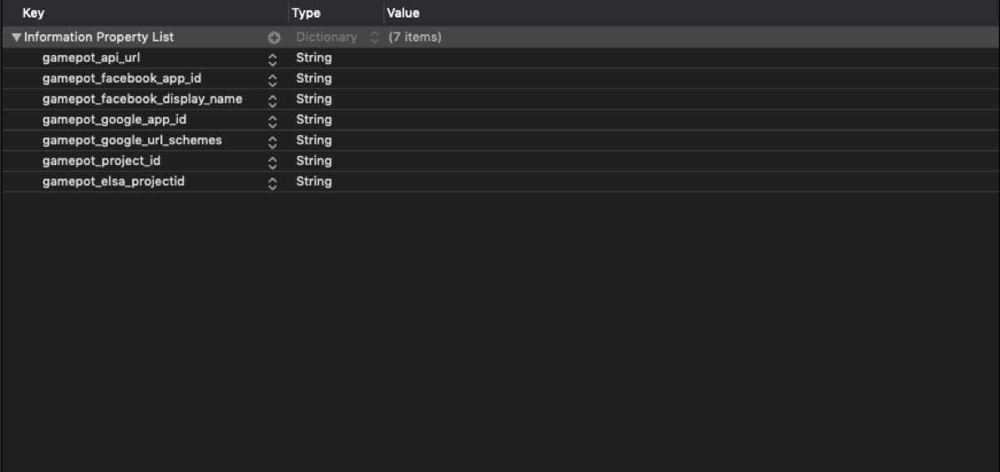
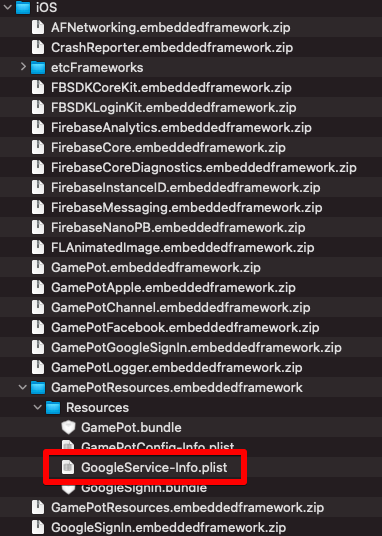
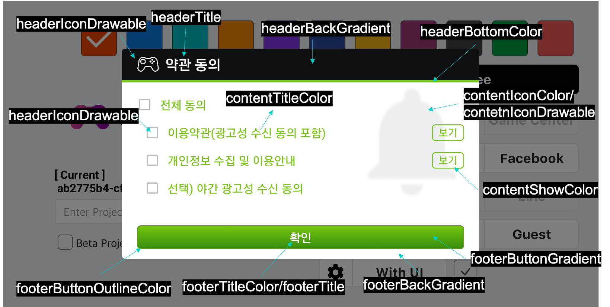

---
search:
  keyword: ['gamepot']
---

#### **네이버 클라우드 플랫폼의 상품 사용 방법을 보다 상세하게 제공하고, 다양한 API의 활용을 돕기 위해 <a href="https://guide.ncloud-docs.com/docs/ko/home" target="_blank">[설명서]</a>와 <a href="https://api.ncloud-docs.com/docs/ko/home" target="_blank">[API 참조서]</a>를 구분하여 제공하고 있습니다.**

<a href="https://api.ncloud-docs.com/docs/ko/game-gamepot" target="_blank">Gamepot API 참조서 바로가기 >></a><br />
<a href="https://guide.ncloud-docs.com/docs/game-gamepotconsole" target="_blank">Gamepot 설명서 바로가기 >></a>

# Unreal SDK

## 기본 환경 설정

### Android

```d
minSdkVersion : API 17 (Jelly Bean, 4.2)
```

**프로젝트 환경 설정 방법**

/Plugin/GamePotSDKPlugin/Source/GamePot/GamePot_Android_UPL.xml 파일을 에디터로 엽니다.

```xml

<buildGradleAdditions>
    <insert>
...
android {
    ...
    defaultConfig {
        ...
         resValue "string", "gamepot_project_id", ""                                      // required
         resValue "string", "gamepot_api_url", ""                                            // required (공백값으로 유지해주세요.)
         resValue "string", "gamepot_dash_url", ""                                         // required (공백값유지해주세요.)
         resValue "string", "gamepot_store", "google"                                   // required
         resValue "string", "gamepot_app_title","@string/app_name"           // required (fcm)
         resValue "string", "gamepot_push_default_channel","Default"        // required (fcm)
         resValue "string", "facebook_app_id", ""                                           // option(facebook)
         resValue "string", "fb_login_protocol_scheme", ""                           // option(facebook)
        // resValue "string", "gamepot_elsa_projectid", "" // optional (ncp elsa)
    }
    ...
}
  </insert>
</buildGradleAdditions>
```

아래의 필수 값을 찾아 수정합니다. 아래 값들을 수정해야만 정상적으로 작동됩니다.

```xml
resValue "string", "[key]", "[value]"
```

| 값                           | 설명                                                                                           |
| :--------------------------- | :--------------------------------------------------------------------------------------------- |
| gamepot_project_id           | GAMEPOT에서 발급받은 프로젝트 아이디를 입력해 주세요.                                          |
| gamepot_store                | 스토어값\(`google` 또는 `one` 또는 `galaxy`\)                                                  |
| gamepot_app_title            | 앱 제목 \(FCM\)                                                                                |
| gamepot_push_default_channel | 등록된 기본 채널 이름 \(Default\) - 변경하지 마세요.                                           |
| facebook_app_id              | 페이스북 발급 받은 앱ID                                                                        |
| fb_login_protocol_scheme     | 페이스북에서 발급 받은 protocol scheme fb\[app_id\]                                            |
| gamepot_elsa_projectid       | NCLOUD ELSA 사용시 프로젝트ID \([자세히 보기](https://www.ncloud.com/product/analytics/elsa)\) |

**노티바에 푸시 아이콘 변경 방법**


푸시 수신 시 Android Notification bar에 보여줄 Small icon은 SDK 내부에서 기본 이미지로 노출하며 직접 추가할 수도 있습니다.

직접 추가하려면 `drawable` 폴더별로 이미지를 넣어야 합니다.\([Android Asset Studio](http://romannurik.github.io/AndroidAssetStudio/icons-notification.html#source.type=clipart&source.clipart=ac_unit&source.space.trim=1&source.space.pad=0&name=ic_stat_gamepot_small)를 이용해 제작하면 자동으로 폴더별로 이미지가 제작되어 편리합니다.\)

이미지 파일명은 ic_stat_gamepot_small이어야 합니다.

| 폴더명                                                                                            | 크기  |
| :------------------------------------------------------------------------------------------------ | :---- |
| /Plugin/GamePotSDKPlugin/Source/GamePot/ThirdParty/Android/GamePotResources/res/drawable-mdpi/    | 24x24 |
| /Plugin/GamePotSDKPlugin/Source/GamePot/ThirdParty/Android/GamePotResources/res/drawable-hdpi/    | 36x36 |
| /Plugin/GamePotSDKPlugin/Source/GamePot/ThirdParty/Android/GamePotResources/res/drawable-xhdpi/   | 48x48 |
| /Plugin/GamePotSDKPlugin/Source/GamePot/ThirdParty/Android/GamePotResources/res/drawable-xxhdpi/  | 72x72 |
| /Plugin/GamePotSDKPlugin/Source/GamePot/ThirdParty/Android/GamePotResources/res/drawable-xxxhdpi/ | 96x96 |

### iOS

구글 파이어베이스에서 다운로드한 `GoogleService-Info.plist` 파일을 `/Plugin/GamePotSDKPlugin/Source/GamePot/ThirdParty/iOS/`에 복사합니다.

`/Plugin/GamePotSDKPlugin/Source/GamePot/ThirdParty/iOS/GamePotConfig-Info.plist` 내에 필요한 환경 변수를 추가해 주세요.



| 환경 변수                     | 설명                                                  |
| :---------------------------- | :---------------------------------------------------- |
| gamepot_project_id            | GAMEPOT에서 발급받은 프로젝트 아이디를 입력해 주세요. |
| gamepot_facebook_app_id       | 페이스북 발급 받은 앱ID                               |
| gamepot_facebook_display_name | 페이스북에 보여지는 이름                              |
| gamepot_google_app_id         | GoogleService-Info 파일의 CLIENT_ID 값                |
| gamepot_google_url_schemes    | GoogleService-Info 파일의 REVERSED_CLIENT_ID 값       |
| gamepot_elsa_projectid        | NCLOUD ELSA 사용시 프로젝트ID                         |

iOS 빌드 전,

프로젝트 셋팅 &gt;&gt; iOS &gt;&gt; Extra PList Data &gt;&gt; Additional Plist Data 내에 아래 `사용자 권한 획득 옵션을 추가` 부탁드립니다.

해당 사용자 권한은 GamePot 고객센터 내의 파일 업로드 기능에서 사용 됩니다.

```text
<key>NSCameraUsageDescription</key>
<string>$(PRODUCT_NAME) camera use.</string>
<key>NSPhotoLibraryUsageDescription</key>
<string>$(PRODUCT_NAME) photo library use.</string>
```

iOS 14 이상 버전

iOS 14 버전부터 IDFA 값 획득 시 사용자에게 권한을 획득해야만

IDFA 값 획득이 가능하도록 변경되었습니다.

따라서 IDFA 값 획득 시 사용자에게 권한 획득하는 팝업을 사용하신다면
프로젝트 셋팅 &gt;&gt; iOS &gt;&gt; Extra PList Data &gt;&gt; Additional Plist Data 내에 아래 `사용자 권한 획득 옵션을 추가` 부탁드립니다.

> 2020.09.11<br/>
> Apple에서 IDFA 값 획득 시 사용자에게 권한 획득하는 팝업 필수 적용은 2021년 초까지 연기되었습니다.<br/>
> 아래 링크 참고 부탁드립니다.<br/> > https://developer.apple.com/news/?id=hx9s63c5

```text
<key>NSUserTrackingUsageDescription</key>
<string>$(PRODUCT_NAME) This identifier will collect IDFA for advertising purposes.</string>
```

IDFA 권한 요청 팝업 호출 (명시적)

Request :

```c++
if (FGamePotSDKPluginModule::IsGamePotSdkAvailable())
    FGamePotSDKPluginModule::GetSharedGamePotSdk()->requestTrackingAuthorization();
```

Response:

```c++
void ASampleGameModeBase::OnSdkResultTrackingAuthorization(FNResultTrackingAuthorization info) {
    // info.authorization (FString)
    //        ATTrackingManagerAuthorizationStatusNotDetermined,
    //        ATTrackingManagerAuthorizationStatusRestricted,
    //        ATTrackingManagerAuthorizationStatusDenied,
    //        ATTrackingManagerAuthorizationStatusAuthorized,
    //        ATTrackingManagerAuthorizationStatusUnknown
}

```

> `iOS 플랫폼의 경우,` 로그인 API 호출 시, IDFA 값 획득에 대한 권한을 요청하는 팝업을 먼저 명시적으로 요청하고 있습니다.

> 해당 팝업 요청을 로그인 시점에 호출하고 싶지 않으실 경우, `FIOSGamePotSdk::Login(ENLoginType::Type)` 함수를 수정해주세요. (/Plugin/GamePotSDKPlugin/Source/GamePot/Private/iOS/IOSGamePotSdk.cpp)

```c++
void FIOSGamePotSdk::Login(ENLoginType::Type _loginType)
{
    //로그인 전, 명시적으로 IDFA 팝업 노출 <-- 필요 시, 주석처리
    FIOSGamePotSdk::requestTrackingAuthorization();
    ...
```

## 1. 초기화

게임을 시작할때 로드되는 첫 장면(레벨)에 사용되는 개체에 다음 코드를 추가합니다.

- ex> "ASampleGameModeBase.h"

```c++
//(해당 레벨에서 사용되는) GAMEPOT API에 대한, Callback Event Listener 선언
UCLASS()
class GAMEPOTSDKSAMPLE_API ASampleGameModeBase : public AGameModeBase
{
    ...
   void OnLoginSuccess(FNUserInfo NUserInfo);
   void OnLoginCancel();
   void OnLoginFailure(FNError NError);
   void OnLoginMaintenance(FNAppStatus NAppStatus);
   void OnLoginNeedUpdate(FNAppStatus NAppStatus);
   void OnLoginExit();
   ...
};
```

- ex> "ASampleGameModeBase.cpp"

```c++
#include "GamePotSDKPluginModule.h"

void ASampleGameModeBase::InitGame(const FString& MapName, const FString& Options, FString& ErrorMessage)
{
    AGameModeBase::InitGame(MapName, Options, ErrorMessage);

     //(header에서 선언한 Event Listener를) GamePotPluginModule의 Callback Event Listener에 바인딩
     if (FGamePotSDKPluginModule::IsAvailable())
     {
         FGamePotSDKPluginModule::OnSdkLoginSuccess.AddUObject(this, &ASampleGameModeBase::OnLoginSuccess);
         FGamePotSDKPluginModule::OnSdkLoginCancel.AddUObject(this, &ASampleGameModeBase::OnLoginCancel);
         FGamePotSDKPluginModule::OnSdkLoginFailure.AddUObject(this, &ASampleGameModeBase::OnLoginFailure);
         FGamePotSDKPluginModule::OnSdkLoginMaintenance.AddUObject(this, &ASampleGameModeBase::OnLoginMaintenance);
         FGamePotSDKPluginModule::OnSdkLoginNeedUpdate.AddUObject(this, &ASampleGameModeBase::OnLoginNeedUpdate);
         FGamePotSDKPluginModule::OnSdkLoginExit.AddUObject(this, &ASampleGameModeBase::OnLoginExit);

         FGamePotSDKPluginModule::OnSdkLogoutSuccess.AddUObject(this, &ASampleGameModeBase::OnLogoutSuccess);
         FGamePotSDKPluginModule::OnSdkLogoutFailure.AddUObject(this, &ASampleGameModeBase::OnLogoutFailure);
        ...
     }
}

void ASampleGameModeBase::OnLoginSuccess(FNUserInfo NUserInfo)
{
    // Handling NUserInfo..
}

void ASampleGameModeBase::OnLoginCancel()
{
}

void ASampleGameModeBase::OnLoginFailure(FNError NError)
{
    // Handling NError Info..
}

```

(Binding) Event Listener 목록

```c++
    // Login 성공
    FOnSdkLoginSuccess OnSdkLoginSuccess(FNUserInfo NUserInfo);
    // Login 취소
    FOnSdkLoginCancel OnSdkLoginCancel();
    // Login 실패
    FOnSdkLoginFailure OnSdkLoginFailure(FNError NError);
    // Login (점검)
    FOnSdkLoginMaintenance OnSdkLoginMaintenance(FNAppStatus NAppStatus);
    // Login (업데이트)
    FOnSdkLoginNeedUpdate OnSdkLoginNeedUpdate(FNAppStatus NAppStatus);
    // Login UI Close(showLoginWithUI 사용 시)
    FOnSdkLoginExit OnSdkLoginExit();
    // (점검, 업데이트 시) 앱 종료
    FOnSdkAppClose OnSdkAppClose();

    // Logout 성공
    FOnSdkLogoutSuccess OnSdkLogoutSuccess();
    // Logout 실패
    FOnSdkLogoutFailure OnSdkLogoutFailure(FNError NError);

    // showWebview 닫음
    FOnWebviewClose OnSdkWebviewClose(FString msg);

    // purchase 성공
    FOnSdkPurchaseSuccess OnSdkPurchaseSuccess(FNPurchaseInfo NPurchaseInfo);
    // purchase 취소
    FOnSdkPurchaseCancel OnSdkPurchaseCancel();
    // purchase 실패
    FOnSdkPurchaseFailure OnSdkPurchaseFailure(FNError NError);

    // getPurchaseDetailListAsync 성공
    FOnSdkPurchaseDetailListSuccess OnSdkPurchaseDetailListSuccess(TArray<FNPurchaseItem> Items);
    // getPurchaseDetailListAsync 실패
    FOnSdkPurchaseDetailListFailure OnSdkPurchaseDetailListFailure(FNError NError);

    // createLinking 성공
    FOnSdkCreateLinkingSuccess OnSdkCreateLinkingSuccess(FNUserInfo NUserInfo);
    // createLinking 취소
    FOnSdkCreateLinkingCancel OnSdkCreateLinkingCancel();
    // createLinking 실패
    FOnSdkCreateLinkingFailure OnSdkCreateLinkingFailure(FNError NError);

    // deleteLinking 성공
    FOnSdkDeleteLinkingSuccess OnSdkDeleteLinkingSuccess();
    // deleteLinking 실패
    FOnSdkDeleteLinkingFailure OnSdkDeleteLinkingFailure(FNError NError);

    // 공지사항 이미지(showNotice, showEvent) 클릭액션 scheme 콜백
    FOnSdkReceiveScheme OnSdkReceiveScheme(FString scheme);

    // deleteMember 성공
    FOnSdkDeleteMemberSuccess OnSdkDeleteMemberSuccess();
    // deleteMember 실패
    FOnSdkDeleteMemberFailure OnSdkDeleteMemberFailure(FNError NError);

    // coupon (사용)성공
    FOnSdkCouponSuccess OnSdkCouponSuccess(FString msg);
    // coupon (사용)실패
    FOnSdkCouponFailure OnSdkCouponFailure(FNError NError);

    // showAgreeDialog (약관동의여부) 갱신 성공
    FOnAgreeDialogSuccess OnSdkAgreeDialogSuccess(FNAgreeResultInfo NAgreeResultInfo);
    // showAgreeDialog (약관동의여부) 갱신 실패
    FOnAgreeDialogFailure OnSdkAgreeDialogFailure(FNError NError);

    // setPush 성공
    FOnPushSuccess OnSdkPushSuccess();
    // setPushAdStatus 성공
    FOnPushAdSuccess OnSdkPushAdSuccess();
    // setPushNightStatus 성공
    FOnPushNightSuccess OnSdkPushNightSuccess();
    // setPushStatus 성공
    FOnPushStatusSuccess OnSdkPushStatusSuccess();

    // setPush 실패
    FOnPushFailure OnSdkPushFailure(FNError NError);
    // setPushAdStatus 실패
    FOnPushAdFailure OnSdkPushAdFailure(FNError NError);
    // setPushNightStatus 실패
    FOnPushNightFailure OnSdkPushNightFailure(FNError NError);
    // setPushStatus 실패
    FOnPushStatusFailure OnSdkPushStatusFailure(FNError NError);
```

NUserInfo 정의

```c++
USTRUCT()
struct FNUserInfo
{
    UPROPERTY()
    FString memberid;           // 멤버 ID(유저의 유니크 아이디)
    UPROPERTY()
    FString name;               // 이름
    UPROPERTY()
    FString profileUrl;         // 프로필 URL(존재 시)
    UPROPERTY()
    FString email;              // 이메일(존재 시)
    UPROPERTY()
    FString token;              // 유저 유효성 체크용 Token (Token AuthenticationAPI에서 사용)
    UPROPERTY()
    FString userid;             // Social ID(google, facebook ...)
}
```

## 2. 오류 코드

NError 정의

```c++
USTRUCT()
struct FNError
{
    //Detail Error code
    static const int CODE_UNKNOWN_ERROR = 0;                    // 알 수 없는 Error
    static const int CODE_NOT_INITALIZE = 1;                    // 초기화 실패
    static const int CODE_INVAILD_PARAM = 2;                    // 파라미터가 올바르지 않은 경우
    static const int CODE_MEMBERID_IS_EMPTY = 3;                    // 멤버아이디 데이터가 없을때
    static const int CODE_NOT_SIGNIN = 4;                    // 로그인이 되지 않은 상태
    static const int CODE_NETWORK_MODULE_NOT_INIT = 3000;                 // 네트웍 모듈이 초기화 되지 않았을 때
    static const int CODE_NETWORK_ERROR = 3001;                 // 네트웍 연결 오류 및 타임아웃 발생 시
    static const int CODE_SERVER_ERROR = 4000;                 // server-side에서 발생하는 오류
    static const int CODE_SERVER_HTTP_ERROR = 4001;                 // http response code가 성공이 아닌 경우
    static const int CODE_SERVER_NETWORK_ERROR = 4002;                 // 네트웍 연결 오류 및 타임아웃 발생 시
    static const int CODE_SERVER_PARSING_ERROR = 4003;                 // 서버에서 받은 데이터를 파싱할때 오류
    static const int CODE_CHARGE_UNKNOWN_ERROR = 5000;                 // 결제에서 알 수 없는 오류 발생 및 스토어 측에서 Error를 전달 할 때
    static const int CODE_CHARGE_PRODUCTID_EMPTY = 5001;                 // product id를 넣지 않은 경우
    static const int CODE_CHARGE_PRODUCTID_WRONG = 5002;                 // product id를 잘못 넣은 경우
    static const int CODE_CHARGE_CONSUME_ERROR = 5003;                 // consume시 오류

    UPROPERTY()
    int code;               // error Code

    UPROPERTY()
    FString message;        // error Message
}
```

## 3. 로그인 환경 설정

### 구글 로그인

#### Google Firebase Console

1. Google Firebase Console에서 Android용 google-service.json 파일을 다운로드한 후에 `/Plugins/GamePotSDKPlugin/Source/GamePot/ThirdParty/Android/`에 복사합니다.
2. APK 빌드 시 사용한 Keystore의 SHA-1 값을 Google Firebase console에 추가합니다.

**구글 로그인 시 onCancel이 응답하며 로그인이 되지 않는 경우** 아래 내용을 체크해주세요.

1. 위에 적용요청한 google-service.json파일을 정상적으로 적용했는지 확인
2. 빌드 시 사용한 키스토어가 Firebase console에 등록한 sha-1를 추출한 키스토어인지 확인
3. Firebase console에 등록한 패키지명으로 빌드를 했는지 확인

#### Android

GamePot_Android_UPL.xml 수정

```xml
...
<resourceCopies>
    <copyFile src="$S(PluginDir)/ThirdParty/Android/libs/gamepot-channel-google-signin.aar" dst="$S(BuildDir)/libs/gamepot-channel-google-signin.aar" />
</resourceCopies>
...

<buildGradleAdditions>
    <insert>
        ...
        dependencies {
            ...
            implementation(name: 'gamepot-channel-google-signin', ext: 'aar')
            ...
        }
        ...
    </insert>
</buildGradleAdditions>
...
```

#### IOS

1. `/Plugins/GamePotSDKPlugin/Source/GamePot/ThirdParty/iOS/GamePotResouces.embeddedframework.zip`의 압축을 해제합니다.

2. IOS용 GoogleService-Info.plist 파일을 다운로드한 후에 `/Plugins/GamePotSDKPlugin/Source/GamePot/ThirdParty/iOS/GamePotResouces.embeddedframework/Resources/`의 경로에 복사한 후, 다시 **재압축** 합니다.

    

### 페이스북 로그인

#### Facebook Developer Console

APK 빌드 시 사용한 Keystore의 키 해시 값을 페이스북 콘솔에 추가합니다.

#### Android

GamePot_Android_UPL.xml 수정

```xml
...
<resourceCopies>
        <copyFile src="$S(PluginDir)/ThirdParty/Android/libs/gamepot-channel-facebook.aar" dst="$S(BuildDir)/libs/gamepot-channel-facebook.aar" />
</resourceCopies>
...

...
<buildGradleAdditions>
    <insert>

        ...
        dependencies {
            ...
            implementation(name: 'gamepot-channel-facebook', ext: 'aar')
            ...
        }

        ...

        defaultConfig {
            resValue "string", "facebook_app_id", "1234567890"
            resValue "string", "fb_login_protocol_scheme", "fb1234567890"
        }
        ...

    </insert>
</buildGradleAdditions>

...

<gameActivityImportAdditions>
  <insert>
    import io.gamepot.channel.facebook.GamePotFacebook;
  </insert>
</gameActivityImportAdditions>

```

#### iOS

GamePotConfig-Info.plist 파일에 아래 항목을 추가하여 해당 값을 입력 합니다.

```text
gamepot_facebook_app_id // 페이스북 개발자 콘솔에서 발듭받은 app id
```

GamePotConfig-Info.plist 파일을 SourceCode로 볼 때는 아래와 같이 추가

```markup
...
<key>gamepot_facebook_app_id</key>
<string>xxxxxx</string>
...
```

### APPLE 로그인

> iOS에만 해당하는 기능입니다. (Android의 경우, Web Login 형태로 지원 )

**Config/DefaultEngine.ini 내, `[/Script/IOSRuntimeSettings.IOSRuntimeSettings]`항목에 다음 Flag 값을 추가 합니다.**

> bEnableSignInWithAppleSupport=True

## 4. 로그인/로그아웃/탈퇴/검증

### 로그인

별도의 가입 없이 사용자 계정이 생성됩니다. 모든 신원 확인을 위한 MemberId가 생성되며, 생성된 정보는 FNUserInfo 저장되어 리턴됩니다.

LoginType 정의

```c++
UENUM()
namespace ENLoginType
{
    enum Type
    {
        NONE,
        GOOGLE,
        GOOGLEPLAY,
        FACEBOOK,
        NAVER,
        GAMECENTER,
        TWITTER,
        LINE,
        APPLE,
        GUEST,
        THIRDPARTYSDK,
        STANDALONE
    };
}
```

- Case 1

Request:

```c++

if (FGamePotSDKPluginModule::IsGamePotSdkAvailable())
FGamePotSDKPluginModule::GetSharedGamePotSdk()->Login(ENLoginType::Type loginType);

```

Response:

```c++
void ASampleGameModeBase::OnLoginSuccess(FNUserInfo NUserInfo)
{
    // 로그인 성공
}

void ASampleGameModeBase::OnLoginCancel()
{
    // 로그인 취소
}

void ASampleGameModeBase::OnLoginFailure(FNError NError)
{
   // 로그인 실패
    // NError.message를 팝업 등으로 유저에게 알려주세요.
}


// 점검(대시보드에 점검이 활성화되어 있는 경우 호출)
void ASampleGameModeBase::OnLoginMaintenance(FNAppStatus NAppStatus)
{
   // TODO: 파라미터로 넘어온 status 정보를 토대로 팝업을 만들어 사용자에게 알려줘야 합니다.
    // TODO: 아래 두 가지 방식 중 한 가지를 선택하세요.
    // case 1: 인게임 팝업을 통해 개발사에서 직접 UI 구현
    // case 2: SDK의 팝업을 사용(이 경우에는 아래 코드를 호출해 주세요.)

    IGamePotSdk* ptr = FGamePotSDKPluginModule::GetSharedGamePotSdk();
    if (FGamePotSDKPluginModule::IsGamePotSdkAvailable())
        ptr->showAppStatusPopup(NAppStatus.ToJsonString());
}

// 강제 업데이트(스토어 버전과 클라이언트 버전이 다를 경우 호출)
void ASampleGameModeBase::OnLoginNeedUpdate(FNAppStatus NAppStatus)
{
     // TODO: 파라미터로 넘어온 status 정보를 토대로 팝업을 만들어 사용자에게 알려줘야 합니다.
    // TODO: 아래 두 가지 방식 중 한 가지를 선택하세요.
    // case 1: 인게임 팝업을 통해 개발사에서 직접 UI 구현
    // case 2: SDK의 자체 팝업 UI를 이용(이 경우에는 아래 코드를 호출해 주세요.)

    IGamePotSdk* ptr = FGamePotSDKPluginModule::GetSharedGamePotSdk();
    if (FGamePotSDKPluginModule::IsGamePotSdkAvailable())
        ptr->showAppStatusPopup(NAppStatus.ToJsonString());
}

void ASampleGameModeBase::OnLoginExit()
{
   // TODO: 강제 업데이트나 점검 기능을 case 2 방식으로 구현하는 경우
    // TODO: 앱을 강제 종료할 수 있기 때문에 이 곳에 앱을 종료할 수 있도록 구현하세요.
}

void ASampleGameModeBase::OnAppClose()
{
    // 앱 종료
    // TODO: 강제 업데이트나 점검 기능을 case 2 방식으로 구현하는 경우
    // TODO: 앱을 강제 종료할 수 있기 때문에 이 곳에 앱을 종료할 수 있도록 구현하세요.
}

```

NAppStatus 정의

```c++
USTRUCT()
struct FNAppStatus
{
    UPROPERTY()
    FString type;       // AppStatus 타입으로 "maintenance" : 점검, "needupdate" : 업데이트

    UPROPERTY()
    FString message;    // 점검 설정 : Dashboard에서 입력한 메세지

    UPROPERTY()
    FString url;        // 점검 설정 : Dashboard에서 입력한 URL

    UPROPERTY()
    FString currentAppVersion;  // 업데이트 : 현재 App Version

    UPROPERTY()
    FString updateAppVersion;   // 업데이트 : Dashboard에서 입력한 App Version

    UPROPERTY()
    int currentAppVersionCode;  // 업데이트 : 현재 App Code

    UPROPERTY()
    FString updateAppVersionCode;   // 업데이트 : Dashboard에서 입력한 App Version code

    UPROPERTY()
    bool isForce;       // 업데이트 : Dashboard에서 강제 업데이트 설정 시 true

    UPROPERTY()
    FString resultPayload;  // 클라이언트 SDK에서 전달 된 Json 값으로 무시하셔도 됩니다.

    UPROPERTY()
    double startedAt;    // 점검 : 시작 시간(timestamp)

    UPROPERTY()
    double endedAt;     // 점검 : 종료 시간(timestamp)
}
```

### 자동 로그인

```c++
ENLoginType::Type loginType =  FGamePotSDKPluginModule::GetSharedGamePotSdk()->getLastLoginType();

if(loginType != ENLoginType::NONE) {
{
    // 마지막에 로그인했던 로그인 타입으로 로그인하는 방식입니다.
    FGamePotSDKPluginModule::GetSharedGamePotSdk()->Login(loginType);
}
else
{
    // 처음 게임을 실행했거나 로그아웃한 상태. 로그인을 할 수 있는 로그인 화면으로 이동해 주세요.
}
```

### 로그아웃

사용자를 로그아웃시킵니다. 계정이 삭제되지 않으며, 동일한 계정으로 로그인이 가능합니다.

- Case 1

Request:

```c++
if (FGamePotSDKPluginModule::IsGamePotSdkAvailable())
    FGamePotSDKPluginModule::GetSharedGamePotSdk()->Logout();
```

Response:

```csharp
void ASampleGameModeBase::OnLogoutSuccess()
{
}

void ASampleGameModeBase::OnLogoutFailure(FNError NError)
{
    // 로그아웃을 실패하는 경우
    // NError.message를 팝업 등으로 유저에게 알려주세요.
}
```

### 탈퇴

회원을 탈퇴하며, 복구가 불가능합니다.

- Case 1

Request:

```c++

if (FGamePotSDKPluginModule::IsGamePotSdkAvailable())
    FGamePotSDKPluginModule::GetSharedGamePotSdk()->deleteMember();
```

Response:

```c++
/// 회원 탈퇴 성공
void ASampleGameModeBase::OnDeleteMemberSuccess()
{

}

void ASampleGameModeBase::OnDeleteMemberFailure(FNError NError)
{
   // 회원 탈퇴를 실패하는 경우
    // NError.message를 팝업 등으로 유저에게 알려주세요.
}
```

### 검증

로그인 완료 후 로그인 정보를 개발사 서버에서 GAMEPOT 서버로 전달하면 로그인 검증이 진행됩니다.

자세한 설명은 Server to server api 메뉴에 `Token Authentication` 항목을 참고해주세요.

## 5. 계정 연동

하나의 게임 계정에 복수 개의 소셜계정\(구글/페이스북 등\)을 연결/해제할 수 있는 기능입니다.\(최소 연동 소셜 계정은 1가지입니다.\)

> 연동화면 UI는 개발사에서 구현해주세요.

```c++
UENUM()
namespace ENLinkingType
{
    enum Type
    {
        NONE,
        GOOGLEPLAY,
        GAMECENTER,
        GOOGLE,
        FACEBOOK,
        NAVER,
        TWITTER,
        LINE,
        APPLE,
        THIRDPARTYSDK
    };
}
```

### 연동

Google / Facebook 등의 아이디로 계정을 연동 하실 수 있습니다.

- Case 1

Request:

```c++
if (FGamePotSDKPluginModule::IsGamePotSdkAvailable())
    FGamePotSDKPluginModule::GetSharedGamePotSdk()->createLinking(ENLinkingType::Type linkingType);
```

Response:

```c++
void ASampleGameModeBase::OnCreateLinkingSuccess(FNUserInfo NUserInfo) {
        // 계정 연동 성공
}

void ASampleGameModeBase::OnCreateLinkingCancel() {
        // 유저가 계정연동을 취소한 경우

}
void ASampleGameModeBase::OnCreateLinkingFailure(FNError NError) {
        // 계정 연동을 실패하는 경우
        // NError.message를 팝업 등으로 유저에게 알려주세요.
}

```

현재 연동된 모든 계정 정보를 가져올 수 있습니다.

```c++
if (FGamePotSDKPluginModule::IsGamePotSdkAvailable())
     TArray<FNLinkingInfo> linkedList = FGamePotSDKPluginModule::GetSharedGamePotSdk()->getLinkedList();
```

링킹 정보 정의

```c++
USTRUCT()
struct FNLinkingInfo
{
    UPROPERTY()
    ENLinkingType::Type provider;      // 계정 연동 정보 (google, facebook, naver, apple..)
}
```

### 연동 해제

기존에 연동 되어 있는 계정을 해제합니다.

- Case 1

Request :

```c++

if (FGamePotSDKPluginModule::IsGamePotSdkAvailable())
    FGamePotSDKPluginModule::GetSharedGamePotSdk()->deleteLinking(ENLinkingType::Type linkType);

```

Response:

```c++

void ASampleGameModeBase::OnDeleteLinkingSuccess() {
/// 계정 연동 해제 성공
}

void ASampleGameModeBase::OnDeleteLinkingFailure(FNError NError) {
    /// 계정 연동 해제 실패
     // 연동 해제를 실패하는 경우
    // NError.message를 팝업 등으로 유저에게 알려주세요.
}
```

## 6. 결제

### 인앱 상품 조회

스토어에 등록된 상품 정보를 전달 합니다.

이 기능을 활용하면 사용자에 맞게 가격, 통화, 상품명이 다르게 표시됩니다.

```c++
if (FGamePotSDKPluginModule::IsGamePotSdkAvailable())
    TArray<FNPurchaseItem> itemList = FGamePotSDKPluginModule::GetSharedGamePotSdk()->getPurchaseItems();
```

### NPurchaseItem 정의

NPurchaseItem 정의

```c++
USTRUCT()
struct FNPurchaseItem
{
    UPROPERTY()
    FString productId;              // 상품 ID

    UPROPERTY()
    FString type;                   // 상품 타입으로 "inapp"으로 고정

    UPROPERTY()
    FString price;                  // 가격 google 스토어 : $0.99 그외 스토어 : 0.99

    UPROPERTY()
    FString price_amount;           // 통화코드 ex) KRW, USD

    UPROPERTY()
    FString price_amount_micros;    // (UI에 노출 시 권장) 통화와 가격이 합쳐진 값  원스토어의 경우 통화 단위 전달 되지 않습니다. ex) $0.99

    UPROPERTY()
    FString price_currency_code;

    UPROPERTY()
    FString price_with_currency;

    UPROPERTY()
    FString title;                   // 상품 이름

    UPROPERTY()
    FString description;            // 상품 설명
}
```

### 인앱 상품 결제

아래 함수 하나로 구글, 애플, 앱스토어 결제가 가능합니다.

- Case 1

Request:

```c++
// productId : 스토어에 등록된 상품ID를 입력해 주시면 됩니다.
// uniqueId  : 별도로 관리하는 영수증 번호를 넣으시면 됩니다.
// serverId  : 결제를 진행한 캐릭터의 서버아이디를 입력해 주시면 됩니다.
// playerId  : 결제를 진행한 캐릭터의 캐릭터 아이디를 입력해 주시면 됩니다.
// etc       : 결제를 진행한 캐릭터 기타 정보를 넣으시면 됩니다.

if (FGamePotSDKPluginModule::IsGamePotSdkAvailable())
    FGamePotSDKPluginModule::GetSharedGamePotSdk()->purchase(FString productId, FString uniqueId, FString serverId, FString playerId, FString etc);

```

### FNPurchaseInfo 정의

결제 성공 후 결제한 아이템의 정보입니다. 참고용으로 사용 부탁드립니다.

```c++

USTRUCT()
struct FNPurchaseInfo
{
    UPROPERTY()
    FString price;                         // 결제 아이템의 가격
    UPROPERTY()
    FString productId;                  // 결제 아이템 ID
    UPROPERTY()
    FString currency;                    // 결제 가격 통화(KRW/USD)
    UPROPERTY()
    FString orderId;                      // 스토어 Order ID
    UPROPERTY()
    FString productName;            // 결제 아이템 이름
    UPROPERTY()
    FString gamepotOrderId;         // (GAMEPOT에서 생성한) order id
    UPROPERTY()
    FString uniqueId;                    // (개발사에서 별도로 관리하는) 영수증 ID
    UPROPERTY()
    FString serverId;                    // (결제를 진행한 캐릭터의) 서버 아이디
    UPROPERTY()
    FString playerId;                    // (결제를 진행한 캐릭터의) 캐릭터 아이디
    UPROPERTY()
    FString etc;                         // (결제를 진행한 캐릭터의) 기타 정보
    UPROPERTY()
    FString signature;                  // 스토어 signature
    UPROPERTY()
    FString originalJSONData;   // 영수증 Data
}
```

Response:

```c++
/// 인앱 결제 성공
 void ASampleGameModeBase::OnPurchaseSuccess(FNPurchaseInfo NPurchaseInfo)
 {
 }

/// 인앱 결제 취소
 void ASampleGameModeBase::OnPurchaseCancel()
 {
 }

/// 인앱 결제 실패
 void ASampleGameModeBase::OnPurchaseFailure(FNError NError)
 {
       // 결제를 실패하는 경우
    // NError.message를 팝업 등으로 유저에게 알려주세요.
 }
```

### 결제 아이템 지급

GAMEPOT은 Server to server api를 통해 결제 스토어에 영수증 검증까지 모두 마친 후 개발사 서버에 지급 요청을 하기 때문에 불법 결제가 불가능합니다.

이를 위해선 `Server to server api` 메뉴에 `Purchase Webhook` 항목을 참고하여 처리하셔야 합니다.

### 외부결제

외부결제를 허용하는 스토어 및 공식 스토어가 아닌 곳에서 결제를 사용할 수 있는 기능입니다.

> 호출 api만 다르고 응답 및 purchase webhook등 나머지는 일반 결제와 동일합니다.
>
> 기능을 사용하기 위해선 설정이 필요합니다. 대시보드 메뉴얼에 '외부결제' 항목을 참고하세요.

- Case 1

Request:

````csharp

​```c++
// productId : 마켓에 등록된 상품ID
if (FGamePotSDKPluginModule::IsGamePotSdkAvailable())
    FGamePotSDKPluginModule::GetSharedGamePotSdk()->purchaseThirdPayments(FString productId);
````

외부결제 이용 시 상품 정보 리스트는 아래 api를 사용하세요.

Request:

```c++
if (FGamePotSDKPluginModule::IsGamePotSdkAvailable())
    TArray<FNPurchaseItem> itemList = FGamePotSDKPluginModule::GetSharedGamePotSdk()->getPurchaseThirdPaymentsItems();
```

## 7. 기타 API

### SDK 지원 로그인 UI

SDK 내에서, 자체적으로 (완성된 형태의) Login UI를 제공합니다.

### FNLoginUIInfo 정의

```c++
USTRUCT()
struct FNLoginUIInfo
{
    //이미지 로고 삽입 여부
    UPROPERTY()
    bool showLogo;

    //UI로 노출할 Login Type
    UPROPERTY()
    TArray<ENLoginType::Type> loginTypes;  //google, facebook...
}
```

#### SDK 로그인 UI 호출

- Case 1

Request:

```c++
//호출할 로그인 UI 타입
if (FGamePotSDKPluginModule::IsGamePotSdkAvailable())
    FGamePotSDKPluginModule::GetSharedGamePotSdk()->showLoginWithUI(FNLoginUIInfo NLoginUIInfo);
```

Response:

```c++
void ASampleGameModeBase::OnLoginSuccess(FNUserInfo NUserInfo)
{
    // 로그인 성공
}

void ASampleGameModeBase::OnLoginCancel()
{
    // 로그인 취소
}

void ASampleGameModeBase::OnLoginFailure(FNError NError)
{
   // 로그인 실패
    // error.message를 팝업 등으로 유저에게 알려주세요.
}
```

Response:

**일반 로그인 API 응답 로직과 동일합니다. (단, onLoginCancel / onLoginFailure의 경우 Native 레벨에서 토스트 메시지로 처리됩니다.)**

```c++

void ASampleGameModeBase::OnLoginSuccess(FNUserInfo NUserInfo)
{
    // 로그인 성공
}

void ASampleGameModeBase::OnLoginCancel()
{
    // 로그인 취소
}

// 점검(대시보드에 점검이 활성화되어 있는 경우 호출)
void ASampleGameModeBase::OnLoginMaintenance(FNAppStatus NAppStatus)
{
   // TODO: 파라미터로 넘어온 status 정보를 토대로 팝업을 만들어 사용자에게 알려줘야 합니다.
    // TODO: 아래 두 가지 방식 중 한 가지를 선택하세요.
    // case 1: 인게임 팝업을 통해 개발사에서 직접 UI 구현
    // case 2: SDK의 팝업을 사용(이 경우에는 아래 코드를 호출해 주세요.)

    if (FGamePotSDKPluginModule::IsGamePotSdkAvailable())
        FGamePotSDKPluginModule::GetSharedGamePotSdk()->showAppStatusPopup(NAppStatus.ToJsonString());
}

// 강제 업데이트(스토어 버전과 클라이언트 버전이 다를 경우 호출)
void ASampleGameModeBase::OnLoginNeedUpdate(FNAppStatus NAppStatus)
{
     // TODO: 파라미터로 넘어온 status 정보를 토대로 팝업을 만들어 사용자에게 알려줘야 합니다.
    // TODO: 아래 두 가지 방식 중 한 가지를 선택하세요.
    // case 1: 인게임 팝업을 통해 개발사에서 직접 UI 구현
    // case 2: SDK의 팝업을 사용(이 경우에는 아래 코드를 호출해 주세요.)

    if (FGamePotSDKPluginModule::IsGamePotSdkAvailable())
        FGamePotSDKPluginModule::GetSharedGamePotSdk()->showAppStatusPopup(NAppStatus.ToJsonString());
}

void ASampleGameModeBase::OnLoginExit()
{
    // TODO: LoginUI를 종료할 때,
}

void ASampleGameModeBase::OnAppClose()
{
    // 앱 종료
    // TODO: 강제 업데이트나 점검 기능을 case 2 방식으로 구현하는 경우
    // TODO: 앱을 강제 종료할 수 있기 때문에 이 곳에 앱을 종료할 수 있도록 구현하세요.
}

```

#### Customizing

**로그인 UI 이미지 로고 변경 방법**

로그인 UI 상단에 노출되는 이미지 로고는 SDK 내부에서 기본 이미지로 노출하며, 직접 추가할 수도 있습니다.

**[Android]**

> 직접 추가하려면 `drawable` 폴더별로 이미지를 넣어야 합니다.\([Android Asset Studio](http://romannurik.github.io/AndroidAssetStudio/icons-notification.html#source.type=clipart&source.clipart=ac_unit&source.space.trim=1&source.space.pad=0&name=ic_stat_gamepot_login_logo)를 이용해 제작하면 자동으로 폴더별로 이미지가 제작되어 편리합니다.\)

이미지 파일명은 ic_stat_gamepot_login_logo.png 이어야 합니다.

| 폴더명                                                                                             | 크기  |
| :------------------------------------------------------------------------------------------------- | :---- |
| /Plugin/GamePotSDKPlugin/Source/GamePotSDKPlugin/ThirdParty/GamePotResources/res/drawable-mdpi/    | 24x24 |
| /Plugin/GamePotSDKPlugin/Source/GamePotSDKPlugin/ThirdParty/GamePotResources/res/drawable-hdpi/    | 36x36 |
| /Plugin/GamePotSDKPlugin/Source/GamePotSDKPlugin/ThirdParty/GamePotResources/res/drawable-xhdpi/   | 48x48 |
| /Plugin/GamePotSDKPlugin/Source/GamePotSDKPlugin/ThirdParty/GamePotResources/res/drawable-xxhdpi/  | 72x72 |
| /Plugin/GamePotSDKPlugin/Source/GamePotSDKPlugin/ThirdParty/GamePotResources/res/drawable-xxxhdpi/ | 96x96 |

### 애플 로그인 (for Android - Web Login)

#### GAMEPOT Dashboard

대시보드 프로젝트 설정 >> 일반 >> Apple ID Login 설정

> 기능을 사용하기 위해선 Apple Developer Console 설정이 필요합니다.
>
> 대시보드에서 해당 항목의 **도움말보기**를 참고해주세요.

GamePot_Android_UPL.xml 수정

```xml
...
<resourceCopies>
        <copyFile src="$S(PluginDir)/ThirdParty/Android/libs/gamepot-channel-apple-signin.aar" dst="$S(BuildDir)/libs/gamepot-channel-apple-signin.aar" />
</resourceCopies>

...

<buildGradleAdditions>
    <insert>

        ...
        dependencies {
            ...
            implementation(name: 'gamepot-channel-apple-signin', ext: 'aar')
            ...
        }

        ...

    </insert>
</buildGradleAdditions>

...

<gameActivityImportAdditions>
  <insert>
    import io.gamepot.channel.naver.GamePotAppleSignin;
  </insert>
</gameActivityImportAdditions>

...
```

/Plugin/GamePotSDKPlugin/Source/GamePot/ThirdParty/Android/libs 경로에 아래 aar파일을 추가합니다.

- gamepot-channel-apple-signin.aar

### 네이버 로그인

#### Naver Developers

사용 API를 `네아로`로 선택 후 애플리케이션 등록

#### Android

GamePot_Android_UPL.xml 수정

```xml
...
<resourceCopies>
        <copyFile src="$S(PluginDir)/ThirdParty/Android/libs/gamepot-channel-naver.aar" dst="$S(BuildDir)/libs/gamepot-channel-naver.aar" />
</resourceCopies>

...

<buildGradleAdditions>
    <insert>

        ...
        dependencies {
            ...
            implementation(name: 'gamepot-channel-naver', ext: 'aar')
            ...
        }

        ...

        defaultConfig {
            resValue "string", "gamepot_naver_clientid", "abcdefg1234567890"
            resValue "string", "gamepot_naver_secretid", "hijklmn"
        }
        ...

    </insert>
</buildGradleAdditions>

...

<gameActivityImportAdditions>
  <insert>
    import io.gamepot.channel.naver.GamePotNaver;
  </insert>
</gameActivityImportAdditions>

...
```

Console에서 발급받은 Client ID를 `gamepot_naver_clientid` 값에 입력하고 Client Secret은 `gamepot_naver_secretid` 값에 입력합니다.

/Plugin/GamePotSDKPlugin/Source/GamePot/ThirdParty/Android/libs 경로에 아래 aar파일을 추가합니다.

- gamepot-channel-naver.aar

#### iOS

GamePotSDKPlugin.Build.cs 수정

```csharp
...

public GamePotSDKPlugin(ReadOnlyTargetRules Target) : base(Target)
{
    ...
           else if (Target.Platform == UnrealTargetPlatform.IOS)
        {
                PublicAdditionalFrameworks.Add(
                new Framework(
                    "GamePotNaver",
                    ModuleDirectory+"/ThirdParty/iOS/GamePotNaver.framework"
                )
            );

                PublicAdditionalFrameworks.Add(
                new Framework(
                    "NaverThirdPartyLogin",
                    ModuleDirectory+"/ThirdParty/iOS/NaverThirdPartyLogin.framework"
                )
        }
    ...
}
...
```

GamePotConfig-Info.plist 파일에 아래 항목을 추가하여 해당 값을 입력 합니다.

```text
gamepot_naver_clientid // 네이버에서 사용할 client 아이디
gamepot_naver_secretid // 네이버에서 사용할 secret 아이디
gamepot_naver_urlscheme // 네이버에서 사용할 urlscheme
```

GamePotConfig-Info.plist 파일을 SourceCode로 볼 때는 아래와 같이 추가

```markup
...
<key>gamepot_naver_clientid</key>
<string>xxxxxx</string>
<key>gamepot_naver_secretid</key>
<string>xxxxxx</string>
<key>gamepot_naver_urlscheme</key>
<string>xxxxxx</string>
...
```

### 라인 로그인

#### LINE Developers

APK 빌드 시 사용한 패키지 이름과 keystore의 SHA값, url Scheme 값을 라인 콘솔에 추가합니다.

#### Android

GamePot_Android_UPL.xml 수정

```xml
...
<resourceCopies>
    <copyFile src="$S(PluginDir)/ThirdParty/Android/libs/gamepot-channel-line.aar" dst="$S(BuildDir)/libs/gamepot-channel-line.aar" />
    <copyFile src="$S(PluginDir)/ThirdParty/Android/libs/line-sdk-4.0.10.aar" dst="$S(BuildDir)/libs/line-sdk-4.0.10.aar" />
</resourceCopies>

...

<buildGradleAdditions>
    <insert>

        ...
        dependencies {
            ...
            implementation(name: 'gamepot-channel-line', ext: 'aar')
            implementation(name: 'line-sdk-4.0.10', ext: 'aar')
            ...
        }

        ...

        defaultConfig {
            resValue "string", "gamepot_line_channelid","xxxxxxx"
        }
        ...

    </insert>
</buildGradleAdditions>

...

<gameActivityImportAdditions>
  <insert>
    import io.gamepot.channel.line.GamePotLine;
  </insert>
</gameActivityImportAdditions>

...
```

/Plugin/GamePotSDKPlugin/Source/GamePot/ThirdParty/Android/libs 경로에 아래 aar파일을 추가합니다.

- gamepot-channel-line.aar
- line-sdk-4.0.10.aar

#### iOS

GamePotSDKPlugin.Build.cs 수정

```csharp
...

public GamePotSDKPlugin(ReadOnlyTargetRules Target) : base(Target)
{
    ...
           else if (Target.Platform == UnrealTargetPlatform.IOS)
        {
                PublicAdditionalFrameworks.Add(
                new Framework(
                    "GamePotLine",
                    ModuleDirectory+"/ThirdParty/iOS/GamePotLine.framework"
                )
            );

            PublicAdditionalFrameworks.Add(
                new Framework(
                    "LineSDK",
                    ModuleDirectory+"/ThirdParty/iOS/LineSDK.framework"
                )
            );

            PublicAdditionalFrameworks.Add(
                new Framework(
                    "LineSDKObjC",
                    ModuleDirectory+"/ThirdParty/iOS/LineSDKObjC.framework"
                )
            );
        }
    ...
}
...
```

GamePotConfig-Info.plist 파일에 아래 항목을 추가하여 해당 값을 입력 합니다.

```text
gamepot_line_channelid // 네이버에서 사용할 client 아이디
gamepot_line_url_schemes // Line URL Scheme (line3rdp.{프로젝트 번들 identifier})
```

GamePotConfig-Info.plist 파일을 SourceCode로 볼 때는 아래와 같이 추가하면 됩니다.

```markup
...
<key>gamepot_line_channelid</key>
<string>xxxxxx</string>
<key>gamepot_line_url_schemes</key>
<string>xxxxxx</string>
...
```

### 트위터 로그인

#### Twitter Developers

#### Android

GamePot_Android_UPL.xml 수정

```xml
...
<resourceCopies>
        <copyFile src="$S(PluginDir)/ThirdParty/Android/libs/gamepot-channel-twitter.aar" dst="$S(BuildDir)/libs/gamepot-channel-twitter.aar" />
        <copyFile src="$S(PluginDir)/ThirdParty/Android/libs/twitter-core-3.3.0.aar" dst="$S(BuildDir)/libs/twitter-core-3.3.0.aar" />
</resourceCopies>

...

<buildGradleAdditions>
    <insert>
        ...
        dependencies {
            ...
            implementation(name: 'gamepot-channel-twitter', ext: 'aar')
            implementation(name: 'twitter-core-3.3.0', ext: 'aar') {
                transitive = true
            }
            ...
        }

        ...

        defaultConfig {
            resValue "string", "gamepot_twitter_consumerkey", ""
            resValue "string", "gamepot_twitter_consumersecret", ""
        }
        ...

    </insert>
</buildGradleAdditions>

...

<gameActivityImportAdditions>
  <insert>
    import io.gamepot.channel.twitter.GamePotTwitter;
  </insert>
</gameActivityImportAdditions>

...
```

/Plugin/GamePotSDKPlugin/Source/GamePot/ThirdParty/Android/libs 경로에 아래 aar파일을 추가합니다.

- gamepot-channel-twitter.aar
- twitter-core-3.3.0.aar

#### iOS

GamePotSDKPlugin.Build.cs 수정

```csharp
...

public GamePotSDKPlugin(ReadOnlyTargetRules Target) : base(Target)
{
    ...
           else if (Target.Platform == UnrealTargetPlatform.IOS)
        {
                PublicAdditionalFrameworks.Add(
                new Framework(
                    "GamePotTwitter",
                    ModuleDirectory+"/ThirdParty/iOS/GamePotTwitter.framework"
                )
            );

            PublicAdditionalFrameworks.Add(
                new Framework(
                    "TwitterCore",
                    ModuleDirectory+"/ThirdParty/iOS/TwitterCore.framework"
                )
            );

            PublicAdditionalFrameworks.Add(
                new Framework(
                    "TwitterKit",
                    ModuleDirectory+"/ThirdParty/iOS/TwitterKit.framework"
                )
            );
        }
    ...
}
...
```

GamePotConfig-Info.plist 파일에 아래 항목을 추가하여 해당 값을 입력 합니다.

```text
gamepot_twitter_consumerkey : Twitter Consumer Key
gamepot_twitter_consumersecret :  Twitter Consumer Secret
```

GamePotConfig-Info.plist 파일을 SourceCode로 볼 때는 아래와 같이 추가

```markup
...
<key>gamepot_twitter_consumerkey</key>
<string>xxxxxx</string>
...
```

### 쿠폰

#### 쿠폰 사용

> 쿠폰을 입력받는 UI는 개발사에서 구현해주세요.

- Case 1

Request:

```c++
    if (FGamePotSDKPluginModule::IsGamePotSdkAvailable())
    {
        FGamePotSDKPluginModule::GetSharedGamePotSdk()->coupon(FString couponNumber); // 쿠폰번호

        FGamePotSDKPluginModule::GetSharedGamePotSdk()->coupon(FString couponNumber, FString userData); // 쿠폰번호, 사용자정보
    }
```

Response:

```c++
void ASampleGameModeBase::OnCouponSuccess(FString msg)
{
    /// 쿠폰 사용 성공
}

void ASampleGameModeBase::OnCouponFailure(FNError NError)
{
      // 쿠폰 사용을 실패하는 경우
    // error.message를 팝업 등으로 유저에게 알려주세요.
}
```

#### 아이템 지급

쿠폰 사용이 성공하면 개발사 서버에 Server to server api를 통해 아이템 지급을 요청합니다.

이를 위해선 Server to server api 메뉴에 `Item Webhook` 항목을 참고하여 처리하셔야 합니다.

### Push on/off

푸시, 야간푸시를 각각 on/off를 처리 할 수 있습니다.

> on/off설정하는 UI는 개발사에서 구현해주세요.

#### 푸시 설정

- Case 1

Request:

```c++
    if (FGamePotSDKPluginModule::IsGamePotSdkAvailable())
        FGamePotSDKPluginModule::GetSharedGamePotSdk()->setPushStatus(bool pushEnable);
```

Response:

```c++
void ASampleGameModeBase::OnPushSuccess()
{
    /// 푸시 상태 변경에 대한 서버 통신 성공
}

void ASampleGameModeBase::OnPushFailure(FNError NError)
{
        // 푸시 상태 변경을 실패하는 경우
    // error.message를 팝업 등으로 유저에게 알려주세요.
}
```

#### 야간 푸시 설정

- Case 1

Request:

```c++
    if (FGamePotSDKPluginModule::IsGamePotSdkAvailable())
        FGamePotSDKPluginModule::GetSharedGamePotSdk()->setPushNightStatus(bool nightPushEnable);
```

Response:

```c++
void ASampleGameModeBase::OnPushNightSuccess()
{
    /// 푸시 상태 변경에 대한 서버 통신 성공
}

void ASampleGameModeBase::OnPushNightFailure(FNError NError)
{
        // 푸시 상태 변경을 실패하는 경우
    // error.message를 팝업 등으로 유저에게 알려주세요.
}
```

#### 광고 푸시 설정

- Case 1

Request:

```c++
    if (FGamePotSDKPluginModule::IsGamePotSdkAvailable())
        FGamePotSDKPluginModule::GetSharedGamePotSdk()->setPushADStatus(bool adPushEnable);
```

Response:

```c++
void ASampleGameModeBase::OnPushAdSuccess()
{
    /// 푸시 상태 변경에 대한 서버 통신 성공
}

void ASampleGameModeBase::OnPushFailure(FNError NError)
{
        // 푸시 상태 변경을 실패하는 경우
    // error.message를 팝업 등으로 유저에게 알려주세요.
}
```

#### 푸시 / 야간푸시 / 광고푸시 한번에 설정

로그인 전에 푸시 / 야간푸시 허용 여부를 받는 게임이라면 로그인 후에 아래 코드로 필히 호출합니다.

- Case 1

Request:

```c++
    if (FGamePotSDKPluginModule::IsGamePotSdkAvailable())
        FGamePotSDKPluginModule::GetSharedGamePotSdk()->setPushStatus(bool pushEnable, bool nightPushEnable, bool adPushEnable);
```

Response:

```c++
void ASampleGameModeBase::OnPushStatusSuccess()
{
    /// 푸시 상태 변경에 대한 서버 통신 성공
}

void ASampleGameModeBase::OnPushStatusFailure(FNError NError)
{
        // 푸시 상태 변경을 실패하는 경우
    // error.message를 팝업 등으로 유저에게 알려주세요.
}
```

#### 푸시 상태 조회

- FNPushInfo 정의

```c++
USTRUCT()
struct FNPushInfo
{
    UPROPERTY()
    bool enable;       // (일반) 푸시 허용 여부

    UPROPERTY()
    bool night;         // 야간 푸시 허용 여부

    UPROPERTY()
    bool ad;            // 광고성 푸시 허용 여부
}
```

Request:

```c++
    if (FGamePotSDKPluginModule::IsGamePotSdkAvailable())
        FNPushInfo NPushInfo = FGamePotSDKPluginModule::GetSharedGamePotSdk()->getPushStatus();
```

### 공지사항

GAMEPOT 대시보드에서 '공지사항'에 추가한 이미지를 순서대로 노출하는 기능입니다.

이미지 권장 스펙은 아래와 같습니다.

- 사이즈 : 720 _1200\(Portrait\) / 1280_ 640\(Landscape\)

  > 위 사이즈를 준수하지 않을 경우 center crop으로 이미지를 처리합니다.

- 용량 : 250KB 이하

Request:

```c++

if (FGamePotSDKPluginModule::IsGamePotSdkAvailable())
    FGamePotSDKPluginModule::GetSharedGamePotSdk()->showNotice(bool showToday = true);

// true : 오늘 하루 보지 않기 적용
// false : 오늘 하루 보지 않기 관계없이, 강제 노출
```

```c++
if (FGamePotSDKPluginModule::IsGamePotSdkAvailable())
    FGamePotSDKPluginModule::GetSharedGamePotSdk()->showEvent(FString Type);

// Type : 대시보드 공지사항 >> 분류에서 설정한 분류명에 해당하는 이미지만 노출
```

Response:

GAMEPOT 대시보드에서 `클릭액션`을 `SCHEME`으로 설정한 경우 해당 이미지를 클릭 시 `SCHEME`값을 전달드립니다.

```c++
 void ASampleGameModeBase::OnReceiveScheme(FString scheme)
 {
      // GAMEPOT 대시보드에서 설정한 scheme값을 전달
 }
```

### 고객지원

고객이 운영자에게 문의를 등록하고 답변을 받을 수 있는 기능입니다.

고객문의 UI는 디바이스 언어에 맞게 변경됩니다. 한국어, 영어, 일어, 중국어(간체, 번체)를 지원하며 그 외 언어는 영어로 보여집니다.

#### 호출

```c++
if (FGamePotSDKPluginModule::IsGamePotSdkAvailable())
    FGamePotSDKPluginModule::GetSharedGamePotSdk()->showCSWebView();
```

외부링크를 지원하여 로그인하지 않은 고객도 문의를 등록할 수 있습니다.

#### 호출

```c++
// url : 게임팟에서 발급받은 외부고객지원 URL
if (FGamePotSDKPluginModule::IsGamePotSdkAvailable())
    FGamePotSDKPluginModule::GetSharedGamePotSdk()->showWebView(FString url);
```

### 로컬 푸시\(Local Push notification\)

푸시 서버를 통하지 않고 단말기에서 푸시를 노출하는 기능입니다.

#### 푸시 등록

정해진 시간에 로컬 푸시를 노출하는 방법은 아래와 같습니다.

> 리턴 값으로 전달되는 pushId는 개발사에서 관리합니다.

```c++
    if (FGamePotSDKPluginModule::IsGamePotSdkAvailable())
         int pushId = FGamePotSDKPluginModule::GetSharedGamePotSdk()->sendLocalPush(FString date, FString title, FString message);

// date : (Format - timestamp "yyyy-MM-dd HH:mm:ss")
// ex >  DateTime.Parse("2018-01-01 00:00:00")
//  title :  "title"
// message :  "content"
```

#### 등록한 푸시 취소

푸시 등록 시 얻은 pushId를 기반으로 기존에 등록된 푸시를 취소할 수 있습니다.

```c++
    if (FGamePotSDKPluginModule::IsGamePotSdkAvailable())
         bool success = FGamePotSDKPluginModule::GetSharedGamePotSdk()->cancelLocalPush(int /*푸시 등록시 얻은 pushId*/);
```

## iOS Image Push
Unreal은 프로젝트에 Notification Service Extension을 추가할 수 있는 방법을 제공하지 않아
iOS Image Push 기능을 사용할 수 없습니다.


### 약관 동의

'이용약관' 및 '개인정보 수집 및 이용안내' 동의를 쉽게 받을 수 있도록 UI를 제공합니다.

`BLUE` 테마와 `GREEN` 테마 두 가지의 `기본테마` 이외에도, 새롭게 추가된 11 종류의 `개선테마`를 제공합니다.

각 영역별로 Customizing도 가능합니다.

#### 약관 동의 호출

#### FNAgreeInfo 정의

```c++
USTRUCT()
struct FNAgreeInfo
{
    // 기본 테마
    UPROPERTY()
    FString theme;

    // 타이틀
    // 배경 색상(gradient)
    UPROPERTY()
    TArray<FString> headerBackGradient;

    // 타이틀 영역 하단 라인 색상
    UPROPERTY()
    FString headerBottomColor;

    // 아이콘 이미지 파일명(aos - drawable / ios - bundle)
    UPROPERTY()
    FString headerIconDrawable;

    // 제목
    UPROPERTY()
    FString headerTitle;

    // 제목 색상
    UPROPERTY()
    FString headerTitleColor;

    // 컨텐츠
    // 배경 색상(gradient)
    UPROPERTY()
    TArray<FString> contentBackGradient;

    // 아이콘 이미지 파일명(aos - drawable / ios - bundle)
    UPROPERTY()
    FString contentIconDrawable;

    // 아이콘 색상
    UPROPERTY()
    FString contentIconColor;

    // 체크버튼 색상
    UPROPERTY()
    FString contentCheckColor;

    // 체크내용 색상
    UPROPERTY()
    FString contentTitleColor;

    // 보기문구 색상
    UPROPERTY()
    FString contentShowColor;

    // 하단(게임시작)
    // 배경 색상(gradient)
    UPROPERTY()
    TArray<FString> footerBackGradient;

    // 게임시작 버튼 배경 색상(gradient)
    UPROPERTY()
    TArray<FString> footerButtonGradient;

    // 게임시작 버튼 외곽선 색상
    UPROPERTY()
    TArray<FString> footerButtonOutlineColor;

    // 게임시작 문구
    UPROPERTY()
    TArray<FString> footerTitle;

    // 게임시작 문구 색상
    UPROPERTY()
    TArray<FString> footerTitleColor;

    //일반푸시 노출 여부
    UPROPERTY()
    bool showPush;

    // 야간푸시 노출 여부
    UPROPERTY()
    bool showNightPush;

    // '모두 동의' 문구 변경 시
    UPROPERTY()
    FString allMessage;

    // '이용 약관' 문구 변경 시
    UPROPERTY()
    FString termMessage;

    // '개인정보 취급방침' 문구 변경 시
    UPROPERTY()
    FString privacyMessage;

    // '일반 푸시' 문구 변경 시
    UPROPERTY()
    FString pushMessage;

    // '야간 푸시' 문구 변경 시
    UPROPERTY()
    FString nightPushMessage;

    UPROPERTY()
    FString pushDetailURL;

    UPROPERTY()
    FString nightPushDetailURL;
}

```

> 약관 동의 팝업 노출 여부는 개발사에서 게임에 맞게 처리해주세요.
>
> '보기'버튼을 클릭 시 보여지는 내용은 대시보드에서 적용 및 수정이 가능합니다.

- Case 1

Request:

```c++

// Case 1) 기본 호출(BLUE 테마로 적용)
if (FGamePotSDKPluginModule::IsGamePotSdkAvailable())
    FGamePotSDKPluginModule::GetSharedGamePotSdk()->showAgreeDialog();

// Case 2) 그 외 테마로 적용 시
if (FGamePotSDKPluginModule::IsGamePotSdkAvailable())
{
    // - 기본 테마
    // BLUE
    // GREEN

    //  - 개선 테마
    // MATERIAL_RED,
    // MATERIAL_BLUE,
    // MATERIAL_CYAN,
    // MATERIAL_ORANGE,
    // MATERIAL_PURPLE,
    // MATERIAL_DARKBLUE,
    // MATERIAL_YELLOW,
    // MATERIAL_GRAPE,
    // MATERIAL_GRAY,
    // MATERIAL_GREEN,
    // MATERIAL_PEACH,

    FNAgreeInfo info;
    info.theme = "MATERIAL_RED";
    info.headerTitle = TEXT("title");
    info.headerBackGradient = "{ 0xFF00050B, 0xFF0F1B21 }";
    info.headerBottomColor = "0xFFFF0000";
    FGamePotSDKPluginModule::GetSharedGamePotSdk()->showAgreeDialog(info.ToJsonString());
}
```

Response:

```c++
// 약관에 동의한 경우
void ASampleGameModeBase::OnAgreeDialogSuccess(FNAgreeResultInfo NAgreeResultInfo)
{
       // NAgreeResultInfo.agree : 필수 약관을 모두 동의한 경우 true
        // NAgreeResultInfo.agreePush :  (일반) 푸시 수신 동의를 체크한 경우 true, 그렇지 않으면 false
        // NAgreeResultInfo.agreeNight : 야간 광고성 수신 동의를 체크한 경우 true, 그렇지 않으면 false
        // agreeNight 값은 로그인 완료 후 setPushNightStatus api를 통해 전달하세요.
}

void ASampleGameModeBase::OnAgreeDialogFailure(FNError NError)
{
    // 오류 발생
}
```

- Customizing

각각의 변수는 아래 영역에 적용됩니다.

> contentIconDrawable은 AOS에만 보여지며, 기본 값은 푸시 아이콘으로 설정됩니다.



### 이용약관

이용약관 UI를 호출합니다.

> 대시보드 - 고객지원 - 이용약관 설정 항목에 내용을 먼저 입력하세요.

```c++
if (FGamePotSDKPluginModule::IsGamePotSdkAvailable())
    FGamePotSDKPluginModule::GetSharedGamePotSdk()->showTerms();
```

### 개인정보 취급방침

개인정보 취급방침 UI를 호출합니다.

> 대시보드 - 고객지원 - 개인정보취급방침 설정 항목에 내용을 먼저 입력하세요.

```c++
if (FGamePotSDKPluginModule::IsGamePotSdkAvailable())
    FGamePotSDKPluginModule::GetSharedGamePotSdk()->showPrivacy();
```

### 환불규정

환불규정 UI를 호출합니다.

> 대시보드 - 고객지원 - 환불규정 설정 항목에 내용을 먼저 입력하세요.

```c++
if (FGamePotSDKPluginModule::IsGamePotSdkAvailable())
    FGamePotSDKPluginModule::GetSharedGamePotSdk()->showRefund();
```

### 원격 구성

대시보드로 등록한 매개변수 값을 클라이언트 상에서 가져옵니다.

> 대시보드 - 설정 - 원격구성 화면에서 매개변수를 추가합니다.

> 추가한 매개변수는 로그인 시점에 로드되며, 이후 시점부터 호출이 가능합니다.

```c++
if (FGamePotSDKPluginModule::IsGamePotSdkAvailable())
{
    //"test_01" : 매개변수 FString
    FString value = FGamePotSDKPluginModule::GetSharedGamePotSdk()->getConfig("test_01");

    //대시보드에 추가한 모든 매개변수를 json string 형태로 가져옵니다.
    FString json_value = FGamePotSDKPluginModule::GetSharedGamePotSdk()->getConfigs();
}
```

### 결제 취소 악용자 자동 해지 기능

결제 취소 악용자 자동 해지 기능의 UI를 제공합니다. 각 영역별로 커스터마이징 할 수 있습니다.

> 구글 결제에 한해 유저가 임의로 구글에 요청하여 결제를 취소 할 경우, '구글 결제 취소' 기능을 통해 해당 유저를 이용정지 시킬 수 있습니다.
>
> 이 때 해당 유저가 로그인 시, SDK 내에서 팝업을 노출하여 해당 결제 아이템을 재결제하도록 유도하고
> 결제 시, 다시 정상적으로 접속이 가능하도록 하는 기능을 제공합니다.
>
> 취소한 결제를 모두 재결제 했을 시 자동으로 이용정지가 해제가 됩니다.

### NVoidInfo 정의

```c++
USTRUCT()
struct FNVoidInfo
{
    // 기본 테마
    UPROPERTY()
    FString theme;

    // 배경 색상(gradient)
    UPROPERTY()
    TArray<FString> headerBackGradient;

    // 제목
    UPROPERTY()
    FString headerTitle;

    // 제목 색상
    UPROPERTY()
    FString headerTitleColor;

    UPROPERTY()
    TArray<FString> contentBackGradient;

    UPROPERTY()
    TArray<FString> listHeaderBackGradient;

    UPROPERTY()
    FString listHeaderTitleColor;

    UPROPERTY()
    TArray<FString> listContentBackGradient;

    UPROPERTY()
    FString listContentTitleColor;

   // 배경 색상(gradient)
    UPROPERTY()
    TArray<FString> footerBackGradient;

    // 버튼 배경 색상(gradient)
    UPROPERTY()
    TArray<FString> footerButtonGradient;

    UPROPERTY()
    FString footerTitleColor;

    UPROPERTY()
    FString descHTML;

    UPROPERTY()
    FString descColor;

    UPROPERTY()
    FString listHeaderTitle;

    UPROPERTY()
    FString footerTitle;
}
```

```c++
    if (FGamePotSDKPluginModule::IsGamePotSdkAvailable())
    {
        //테마 종류
        // MATERIAL_RED,
        // MATERIAL_BLUE,
        // MATERIAL_CYAN,
        // MATERIAL_ORANGE,
        // MATERIAL_PURPLE,
        // MATERIAL_DARKBLUE,
        // MATERIAL_YELLOW,
        // MATERIAL_GRAPE,
        // MATERIAL_GRAY,
        // MATERIAL_GREEN,
        // MATERIAL_PEACH

        NVoidInfo info;
        info.theme = "MATERIAL_RED";
        FGamePotSDKPluginModule::GetSharedGamePotSdk()->setVoidBuilder(info.ToJsonString());
    }
```

### 게임 로그 전송

게임에서 사용되는 정보를 담아 호출하면 `대시보드` - `게임`에서 조회가 가능합니다.

아래는 사용할 수 있는 예약어 정의 표 입니다.

| 예약어                       | 필수 | 타입    | 설명         | 최대 길이 |
| :--------------------------- | :--- | :------ | :----------- | --------- |
| FNSendLogCharacter.NAME      | 필수 | FString | 케릭터명     | 128       |
| FNSendLogCharacter.LEVEL     | 선택 | FString | 레벨         | 128       |
| FNSendLogCharacter.SERVER_ID | 선택 | FString | 서버아이디   | 128       |
| FNSendLogCharacter.PLAYER_ID | 선택 | FString | 케릭터아이디 | 128       |
| FNSendLogCharacter.USERDATA  | 선택 | FString | ETC          | 128       |

### FNSendLogCharacter 정의

```c++
USTRUCT()
struct FNSendLogCharacter
{
    UPROPERTY()
    FString NAME;

    UPROPERTY()
    FString PLAYER_ID;

    UPROPERTY()
    FString SERVER_ID;

    UPROPERTY()
    FString LEVEL;

    UPROPERTY()
    FString USERDATA;
}
```

```c++
if (FGamePotSDKPluginModule::IsGamePotSdkAvailable())
{
    FNSendLogCharacter info;
    info.NAME = TEXT("tester");
    info.PLAYER_ID = TEXT("player_id");

    bool result = FGamePotSDKPluginModule::GetSharedGamePotSdk()->characterInfo(info.ToJsonString());

    // Result is TRUE : validation success. Logs will send to GamePot Server
    // Result is FALSE : validation was failed. Please check logcat
}

```

### GDPR 약관 체크리스트

대시보드에서 활성화 한, GDPR 약관 항목을 리스트형태로 가져옵니다.

```c++
//리턴되는 데이터포맷은 FString 타입이며, string[] 형태입니다. ex> "[ gdpr_privacy, gdpr_term ]"
if (FGamePotSDKPluginModule::IsGamePotSdkAvailable())
    FString gdpr_list = FGamePotSDKPluginModule::GetSharedGamePotSdk()->getGDPRCheckedList();

// gdpr_privacy : 개인정보취급방침
// gdpr_term : 이용약관
// gdpr_gdpr : GDPR 이용약관
// gdpr_push_normal : 이벤트 Push 수신동의
// gdpr_push_night : 야간 이벤트 Push 수신동의 (한국만 해당)
// gdpr_adapp_custom : 개인 맞춤광고 보기에 대한 동의 (GDPR 적용국가)
// gdpr_adapp_nocustom : 개인 맞춤이 아닌 광보 보기에 대한 동의 (GDPR 적용국가)
```

# 부록

### 3rd party SDK 연동 지원

## 로그인

> 자동 로그인을 지원하지 않음. 매번 호출 필요.

| 파라미터명 | 필수 | 타입    | 설명               |
| :--------- | :--- | :------ | :----------------- |
| userid     | 필수 | FString | 유저 unique 아이디 |

```c++
FString userid = TEXT("memberid of 3rd party sdk");

if (FGamePotSDKPluginModule::IsGamePotSdkAvailable())
    FGamePotSDKPluginModule::GetSharedGamePotSdk()->loginByThirdPartySDK(userid);
```

## 결제

> 결제 아이템이 게임팟 대시보드에 등록되어있어야 합니다.

| 파라미터명    | 필수 | 타입    | 설명                                       |
| :------------ | :--- | :------ | :----------------------------------------- |
| productid     | 필수 | FString | 게임팟 대시보드에 등록된 아이템 아이디     |
| transactionid | 필수 | FString | 결제 영수증 번호(GPA-xxx-xxxx-xxxx)        |
| store         | 필수 | FString | (결제 스토어 - google, apple, one, galaxy) |
| currency      | 선택 | FString | 통화(KRW, USD)                             |
| price         | 선택 | double  | 결제 아이템 금액                           |
| paymentid     | 선택 | FString | 결제 payment (일반적으로 store_id와 동일)  |
| uniqueid      | 선택 | FString | 개발사에서 사용하는 고유 아이디            |

```c++
FString productId = "purchase_001";
FString transactionId = "GPA-xxx-xxxx-xxxx";
FString currency = "KRW";
double price = 1200;
FString paymentId = "google";
FString uniqueId = "developer unique id";

if (FGamePotSDKPluginModule::IsGamePotSdkAvailable())
{
    FGamePotSDKPluginModule::GetSharedGamePotSdk()->sendPurchaseByThirdPartySDK(FString productId, FString transactionId, FString currency, double price, FString store, FString paymentId, FString uniqueId);
}
```
