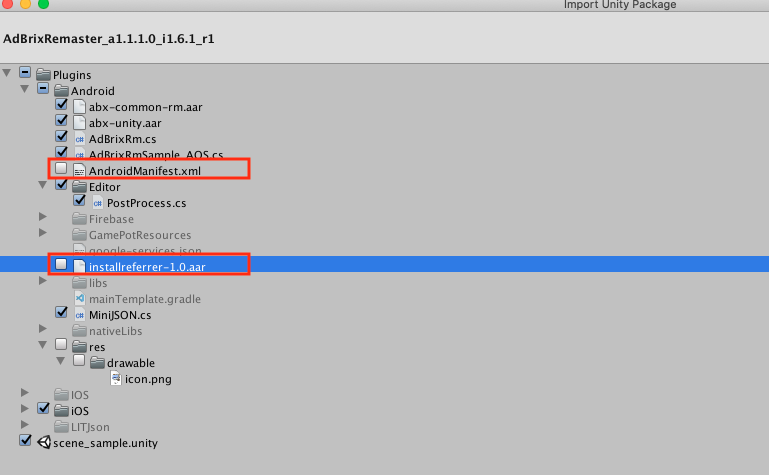

# 3rd-party SDK

GAMEPOT SDK 이외에 적용하는 3rd-party SDK를 빌드에러 없이 게임 프로젝트에 적용하기 위한 가이드입니다.

> 각 SDK의 가이드를 기준으로 기술하며, API를 적용하는 방법은 각 SDK의 가이드를 참고하세요.

## Naver cafe SDK

### Android

> 준비중입니다.

### iOS

> 준비중입니다.

### Unity \([Link](https://github.com/naver/cafe-sdk-unity)\)

1. Unity Package를 import할 때 아래와 같이 몇몇 파일은 제외해주세요.


## Adjust

### Android \([Link](https://github.com/adjust/android_sdk/blob/master/doc/korean/README.md#qs-getting-started)\)

1. `build.gradle` 에 패키지 추가시 아래 두 패키지는 이미 포함되어있으니 무시하세요.

```java
implementation 'com.android.installreferrer:installreferrer:1.0'
implementation 'com.google.android.gms:play-services-analytics:16.0.4'
```

2. `AndroidManifest.xml` 에 이미 권한이 추가 되어있으니 무시하세요.

```java
<uses-permission android:name="android.permission.INTERNET" />
<uses-permission android:name="android.permission.ACCESS_NETWORK_STATE" />
```

### iOS\([Link](https://github.com/adjust/ios_sdk/blob/master/README.md)\)

* Gamepot과 충돌 사항이 없습니다.

### Unity\([Link](https://github.com/adjust/unity_sdk#qs-get-sdk)\)

* Gamepot과 충돌 사항이 없습니다.

## Adbrix

### Android

> 준비중입니다.

### iOS

> 준비중입니다.

### Unity  \([Link](https://developers.singular.net/docs/android-sdk)\)

1. Unity Package를 import할 때 아래와 같이 몇몇 파일은 제외해주세요.



2. 다음 패치를 다운로드 받아주세요. \([Download](https://kr.object.ncloudstorage.com/itsb/gamepot-bridge.aar.zip)\)

3. 다운로드 받은 'gamepot-bridge.aar' 파일을 다음 경로의 파일과 교체해주세요.
    
    > /Assets/Android/libs/gamepot-bridge.aar

4. /Assets/Plugins/Android/AndroidManifest.xml에 Adbrix에서 필요한 설정을 가져와 삽입해야 합니다.
해당 부분은 Adbrix SDK 가이드를 참조해주세요. \([Link](https://help.adbrix.io/hc/ko/articles/360007861793-%EC%95%A0%EB%93%9C%EB%B8%8C%EB%A6%AD%EC%8A%A4-Android-%EC%97%B0%EB%8F%99%ED%95%98%EA%B8%B0-Unity-#toc6)\)


## Singular

### Android \([SDK 9.2.0](https://developers.singular.net/docs/android-sdk)\)

1. 앱 수준의 `build.gradle` 에 패키지 추가시 아래 패키지는 이미 포함되어있으니 무시하세요.

```java
compile 'com.android.installreferrer:installreferrer:1.0'
```

2. `AndroidManifest.xml` 에 이미 권한이 추가 되어있으니 무시하세요.

```java
<uses-permission android:name="android.permission.INTERNET" />
<uses-permission android:name="android.permission.ACCESS_NETWORK_STATE" />
```

### iOS \([SDK 9.2.0](https://developers.singular.net/docs/ios-sdk)\)

* Gamepot과 충돌 사항이 없습니다.

### Unity \([SDK 9.2.0](https://developers.singular.net/docs/unity-sdk)\)

* 다음 경로의 라이브러리 파일을 삭제해 주세요.

>`Assets/Plugins/Android/libs/installreferrer-1.0.aar`

## Appsflyer

### Android

> 준비중입니다.

### iOS

> 준비중입니다.

### Unity

> 준비중입니다.

## AdMob

**_`androidx 패키지로의 migration 이슈로 인해, Google Play Service 18.0.0 이상의 버전이 포함된 sdk는 사용할 수 없습니다.`_**

### Android \([Link](https://firebase.google.com/docs/admob/android/quick-start?hl=ko)\)

* Gamepot 서비스는 Firebase Messaging 서비스를 이용합니다. Admob with Firebase를 통해 설정해주세요.

### iOS \([Link](https://developers.google.com/admob/ios/quick-start?hl=ko)\)

* Gamepot과 충돌 사항이 없습니다.

### Unity \([Guide](https://developers.google.com/admob/unity/start)\) \([Google Mobile Ads v3.17.0](https://github.com/googleads/googleads-mobile-unity/releases/tag/3.17.0)\)

1. 위 Link를 통해 플러그인(v3.17.0)을 게임 프로젝트에 import 합니다.

2. `mainTemplate.gradle` 에서 아래와 같이 AdMob 안드로이드 프로젝트를 추가합니다.


3. AdMob SDK(Unity)의 경우, 유니티 패키지를 import 후 Unity Play Services Resolver 기능을 사용해야 합니다. (AdMob 가이드 참조)

    - Resolve 기능 적용 시, 기존 게임팟 SDK에서 사용중인 라이브러리와 중복되는 라이브러리도 함께 복사됩니다.
    
    - AdMob SDK와 중복되는 라이브러리 목록을 /Assets/Plugins/Android/libs/ 에서 제거해주세요. 

    - 제거해야 할 라이브러리 목록은 아래와 같습니다.

     | |
   | :---  |
   | 1. core-common-1.1.0.jar |
   | 2. lifecycle-common-1.1.0.jar |
   | 3. lifecycle-runtime-1.1.0.aar |
   | 4. customtabs-27.1.1.aar |
   | 5. support-annotations-27.1.1.jar |
   | 6. support-compat-27.1.1.aar |
   | 7. support-core-ui-27.1.1.aar |
   | 8. support-core-utils-27.1.1.aar |
   | 9. support-fragment-27.1.1.aar |
   | 10. support-media-compat-27.1.1.aar |
   | 11. support-v4-27.1.1.aar |
   | 12. play-services-ads-identifier-16.0.0.aar |
   | 13. play-services-basement-16.2.0.aar |
   | 14. play-services-measurement-base-16.0.5.aar |


## Admob Mediation

**_`androidx 패키지로의 migration 이슈로 인해, Google Play Service 18.0.0 이상의 버전이 포함된 sdk는 사용할 수 없습니다.`_**

### Android\([Link](https://developers.google.com/admob/android/mediate)\) \(Google Play service Ads SDK 17.2.0\)

#### - Vungle\([Link](https://developers.google.com/admob/android/mediation/vungle)\)

* Gamepot과 충돌 사항이 없습니다. \(Vungle sdk 6.3.24\)

#### - Unity Ads\([Link](https://developers.google.com/admob/android/mediation/unity)\)

* 앱 수준의 `build.gradle` 에 패키지 추가시, 해당 패키지로 추가해주세요.

```java
compile 'com.google.ads.mediation:unity:3.1.0.0'
```

#### - Facebook\([Link](https://developers.google.com/admob/android/mediation/facebook)\)

* 앱 수준의 `build.gradle` 에 패키지 추가시, 해당 패키지로 추가해주세요.

```java
compile 'com.google.ads.mediation:facebook:5.4.0.0'
```

### iOS \([Link](https://developers.google.com/admob/ios/mediate)\) \(Google Mobile Ads SDK 7.49.0\)

#### - Vungle\([Link](https://developers.google.com/admob/ios/mediation/vungle)\)

* Gamepot과 충돌 사항이 없습니다. \(Vungle sdk 6.3.2\)

#### - Unity Ads\([Link](https://developers.google.com/admob/ios/mediation/unity)\)

* Gamepot과 충돌 사항이 없습니다. \(UnityAds sdk 3.2.0\)

#### - Facebook\([Link](https://developers.google.com/admob/ios/mediation/facebook)\)

* Gamepot과 충돌 사항이 없습니다. \(iOS Audience Network sdk 5.5.0\)

### Unity \([Link](https://github.com/googleads/googleads-mobile-unity/releases/tag/3.17.0)\) \(Google Mobile Ads Unity Plugin v3.17\)

#### - Vungle\([Link](https://developers.google.com/admob/unity/mediation/vungle)\)

* Gamepot과 충돌 사항이 없습니다.

#### - Unity Ads\([Link](https://developers.google.com/admob/unity/mediation/unity)\)

* Gamepot과 충돌 사항이 없습니다.

#### - Facebook\([Link](https://developers.google.com/admob/unity/mediation/facebook)\)

* Gamepot과 충돌 사항이 없습니다.

