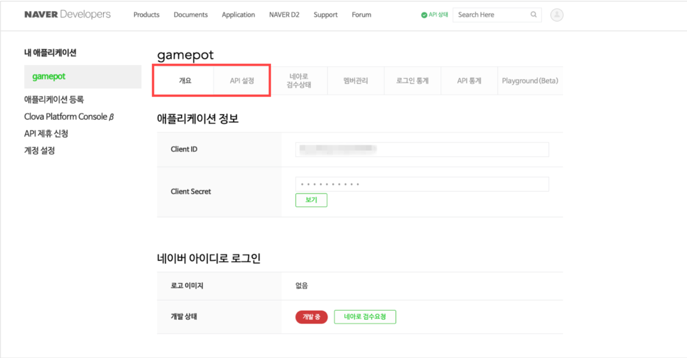
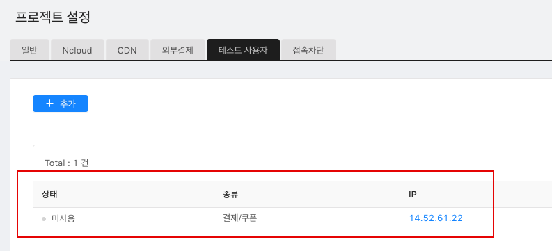

# FAQ

## 로그인이 안 돼요!

 > 소셜 로그인 기능의 경우, 기본적으로 해당 플랫폼의 개발 가이드를 기준으로 합니다. 문제 발생 시, 해당 플랫폼의 로그인 개발 가이드를 먼저 확인 해주세요.
 
### 1. Google 로그인

#### 1-1)

    # Q. 로그인 시도시 바로 로그인 취소가 리턴됩니다. (AOS, iOS)
    # A. 필요한 환경이 올바로 설정 되지 않아 발생하는 현상입니다. 

1. Firebase 설정 파일인 `google-service.json`파일이 프로젝트에 정상적으로 포함 됐는지 확인

2. (AOS) APK 빌드 시 사용한 Keystore의 SHA-1값을 Firebase Console에 추가했는지 확인

   > SHA-1값은 개발사에 요청합니다.

3. Firebase Console에서 프로젝트 설정이 정상적으로 되어있는지 확인

    * 해당 내용이 적용된 빌드가 맞는지 확인
        1. Console 상에 설정한 Package Name(AOS) / Bundle ID(iOS)로 빌드했는지 여부

        2. (AOS) SHA-1을 추출한 Keystore로 빌드했는지 여부

    * Firbase Conosole에 지원 이메일을 설정 했는지 확인

    * (AOS) Google Console에서 `앱 서명`을 사용하는 경우, Console에서 만들어진 SHA-1 값도 추가로 넣어주셔야 합니다.

4. 위 체크 항목을 모두 확인했음에도 불구하고 여전하다면, 지원 이메일을 다른 이메일로 변경해보세요.

    > 간헐적으로 최초 지원 이메일 설정 시 제대로 동작하는 경우가 발생하고 있습니다. 이 경우 다른 이메일로 변경하면 위 문제가 모두 해결되었습니다.

#### 1-2)

    # Q. APK를 직접 설치할때는 로그인이 되나, 스토어에 올린 앱을 다운받아서 로그인할땐 로그인이 되지 않습니다. (AOS)
    # A. Google Developer Console에서 '앱 서명' 기능을 사용해서 그렇습니다.

콘솔에서 APK를 업로드 할 때 '앱 서명'을 활성화 하게 되면 keystore가 콘솔에서 관리하는 키로 교체되면서 발생하는 문제로, 콘솔에서 관리하는 keystore의 sha-1값을 Firebase console에 추가해주셔야 합니다.

> 이 때 페이스북 로그인을 사용하는 경우, Facebook developer console에도 또한 새로운 keystore의 keyhash 값을 추가해주셔야 합니다.

#### 1-3)

    # Q. IOS에서 구글 로그인 시 오류 \(401 오류 : disabled\_client\)가 발생 됩니다. (iOS)
    # A. Firebase 콘솔 설정에 지원 이메일이 설정 되어 있지 않아 문제가 발생 할 수 있습니다.

지원 이메일을 설정 한 후 확인해주세요.

#### 1-4)

    # Q. iOS에서 구글 로그인 시 팝업이 발생 되는데, 게임이름이 아닌 다른 값으로 노출 됩니다. (iOS)
    # A. Xcode >> Targets >> build Settings >> Product Name 항목의 값을 변경 해주시면 됩니다.

  
### 2. Facebook 로그인

    # Q. Facebook 앱이 스마트폰에 설치되어 있을 때, 정상적으로 로그인 할 수 없습니다. (AOS, iOS)
    # A. Facebook Developer Console의 환경설정이 올바르지 않아 문제가 발생할 수 있습니다.

APK 빌드 시 사용한 Keystore의 키 해시 값을 페이스북 콘솔에 추가합니다.

  * Google Console에서 '앱 서명' 기능을 사용할 경우,  Google Console에서 관리하는 keystore의 keyhash 값도 추가해주셔야 합니다.
    

### 3. APPLE 로그인

    # Q. APPLE 로그인 시도 시, 에러가 발생합니다. (iOS)
    # A. 필요한 환경이 올바로 설정 되지 않아 발생하는 현상입니다. 

1.  Xcode >> TARGETS >> Signing & Capabilities >> + Capability >> Sign In with Apple을 추가했는지 확인

2. Xcode >> TARGETS >> Build phases >> Link Binary With Libraries에 LocalAuthentication.framework, AuthenticationService.framework이 추가되었는지 확인
(Target 버전이 iOS 13 이하라면 AuthenticationService.framework은 optional로 설정)

### 4. Naver 로그인(네아로)

#### 4-1)

    # Q. 네이버 로그인 시 오류가 발생 합니다. (AOS, iOS)
    # A. NAVER Developers Console의 환경설정이 빌드설정과 달라 문제가 발생할 수 있습니다.

NAVER Developers Application 설정과 빌드 설정이 일치하는 지 확인해주세요. 

#### 4-2)

    # Q. 네이버 카페 SDK 연동 시, 웹뷰를 통한 네아로(네이버 아이디로 로그인)을 할 수 없습니다. (iOS)
    # A. 네아로 SDK와 카페 SDK의 로그인 모듈이 공존하여 발생하는 이슈입니다.

1. 해당 링크의 패치를 다운받아 주세요. \([Download](https://kr.object.ncloudstorage.com/itsb/Patch_GamePotNaverLogin_20191220.zip)\)

2. 기존에 프로젝트 내 존재하는 2개의 framework를 삭제해주세요.
    - GamePotNaver.framework
    - NaverThirdPartyLogin.framework

3. 다운받은 패치(GamePotNaver.framework)를 기존 동일한 경로에 넣어주세요. 

### 5. Line 로그인

    # Q. 라인 로그인 시 오류 \(400 오류 : Bad\_Request\)가 발생 합니다. (AOS, iOS)
    # A. LINE Developers Console의 환경설정이 올바르지 않아 문제가 발생할 수 있습니다.

Line Developer Console의 설정이 올바른지 확인해주세요. 

### 6. Twitter 로그인

    # Q. 트위터 로그인 시 오류 \(Error Code - 1011\)가 발생 합니다. (AOS, iOS)
    # A. Twitter Developers Console의 환경설정이 올바르지 않아 문제가 발생할 수 있습니다.

Twitter Developer Console의 설정이 올바른지 확인해주세요. 

1. Sign in with Twitter가 Enabled 상태인지 확인해주세요.

2. Callback URL 설정이 올바른지 확인해주세요.
    - 첫째줄 (AOS 사용) : twittersdk://
    - 둘째줄 (iOS 사용) : twitterkit-{twitter_consumerkey}://

## 결제가 안 돼요!

### 1. 공통

#### 1-1)

    # Q. 결제 시도시 'productid was wrong!' 문구가 노출됩니다.
    # A. GAMEPOT 대시보드 -> 결제 -> IAP에 스토어의 상품 아이디를 추가해주세요.

#### 1-2)

    # Q. 첫번째 결제 시도엔 응답이 없고, 두번째 결제 시도시에 결제가 성공했다고 응답합니다. (Play Store, ONEStore)
    # A. 대시보드 - 프로젝트 설정 - 일반 - Public Key에 키가 올바르지 않은 경우입니다.

`도움말 보기` 에 내용을 참고하여 키를 넣어주세요.

### 2. Google Play Store

#### 2-1)

    # Q. 구글 결제 팝업은 노출되나 결제가 진행되지 않아요.
    # A. 구글 결제를 할 수 있는 환경이 올바로 설정되지 않아 발생하는 경우입니다. 아래 항목을 하나씩 체크하세요.

1. 콘솔 &gt; 앱정보 &gt; 인앱 상품에 인앱이 `활성 APK` 로 돼있는지 확인

2. 콘솔에 앱이 `출시됨` 상태인지 확인

   > `프로덕션` 트랙이 아닌 `비공개`/`내부 테스트` 트랙에 올리시면 됩니다.

3. 콘솔 -&gt; 출시 관리 -&gt; 앱 버전 -&gt; 트랙 -&gt; 관리 -&gt; 테스트 참여 대상 관리에 테스트 계정을 등록했는지 확인

4. 테스트 참여 URL로 접속하여 테스트 참여를 신청했는지 확인

5. 콘솔 -&gt; 설정에서 `라이선스 테스트`에 테스트 계정을 추가했는지 확인

6. 단말기 -&gt; 설정 -&gt; 계정 메뉴에 테스트 참여한 계정만 남기고 모두 삭제 했는지 확인

### 3. ONEStore

#### 3-1)

    # Q. '비정상 앱에서 결제가 요청되었습니다' 문구 노출됩니다.
    # A. 오픈 전에 앱은 테스트 계정만 접근이 가능합니다. 아래 사항을 확인하세요.

1. 테스트 계정이 등록 여부

2. 단말기에 설치된 원스토어 앱이 1번에서 등록한 테스트 계정으로 로그인 여부

#### 3-2)    
    
    # Q. 결제시 \[package\] doesn't exist or wrong secret. 문구 노출됩니다.
    # A. GAMEPOT 대시보드에 원스토어 관련 키값이 정상 적용됐는지 다시 확인하세요.

1. APK의 Package name 이 원스토어에 등록된 패키지명과 동일 여부

2. 원스토어 콘솔의 `라이선스 키` 적용 여부

>해당 값이 GAMEPOT 대시보드 아래 항목에 적용되었는지 여부

3. 원스토어 콘솔의 `Client secret` 적용 여부

>해당 값이 GAMEPOT대시보드 아래 항목에 적용되었는지 여부

#### 3-3)

    # Q. 결제 완료 후 "조회된 결과 값이 존재하지 않습니다. \(9001\)" 문구와 함께 결제가 실패합니다.
    # A. 원스토어에 영수증 검증 요청 시 리얼/테스트 환경의 문제가 발생한 경우입니다.

**A-1. 원스토어 결제화면이 Sandbox 환경이었나요?**

* 게임팟 대시보드 - 프로젝트 설정 - 테스트 사용자 메뉴에 **결제/쿠폰** 으로 아이피가 등록되어 있는지 확인.

* 게임팟 대시보드 - 프로젝트 설정 - Webhook 항목에 **결제 아이템 \(테스트사용자\)** 가 등록되어 있는지 확인.

**A-2. 원스토어 결제화면이 Production 환경이었나요?**

* 게임팟 대시보드 - 프로젝트 설정 - 테스트 사용자 메뉴에 **결제/쿠폰** 으로 아이피가 **미사용** 혹은 **없는지** 확인.

* 게임팟 대시보드 - 프로젝트 설정 - Webhook 항목에 **결제 아이템 \(서비스\)** 에 등록되어 있는지 확인.

## Adbrix Remaster

    # Q. Adbrix Remaster 적용 후 IOS 빌드 시 Crash가 발생되요.
    # A. Adbrix Remaster는 Swift로 구현되어 있는 라이브러리로 Swift 라이브러리 적용 시 추가 설정이 필요 합니다.

XCode에서 아래와 같이 설정 하신 후 빌드 해주세요.

만약 빌드 해도 동일하다면 클린 빌드 한 후 확인 해주세요.

#### Q. Adbrix Remaster 적용 후 AppStore 업로드 시 Error가 발생 됩니다.

#### A. Adbrix Remaster 라이브러리가 x86\_64, i386 아키텍쳐를 포함 하여 발생하는 문제 입니다. 아래와 같이 조치 후 다시 빌드 후 확인 해주세요.

콘솔\(터미널\)에서 AdBrixRM.framework 파일 위치로 이동 후 아래 두 명령어를 입력 lipo -remove x86\_64 ./AdBrixRM.framework/AdBrixRM -o ./AdBrixRM.framework/AdBrixRM lipo -remove i386 ./AdBrixRM.framework/AdBrixRM -o ./AdBrixRM.framework/AdBrixRM

## Naver Cafe

    # Q. iOS Naver Cafe 노출 시 영문으로 노출 됩니다.
    # A. XCode &gt;&gt; Targets&gt;&gt; Info &gt;&gt; Localization native development region 을 korea로 변경 후 확인 부탁드립니다.

## 서비스 런칭

    # Q. iOS 플랫폼을 대상으로 서비스를 런칭할 예정입니다.
    # A. iOS App Store 의 경우, 앱 검수 기간이 1~2 주 가량 소요되기 때문에 2주 정도 여유기간을 두시고 리얼존 대시보드로 이전을 신청하셔야 원활한 진행이 가능합니다.

## 푸쉬

    # Q. iOS에서 푸쉬 수신이 되지 않아요.
    # A. 아래 설명에 있는 부분을 하나씩 확인 해주세요.

**1. NCloud SENS 설정에 Certification에 iOS 인증서가 등록되어 있는지 확인 부탁드립니다.**

iOS는 빌드 시 사용 된 프로비저닝프로파일 타입에 따라 등록해야 하는 인증서가 다릅니다.

* Developement Provisioning &gt;&gt; Push Development 인증서 등록 Type은 Sandbox로 설정
* Adhoc / Distribution Provisioning &gt;&gt; Push Distribution 인증서 등록 Type은 Production으로 설정

**2. 인증서 등록 후 클라이언트에서 로그인까지 완료 되었는지 확인 부탁드립니다.**

Gamepot은 푸쉬토큰을 로그인 완료 시 서버로 전달 합니다.

따라서 인증서를 등록하셨으면 Client에서 로그인까지 진행 후 확인 부탁드립니다.

**3. 앱이 Forground 상태 인지 확인해주세요.**

iOS의 경우 앱이 Forground 인 상태에서는 푸쉬 수신이 되지 않습니다.

home 버튼을 눌러 메인 화면에서 푸쉬가 수신되는지 확인 부탁드립니다.

**4. Xcode에서 build 시 Capability에 Push Notification이 포함 되어 있는지 확인 해주세요.**

Xcode에서 build 시 Capability에 Push Notification이 포함되어야 합니다. 수신이 되지 않는다면 빌드 시 이 부분이 포함 되지 않았는지 확인 부탁드립니다.

## 앱 서명

    # Q. 직접 설치한 APK는 소셜 로그인이 정상적으로 되나, 스토어에서 다운로드 후 소셜로그인하면 로그인이 되지 않아요.
    # A. 구글 개발자 콘솔에서 앱 서명이 활성화 되어 키스토어가 변경된 경우입니다.

구글 개발자 콘솔에 `출시 관리` -> `앱 서명` 메뉴에 아래와 같은 화면이 보여집니다.

구글 로그인을 이용중이라면 `SHA-1`값을 firebase console에 추가하시고,

페이스북 로그인을 이용중이라면 위 `SHA-1`값의 `keyhash`를 페이스북 콘솔에 추가하세요.
